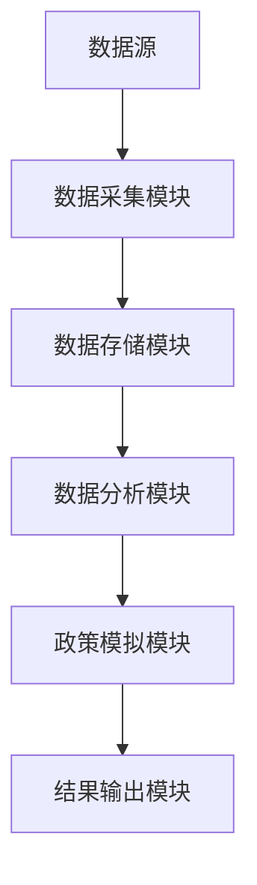
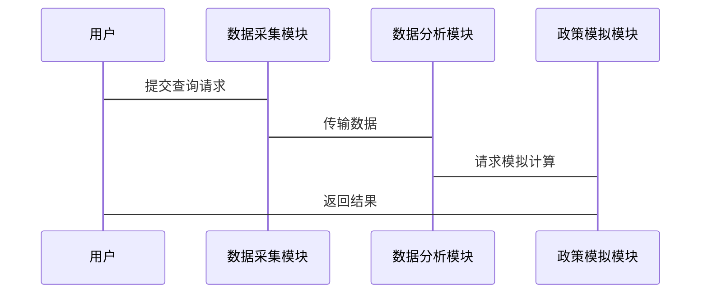

                 


# 全球股市估值与基因治疗的医疗保险政策框架

> 关键词：全球股市估值、基因治疗、医疗保险政策框架、股市估值模型、基因治疗成本效益分析

> 摘要：本文探讨了全球股市估值与基因治疗的相互影响，分析了基因治疗的医疗保险政策框架，并提出了结合股市估值模型优化医保政策的设计思路。通过数学模型和实际案例，详细阐述了如何在基因治疗的高成本背景下，制定合理的医保政策，平衡各方利益，促进基因治疗的健康发展。

---

## 第一部分: 全球股市估值与基因治疗的背景与概念

### 第1章: 全球股市估值概述

#### 1.1 股市估值的基本概念
- 股市估值是通过对公司财务数据、行业地位和市场前景等多方面因素的分析，对股票价格进行合理评估的过程。
- 核心要素包括市盈率（P/E）、市净率（P/B）、股息率等，这些指标反映了市场的信心和公司价值。
- 股市估值的分类包括绝对估值（DCF模型）和相对估值（可比公司分析），各有优缺点。

#### 1.2 全球股市估值的影响因素
- 经济指标如GDP增长率、通胀率、利率等直接影响股市估值。
- 行业政策如税收优惠、行业监管力度影响企业的盈利能力，进而影响股市估值。
- 全球化背景下，股市的联动效应使得局部市场的波动可能影响全球股市。

### 第2章: 基因治疗的医疗效果与成本分析

#### 2.1 基因治疗的基本概念
- 基因治疗是一种通过修改基因组来治疗疾病的方法，主要应用于遗传病、癌症等领域。
- 基因治疗的主要技术手段包括基因编辑（如CRISPR）、基因替换和基因增强等。
- 临床应用现状显示，基因治疗在某些疾病上已取得显著效果，但整体仍处于发展阶段。

#### 2.2 基因治疗的成本与效果评估
- 基因治疗的高成本主要源于研发投入大、生产复杂和专利保护等因素。
- 疗效评估标准包括治疗效果的持久性、副作用的可控性等。
- 成本效益分析显示，基因治疗在某些情况下具有较高的性价比，但在大规模应用中仍面临挑战。

---

## 第二部分: 基因治疗的医疗保险政策框架

### 第3章: 基因治疗的医疗保险覆盖现状

#### 3.1 全球主要国家的医疗保险政策
- 美国通过医保Dx计划将部分基因治疗纳入报销范围。
- 欧盟要求基因治疗产品通过严格的审批程序后才能获得医保覆盖。
- 日本对基因治疗的医保覆盖较为谨慎，主要基于疗效和成本效益分析。

#### 3.2 基因治疗在不同地区的医保覆盖情况
- 发达国家如美国、英国在基因治疗的医保覆盖上较为积极，但限制条件较多。
- 发展中国家由于经济能力有限，医保覆盖相对有限，主要依赖国际援助。

### 第4章: 基因治疗的医保政策设计与优化

#### 4.1 基因治疗医保政策的核心要素
- 支付方式选择：按疗程付费或按效果付费。
- 报销比例设计：根据治疗效果和成本分担。
- 基金分配：优先覆盖疗效显著且成本可控的治疗项目。

#### 4.2 基因治疗医保政策的优化建议
- 创新支付机制：引入风险分担和分期支付模式。
- 动态平衡疗效与成本：定期评估治疗效果和成本变化，调整报销政策。
- 完善监管框架：加强基因治疗的质量控制和疗效评估。

---

## 第三部分: 全球股市估值与基因治疗的政策框架结合

### 第5章: 股市估值对基因治疗公司的价值影响

#### 5.1 基因治疗公司的估值模型
- 使用DCF模型评估基因治疗公司的未来现金流。
- 关注关键参数如折现率、增长率对估值的影响。

#### 5.2 股市对基因治疗技术进展的反应
- 技术突破如CRISPR的改进会显著提升相关公司的股价。
- 临床试验结果的好坏直接影响市场对基因治疗公司的估值。

#### 5.3 基因治疗公司的市场表现分析
- 基因治疗公司股票波动较大，受政策和科研进展影响显著。
- 市场表现与公司的研发投入和技术储备密切相关。

---

## 第四部分: 数学模型与算法设计

### 第6章: 综合评估模型构建

#### 6.1 模型设计思路
- 综合考虑股市估值和基因治疗的成本效益，构建一个综合评分系统。
- 通过加权平均的方法，平衡股市估值和医保政策的影响。

#### 6.2 数学模型
$$
\text{综合评分} = \alpha \times \text{股市估值} + (1-\alpha) \times \text{成本效益}
$$

其中，$\alpha$ 是根据政策需求设定的权重系数。

#### 6.3 算法实现
1. 数据采集：收集基因治疗公司的股市数据和医保政策信息。
2. 数据处理：计算股市估值和成本效益指标。
3. 模型训练：通过机器学习算法优化权重系数。
4. 结果输出：生成综合评分，为医保政策制定提供依据。

---

## 第五部分: 系统架构与项目实战

### 第7章: 系统架构设计

#### 7.1 系统功能设计
- 数据采集模块：实时采集股市数据和基因治疗相关信息。
- 数据分析模块：应用机器学习算法进行综合评估。
- 政策模拟模块：模拟不同医保政策下的市场表现。

#### 7.2 系统架构图


#### 7.3 系统交互流程


### 第8章: 项目实战与代码实现

#### 8.1 环境安装
- 安装Python、Pandas、Scikit-learn等工具。

#### 8.2 核心代码实现
```python
import pandas as pd
from sklearn.linear_model import LinearRegression

# 数据处理
data = pd.read_csv('gene_therapy_data.csv')
X = data[['市盈率', '研发成本']]
y = data['综合评分']

# 模型训练
model = LinearRegression()
model.fit(X, y)

# 模型预测
new_data = pd.DataFrame({'市盈率': [25], '研发成本': [100]})
prediction = model.predict(new_data)
print("预测评分：", prediction[0])
```

#### 8.3 实际案例分析
- 以某基因治疗公司为例，分析其股市估值和医保政策的互动关系。

---

## 第六部分: 最佳实践与总结

### 第9章: 最佳实践

#### 9.1 小结
- 结合股市估值和医保政策，制定动态平衡的基因治疗医保框架。
- 注重政策的可操作性和可持续性，确保基因治疗的健康发展。

#### 9.2 注意事项
- 定期评估政策效果，及时调整医保覆盖范围。
- 加强国际合作，推动基因治疗的全球化发展。

#### 9.3 拓展阅读
- 推荐阅读相关领域的学术论文和政策报告，深入了解基因治疗的最新进展。

---

## 结语

通过本文的分析，我们探讨了全球股市估值与基因治疗的相互影响，提出了结合股市估值模型优化医保政策的设计思路。未来，随着基因治疗技术的不断进步和医保政策的完善，基因治疗将在医疗领域发挥更大的作用。

---

作者：AI天才研究院/AI Genius Institute & 禅与计算机程序设计艺术 /Zen And The Art of Computer Programming

