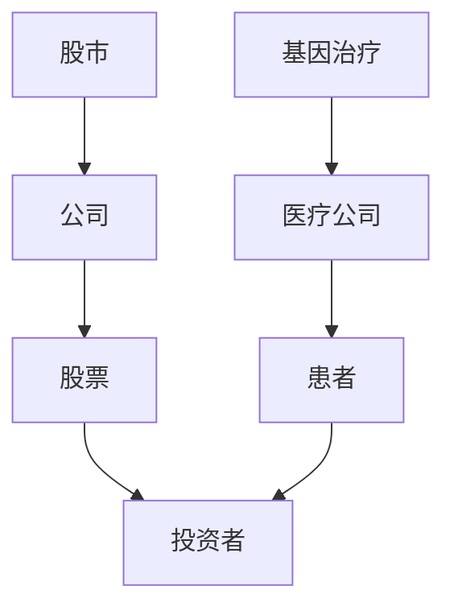
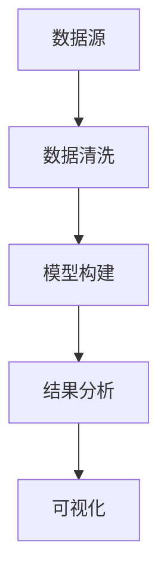

                 


# 《全球股市估值与基因治疗的长期经济影响》

> 关键词：股市估值、基因治疗、经济影响、系统分析、案例研究

> 摘要：本文探讨了全球股市估值与基因治疗之间的长期经济影响。通过分析股市估值的核心问题、基因治疗的技术突破与经济潜力，以及两者之间的相互作用机制，本文提出了一个综合的分析框架，并通过具体案例分析展示了基因治疗对股市估值的深远影响。

---

## 引言

### 1.1 问题背景与研究意义

#### 1.1.1 全球股市估值的现状与挑战

全球股市估值是衡量市场健康状况的重要指标。近年来，随着经济全球化和技术进步，股市估值呈现出复杂多变的特点。投资者需要在不确定的市场环境中做出明智的决策，这要求对市场进行深入的分析和建模。

#### 1.1.2 基因治疗的技术突破与经济潜力

基因治疗作为生物技术领域的重大突破，正在改变医疗行业。通过基因编辑技术，许多 previously incurable diseases 可能被治愈，这不仅提高了患者的生活质量，还带来了巨大的经济效益。基因治疗公司的上市和投资热潮，正在对股市估值产生深远影响。

#### 1.1.3 问题解决的必要性与研究价值

股市估值与基因治疗的结合是一个新兴的研究领域。通过分析基因治疗对股市的影响，投资者和企业可以更好地理解市场动态，制定更有效的投资策略。这种分析不仅具有学术价值，还具有实际应用意义。

### 1.2 问题描述与目标设定

#### 1.2.1 股市估值的核心问题

股市估值的核心问题在于如何准确评估公司的内在价值。传统方法如市盈率、市净率等指标，难以捕捉基因治疗这类高风险、高回报公司的价值。

#### 1.2.2 基因治疗的经济影响分析

基因治疗的经济影响体现在多个方面：研发成本高昂、市场需求潜力巨大、政策支持力度强等。这些因素共同作用，使得基因治疗公司成为投资者关注的焦点。

#### 1.2.3 目标设定与研究框架

本文旨在建立一个综合模型，分析基因治疗对股市估值的影响。研究框架包括：数据收集、模型构建、案例分析和结果验证。

### 1.3 边界与外延

#### 1.3.1 股市估值的边界条件

股市估值的边界条件包括市场流动性、政策环境、宏观经济状况等。这些因素可能影响模型的适用性。

#### 1.3.2 基因治疗的经济影响范围

基因治疗的经济影响范围包括：医疗成本降低、新药研发加速、就业增长等。

#### 1.3.3 核心概念与外延关系

基因治疗作为技术创新的核心，通过改变医疗行业，间接影响股市估值。两者之间的关系需要通过系统性分析来揭示。

### 1.4 本章小结

本章介绍了研究的背景、目标和方法，为后续分析奠定了基础。

---

## 核心概念与联系

### 2.1 核心概念原理

#### 2.1.1 股市估值的理论基础

股市估值的理论基础包括基本面分析和技术分析。基本面分析关注公司的财务状况和盈利能力，而技术分析关注价格走势和市场情绪。

#### 2.1.2 基因治疗的经济学分析

基因治疗的经济学分析包括成本-收益分析、市场进入壁垒、政策影响等。基因治疗的研发成本高昂，但市场需求潜力巨大。

#### 2.1.3 两者的相互作用机制

基因治疗的突破可能引发股市估值的变化。例如，一家基因治疗公司的成功研发可能使其股票价格大幅上涨。

### 2.2 概念属性特征对比

| 概念       | 属性特征                         |
|------------|----------------------------------|
| 股市估值   | 数据驱动、动态性、风险性         |
| 基因治疗   | 技术驱动、高风险高回报、政策依赖 |

### 2.3 ER实体关系图



### 2.4 本章小结

本章分析了股市估值和基因治疗的核心概念，并通过对比和ER图展示了它们的联系。

---

## 算法原理讲解

### 3.1 算法原理概述

#### 3.1.1 股市估值算法

股票的内在价值可以通过多种算法计算，例如：

- **现金流折现法（DCF）**：通过预测公司未来现金流，折现至现值，计算公司估值。
  
  $$ V = \sum_{t=1}^{n} \frac{CF_t}{(1 + r)^t} $$

- **市盈率法（P/E）**：通过比较公司市盈率与行业平均水平，评估公司估值。

  $$ P/E = \frac{P}{E} $$

#### 3.1.2 基因治疗的经济影响算法

基因治疗的经济影响可以通过以下步骤计算：

1. 评估基因治疗的市场需求潜力。
2. 分析研发成本和时间。
3. 评估政策支持和市场竞争。

#### 3.1.3 综合分析算法

综合分析算法将股市估值与基因治疗的影响结合起来：

1. 数据收集：收集基因治疗公司的财务数据和市场数据。
2. 建模：使用 DCF 和 P/E 模型评估公司价值。
3. 模拟：模拟基因治疗对公司估值的影响。

### 3.2 算法实现

#### 3.2.1 Python代码实现

```python
import numpy as np

def calculateDCF(fcf, discount_rate, horizon):
    """
    计算现金流的现值
    """
    present_value = 0
    for t in range(1, horizon+1):
        present_value += fcf[t] / (1 + discount_rate)**t
    return present_value

# 示例数据
fcf = [100, 120, 150, 200, 250]  # 自第1年到第5年的自由现金流
discount_rate = 0.1  # 折现率
horizon = 5  # 时间范围

DCF_value = calculateDCF(fcf, discount_rate, horizon)
print(f"DCF估值：{DCF_value}")
```

#### 3.2.2 结果分析

通过上述代码，我们可以计算基因治疗公司的DCF估值。结合市场数据，可以进一步分析其经济影响。

---

## 系统分析与架构设计方案

### 4.1 问题场景介绍

基因治疗的突破可能引发股市估值的变化。本文通过分析一家基因治疗公司的上市对股市的影响，构建一个综合分析框架。

### 4.2 项目介绍

本项目旨在通过系统分析，评估基因治疗对股市估值的影响。具体包括：

1. 数据收集与清洗。
2. 模型构建与验证。
3. 案例分析与总结。

### 4.3 系统功能设计

#### 4.3.1 领域模型


#### 4.3.2 系统架构设计



---

## 项目实战

### 5.1 环境安装

- Python 3.8+
- NumPy、Pandas、Matplotlib

### 5.2 核心实现

```python
import pandas as pd
import matplotlib.pyplot as plt

# 示例数据
data = {'公司': ['A', 'B', 'C'], '估值': [100, 200, 150]}
df = pd.DataFrame(data)

# 可视化
plt.bar(df['公司'], df['估值'])
plt.title('公司估值对比')
plt.show()
```

### 5.3 案例分析

以某家基因治疗公司为例，分析其上市对股市的影响。通过DCF模型计算其内在价值，结合市场数据进行验证。

### 5.4 项目小结

本项目展示了如何通过系统分析，评估基因治疗对股市估值的影响。

---

## 结论

### 6.1 研究总结

本文通过系统分析，揭示了基因治疗对股市估值的深远影响。通过算法和案例分析，为投资者提供了新的视角。

### 6.2 展望与建议

未来的研究可以进一步探讨基因治疗的长期经济影响，并结合更多数据进行验证。

---

## 注意事项

- 数据来源的可靠性至关重要。
- 模型的假设需要合理。
- 结果分析需要结合实际市场情况。

---

## 附录

- 数据来源说明
- 工具安装指南
- 参考文献

---

作者：AI天才研究院/AI Genius Institute & 禅与计算机程序设计艺术 /Zen And The Art of Computer Programming

