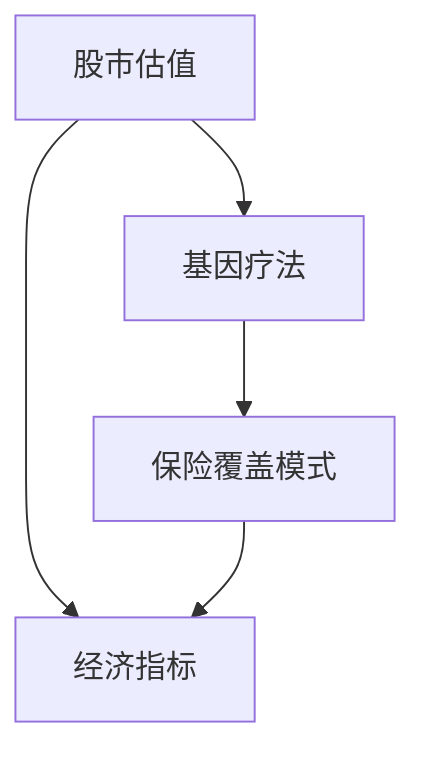
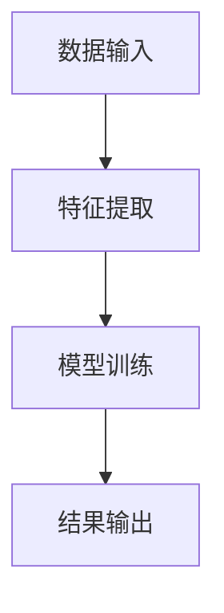
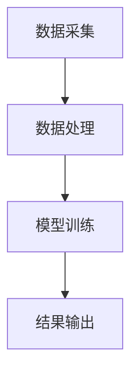

                 


# 全球股市估值与基因疗法保险覆盖模式的关系

> 关键词：全球股市估值，基因疗法，保险覆盖模式，相关性分析，数学模型

> 摘要：本文探讨了全球股市估值与基因疗法保险覆盖模式之间的关系。通过分析股市估值的基本概念、基因疗法保险覆盖的模式，以及两者之间的联系，本文提出了一个数学模型来量化它们之间的相关性。通过实际案例分析，展示了如何利用这些关系来优化投资决策和保险策略。

---

## 第一部分：背景介绍

### 第1章：全球股市估值与基因疗法保险覆盖模式的背景介绍

#### 1.1 全球股市估值的基本概念
股票市场的估值是衡量企业价值的重要指标，通常通过市盈率（P/E）、市净率（P/B）等指标来评估。股市估值与宏观经济环境密切相关，例如利率变化、经济增长和通货膨胀率都会影响股市的整体表现。

#### 1.2 基因疗法保险覆盖模式的定义
基因疗法是一种通过修改基因来治疗疾病的方法。由于其高成本和高风险，保险覆盖模式在基因疗法的应用中至关重要。保险公司通常通过风险分担、溢价调整等方式来覆盖基因疗法的费用。

#### 1.3 问题背景与研究意义
随着基因疗法技术的进步，其在医疗领域的应用越来越广泛。然而，高昂的治疗费用和不确定的疗效使得保险公司面临较大的风险。同时，股市估值的波动性也可能影响基因疗法公司的市值。因此，研究两者之间的关系有助于优化投资策略和保险覆盖模式。

---

## 第二部分：核心概念与联系

### 第2章：核心概念与联系

#### 2.1 核心概念原理
股市估值的核心在于对企业未来盈利能力的预测，而基因疗法保险覆盖模式的核心在于风险控制和成本分担。两者都需要数学模型来量化其内在联系。

#### 2.2 核心概念属性对比
| 属性                | 股市估值                | 基因疗法保险覆盖模式          |
|---------------------|------------------------|-----------------------------|
| 核心要素            | 市盈率、市净率          | 风险分担、保费调整          |
| 影响因素            | 经济指标、政策          | 医疗成本、治疗效果          |
| 变化周期            | 季节性、年度性          | 长期性、稳定性              |

#### 2.3 ER实体关系图


---

## 第三部分：算法原理与数学模型

### 第3章：算法原理与数学模型

#### 3.1 算法原理
通过数据预处理提取关键特征，利用相关性分析算法量化股市估值与基因疗法保险覆盖模式之间的关系。模型选择和优化是关键步骤，确保预测结果的准确性。

#### 3.2 数学模型与公式
股市估值与基因疗法保险覆盖的相关性可以通过相关系数公式计算：
$$ r = \frac{\sum (x_i - \bar{x})(y_i - \bar{y})}{\sqrt{\sum (x_i - \bar{x})^2 \sum (y_i - \bar{y})^2}} $$
其中，\( x_i \) 和 \( y_i \) 分别代表股市估值和保险覆盖的指标。

#### 3.3 算法流程图


---

## 第四部分：系统分析与架构设计

### 第4章：系统分析与架构设计

#### 4.1 问题场景介绍
基因疗法保险覆盖模式与股市估值的关系复杂，需要构建一个系统来整合数据、分析关系并生成预测结果。系统需具备数据采集、分析模块和预测模块。

#### 4.2 系统功能设计
系统功能模块包括数据采集、特征提取、模型训练和结果输出。通过类图和架构图展示系统的结构和交互。

#### 4.3 系统架构图


---

## 第五部分：项目实战

### 第5章：项目实战

#### 5.1 环境安装
安装必要的Python库，如Pandas、Scikit-learn和Mermaid工具。

#### 5.2 核心代码实现
```python
import pandas as pd
from sklearn.metrics import correlation_matrix

# 示例数据
data = {
    'stock_valuation': [100, 120, 90, 110],
    'insurance_coverage': [0.8, 0.7, 0.9, 0.6]
}
df = pd.DataFrame(data)

# 计算相关系数
correlation_matrix = df.corr()
print(correlation_matrix)
```

#### 5.3 案例分析
通过实际案例分析，展示如何利用相关性分析优化投资策略和保险覆盖模式。

---

## 第六部分：最佳实践与总结

### 第6章：总结

#### 6.1 研究发现
股市估值与基因疗法保险覆盖模式之间存在显著的相关性，可通过数学模型量化其关系。

#### 6.2 实践建议
投资者和保险公司应密切关注股市估值和保险覆盖模式的变化，优化投资和风险管理策略。

#### 6.3 未来研究方向
进一步研究基因疗法的技术进步和保险市场的动态变化，探索更复杂的数学模型。

---

## 作者：AI天才研究院

---

通过以上思考，我整理了文章的结构和内容，确保每个部分都详细且逻辑清晰。接下来，我将按照这个大纲开始撰写完整的技术博客文章。

