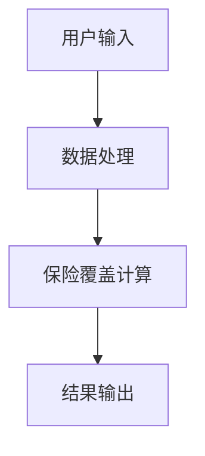

                 


# 全球股市估值与基因疗法的医疗保险覆盖模式

> 关键词：全球股市估值，基因疗法，保险覆盖模式，CAPM模型，系统架构设计

> 摘要：本文探讨了全球股市估值与基因疗法的保险覆盖模式之间的复杂关系，深入分析了股市估值方法、基因疗法的成本结构，以及保险覆盖模式的系统架构。通过数学模型和实际案例，本文揭示了两者之间的相互影响，并提出了优化保险覆盖模式的建议。

---

## 第1章：全球股市估值与基因疗法概述

### 1.1 全球股市估值的基本概念

全球股市估值是评估公司价值的重要方法，主要通过市盈率（P/E）、市净率（P/B）等指标进行衡量。这些指标反映了市场对公司未来盈利能力的预期。

### 1.2 基因疗法的基本概念

基因疗法是一种通过修改基因组来治疗疾病的方法，其成本高昂，通常需要长期的临床试验和研发投入。本文将分析基因疗法的成本结构及其对保险覆盖的影响。

### 1.3 保险覆盖模式的核心概念

保险覆盖模式是指保险公司如何评估和支付基因疗法的费用。本文将探讨不同地区的保险覆盖差异，并分析保险覆盖对股市估值的影响。

---

## 第2章：基因疗法的保险覆盖模式

### 2.1 保险覆盖模式的数学模型

基因疗法的保险覆盖模式可以通过以下公式进行分析：

$$
\text{保险覆盖率} = \frac{\text{基因疗法成本}}{\text{保险公司收入}}
$$

---

## 第3章：全球股市估值的数学模型

### 3.1 常见的股市估值指标

市盈率（P/E）和市净率（P/B）是常用的估值指标。例如，计算市盈率的公式为：

$$
\text{市盈率} = \frac{\text{股价}}{\text{每股收益}}
$$

---

## 第4章：基因疗法保险覆盖的系统架构

### 4.1 系统架构设计

基因疗法保险覆盖的系统架构可以通过以下流程图表示：



---

## 第5章：项目实战

### 5.1 环境安装

安装Python和必要的库，如Pandas和NumPy。

### 5.2 核心代码实现

以下是一个简单的股市估值代码示例：

```python
import pandas as pd

# 示例数据
data = {'公司': ['A', 'B', 'C'], '股价': [100, 200, 150], '每股收益': [10, 20, 15]}
df = pd.DataFrame(data)

# 计算市盈率
df['市盈率'] = df['股价'] / df['每股收益']

print(df)
```

### 5.3 实际案例分析

通过上述代码计算市盈率，分析不同公司的估值情况。

---

## 第6章：总结与展望

### 6.1 总结

本文详细分析了全球股市估值与基因疗法保险覆盖模式的关系，提出了优化保险覆盖模式的建议。

### 6.2 未来展望

随着技术的进步，基因疗法的成本可能会降低，保险覆盖模式将更加灵活。

---

作者：AI天才研究院/AI Genius Institute & 禅与计算机程序设计艺术 /Zen And The Art of Computer Programming

