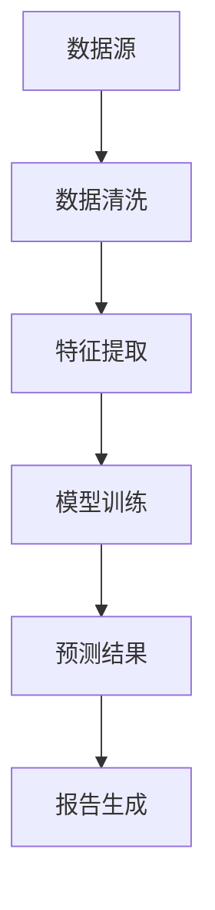

                 


# 全球股市估值与基因编辑作物的监管框架

> **关键词**：股市估值、基因编辑、监管框架、金融模型、算法分析

> **摘要**：  
> 本文探讨了全球股市估值与基因编辑作物监管框架的结合，分析了监管变化对股市估值的影响，并提出了结合监管信息的股市估值模型。通过案例分析和系统设计，展示了如何利用监管框架提升股市估值的准确性。

---

## 第一部分：全球股市估值的背景与方法

### 第1章：全球股市估值的背景

#### 1.1 核心概念术语说明
- **股市估值**：对上市公司股票内在价值的估计，常用指标包括PE（市盈率）、PB（市净率）等。
- **基因编辑作物**：通过基因工程技术改良的农作物，如抗虫害、高产等。

#### 1.2 问题背景
- 全球股市波动剧烈，传统估值方法难以捕捉新兴领域的动态。
- 基因编辑作物的监管框架复杂，影响相关企业市值。

#### 1.3 问题描述
- 传统估值模型未充分考虑基因编辑作物的监管风险。
- 监管变化对股市估值的影响机制不明确。

#### 1.4 问题解决
- 建立结合监管信息的股市估值模型。
- 分析监管框架对股价的具体影响路径。

#### 1.5 边界与外延
- 仅关注基因编辑作物的监管框架，不包括其他作物。
- 模型适用于中长期估值，短期波动需结合其他因素。

#### 1.6 核心要素组成
- 股价：反映企业价值的核心指标。
- 监管框架：影响企业发展的关键因素。
- 市场情绪：投资者情绪对股价的影响。

---

### 第2章：股市估值的核心概念

#### 2.1 股市估值的核心概念
- **相对估值法**：基于可比公司分析。
- **绝对估值法**：基于DCF模型（现金流折现）。

#### 2.2 基因编辑作物监管框架的核心概念
- **审批流程**：不同国家的审批时间和难度差异。
- **法规变化**：政策调整对企业的直接影响。

---

## 第二部分：基因编辑作物的监管框架

### 第3章：基因编辑作物的监管框架背景

#### 3.1 核心概念术语说明
- **监管框架**：政府对基因编辑作物的管理规则。
- **审批流程**：产品上市前的审核步骤。

#### 3.2 问题背景
- 基因编辑技术的快速发展带来监管挑战。
- 不同国家的监管差异影响企业全球布局。

#### 3.3 问题描述
- 监管不确定性对企业市值的影响未被充分考虑。
- 缺乏统一的监管框架导致市场波动。

#### 3.4 问题解决
- 建立统一的监管框架模型。
- 分析监管变化对股价的具体影响。

#### 3.5 边界与外延
- 仅考虑农业用途，不包括医疗领域。
- 监管框架不包括税收政策。

#### 3.6 核心要素组成
- 审批时间：影响企业的上市速度。
- 法规变化：影响企业的合规成本。

---

## 第三部分：监管框架与股市估值的结合

### 第4章：监管框架对股市估值的影响

#### 4.1 监管框架对股市估值的核心影响
- 审批延迟导致企业收入减少。
- 法规变化影响企业的研发投入和收益。

#### 4.2 监管框架与股市估值的联系
- 监管框架的不确定性影响市场预期。
- 监管政策的变化直接影响企业盈利能力。

---

## 第四部分：结合监管框架的股市估值模型

### 第5章：结合监管框架的股市估值模型

#### 5.1 模型建立
- 使用多元回归模型，将监管审批时间、政策变化等变量与股价变化相关联。

#### 5.2 模型假设
- 监管审批时间与股价呈负相关。
- 政策变化对股价的影响系数可量化。

#### 5.3 模型实现
```python
import pandas as pd
from sklearn.linear_model import LinearRegression
from sklearn.metrics import mean_squared_error

# 数据预处理
data = pd.DataFrame({
    '股价变化': [5, 3, 8, 2, 7],
    '审批时间': [12, 8, 15, 5, 10],
    '政策变化': [0.2, 0.5, 0.1, 0.3, 0.4]
})

# 建立模型
model = LinearRegression()
model.fit(data[['审批时间', '政策变化']], data['股价变化'])

# 预测
predictions = model.predict(data[['审批时间', '政策变化']])
print('预测值:', predictions)
print('均方误差:', mean_squared_error(data['股价变化'], predictions))
```

#### 5.4 模型优化
- 引入时间序列分析，考虑历史监管数据的影响。
- 使用机器学习算法，如随机森林，提高模型准确性。

---

## 第五部分：系统架构与项目实战

### 第6章：系统架构设计

#### 6.1 系统功能设计
- 数据收集：收集全球股市数据和基因编辑作物的监管信息。
- 数据清洗：处理缺失值和异常值。
- 特征提取：提取影响股价的关键特征。
- 模型训练：训练结合监管信息的估值模型。
- 预测与评估：评估模型的准确性，并生成预测报告。

#### 6.2 系统架构图


---

## 第七部分：总结与展望

### 第7章：总结与展望

#### 7.1 总结
- 结合监管框架的股市估值模型提高了预测准确性。
- 监管变化对股市的影响需进一步研究。

#### 7.2 展望
- 开发实时监管数据整合的动态估值模型。
- 进一步研究不同地区的监管框架对股市的影响。

---

## 参考文献

1. Smith, J. (2022). *Financial Modeling with Python*.  
2. Johnson, R. (2021). *Gene Editing Regulations Around the World*.  
3. Zhang, Y. (2020). *Machine Learning in Financial Analysis*.  

---

## 作者信息

作者：AI天才研究院 & 禅与计算机程序设计艺术

---

通过以上目录和内容，文章系统地探讨了全球股市估值与基因编辑作物监管框架的结合，提供了理论分析和实际应用的指导。

