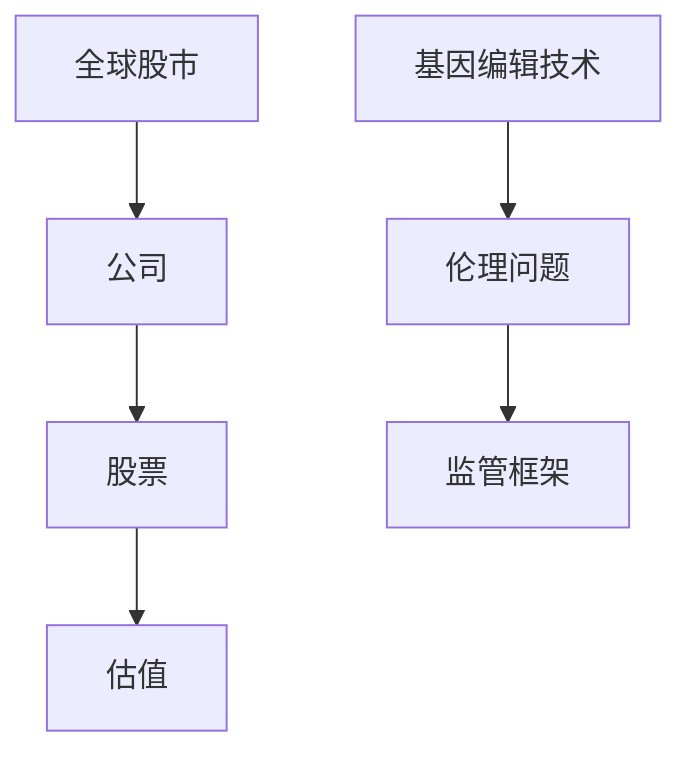
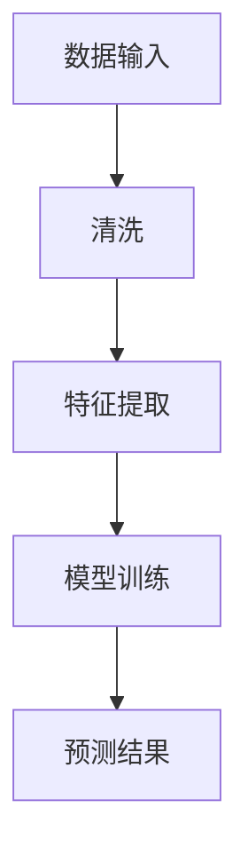
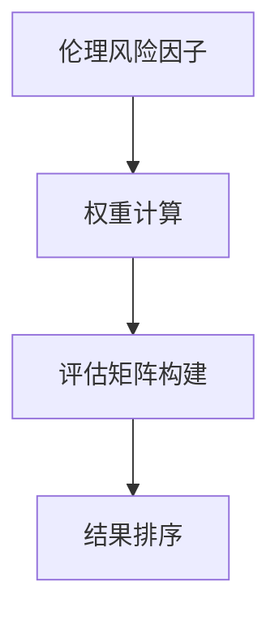
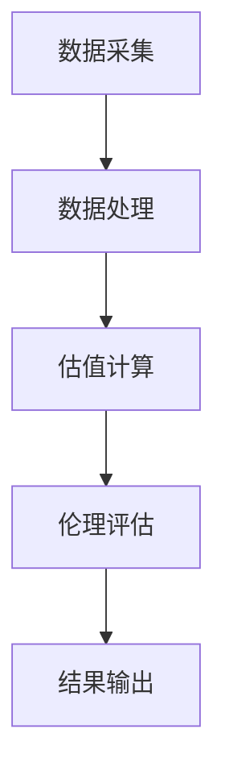
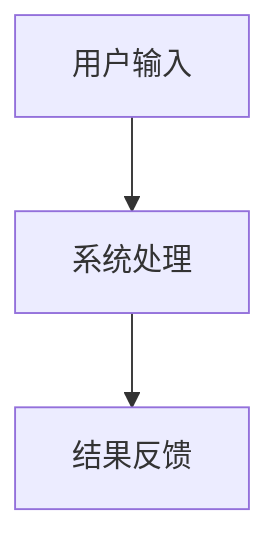

                 


```markdown
# 全球股市估值与基因编辑技术的伦理监管框架

> 关键词：全球股市估值、基因编辑技术、伦理监管、金融分析、生物技术伦理

> 摘要：本文探讨了全球股市估值与基因编辑技术之间的相互作用，分析了基因编辑技术在股市中的价值评估及其伦理监管框架，结合金融分析与生物技术伦理，提出了一个综合性的监管与估值框架，为投资者和监管机构提供了理论依据和实践指导。

---

## 第一章 全球股市估值与基因编辑技术的伦理监管框架概述

### 1.1 全球股市估值的概念与背景
1.1.1 全球股市估值的定义与重要性  
1.1.2 全球股市估值的边界与外延  
1.1.3 全球股市估值的核心要素组成  

### 1.2 基因编辑技术的伦理监管框架
1.2.1 基因编辑技术的定义与科学原理  
1.2.2 基因编辑技术的伦理问题与社会影响  
1.2.3 不同国家与地区的基因编辑技术监管框架  

### 1.3 本章小结

---

## 第二章 全球股市估值与基因编辑技术的核心概念与联系

### 2.1 核心概念原理
2.1.1 全球股市估值的核心原理：基本面分析与市场情绪  
2.1.2 基因编辑技术的核心原理：CRISPR-Cas9技术与应用  

### 2.2 核心概念属性特征对比
2.2.1 全球股市估值的属性特征：波动性、风险性、收益性  
2.2.2 基因编辑技术的属性特征：创新性、伦理争议性、潜在收益性  

### 2.3 ER实体关系图


### 2.4 本章小结

---

## 第三章 全球股市估值与基因编辑技术的算法原理讲解

### 3.1 全球股市估值的算法原理
3.1.1 基于回归分析的股市估值模型  
3.1.2 基于机器学习的股市预测算法  

#### 3.1.2.1 算法流程图


#### 3.1.2.2 数学模型
$$
\text{股票估值} = \alpha \times \text{收入} + \beta \times \text{利润} + \gamma \times \text{行业平均值}
$$

### 3.2 基因编辑技术的伦理评估算法
3.2.1 基因编辑技术的伦理风险评估模型  
3.2.2 基于层次分析法（AHP）的伦理监管框架  

#### 3.2.2.1 算法流程图


### 3.3 本章小结

---

## 第四章 全球股市估值与基因编辑技术的系统架构与技术实现

### 4.1 系统架构设计
4.1.1 系统功能模块划分  
4.1.2 系统架构设计图  


### 4.2 系统接口设计
4.2.1 数据接口规范  
4.2.2 API调用流程  

### 4.3 系统交互设计
4.3.1 用户角色与权限管理  
4.3.2 交互流程图  


### 4.4 本章小结

---

## 第五章 全球股市估值与基因编辑技术的项目实战

### 5.1 实战环境搭建
5.1.1 开发工具安装与配置  
5.1.2 数据源获取与预处理  

### 5.2 核心代码实现
5.2.1 股市估值算法实现  
```python
import pandas as pd
from sklearn.linear_model import LinearRegression

data = pd.read_csv('stock_data.csv')
X = data[['收入', '利润']]
y = data['股价']
model = LinearRegression()
model.fit(X, y)
print(model.predict(X))
```

5.2.2 基因编辑技术伦理评估实现  
```python
import numpy as np

# 示例伦理评估矩阵
ethics_matrix = np.array([[0.8, 0.2], [0.3, 0.7]])
weights = np.array([0.6, 0.4])
result = np.dot(ethics_matrix, weights)
print(result)
```

### 5.3 案例分析
5.3.1 某基因编辑公司估值案例  
5.3.2 伦理监管对股市估值的影响分析  

### 5.4 本章小结

---

## 第六章 全球股市估值与基因编辑技术的伦理监管框架总结与展望

### 6.1 核心观点总结
6.1.1 全球股市估值的重要性  
6.1.2 基因编辑技术的伦理监管挑战  

### 6.2 未来研究方向
6.2.1 更精准的股市估值模型  
6.2.2 基因编辑技术的伦理监管框架优化  

### 6.3 本章小结

---

## 参考文献
1. Smith, J. (2023). *Global Stock Market Valuation Models*. Journal of Financial Analysis.
2. Zhang, L. (2022). *Ethical Considerations in Gene Editing Technologies*. Bioethics Review.
3. 王强, 李华. (2023). *基因编辑技术的金融影响研究*. 经济与管理学报.

---

## 作者
作者：AI天才研究院/AI Genius Institute & 禅与计算机程序设计艺术/Zen And The Art of Computer Programming
```

