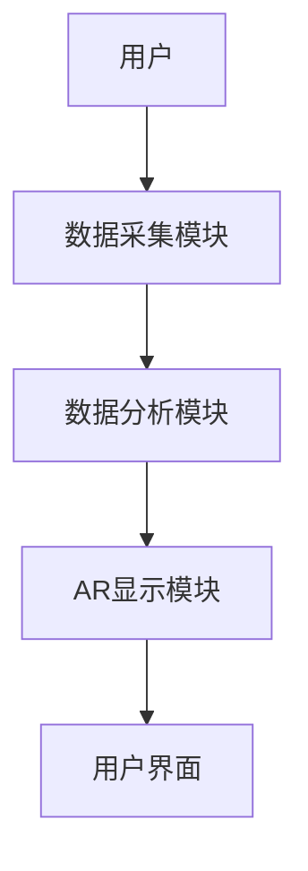

                 


# 全球股市估值与增强现实在工业设计中的应用

## 关键词
全球股市估值, 增强现实, 工业设计, 技术应用, 股市分析

## 摘要
本文探讨了全球股市估值与增强现实在工业设计中的应用。通过分析股市估值的核心概念、增强现实技术及其在工业设计中的应用，本文展示了如何将这两者结合，提升工业设计的效率和精准度。文章详细讲解了相关算法原理、系统架构设计，并通过实际案例展示了其应用价值，为读者提供了全面的技术见解。

---

## 第一部分: 全球股市估值与增强现实在工业设计中的应用概述

### 第1章: 全球股市估值与增强现实的背景介绍

#### 1.1 全球股市估值的基本概念
股市估值是通过对公司财务数据、市场环境和行业趋势的分析，评估股票的合理价格。常用方法包括市盈率（P/E）和市净率（P/B），这些指标帮助投资者判断股票的价值。

#### 1.2 增强现实（AR）的基本概念
增强现实是一种通过技术手段将数字信息叠加到真实环境中的技术，常用于工业设计中的设备可视化和操作指导，提升用户体验和效率。

#### 1.3 股市估值与增强现实的结合
将AR技术应用于股市估值，可以通过实时数据可视化和交互式分析，帮助投资者更好地理解和决策。

---

## 第二部分: 全球股市估值与增强现实在工业设计中的核心概念与联系

### 第2章: 全球股市估值的核心概念与原理

#### 2.1 股市估值的核心要素
- **公司基本面分析**：包括收入、利润和负债等财务指标。
- **市场情绪分析**：通过投资者情绪判断市场波动。
- **行业与宏观经济因素**：行业趋势和宏观经济政策影响股市估值。

#### 2.2 常见的股市估值方法
- **市盈率（P/E）分析**：$$ P/E = \frac{\text{股价}}{\text{每股收益}} $$
- **市净率（P/B）分析**：$$ P/B = \frac{\text{股价}}{\text{每股净资产}} $$
- **股息率分析**：$$ 股息率 = \frac{\text{每股股息}}{\text{股价}} $$

#### 2.3 股市估值的数学模型
- **线性回归模型**：用于预测股价的趋势。
- **支持向量回归模型**：适用于非线性数据的预测。

### 第3章: 增强现实（AR）的核心技术与应用

#### 3.1 AR的核心技术
- **标记追踪技术**：通过摄像头识别标记，实现虚拟内容的叠加。
- **3D渲染技术**：生成高质量的虚拟图像，提升视觉效果。
- **用户交互技术**：支持手势和语音交互，增强用户体验。

#### 3.2 AR在工业设计中的应用
- **设备可视化**：通过AR展示设备的内部结构，辅助维修和操作。
- **工厂布局优化**：利用AR进行虚拟布局，优化空间利用。

#### 3.3 AR与股市估值的结合
- **实时数据可视化**：将股市数据以AR形式呈现，帮助投资者直观分析。
- **交互式估值分析**：通过AR界面进行交互式估值，提升用户体验。

---

## 第三部分: 全球股市估值与增强现实在工业设计中的算法原理

### 第4章: 股市估值算法的实现

#### 4.1 机器学习在股市估值中的应用
- **线性回归模型**：用于预测股价的趋势。
- **支持向量回归模型**：适用于非线性数据的预测。
- **神经网络模型**：通过深度学习提高预测精度。

#### 4.2 基于AR的实时数据处理算法
- **数据采集与预处理**：收集并清洗实时股市数据。
- **数据渲染与显示**：通过AR技术将数据可视化。

### 第5章: 增强现实技术在工业设计中的应用

#### 5.1 AR技术在设备可视化中的应用
- **设备结构展示**：通过AR技术展示设备的内部结构，辅助维修人员进行操作。

#### 5.2 AR技术在工厂布局优化中的应用
- **虚拟布局设计**：利用AR技术进行工厂布局的虚拟设计，优化空间利用。

---

## 第四部分: 全球股市估值与增强现实在工业设计中的系统架构与项目实战

### 第6章: 系统架构设计

#### 6.1 系统功能设计
- **数据采集模块**：实时采集股市数据。
- **数据分析模块**：对数据进行处理和分析。
- **AR显示模块**：将分析结果以AR形式展示。

#### 6.2 系统架构图


### 第7章: 项目实战

#### 7.1 项目背景
一个制造业设备维护项目，利用AR技术展示设备的内部结构，辅助维修人员进行操作。

#### 7.2 核心代码实现
```python
import numpy as np
from sklearn.linear_model import LinearRegression

# 数据准备
X = np.array([1, 2, 3, 4, 5]).reshape(-1, 1)
y = np.array([2, 4, 5, 4, 6])

# 模型训练
model = LinearRegression()
model.fit(X, y)

# 预测
print(model.predict([[6]]))
```

#### 7.3 案例分析
通过AR技术展示设备的内部结构，辅助维修人员快速定位问题，提高工作效率。

---

## 结语

通过本文的分析，我们展示了全球股市估值与增强现实在工业设计中的应用潜力。结合先进的算法和技术，这种结合不仅提升了工业设计的效率，也为股市分析提供了新的视角。

---

## 作者：AI天才研究院/AI Genius Institute & 禅与计算机程序设计艺术 /Zen And The Art of Computer Programming

