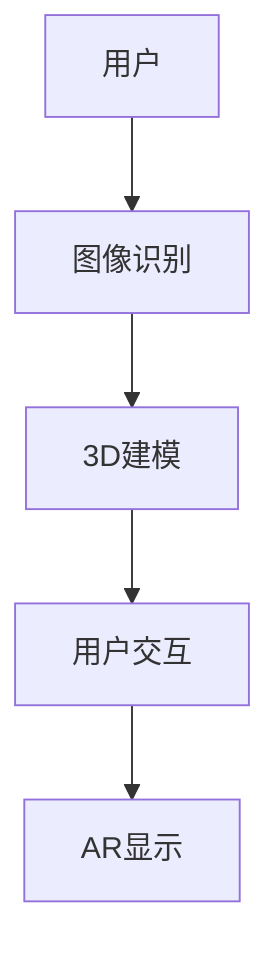
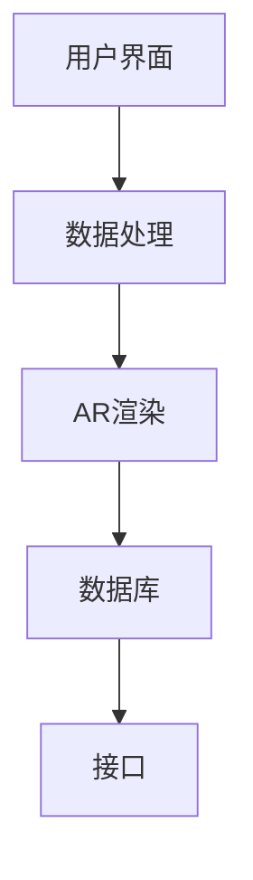
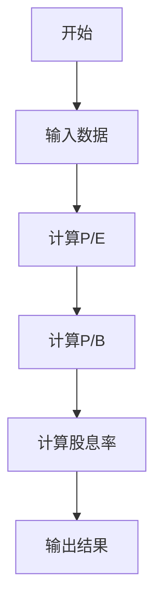
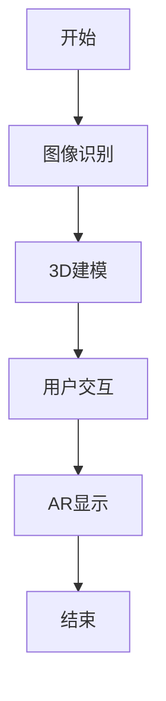

                 


# 全球股市估值与增强现实在教育培训中的应用

## 关键词：全球股市估值，增强现实，教育培训，系统设计，项目实战

## 摘要

本文探讨了全球股市估值与增强现实技术在教育培训中的应用。通过分析股市估值的基本概念、核心指标及全球视角下的估值策略，结合增强现实技术的优势，展示了其在金融教育培训中的潜力。文章详细讲解了AR技术在股市估值教学中的应用，系统设计与实现，以及项目实战，强调了技术与教育的结合如何提升学习效率和互动性。

---

## 第1章：引言

### 1.1 背景介绍

随着全球经济一体化的深入，股市估值成为投资者和教育机构关注的焦点。同时，增强现实（AR）技术的发展为教育培训提供了新的可能性。本文探讨AR技术如何在全球股市估值的教育培训中发挥作用。

### 1.2 核心概念

- **股市估值**：通过分析公司基本面和市场因素，确定股票的合理价格。
- **增强现实（AR）**：将虚拟信息叠加在真实环境中，提升用户体验。

### 1.3 问题描述

传统股市估值教学依赖于理论知识，缺乏互动性和实践性。AR技术能够提供沉浸式学习体验，帮助学生更好地理解和应用估值方法。

---

## 第2章：全球股市估值基础

### 2.1 股市估值的核心指标

#### 2.1.1 市盈率（P/E）

市盈率=股票价格/每股收益（EPS）

$$P/E = \frac{P}{EPS}$$

#### 2.1.2 市净率（P/B）

市净率=股票价格/每股净资产（BPS）

$$P/B = \frac{P}{BPS}$$

#### 2.1.3 股息率（Dividend Yield）

股息率=每股股息/股票价格

$$Dividend\ Yield = \frac{D}{P}$$

### 2.2 全球视角下的估值策略

- 不同市场估值差异：新兴市场与成熟市场的估值标准不同。
- 经济周期影响：经济繁荣时期，估值偏高；衰退时期，估值偏低。
- 全球化视角：考虑国际经济形势和地缘政治因素。

---

## 第3章：增强现实技术基础

### 3.1 AR技术的基本原理

AR通过图像识别、3D建模和用户交互技术，将虚拟内容叠加在现实环境中。核心流程如下：



### 3.2 AR在教育培训中的优势

- **视觉化学习**：通过AR技术，学生可以直观地观察复杂的金融模型。
- **互动性增强**：AR提供沉浸式体验，提升学习兴趣。
- **个性化学习**：根据学生特点定制学习内容。

---

## 第4章：全球股市估值与AR技术的结合

### 4.1 AR技术在股市估值教学中的应用

- **实时数据展示**：通过AR技术，学生可以在虚拟环境中查看实时市场数据。
- **市场趋势分析**：AR技术可以帮助学生更好地理解市场动态。
- **投资决策辅助**：AR技术提供互动式学习体验，帮助学生做出投资决策。

### 4.2 AR技术在金融培训中的具体应用

- **虚拟股票交易练习**：学生可以在虚拟环境中进行股票交易，提升实战能力。
- **3D市场动态展示**：通过3D模型展示市场波动，帮助学生理解市场趋势。
- **AR辅助的金融知识学习**：结合AR技术，学生可以更直观地学习金融知识。

---

## 第5章：系统设计与实现

### 5.1 系统架构设计

系统架构如下：



### 5.2 算法实现与数学模型

#### 5.2.1 股市估值算法

股市估值算法流程图：



#### 5.2.2 AR技术实现

AR技术实现流程图：



### 5.3 项目实战

#### 5.3.1 环境安装

- 安装Python和相关库（如OpenCV、NumPy）
- 下载并安装AR开发工具（如Unity或ARKit）

#### 5.3.2 核心代码实现

以下是股市估值算法的Python代码示例：

```python
import numpy as np

def calculate_pe(stock_price, eps):
    return stock_price / eps

def calculate_pb(stock_price, book_value_per_share):
    return stock_price / book_value_per_share

def calculate_dividend_yield(dividend, stock_price):
    return dividend / stock_price

# 示例数据
stock_price = 100
eps = 10
book_value_per_share = 5
dividend = 2

pe = calculate_pe(stock_price, eps)
pb = calculate_pb(stock_price, book_value_per_share)
dividend_yield = calculate_dividend_yield(dividend, stock_price)

print(f"市盈率: {pe}")
print(f"市净率: {pb}")
print(f"股息率: {dividend_yield}")
```

#### 5.3.3 实际案例分析

通过实际案例分析，展示系统在实际应用中的效果。例如，某学生通过AR技术学习市盈率计算，提高了理解能力和应用能力。

---

## 第6章：结论

### 6.1 总结

本文探讨了全球股市估值与增强现实技术在教育培训中的应用。通过结合AR技术，股市估值教学更加生动有趣，学生能够更好地理解和应用估值方法。

### 6.2 未来展望

随着AR技术的不断发展，其在金融教育培训中的应用潜力巨大。未来，可以通过进一步优化系统设计和提升用户体验，将AR技术应用于更多金融领域。

---

## 作者：AI天才研究院 & 禅与计算机程序设计艺术

---

通过本文的探讨，我们展示了AR技术在全球股市估值教育培训中的重要性和应用潜力。希望本文能为相关领域的研究和实践提供有价值的参考。

