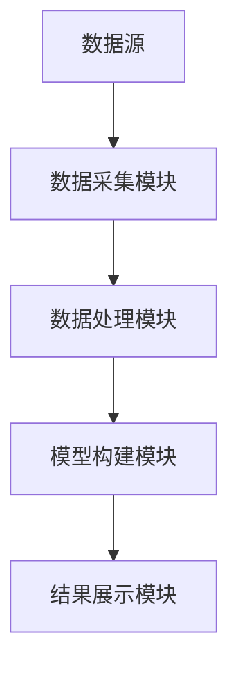

                 


# 全球股市估值与大宗商品价格的关系

> **关键词**：全球股市估值，大宗商品价格，关系分析，时间序列分析，回归分析，系统架构设计

> **摘要**：本文深入探讨全球股市估值与大宗商品价格之间的关系，分析其相互影响的机制和影响因素。通过对比分析、算法原理、数学模型、系统设计和项目实战，揭示两者之间的联系，并提供实际案例和最佳实践。

---

## 第1章: 问题背景与核心概念

### 1.1 问题背景

#### 1.1.1 全球化经济与金融市场的发展

全球经济一体化的深入发展，使得金融市场之间的相互影响日益显著。股市和大宗商品市场作为两大重要组成部分，其波动往往密切相关。股市反映整体经济状况，而大宗商品价格则受供需、生产成本和宏观经济政策影响。

#### 1.1.2 大宗商品在经济中的作用

大宗商品包括能源（如石油）、金属（如黄金）和农产品（如小麦）。它们是全球经济的基石，价格波动直接影响企业成本、消费者价格指数（CPI）和国家经济政策。例如，油价上涨会推高运输成本，进而影响股市整体表现。

#### 1.1.3 股市估值的核心要素

股市估值主要通过市盈率（P/E）、市净率（P/B）等指标衡量。这些指标反映市场对企业的盈利能力和资产价值的评估，而大宗商品价格的变化会影响企业的成本结构，进而影响其估值指标。

### 1.2 核心概念与问题描述

#### 1.2.1 股市估值的定义与影响因素

股市估值是市场对上市公司未来盈利能力的预期，主要指标包括市盈率、市净率等。影响股市估值的主要因素包括宏观经济状况、企业盈利、市场情绪等。

#### 1.2.2 大宗商品价格的定义与分类

大宗商品是指用于工业生产和消费的基本原材料，分为能源、金属和农产品三类。价格波动受供需、生产成本、货币政策和地缘政治等因素影响。

#### 1.2.3 两者关系的描述与边界

股市估值与大宗商品价格之间存在双向影响。一方面，大宗商品价格上涨会增加企业成本，降低盈利，进而影响股市估值；另一方面，股市的波动也会通过投资者情绪影响大宗商品市场。

---

## 第2章: 核心概念与联系

### 2.1 核心概念原理

#### 2.1.1 股市估值的计算方法

市盈率（P/E）= 股价 / 每股净利润  
市净率（P/B）= 股价 / 每股净资产

#### 2.1.2 大宗商品价格的形成机制

供需关系、生产成本、货币政策和地缘政治是影响大宗商品价格的主要因素。

#### 2.1.3 两者关系的理论基础

宏观经济理论指出，大宗商品价格波动会影响企业成本，进而影响股市估值。同时，股市的波动也会反向影响大宗商品市场。

### 2.2 概念属性特征对比

#### 2.2.1 对比表格展示

| 特性            | 股市估值       | 大宗商品价格   |
|-----------------|---------------|----------------|
| 主要影响因素     | 宏观经济、企业盈利 | 供需、生产成本、政策 |
| 计量指标         | 市盈率、市净率   | 现货价格、期货价格 |
| 时间尺度         | 短期波动       | 长期趋势与短期波动 |

#### 2.2.2 ER实体关系图

```mermaid
erd
    图表标题：股市估值与大宗商品价格的关系
    图表内容：
        股市估值 <--(影响因素)- 宏观经济
        大宗商品价格 <--(影响因素)- 供需
        股市估值 <--(影响因素)- 企业盈利
        大宗商品价格 <--(影响因素)- 货币政策
```

---

## 第3章: 算法原理与数学模型

### 3.1 算法原理

#### 3.1.1 时间序列分析

时间序列分析用于研究数据随时间的变化趋势和周期性。常用模型包括ARIMA和GARCH。

#### 3.1.2 回归分析

回归分析用于研究变量之间的关系。例如，用大宗商品价格回归股市估值。

#### 3.1.3 联合分析方法

联合分析结合时间序列和回归分析，用于研究两者的动态关系。

### 3.2 数学模型与公式

#### 3.2.1 相关系数公式

$$ r = \frac{\sum (x_i - \bar{x})(y_i - \bar{y})}{\sqrt{\sum (x_i - \bar{x})^2 \sum (y_i - \bar{y})^2}} $$

#### 3.2.2 回归方程

$$ y = \beta_0 + \beta_1 x + \epsilon $$

其中，$y$ 为股市估值，$x$ 为大宗商品价格，$\beta_0$ 和 $\beta_1$ 为回归系数。

---

## 第4章: 系统分析与架构设计

### 4.1 问题场景介绍

#### 4.1.1 数据收集与处理

从金融数据库获取股市估值和大宗商品价格数据，清洗缺失值和异常值。

#### 4.1.2 数据分析与建模

使用时间序列分析和回归分析模型，建立两者的关系模型。

#### 4.1.3 结果展示与应用

将分析结果可视化，并用于投资决策支持。

### 4.2 系统架构设计

#### 4.2.1 系统功能设计

- 数据采集模块：获取实时数据。
- 数据处理模块：清洗和预处理数据。
- 模型构建模块：建立回归和时间序列模型。
- 结果展示模块：生成可视化报告。

#### 4.2.2 系统架构图



#### 4.2.3 接口与交互设计

API接口用于数据获取和结果查询，用户通过界面与系统交互。

---

## 第5章: 项目实战与案例分析

### 5.1 环境安装与数据准备

#### 5.1.1 数据来源与获取

使用Yahoo Finance API获取数据。

#### 5.1.2 数据清洗与预处理

处理缺失值和异常值，标准化数据。

#### 5.1.3 数据可视化

使用Matplotlib绘制时间序列图和散点图。

### 5.2 核心算法实现

#### 5.2.1 时间序列分析代码

```python
import pandas as pd
from statsmodels.tsa.arima.model import ARIMA

data = pd.read_csv('data.csv')
model = ARIMA(data['stock_valuation'], order=(1,1,1))
model_fit = model.fit()
```

#### 5.2.2 回归分析代码

```python
import statsmodels.api as sm

X = sm.add_constant(data['commodity_price'])
model = sm.OLS(data['stock_valuation'], X).fit()
```

#### 5.2.3 联合分析代码

```python
import numpy as np

correlation = np.corrcoef(data['commodity_price'], data['stock_valuation'])
```

### 5.3 实际案例分析

分析2020年新冠疫情对股市估值和大宗商品价格的影响，展示模型的应用。

---

## 第6章: 最佳实践与小结

### 6.1 最佳实践 tips

- 数据处理：注意缺失值和异常值。
- 模型选择：根据数据特征选择合适模型。
- 结果解读：结合经济背景分析结果。

### 6.2 项目小结

#### 6.2.1 核心发现

股市估值和大宗商品价格之间存在显著的正相关关系，尤其在经济波动时期。

#### 6.2.2 实践总结

通过系统设计和算法实现，可以有效分析两者关系，并为投资决策提供支持。

#### 6.2.3 未来展望

未来研究可以结合更多变量，如货币政策和地缘政治因素，建立更复杂的模型。

### 6.3 注意事项与拓展阅读

#### 6.3.1 模型局限性

模型假设可能与实际不符，需结合实际情况调整。

#### 6.3.2 拓展阅读推荐

推荐阅读《金融时间序列分析》和《计量经济学》。

#### 6.3.3 实践中的常见问题

数据获取困难和模型选择不当是常见的挑战。

---

## 第7章: 数学模型与算法的详细讲解

### 7.1 相关系数公式

$$ r = \frac{\sum (x_i - \bar{x})(y_i - \bar{y})}{\sqrt{\sum (x_i - \bar{x})^2 \sum (y_i - \bar{y})^2}} $$

相关系数衡量两个变量之间的线性关系，值在-1到1之间。

### 7.2 回归方程

$$ y = \beta_0 + \beta_1 x + \epsilon $$

回归分析用于预测股市估值，其中$\beta_1$表示大宗商品价格对股市估值的影响程度。

---

## 作者

作者：AI天才研究院/AI Genius Institute & 禅与计算机程序设计艺术 /Zen And The Art of Computer Programming

---

**摘要**：本文系统地探讨了全球股市估值与大宗商品价格之间的关系，通过理论分析、算法实现和实际案例，揭示了两者之间的相互影响机制，并提供了实践中的最佳方法。

