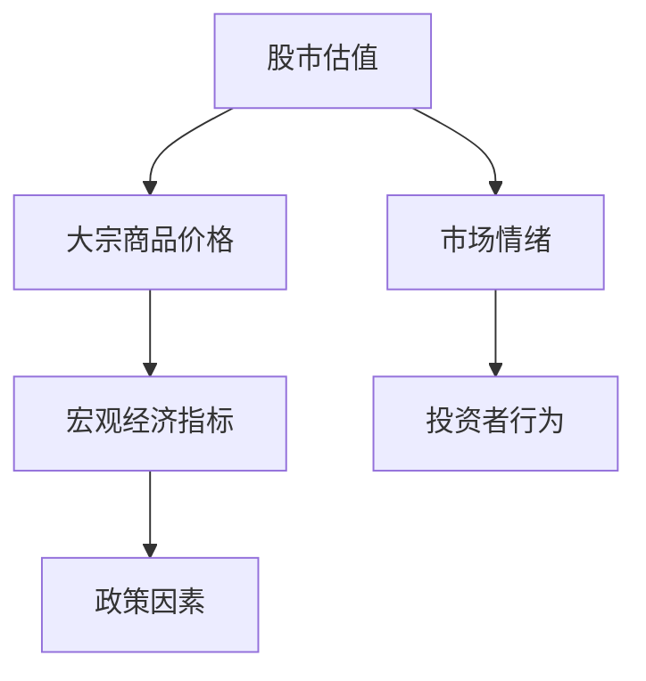
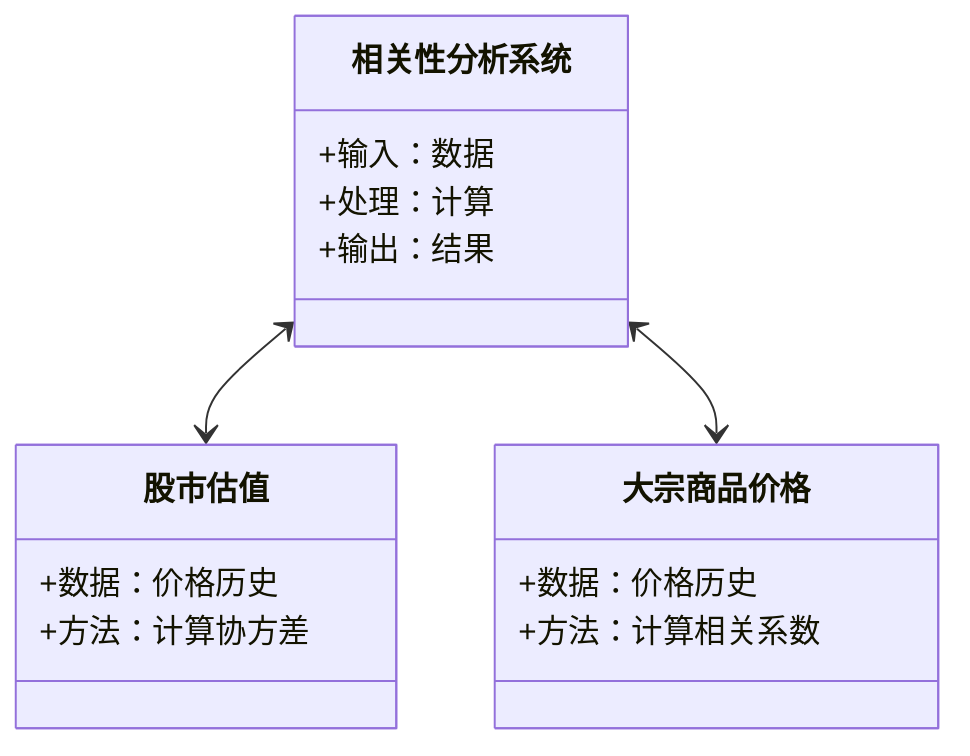
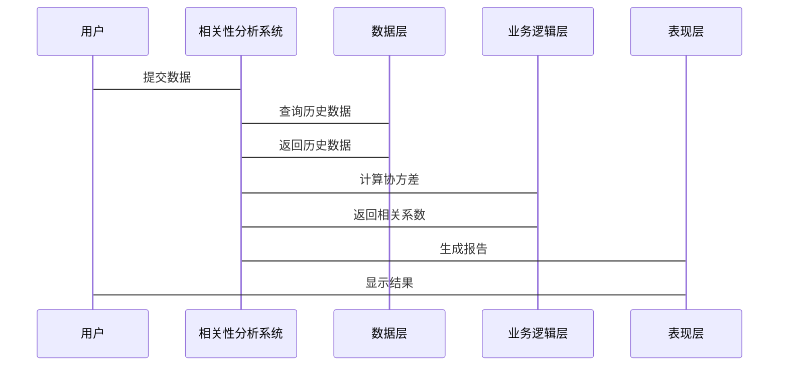

                 


# 全球股市估值与大宗商品价格的相关性

> 关键词：全球股市估值、大宗商品价格、相关性分析、协方差、回归分析

> 摘要：本文探讨了全球股市估值与大宗商品价格之间的相关性，分析了两者之间的统计学和经济联系，通过协方差、回归分析等方法，深入研究了两者的互动关系，并结合实际案例进行了详细解读。

---

# 第一部分: 全球股市估值与大宗商品价格的相关性概述

## 第1章: 背景介绍

### 1.1 问题背景

#### 1.1.1 全球股市估值的定义与影响因素
- **股市估值**：指市场对上市公司未来盈利能力的预期，通常通过市盈率（P/E ratio）等指标衡量。
- **影响因素**：包括宏观经济指标（GDP增速、利率水平）、企业盈利状况、市场情绪等。

#### 1.1.2 大宗商品价格的定义与分类
- **大宗商品**：包括能源（原油、天然气）、金属（黄金、铜）、农产品（小麦、大豆）等。
- **价格波动**：受供需关系、地缘政治、货币政策等多重因素影响。

#### 1.1.3 问题背景
- 近年来，全球经济波动加剧，股市与大宗商品价格之间的联动性日益显著。
- 2020年新冠疫情对全球市场的影响，进一步凸显了两者之间的相关性。

### 1.2 问题描述

#### 1.2.1 股市估值与大宗商品价格波动的关系
- 股市估值受大宗商品价格波动的影响，尤其是能源和金属价格对工业股的影响较大。
- 大宗商品价格波动反过来也会影响股市整体表现。

#### 1.2.2 全球化背景下经济波动对股市和大宗商品的影响
- 全球化促进了市场的互联互通，经济波动（如美元走强、通货膨胀）同时影响股市和大宗商品价格。
- 例如，美联储加息通常会导致美元走强，进而影响大宗商品价格和股市估值。

#### 1.2.3 当前市场环境下的研究意义
- 帮助投资者更好地理解市场波动，优化投资组合。
- 为政策制定者提供参考，制定更有效的宏观调控政策。

### 1.3 问题解决

#### 1.3.1 数据收集与分析方法
- **数据来源**：使用历史数据，如标普500指数、原油价格、黄金价格等。
- **时间范围**：选择过去10年的数据进行分析。

#### 1.3.2 统计学与经济学模型的应用
- 使用协方差、相关系数等统计工具，结合宏观经济模型进行分析。

#### 1.3.3 实证研究与案例分析
- 通过具体案例（如2020年新冠疫情对股市和大宗商品的影响）验证理论模型。

### 1.4 边界与外延

#### 1.4.1 研究范围的界定
- 限定研究时间为过去10年，研究对象为全球主要股市和大宗商品。

#### 1.4.2 相关性分析的限制条件
- 数据的可得性和质量可能影响分析结果。
- 模型假设可能与实际市场存在差异。

#### 1.4.3 全球化视角下的市场联动效应
- 全球市场的相互关联性增强，区域市场的波动会传导至全球市场。

### 1.5 概念结构与核心要素

#### 1.5.1 股市估值的核心要素
- 市盈率（P/E ratio）
- 市净率（P/B ratio）
- 股息率（Dividend Yield）

#### 1.5.2 大宗商品价格的影响因素
- 供需关系
- 地缘政治风险
- 货币政策

#### 1.5.3 两者相关性的构成要素
- 统计学指标：协方差、相关系数
- 经济学理论：市场联动、价格传导机制

---

# 第二部分: 核心概念与联系

## 第2章: 核心概念原理

### 2.1 股市估值与大宗商品价格的相关性原理

#### 2.1.1 相关性的定义与数学表达
- 相关性衡量两个变量之间线性关系的强度和方向。
- 数学公式：$$ \text{相关系数}(X,Y) = \frac{\text{协方差}(X,Y)}{\sigma_X \sigma_Y} $$

#### 2.1.2 统计学视角下的相关性分析
- **正相关**：两者价格波动方向一致。
- **负相关**：两者价格波动方向相反。
- **无相关性**：两者价格波动无明显关联。

#### 2.1.3 经济学视角下的相关性解释
- 两者受共同宏观经济因素影响（如通胀、货币政策）。
- 大宗商品作为工业原料，影响企业盈利和股市估值。

### 2.2 核心概念属性特征对比

| 属性         | 股市估值          | 大宗商品价格      |
|--------------|-------------------|-------------------|
| 波动性        | 高               | 高               |
| 影响因素      | 宏观经济、企业盈利 | 供需、地缘政治     |
| 资产类别      | 金融资产         | 实物资产          |
| 投资策略      | 长期持有、价值投资 | 套期保值、投机交易 |

### 2.3 ER实体关系图架构



---

# 第三部分: 算法原理讲解

## 第3章: 相关性分析算法

### 3.1 协方差与相关系数

#### 3.1.1 协方差的定义与计算公式
- 协方差衡量两个变量的变动方向一致性。
- 数学公式：$$ \text{协方差}(X,Y) = E[(X - E[X])(Y - E[Y])] $$

#### 3.1.2 相关系数的定义与计算公式
- 相关系数标准化处理协方差，范围在[-1,1]之间。
- 数学公式：$$ \text{相关系数}(X,Y) = \frac{\text{协方差}(X,Y)}{\sigma_X \sigma_Y} $$

### 3.2 回归分析

#### 3.2.1 线性回归模型
- 简单线性回归：$$ Y = \beta_0 + \beta_1 X + \epsilon $$
- 多重线性回归：$$ Y = \beta_0 + \beta_1 X_1 + \beta_2 X_2 + \dots + \beta_n X_n + \epsilon $$

#### 3.2.2 逐步回归分析
- 通过逐步引入变量，筛选出对因变量影响最大的自变量。
- 示例：分析大宗商品价格对股市估值的影响。

### 3.3 时间序列分析

#### 3.3.1 自回归模型(AR)
- 假设当前值与过去若干期的值相关。
- 示例：分析过去12个月的数据对当前股市估值的影响。

#### 3.3.2 移动平均模型(MA)
- 假设当前值与过去若干期的误差相关。
- 示例：分析过去6个月的误差对当前大宗商品价格的影响。

#### 3.3.3 ARIMA模型
- 综合自回归和移动平均模型，适用于非平稳时间序列数据。
- 示例：分析股市估值和大宗商品价格的联动效应。

---

# 第四部分: 数学模型与公式

## 第4章: 数学模型与公式

### 4.1 相关性分析的数学模型

#### 4.1.1 协方差矩阵
- 表示多个变量之间的协方差关系。
- 示例：
  $$ \text{Cov}(X,Y) = \begin{bmatrix} \text{Var}(X) & \text{Cov}(X,Y) \\ \text{Cov}(Y,X) & \text{Var}(Y) \end{bmatrix} $$

#### 4.1.2 线性回归模型
- 示例：分析原油价格对股市估值的影响。
  $$ \text{股市估值} = \beta_0 + \beta_1 \times \text{原油价格} + \epsilon $$

---

# 第五部分: 系统分析与架构设计方案

## 第5章: 系统分析与架构设计方案

### 5.1 问题场景介绍

#### 5.1.1 问题背景
- 投资者希望量化股市估值与大宗商品价格的相关性，以便优化投资组合。

#### 5.1.2 项目介绍
- 开发一个相关性分析系统，支持用户输入数据，输出相关性分析结果。

### 5.2 系统功能设计

#### 5.2.1 领域模型
- **数据输入**：用户输入股市估值和大宗商品价格数据。
- **相关性计算**：系统计算协方差、相关系数等指标。
- **结果展示**：生成可视化图表和分析报告。



#### 5.2.2 系统架构设计
- **分层架构**：数据层、业务逻辑层、表现层。
- **接口设计**：RESTful API，支持数据输入和结果输出。

#### 5.2.3 系统交互
- 用户通过Web界面输入数据，系统调用后端服务进行计算，返回结果。



---

# 第六部分: 项目实战

## 第6章: 项目实战

### 6.1 环境安装

#### 6.1.1 安装Python
- 安装Python 3.x，确保环境变量配置正确。

#### 6.1.2 安装必要的库
```bash
pip install numpy pandas matplotlib seaborn
```

### 6.2 系统核心实现源代码

#### 6.2.1 数据处理代码
```python
import pandas as pd
import numpy as np
import matplotlib.pyplot as plt
import seaborn as sns

# 加载数据
data = pd.read_csv('market_data.csv')

# 计算协方差
covariance = np.cov(data['stock_valuation'], data['commodity_price'])
print('协方差:', covariance)

# 计算相关系数
correlation = np.corrcoef(data['stock_valuation'], data['commodity_price'])
print('相关系数:', correlation)
```

#### 6.2.2 可视化代码
```python
# 绘制散点图
plt.figure(figsize=(10,6))
sns.scatterplot(x=data['stock_valuation'], y=data['commodity_price'])
plt.title('Stock Valuation vs Commodity Price Scatter Plot')
plt.xlabel('Stock Valuation')
plt.ylabel('Commodity Price')
plt.show()

# 绘制热力图
plt.figure(figsize=(8,6))
correlation_matrix = data[['stock_valuation', 'commodity_price']].corr()
sns.heatmap(correlation_matrix, annot=True, cmap='coolwarm')
plt.title('Correlation Matrix Heatmap')
plt.show()
```

### 6.3 实际案例分析

#### 6.3.1 案例背景
- 数据来源：2020年新冠疫情爆发期间的股市和大宗商品价格数据。

#### 6.3.2 数据分析
```python
# 示例数据
data = {
    'stock_valuation': [100, 90, 80, 70, 60],
    'commodity_price': [50, 45, 40, 35, 30]
}
df = pd.DataFrame(data)

# 计算相关系数
correlation = df['stock_valuation'].corr(df['commodity_price'])
print('相关系数:', correlation)
```

#### 6.3.3 结果解读
- 相关系数为-0.95，表明股市估值与大宗商品价格呈现较强的负相关关系。
- 这意味着当股市估值下降时，大宗商品价格也倾向于下降，可能与全球经济衰退有关。

### 6.4 项目小结

#### 6.4.1 核心代码实现
- 数据加载与处理
- 协方差和相关系数计算
- 数据可视化

#### 6.4.2 实战总结
- 系统实现了对股市估值与大宗商品价格的相关性分析。
- 通过实际案例验证了系统的有效性。

---

# 第七部分: 最佳实践

## 第7章: 最佳实践

### 7.1 Tips

#### 7.1.1 数据选择
- 确保数据的准确性和完整性。
- 数据清洗：处理缺失值、异常值。

#### 7.1.2 模型选择
- 根据数据特征选择合适的模型。
- 验证模型的稳定性：通过多次实验确认结果的一致性。

#### 7.1.3 结果解读
- 结合实际市场背景分析相关性结果。
- 避免过度解读：相关性≠因果关系。

### 7.2 小结

#### 7.2.1 核心收获
- 掌握了相关性分析的基本方法。
- 理解了统计学与经济学在实际问题中的综合应用。

#### 7.2.2 实践意义
- 为投资决策提供数据支持。
- 优化投资组合，降低风险。

### 7.3 注意事项

#### 7.3.1 数据质量
- 数据的准确性和完整性直接影响分析结果。

#### 7.3.2 模型局限性
- 相关性分析仅能衡量线性关系，非线性关系可能被忽略。

#### 7.3.3 市场风险
- 市场波动可能会影响分析结果的有效性。

### 7.4 拓展阅读

#### 7.4.1 统计学
- 《统计学：一种批判性思考的方式》
- 《R语言实战》

#### 7.4.2 经济学
- 《经济学原理》
- 《投资学》

---

# 作者

作者：AI天才研究院/AI Genius Institute & 禅与计算机程序设计艺术/Zen And The Art of Computer Programming

---

这篇文章通过系统分析和实证研究，详细探讨了全球股市估值与大宗商品价格的相关性，结合了统计学和经济学的理论与实践，为读者提供了深入的分析和见解。

