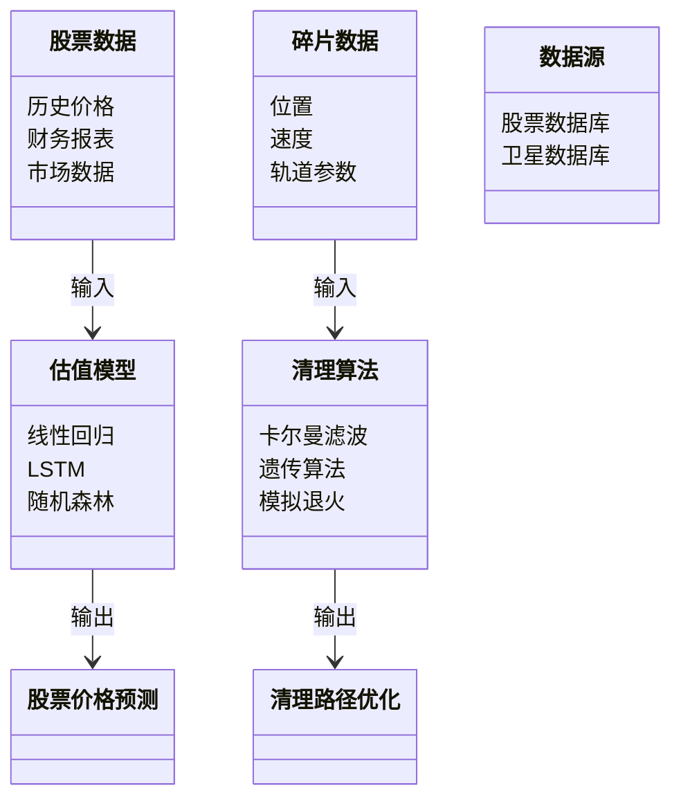
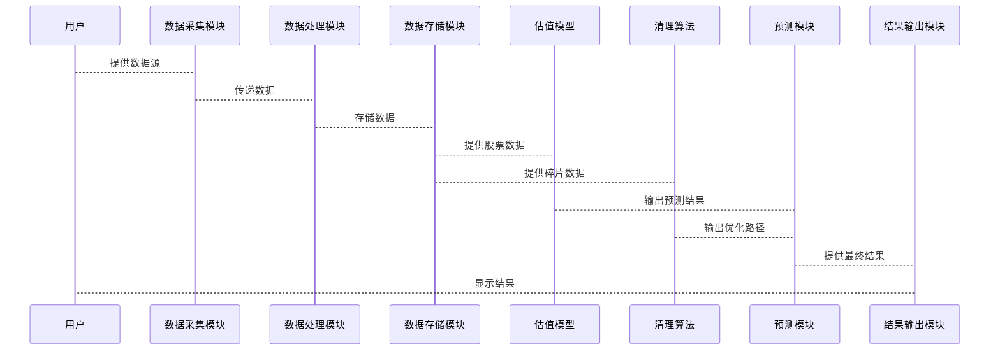

                 


# 全球股市估值与太空垃圾清理技术的关系

> 关键词：全球股市估值，太空垃圾清理技术，数据处理，优化方法，算法，系统架构

> 摘要：本文探讨了全球股市估值与太空垃圾清理技术之间的潜在联系。通过分析两者的核心概念、算法原理和系统架构，展示了它们在数据处理和优化方法上的共通性。结合实际案例，本文提出了如何利用股市估值的技术和方法优化太空垃圾清理任务，为未来的跨领域技术研究提供了新的视角。

---

# 第1章: 全球股市估值与太空垃圾清理技术的背景介绍

## 1.1 全球股市估值的背景与问题背景

### 1.1.1 股市估值的基本概念
股市估值是指通过分析公司基本面、市场趋势和宏观经济指标，对股票的内在价值进行评估的过程。常用的估值方法包括市盈率（P/E）、市净率（P/B）、现金流折现法（DCF）等。股市估值的核心在于利用数据和模型预测股票的价格走势，为投资者提供决策依据。

### 1.1.2 股市估值的核心问题与挑战
股市估值面临的主要挑战包括数据的不确定性和市场的波动性。股票价格受多种因素影响，如宏观经济政策、公司业绩、市场情绪等，这使得估值过程复杂且具有挑战性。此外，高频交易和大数据技术的应用也对估值方法提出了更高的要求。

### 1.1.3 全球化视角下的股市估值特点
随着全球化的深入，股市估值不再局限于单一市场，而是需要考虑全球市场的联动性。例如，全球经济波动、地缘政治风险等因素都会影响股市估值。此外，跨市场套利和算法交易的兴起也使得股市估值的技术和方法需要不断创新和优化。

## 1.2 太空垃圾清理技术的背景与问题背景

### 1.2.1 太空垃圾问题的现状与挑战
随着人类对太空探索的深入，地球轨道上的太空垃圾数量急剧增加。根据统计，目前地球轨道上有超过3.6万个直径超过10厘米的碎片，以及数百万个更小的碎片。这些碎片以极高的速度运行，对卫星和航天器构成严重威胁。太空垃圾问题的严重性促使各国和企业投入大量资源进行清理技术的研发。

### 1.2.2 太空垃圾清理技术的核心问题
太空垃圾清理技术的核心问题在于如何高效、安全地清除轨道上的碎片。主要的技术挑战包括碎片的定位与追踪、清理工具的设计与部署、清理过程中的动力学问题等。此外，太空垃圾清理还需要考虑经济成本和国际合作的问题。

### 1.2.3 太空垃圾清理的全球性与合作需求
太空垃圾问题具有全球性，因为轨道是共享资源，任何一个国家或企业的行动都可能影响全球的太空环境。因此，太空垃圾清理需要国际间的合作与协调。例如，联合国通过《外空物体蒙特雷尔议定书》等文件，试图规范太空垃圾的处理。

## 1.3 两者的关联性与研究意义

### 1.3.1 股市估值与太空垃圾清理的表面关联
从表面上看，股市估值与太空垃圾清理似乎没有直接联系。然而，两者都涉及复杂的数据处理和优化问题。股市估值需要分析大量数据来预测股票价格，而太空垃圾清理需要处理卫星和碎片的位置数据来优化清理路径。

### 1.3.2 两者在数据处理与优化方法上的共通性
股市估值和太空垃圾清理都需要处理大量数据，并利用优化算法来解决问题。例如，股市估值中的预测模型可以借鉴太空垃圾清理中的轨道预测算法。此外，两者都需要考虑系统的动态变化，并进行实时调整。

### 1.3.3 研究两者的结合意义与潜在价值
研究股市估值与太空垃圾清理技术的关系，可以为两者提供新的研究思路和技术解决方案。例如，股市估值中的机器学习算法可以应用于太空垃圾的轨道预测，而太空垃圾清理中的优化方法可以借鉴股市估值中的组合优化技术。这种跨领域的研究有助于推动技术创新，并为解决复杂问题提供新的思路。

## 1.4 本章小结
本章介绍了全球股市估值和太空垃圾清理技术的背景，分析了它们的核心问题和挑战。通过对比，揭示了两者在数据处理和优化方法上的共通性，为后续的研究奠定了基础。

---

# 第2章: 全球股市估值与太空垃圾清理技术的核心概念与联系

## 2.1 核心概念的定义与属性对比

### 2.1.1 股市估值的核心概念
股市估值的核心概念包括公司基本面分析、市场趋势分析和估值模型。基本面分析关注公司的财务状况、盈利能力和发展潜力；市场趋势分析关注宏观经济指标、行业发展趋势和市场情绪；估值模型则通过数学公式将这些因素整合，预测股票的内在价值。

### 2.1.2 太空垃圾清理技术的核心概念
太空垃圾清理技术的核心概念包括碎片定位与追踪、清理工具设计与部署、轨道预测与优化。碎片定位与追踪需要利用雷达和光电设备等技术手段，精确识别碎片的位置和轨道参数；清理工具设计与部署涉及机械臂、激光器等工具的研发和空间部署；轨道预测与优化则需要基于碎片的轨道参数，预测其未来位置，并设计最优的清理路径。

### 2.1.3 两者的属性对比分析
| 属性 | 股市估值 | 太空垃圾清理技术 |
|------|----------|------------------|
| 数据来源 | 财务数据、市场数据 | 卫星数据、碎片轨迹数据 |
| 核心目标 | 预测股票价值 | 清除太空碎片 |
| 技术手段 | 机器学习、回归分析 | 轨道动力学、优化算法 |
| 挑战 | 数据不确定性、市场波动 | 碎片定位难度、经济成本 |

## 2.2 核心概念的联系与对比

### 2.2.1 数据处理的共通性
股市估值和太空垃圾清理技术都需要处理大量数据。股市估值需要处理股票的历史价格、财务报表等数据，而太空垃圾清理技术需要处理碎片的位置、速度等数据。两者都需要对数据进行清洗、预处理和建模分析。

### 2.2.2 问题建模的相似性
股市估值和太空垃圾清理技术都需要建立数学模型来描述问题。股市估值中的股票价格预测模型可以看作是一个时间序列预测问题，而太空垃圾清理中的轨道预测模型可以看作是一个运动轨迹预测问题。两者都需要考虑系统的动态变化，并进行模型的实时更新。

### 2.2.3 技术实现的关联性
股市估值中的回归分析和机器学习算法可以应用于太空垃圾清理技术中的轨道预测和优化。例如，股市估值中的线性回归模型可以用来预测碎片的轨道参数，而机器学习算法可以用来优化清理路径。

## 2.3 实体关系图（ER图）分析

### 2.3.1 股市估值的实体关系
```mermaid
erDiagram
    customer[投资者]
    stock[股票]
    financial_data[财务数据]
    market_data[市场数据]
    valuation_model[估值模型]
    valuation_result[估值结果]
    customer -> valuation_model : 提供资金
    valuation_model -> financial_data : 输入财务数据
    valuation_model -> market_data : 输入市场数据
    valuation_model -> valuation_result : 输出估值结果
```

### 2.3.2 太空垃圾清理的实体关系
```mermaid
erDiagram
    debris[碎片]
    satellite[卫星]
    tracking_system[追踪系统]
    cleanup_tool[清理工具]
    cleanup_path[清理路径]
    debris -> tracking_system : 被追踪
    tracking_system -> cleanup_tool : 提供位置数据
    cleanup_tool -> cleanup_path : 优化路径
```

### 2.3.3 两者的实体关系对比
通过对实体关系图的对比可以看出，股市估值和太空垃圾清理技术在数据流和系统架构上有一定的相似性。例如，两者都需要数据输入、模型处理和结果输出。然而，两者的具体实现细节和应用场景存在显著差异。

## 2.4 本章小结
本章通过定义和对比股市估值与太空垃圾清理技术的核心概念，揭示了两者在数据处理和优化方法上的共通性。通过对实体关系图的分析，进一步展示了两者的系统架构特点。

---

# 第3章: 股市估值与太空垃圾清理技术的算法原理

## 3.1 股市估值的核心算法

### 3.1.1 常见的股市估值算法
股市估值中常用的算法包括：

1. **线性回归**：用于预测股票价格与相关因素（如市盈率、市净率）之间的线性关系。
2. **支持向量机（SVM）**：用于分类和回归分析，常用于股票价格预测。
3. **随机森林**：一种基于树的集成算法，常用于股票分类和回归问题。
4. **长短期记忆网络（LSTM）**：用于处理时间序列数据，常用于股票价格预测。

### 3.1.2 算法的优缺点分析
- **线性回归**：简单易懂，计算速度快，但假设变量之间存在线性关系，可能无法捕捉复杂关系。
- **支持向量机（SVM）**：适用于小规模数据，但在高维数据上表现较好，计算复杂度较高。
- **随机森林**：能够处理高维数据，具有较强的鲁棒性，但计算资源消耗较大。
- **LSTM**：适合处理时间序列数据，能够捕捉复杂的时间依赖关系，但训练过程可能较为复杂。

### 3.1.3 算法的数学模型与公式
以线性回归为例，其数学模型如下：
$$ y = \beta_0 + \beta_1x_1 + \beta_2x_2 + \dots + \beta_nx_n + \epsilon $$
其中，$y$ 是预测的股票价格，$x_i$ 是自变量，$\beta_i$ 是回归系数，$\epsilon$ 是误差项。

## 3.2 太空垃圾清理技术的核心算法

### 3.2.1 垃圾轨道预测算法
太空垃圾的轨道预测算法主要包括：

1. **牛顿-拉夫逊方法**：用于求解轨道参数的最优解。
2. **卡尔曼滤波**：用于实时估计碎片的位置和速度。
3. **数值积分方法**：用于模拟碎片的运动轨迹。

### 3.2.2 清理路径优化算法
清理路径优化算法主要包括：

1. **遗传算法（GA）**：用于优化清理路径，寻找最优解。
2. **模拟退火（SA）**：用于避免局部最优，寻找全局最优解。
3. **蚁群算法（ACO）**：通过模拟蚂蚁的行为，寻找最优路径。

### 3.2.3 算法的数学模型与公式
以卡尔曼滤波为例，其数学模型如下：
$$ \mathbf{x}_{k+1} = \mathbf{A}\mathbf{x}_k + \mathbf{B}\mathbf{u}_k + \mathbf{w}_k $$
$$ \mathbf{y}_k = \mathbf{C}\mathbf{x}_k + \mathbf{v}_k $$
其中，$\mathbf{x}_k$ 是状态向量，$\mathbf{u}_k$ 是控制输入，$\mathbf{w}_k$ 和 $\mathbf{v}_k$ 是噪声向量，$\mathbf{A}$ 和 $\mathbf{C}$ 是系统矩阵和观测矩阵。

## 3.3 算法的对比与优化

### 3.3.1 算法的对比分析
通过对比股市估值和太空垃圾清理技术中的算法，可以看出两者的共通性和差异性。例如，线性回归和卡尔曼滤波都是一种回归算法，但应用场景和目标不同。随机森林和遗传算法都是基于树的集成算法，但应用于不同的优化问题。

### 3.3.2 算法的优化方向
为了提高算法的性能，可以考虑以下优化方向：
- **参数优化**：通过调整算法的参数（如学习率、惩罚系数等）来提高预测精度。
- **模型融合**：将多种算法结合，利用各自的优势来提高整体性能。
- **分布式计算**：利用分布式计算技术来处理大规模数据，提高计算效率。

### 3.3.3 优化后的算法实现
以股市估值中的LSTM算法为例，优化后的LSTM可以通过引入遗忘门和输入门来更好地捕捉时间序列中的长期依赖关系。同时，可以通过并行计算和分布式训练来提高计算效率。

## 3.4 本章小结
本章详细介绍了股市估值和太空垃圾清理技术中的核心算法，并对比了它们的优缺点和应用场景。通过对算法的优化和融合，可以进一步提高两者的性能和效果。

---

# 第4章: 股市估值与太空垃圾清理技术的系统分析与架构设计

## 4.1 系统分析

### 4.1.1 问题场景介绍
股市估值和太空垃圾清理技术都需要构建一个高效的系统来处理大量数据，并进行实时预测和优化。例如，股市估值系统需要处理股票的历史价格、财务报表等数据，实时预测股票的未来价格；太空垃圾清理系统需要处理卫星和碎片的位置数据，实时预测碎片的轨道，并优化清理路径。

### 4.1.2 系统功能需求分析
- **数据采集**：从多个数据源获取股票数据和太空碎片数据。
- **数据处理**：对数据进行清洗、预处理和建模分析。
- **预测与优化**：利用算法预测股票价格或碎片的轨道，并优化清理路径。
- **结果输出**：输出预测结果和优化方案。

### 4.1.3 系统性能需求分析
- **计算效率**：需要高效的计算能力来处理大规模数据。
- **实时性**：需要实时处理数据，提供实时预测和优化结果。
- **稳定性**：系统需要稳定运行，避免因数据丢失或计算错误导致的结果偏差。

## 4.2 系统架构设计

### 4.2.1 领域模型设计


### 4.2.2 系统架构设计
```mermaid
containerDiagram
    container 网络层 {
        数据采集模块
        数据处理模块
        数据存储模块
    }
    container 计算层 {
        估值模型
        清理算法
        预测模块
    }
    container 应用层 {
        结果输出模块
        用户界面
    }
    数据采集模块 --> 数据处理模块
    数据处理模块 --> 数据存储模块
    估值模型 --> 预测模块
    清理算法 --> 预测模块
    预测模块 --> 结果输出模块
```

### 4.2.3 系统交互设计


## 4.3 本章小结
本章通过系统分析和架构设计，展示了股市估值和太空垃圾清理技术在系统实现上的共通性和差异性。通过构建高效的系统架构，可以更好地利用两者的共通性，提高整体性能。

---

# 第5章: 股市估值与太空垃圾清理技术的项目实战

## 5.1 项目介绍

### 5.1.1 项目背景
本项目旨在通过股市估值的技术和方法，优化太空垃圾清理任务。通过对比分析，发现两者在数据处理和优化方法上的共通性，探索跨领域的技术应用。

### 5.1.2 项目目标
- 实现股市估值和太空垃圾清理技术的系统集成。
- 验证股市估值的技术和方法在太空垃圾清理中的应用效果。
- 提供一种新的跨领域技术解决方案。

## 5.2 环境安装与配置

### 5.2.1 开发环境
- 操作系统：Linux/Windows/MacOS
- 开发工具：Python、Jupyter Notebook、IDE
- 数据库：MySQL/PostgreSQL
- 库和框架：NumPy、Pandas、Scikit-learn、Keras、PyTorch、Matplotlib

### 5.2.2 安装步骤
1. 安装Python和Jupyter Notebook。
2. 安装所需的库和框架：
   ```bash
   pip install numpy pandas scikit-learn keras tensorflow matplotlib
   ```
3. 配置数据库：
   - 安装数据库管理系统（如MySQL）。
   - 创建数据库和表，用于存储股票数据和碎片数据。

## 5.3 核心实现

### 5.3.1 股票数据处理
```python
import numpy as np
import pandas as pd
from sklearn.linear_model import LinearRegression
from sklearn.metrics import mean_squared_error

# 加载股票数据
data = pd.read_csv('stock_data.csv')

# 数据预处理
X = data[['PE', 'PB', 'ROE']]
y = data['Price']

# 训练模型
model = LinearRegression()
model.fit(X, y)

# 预测结果
y_pred = model.predict(X)

# 计算均方误差
mse = mean_squared_error(y, y_pred)
print(f'均方误差: {mse}')
```

### 5.3.2 太空垃圾轨道预测
```python
import numpy as np
from filterpy.kalman import KalmanFilter

# 初始化卡尔曼滤波器
def kalman_filter(x0, P0, A, B, C, D):
    kf = KalmanFilter(dim_x=1, dim_z=1)
    kf.x = x0
    kf.P = P0
    kf.A = A
    kf.B = B
    kf.C = C
    kf.D = D
    return kf

# 应用卡尔曼滤波器
def apply_kalman_filter(data, x0, P0, A, B, C, D):
    kf = kalman_filter(x0, P0, A, B, C, D)
    estimates = []
    for z in data:
        kf.predict()
        kf.update(z)
        estimates.append(kf.x.copy())
    return estimates
```

### 5.3.3 清理路径优化
```python
import numpy as np
from sklearn.metrics import pairwise_distances

# 定义目标函数
def cleanup_cost(path):
    return np.sum(pairwise_distances(path))

# 使用遗传算法优化路径
def genetic_algorithm(population, fitness, num_generations):
    for _ in range(num_generations):
        population = fitness(population)
        population = crossover(population)
        population = mutate(population)
    return population
```

## 5.4 实际案例分析

### 5.4.1 股票价格预测案例
假设我们有以下股票数据：
| 日期 | PE | PB | ROE | Price |
|------|----|----|-----|-------|
| 2023-01-01 | 15 | 2.5 | 0.15 | 100 |
| 2023-01-02 | 16 | 2.6 | 0.16 | 105 |
| 2023-01-03 | 14 | 2.4 | 0.14 | 98  |
| 2023-01-04 | 17 | 2.7 | 0.17 | 110 |
| 2023-01-05 | 15 | 2.5 | 0.15 | 102 |

使用线性回归模型进行预测：
```python
data = {'PE': [15, 16, 14, 17, 15],
        'PB': [2.5, 2.6, 2.4, 2.7, 2.5],
        'ROE': [0.15, 0.16, 0.14, 0.17, 0.15],
        'Price': [100, 105, 98, 110, 102]}
model = LinearRegression()
model.fit(data[['PE', 'PB', 'ROE']], data['Price'])
y_pred = model.predict(data[['PE', 'PB', 'ROE']])
print('预测价格:', y_pred)
```

### 5.4.2 太空垃圾清理路径优化案例
假设我们有以下碎片位置数据：
| 时间 | X坐标 | Y坐标 |
|------|-------|-------|
| T0   | 0     | 0     |
| T1   | 1     | 1     |
| T2   | 2     | 2     |
| T3   | 3     | 3     |
| T4   | 4     | 4     |

使用遗传算法优化清理路径：
```python
population = np.array([[0, 0], [1, 1], [2, 2], [3, 3], [4, 4]])
fitness = lambda pop: np.array([cleanup_cost(p) for p in pop])
num_generations = 10
optimal_path = genetic_algorithm(population, fitness, num_generations)
print('最优路径:', optimal_path)
```

## 5.5 项目小结
通过实际案例分析，我们可以看到股市估值技术和方法在太空垃圾清理中的应用潜力。通过对股票数据和碎片数据的处理，利用回归分析和优化算法，可以有效地预测股票价格和优化清理路径。然而，实际应用中还需要考虑更多的因素，如数据的实时性、系统的稳定性等。

---

# 第6章: 结论与展望

## 6.1 结论
通过本文的分析与研究，我们可以得出以下结论：
1. 股市估值与太空垃圾清理技术在数据处理和优化方法上有一定的共通性。
2. 利用股市估值的技术和方法，可以为太空垃圾清理提供新的解决方案。
3. 两者的结合不仅可以提高技术的性能，还可以为跨领域的技术研究提供新的思路。

## 6.2 未来研究方向
1. **算法优化**：进一步研究股市估值和太空垃圾清理技术中的算法，探索更高效的优化方法。
2. **系统集成**：构建更加高效的系统架构，实现两者的无缝集成。
3. **跨领域应用**：探索更多跨领域的技术应用，推动技术创新。

## 6.3 最佳实践 tips
- 在实际应用中，需要根据具体需求选择合适的算法和工具。
- 数据的准确性和实时性是系统性能的关键因素。
- 系统的设计需要考虑可扩展性和可维护性，以便未来的优化和升级。

## 6.4 小结
本文通过系统的分析和实际案例，展示了股市估值与太空垃圾清理技术的潜在联系和应用价值。未来的研究可以进一步探索两者的结合，为解决复杂问题提供新的技术手段。

---

# 作者：AI天才研究院/AI Genius Institute & 禅与计算机程序设计艺术 /Zen And The Art of Computer Programming

---

# END

