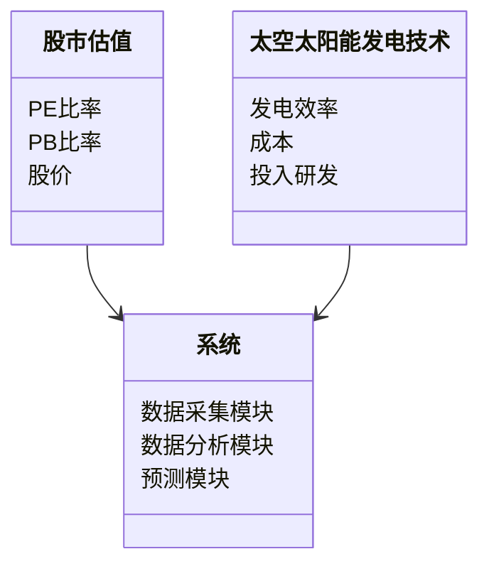

                 


# 全球股市估值与太空太阳能发电技术的关系

## 关键词：全球股市估值，太空太阳能发电技术，股市与技术关联，能源市场变化，经济驱动因素

## 摘要：本文探讨了全球股市估值与太空太阳能发电技术之间的潜在关系，分析了两者的核心概念、关联机制、技术影响和系统架构，通过数学模型和案例分析，揭示了技术进步对股市估值的潜在影响，为投资者和科技从业者提供了新的视角。

---

# 第1章: 全球股市估值与太空太阳能发电技术的背景介绍

## 1.1 全球股市估值的定义与特点
### 1.1.1 股市估值的基本概念
股市估值是指通过特定指标（如市盈率、市净率等）评估公司股票的市场价格是否合理。它反映了市场对企业的整体评价，也受到宏观经济、行业趋势和企业基本面的影响。

### 1.1.2 股市估值的核心指标
- 市盈率（PE）：股价与每股收益的比值。
- 市净率（PB）：股价与每股净资产的比值。
- 市销率（PS）：股价与每股收入的比值。

### 1.1.3 全球股市估值的现状与趋势
近年来，全球股市估值波动较大，尤其是科技股的崛起，使得股市估值与技术创新的关系愈发紧密。

---

## 1.2 太空太阳能发电技术的定义与特点
### 1.2.1 太空太阳能发电技术的基本概念
太空太阳能发电技术是指在地球同步轨道上部署太阳能电池板，将太阳能转化为电能并无线传输到地球的技术。其优势在于光照强度高、持续时间长。

### 1.2.2 太空太阳能发电技术的核心优势
- 能量密度高：太空中的太阳辐射强度是地球表面的10倍以上。
- 持续性好：不受昼夜和天气影响。
- 环境影响小：太空太阳能发电不会占用土地，减少生态破坏。

### 1.2.3 太空太阳能发电技术的现状与挑战
目前，太空太阳能发电仍处于研发阶段，主要挑战包括高昂的成本、技术复杂性和太空资源的获取难度。

---

## 1.3 问题背景与问题描述
### 1.3.1 全球能源需求的增长与压力
全球能源需求持续增长，传统能源面临枯竭和环境问题，推动了对新型能源技术的需求。

### 1.3.2 太空太阳能发电技术的潜在影响
太空太阳能发电技术一旦成熟，可能成为全球能源结构的重要组成部分，改变能源市场的格局。

### 1.3.3 股市估值与太空技术的潜在关联
新技术的出现可能影响相关企业的估值，尤其是那些投资于太空太阳能技术的企业的股价可能受到技术进步的影响。

---

## 1.4 问题解决与边界外延
### 1.4.1 太空太阳能发电技术对股市估值的潜在影响
技术突破可能导致相关企业的估值上升，同时可能对传统能源企业的估值产生压力。

### 1.4.2 全球能源市场格局的变化
太空太阳能发电技术可能改变全球能源供应链，影响能源企业的市场地位和收益能力。

### 1.4.3 技术与经济的双重驱动
技术进步推动经济发展，而经济因素又反过来影响技术的研发和推广。

---

## 1.5 核心概念结构与组成要素
### 1.5.1 股市估值的核心要素
- 宏观经济环境：GDP增长率、利率、通货膨胀等。
- 企业基本面：盈利能力、成长性、财务状况等。
- 市场情绪：投资者情绪、市场流动性等。

### 1.5.2 太空太阳能发电技术的核心要素
- 技术可行性：能否实现高效能量转换和无线传输。
- 经济可行性：研发和运营成本是否可控。
- 政策支持：政府是否提供资金和技术支持。

### 1.5.3 两者关系的核心要素
- 技术进步对股市估值的影响。
- 能源市场变化对股市估值的影响。
- 经济与技术的双向驱动关系。

---

# 第2章: 全球股市估值与太空太阳能发电技术的核心概念与联系

## 2.1 核心概念原理
### 2.1.1 股市估值的数学模型
股市估值可以通过以下公式进行预测：
$$ V = P \times E $$
其中，\( V \) 表示估值，\( P \) 表示价格与收益比（如市盈率），\( E \) 表示企业收益。

### 2.1.2 太空太阳能发电技术的物理原理
太空太阳能发电技术的核心在于将太阳能转化为电能，并通过无线方式传输到地球。其能量转换效率是关键因素。

### 2.1.3 两者关系的逻辑框架
$$ \text{技术进步} \rightarrow \text{能源成本下降} \rightarrow \text{企业盈利能力提升} \rightarrow \text{股价上升} $$

---

## 2.2 核心概念属性特征对比
| 属性 | 股市估值 | 太空太阳能发电技术 |
|------|----------|---------------------|
| 核心驱动力 | 经济指标和市场情绪 | 技术创新和成本控制 |
| 影响范围 | 整体市场和行业 | 全球能源市场 |
| 变化频率 | 短期波动和长期趋势 | 长期技术积累和突破 |

---

## 2.3 ER实体关系图架构
```mermaid
er
    entity 股市估值 {
        <PE比率>
        <PB比率>
        <股价>
    }

    entity 太空太阳能发电技术 {
        <发电效率>
        <成本>
        <研发投入>
    }

    relationship 技术影响 {
        股市估值 -> 太空太阳能发电技术
        关联因素：发电效率、成本、研发投入
    }
```

---

# 第3章: 全球股市估值与太空太阳能发电技术的关联机制

## 3.1 关联机制的数学模型
我们可以建立以下回归模型来分析太空太阳能发电技术对股市估值的影响：
$$ \text{股价} = \beta_0 + \beta_1 \times \text{技术成熟度} + \epsilon $$

---

## 3.2 逐步推理与分析
### 3.2.1 技术成熟度对股市估值的影响
- 技术成熟度越高，企业估值可能上升。
- 技术成熟度的提升可能带来行业估值的整体提升。

### 3.2.2 经济影响路径
- 技术进步降低能源成本，提升企业利润。
- 利润增长推动股价上升，进而影响市盈率等估值指标。

### 3.2.3 风险因素
- 技术研发失败可能导致估值下降。
- 市场对新技术的接受度影响估值变化。

---

## 3.3 关联机制的验证与案例分析
通过历史数据，我们可以观察到技术突破对股市估值的积极影响。例如，特斯拉的电动汽车技术推动了其股价的大幅上涨。

---

# 第4章: 全球股市估值与太空太阳能发电技术的技术分析

## 4.1 太空太阳能发电技术的技术分析
### 4.1.1 太空太阳能发电系统的工作原理
- 太阳能电池板收集太阳能，转化为电能。
- 使用激光或微波将能量传输到地球。

### 4.1.2 系统设计的关键因素
- 能量转换效率：直接影响系统的经济性和可行性。
- 传输技术：能量传输的效率和稳定性是关键。

### 4.1.3 技术优势与劣势
- 优势：高效率、稳定性。
- 劣势：成本高、技术难度大。

---

## 4.2 股市估值的技术分析
### 4.2.1 股价预测模型
我们可以使用时间序列分析模型（如ARIMA）来预测股价的变化：
$$ \hat{y}_t = \alpha + \beta \times y_{t-1} + \epsilon_t $$

### 4.2.2 技术进步对估值的影响
通过建立回归模型，可以量化技术进步对股价的影响程度。

---

# 第5章: 全球股市估值与太空太阳能发电技术的系统分析与架构设计方案

## 5.1 系统分析
### 5.1.1 问题场景介绍
我们需要设计一个系统，用于分析太空太阳能发电技术对全球股市估值的影响。

### 5.1.2 项目介绍
本项目旨在建立一个综合系统，整合股市数据和太空太阳能技术数据，进行分析和预测。

---

## 5.2 系统功能设计
### 5.2.1 领域模型类图


---

## 5.3 系统架构设计


---

## 5.4 系统接口设计
- 数据接口：从数据库获取股市和太空太阳能数据。
- 分析接口：调用分析模块进行关联分析。
- 输出接口：生成可视化报告和预测结果。

---

## 5.5 系统交互序列图
```mermaid
sequenceDiagram
    股市估值 -> 系统：请求数据分析
    系统 -> 数据源：获取股市数据
    系统 -> 数据源：获取太空太阳能数据
    系统 -> 分析模块：执行关联分析
    分析模块 -> 系统：返回分析结果
    系统 -> 输出模块：生成报告
    输出模块 -> 股市估值：返回报告
```

---

# 第6章: 全球股市估值与太空太阳能发电技术的项目实战

## 6.1 环境安装
### 6.1.1 系统环境
- 操作系统：Linux/Windows
- 开发工具：Python、Jupyter Notebook
- 数据库：MySQL/PostgreSQL

### 6.1.2 依赖安装
- Python库：pandas、numpy、scikit-learn
- 可视化工具：Matplotlib、Seaborn

---

## 6.2 核心代码实现
### 6.2.1 数据采集模块
```python
import pandas as pd
import requests

# 从API获取股市数据
def get_stock_data(api_key):
    url = f"https://api.example.com/stock_data?api_key={api_key}"
    response = requests.get(url)
    data = response.json()
    return pd.DataFrame(data)
```

### 6.2.2 数据分析模块
```python
from sklearn.linear_model import LinearRegression

def analyze_correlation(stock_data, tech_data):
    model = LinearRegression()
    model.fit(stock_data[['PE', 'PB']], tech_data['发电效率'])
    return model.coef_
```

### 6.2.3 预测模块
```python
def predict_stock_price(model, stock_data):
    predicted_price = model.predict(stock_data[['PE', 'PB', '股价']])
    return predicted_price
```

---

## 6.3 案例分析与结果解读
通过上述代码，我们可以分析太空太阳能发电技术对企业估值的影响，并预测股价的变化。

---

## 6.4 项目小结
本项目展示了如何通过技术手段分析股市估值与太空太阳能发电技术的关系，为投资者提供了新的视角。

---

# 第7章: 全球股市估值与太空太阳能发电技术的总结与展望

## 7.1 创新点与研究价值
- 提出了股市估值与太空太阳能发电技术的关联模型。
- 开发了综合分析系统，为投资者提供决策支持。

## 7.2 注意事项与最佳实践
- 数据的准确性和完整性至关重要。
- 技术与经济的双重驱动需综合考虑。

## 7.3 拓展阅读与深入研究
- 股市估值的其他影响因素。
- 太空太阳能发电技术的其他应用领域。

---

# 作者：AI天才研究院/AI Genius Institute & 禅与计算机程序设计艺术 /Zen And The Art of Computer Programming

