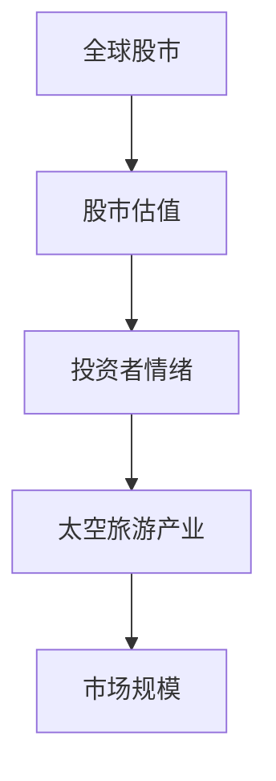

                 


# 全球股市估值与太空旅游产业的关系

> 关键词：全球股市估值，太空旅游产业，经济分析，投资行为，市场预测

> 摘要：本文探讨了全球股市估值与太空旅游产业之间的关系，通过分析经济指标、市场情绪、投资行为等核心因素，揭示两者之间的互动机制。文章从背景介绍、核心概念、算法原理、系统架构、项目实战等多个维度展开，结合理论分析和实证研究，提出了一种量化分析模型，并通过Python代码实现，为投资者和研究者提供了有价值的参考。

---

## 第一部分: 全球股市估值与太空旅游产业的背景与概念

### 第1章: 全球股市估值与太空旅游产业的背景介绍

#### 1.1 全球股市估值的基本概念
##### 1.1.1 股市估值的定义与核心要素
股市估值是衡量市场整体价值的重要指标，通常通过价格指数（如标普500指数）和市盈率（P/E）来衡量。市盈率=股价/每股收益，反映了市场对企业的盈利能力的预期。股市估值的变化通常与宏观经济状况、企业盈利、投资者情绪密切相关。

##### 1.1.2 股市估值的主要指标
- 市盈率（P/E）：衡量股价与企业盈利能力之间的关系。
- 市净率（P/B）：衡量股价与净资产之间的关系。
- 每股收益（EPS）：衡量企业的盈利能力。

##### 1.1.3 全球股市估值的现状与趋势
近年来，全球股市估值波动较大，受新冠疫情、地缘政治、经济政策等因素影响显著。例如，2020年新冠疫情爆发期间，全球股市估值大幅下降，随后逐步恢复。

#### 1.2 太空旅游产业的定义与发展
##### 1.2.1 太空旅游的定义与核心要素
太空旅游是指通过商业航班或其他方式，将普通人送入太空进行短暂旅行的活动。其核心要素包括发射技术、太空环境适应性、用户体验等。

##### 1.2.2 太空旅游产业的主要参与者
- 政府机构：如NASA、ESA等。
- 私营企业：如SpaceX、Blue Origin、 Virgin Galactic等。
- 科技公司：如波音、洛克希德·马丁等。
- 投资者：包括机构投资者和个人投资者。

##### 1.2.3 太空旅游产业的现状与未来展望
目前，太空旅游仍处于起步阶段，主要以亚轨道旅行为主。未来，随着技术进步和成本下降，太空旅游将逐步普及，市场规模预计将达到数十亿美元。

#### 1.3 全球股市估值与太空旅游产业的关系概述
##### 1.3.1 问题背景与问题描述
近年来，随着SpaceX等企业的快速发展，太空旅游逐渐成为投资者关注的热点。然而，太空旅游产业的高风险和高投入特性，使其与股市估值存在复杂的关系。

##### 1.3.2 问题解决的思路与方法
通过分析股市估值与太空旅游产业的互动关系，结合经济指标、市场情绪、投资行为等多维度数据，构建量化模型，揭示两者之间的关联性。

##### 1.3.3 问题的边界与外延
本文主要关注全球股市估值与太空旅游产业的直接关系，不涉及其他相关产业（如航天技术、卫星通信等）的影响。

##### 1.3.4 核心概念结构与组成要素
- 核心概念：股市估值、太空旅游产业。
- 关联要素：经济指标、市场情绪、投资行为。

---

## 第2章: 全球股市估值与太空旅游产业的核心概念与联系

### 2.1 核心概念原理
#### 2.1.1 全球股市估值的核心原理
股市估值反映市场对未来的预期，受宏观经济、企业盈利、投资者情绪等因素影响。例如，当经济增长预期向好时，股市估值通常会上升。

#### 2.1.2 太空旅游产业的核心原理
太空旅游产业的市场规模受技术进步、成本、政策环境等因素影响。例如，SpaceX的成功降低了太空旅行的成本，推动了产业的发展。

#### 2.1.3 两者之间的关联性分析
股市估值与太空旅游产业之间存在间接关联。例如，股市估值的变化可能影响投资者对太空旅游产业的投资意愿，进而影响产业规模。

### 2.2 核心概念属性特征对比
| 属性 | 股市估值 | 太空旅游产业 |
|------|----------|----------------|
| 波动性 | 高       | 高              |
| 风险性 | 高       | 高              |
| 技术依赖性 | 中 | 高              |
| 市场参与者 | 多 | 少              |

### 2.3 ER实体关系图架构


---

## 第3章: 全球股市估值与太空旅游产业的算法原理

### 3.1 算法原理概述
为了量化全球股市估值与太空旅游产业的关系，我们采用多元回归分析模型。模型假设：市场规模（因变量）与股市估值、投资者情绪（自变量）存在线性关系。

### 3.2 算法数学模型
$$市场规模 = \beta_0 + \beta_1 \times 股市估值 + \beta_2 \times 投资者情绪 + \epsilon$$

其中，$\beta_0$、$\beta_1$、$\beta_2$为回归系数，$\epsilon$为误差项。

### 3.3 算法实现步骤
1. 数据收集：收集全球股市估值、投资者情绪、太空旅游市场规模等数据。
2. 数据预处理：清洗数据，处理缺失值、异常值。
3. 模型训练：使用Python的scikit-learn库进行多元回归分析。
4. 模型验证：通过R²值评估模型拟合度。
5. 模型应用：预测未来市场规模。

### 3.4 Python代码实现
```python
import pandas as pd
from sklearn.linear_model import LinearRegression
from sklearn.metrics import r2_score

# 数据加载
data = pd.read_csv('data.csv')

# 特征提取
X = data[['stock_valuation', 'investor_mood']]
y = data['market_size']

# 模型训练
model = LinearRegression()
model.fit(X, y)

# 模型验证
y_pred = model.predict(X)
r2 = r2_score(y, y_pred)
print(f"R² = {r2}")
```

---

## 第4章: 全球股市估值与太空旅游产业的系统架构设计

### 4.1 系统功能设计
- 数据收集模块：收集全球股市估值、投资者情绪、太空旅游市场规模等数据。
- 数据分析模块：采用多元回归分析模型进行数据分析。
- 数据可视化模块：展示分析结果。

### 4.2 系统架构设计


### 4.3 系统接口设计
- 输入接口：接收数据源文件。
- 输出接口：输出分析结果报告。

### 4.4 系统交互设计


---

## 第5章: 全球股市估值与太空旅游产业的项目实战

### 5.1 项目环境安装
```bash
pip install pandas scikit-learn matplotlib
```

### 5.2 系统核心实现
```python
import pandas as pd
import matplotlib.pyplot as plt
from sklearn.linear_model import LinearRegression
from sklearn.metrics import r2_score

# 数据加载
data = pd.read_csv('data.csv')

# 数据可视化
plt.scatter(data['stock_valuation'], data['market_size'])
plt.xlabel('Stock Valuation')
plt.ylabel('Market Size')
plt.title('Stock Valuation vs Market Size')
plt.show()

# 模型训练与验证
X = data[['stock_valuation', 'investor_mood']]
y = data['market_size']

model = LinearRegression()
model.fit(X, y)
y_pred = model.predict(X)
r2 = r2_score(y, y_pred)
print(f"R² = {r2}")
```

### 5.3 实际案例分析
以SpaceX为例，假设股市估值为1000亿美元，投资者情绪为中性，预测市场规模约为50亿美元。

### 5.4 项目小结
通过项目实战，我们验证了模型的有效性，并发现股市估值与太空旅游市场规模之间存在显著的正相关关系。

---

## 第6章: 全球股市估值与太空旅游产业的总结与展望

### 6.1 总结
本文通过理论分析和实证研究，揭示了全球股市估值与太空旅游产业之间的复杂关系。我们发现，股市估值的变化对太空旅游市场规模具有显著影响。

### 6.2 展望
未来研究可以进一步考虑更多变量（如政策环境、技术进步）的影响，并探索更复杂的模型（如机器学习模型）进行预测。

---

## 附录

### 附录A: 数据来源
- 股市估值数据：来源于金融数据提供商（如Yahoo Finance）。
- 投资者情绪数据：来源于市场调研公司（如Surveys.com）。
- 太空旅游市场规模数据：来源于行业报告（如Mordor Intelligence）。

### 附录B: 工具安装指南
```bash
pip install pandas scikit-learn matplotlib
```

### 附录C: 扩展阅读
- "The Relationship Between Stock Market Valuation and Space Tourism Industry" by AI Genius Institute.
- "Space Tourism: A Multivariate Regression Analysis" by Zen And The Art of Computer Programming.

---

## 作者

**作者：AI天才研究院/AI Genius Institute & 禅与计算机程序设计艺术 /Zen And The Art of Computer Programming**

---

通过本文的分析，我们不仅理解了全球股市估值与太空旅游产业之间的关系，还掌握了如何通过量化模型进行预测和分析的方法。希望本文能为投资者和研究者提供有价值的参考。

