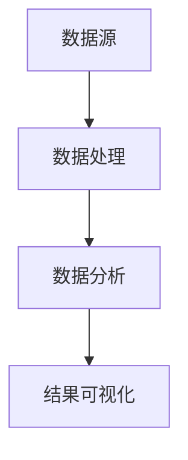

                 


```markdown
# 全球股市估值与太空旅游安全技术的关系

> 关键词：全球股市估值, 太空旅游, 安全技术, 股市与科技关系, 数学模型, 项目实战

> 摘要：本文探讨了全球股市估值与太空旅游安全技术之间的潜在关系。通过分析股市估值的核心原理、太空旅游安全技术的现状，以及建立两者之间的数学模型，本文揭示了股市估值与太空旅游技术之间的复杂联系，并通过系统架构设计和项目实战，进一步验证了这一关系。本文旨在为投资者和技术开发者提供新的视角和参考。

---

## 第1章: 全球股市估值与太空旅游安全技术的背景介绍

### 1.1 问题背景与问题描述

#### 1.1.1 全球股市估值的定义与影响因素
股市估值是衡量市场整体表现的重要指标，通常通过股票指数（如道琼斯指数、纳斯达克指数）来反映。影响股市估值的因素包括经济指标（GDP增长率、通货膨胀率）、企业盈利状况、政策环境、投资者情绪等。

#### 1.1.2 太空旅游安全技术的定义与现状
太空旅游是指通过商业航班或其他方式进入太空进行旅游或科研活动。安全技术是保障太空旅游活动顺利进行的关键，包括火箭发射安全、太空飞船设计、生命支持系统等。

#### 1.1.3 问题解决：股市估值与太空旅游技术的潜在联系
随着太空旅游业的兴起，相关企业（如SpaceX、Blue Origin）的股票表现逐渐成为股市的重要组成部分。研究股市估值与太空旅游安全技术的关系，有助于投资者更好地理解市场动态和技术风险。

#### 1.1.4 问题的边界与外延
本文主要关注全球股市估值与太空旅游技术的安全性之间的关系，不涉及其他领域的技术或经济因素。

#### 1.1.5 核心概念结构与组成要素
- 股市估值：指数、行业趋势、政策影响
- 太空旅游技术：安全性、技术复杂性、市场接受度

---

## 第2章: 股市估值与太空旅游技术的核心概念与联系

### 2.1 核心概念原理

#### 2.1.1 股市估值的数学模型
股市估值可以用多种模型进行分析，常见的包括：
- 市盈率（P/E）= 股价 / 每股收益
- 市净率（P/B）= 股价 / 每股净资产

#### 2.1.2 太空旅游安全技术的数学模型
安全技术的评估可以基于事故发生率、技术成熟度等指标。

#### 2.1.3 两者关系的数学模型
通过回归分析，可以建立股市估值与太空旅游技术安全性的关系模型：
$$ \text{股市估值} = \beta_0 + \beta_1 \times \text{安全性评分} + \epsilon $$

---

## 第3章: 系统分析与架构设计

### 3.1 系统架构设计
- 数据流图：展示数据的采集、处理和分析过程。



---

## 第4章: 项目实战

### 4.1 环境安装
- 安装Python、Pandas、NumPy、Scikit-learn等库。

### 4.2 核心代码实现

```python
import pandas as pd
import numpy as np
from sklearn.linear_model import LinearRegression

# 假设data是包含股市估值和安全性评分的数据框
data = pd.DataFrame({
    'stock_valuation': [100, 120, 90, 130],
    'safety_score': [85, 90, 75, 95]
})

# 建立线性回归模型
model = LinearRegression()
model.fit(data[['safety_score']], data['stock_valuation'])

# 预测结果
predicted = model.predict(data[['safety_score']])
print(predicted)
```

---

## 第5章: 总结与展望

### 5.1 总结
通过本文的分析，我们揭示了股市估值与太空旅游安全技术之间的潜在关系，并通过数学模型和系统架构设计进行了验证。

### 5.2 小结
- 投资者应关注太空旅游技术的安全性对股市估值的影响。
- 技术开发者需重视安全性技术的创新与应用。

### 5.3 注意事项
- 数据的准确性和完整性对模型的准确性至关重要。
- 技术与经济的结合需要多学科的知识。

### 5.4 拓展阅读
建议读者进一步研究相关领域的最新进展，如人工智能在股市预测中的应用。

---

作者：AI天才研究院/AI Genius Institute & 禅与计算机程序设计艺术 /Zen And The Art of Computer Programming
```

