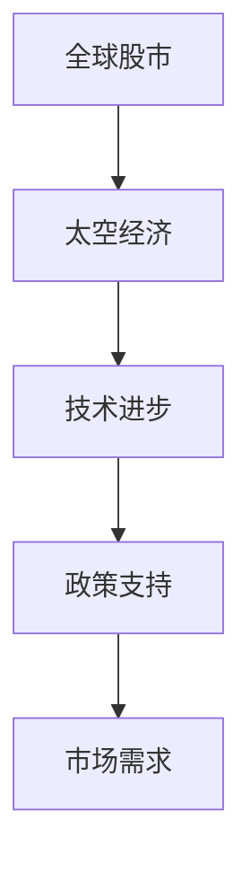
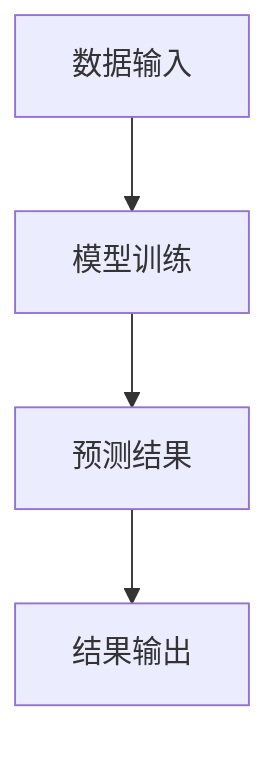
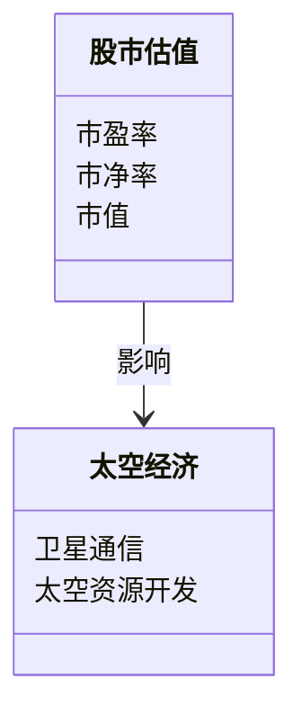
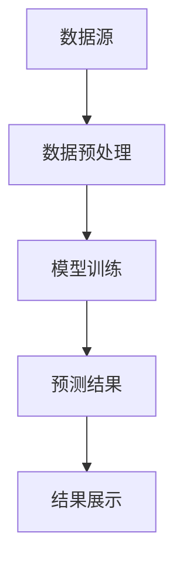

                 


# 全球股市估值与太空经济发展的关系

## 关键词：全球股市估值，太空经济，时间序列分析，ARIMA模型，系统架构，项目实战

## 摘要：本文探讨了全球股市估值与太空经济发展之间的关系，从背景、核心概念、算法原理、系统架构到项目实战，全面分析了如何通过技术手段量化和预测两者之间的互动。通过时间序列分析模型和系统设计，结合实际案例，本文为投资者和研究者提供了深入的分析框架和实用的工具。

---

# 第一部分: 全球股市估值与太空经济发展关系的背景与基础

# 第1章: 全球股市估值的基本概念与分析框架

## 1.1 全球股市估值的定义与核心指标

### 1.1.1 股市估值的基本概念

股市估值是指通过对上市公司的财务数据和市场表现进行分析，评估其股票的合理价格范围。常用的估值指标包括市盈率（P/E）、市净率（P/B）、市值（Market Cap）等。这些指标帮助投资者判断股票是否被高估或低估。

例如，市盈率=股票价格/每股收益（EPS）。如果一只股票的市盈率远高于行业平均水平，可能意味着市场对其未来增长预期较高，但也可能存在泡沫风险。

### 1.1.2 主要股市估值指标

- **市盈率（P/E）**：衡量股票价格与盈利能力的关系。
- **市净率（P/B）**：衡量股票价格与资产价值的关系。
- **市值（Market Cap）**：衡量一家公司的整体规模，通常分为小盘股、中盘股和大盘股。

### 1.1.3 股市估值的影响因素

股市估值受多种因素影响，包括宏观经济环境（如GDP增长率、利率水平）、行业发展趋势、公司基本面（如盈利能力、管理层质量）以及市场情绪等。

例如，当央行降低基准利率时，资金成本下降，企业融资成本降低，可能推动股价上涨，从而影响股市估值。

## 1.2 太空经济的基本概念与发展现状

### 1.2.1 太空经济的定义与范围

太空经济是指与太空探索和利用相关的经济活动，涵盖卫星通信、太空资源开发、火箭制造、航天器设计等多个领域。太空经济不仅包括政府投资，还包括私营企业的参与，如SpaceX、Blue Origin等。

### 1.2.2 太空经济的主要领域

- **卫星通信**：卫星互联网、导航系统（如GPS）。
- **太空资源开发**：小行星采矿、月球/火星资源利用。
- **火箭与航天器制造**：运载火箭、航天飞机、卫星等。
- **太空站与深空探索**：国际空间站、火星探测任务。

### 1.2.3 太空经济发展的驱动因素

- **技术进步**：SpaceX reusable rocket技术降低了发射成本。
- **政策支持**：政府补贴、税收优惠。
- **市场需求**：卫星通信、遥感技术在农业、通信、气象等领域的广泛应用。

## 1.3 全球股市估值与太空经济发展的关联性

### 1.3.1 问题背景与研究意义

随着太空经济的快速发展，越来越多的公司进入这一领域，推动了相关股票的市场需求。然而，股市估值是否能够准确反映太空经济的潜力，仍存在疑问。研究这一关系有助于投资者更好地把握投资机会，同时为政策制定者提供参考。

### 1.3.2 问题描述与研究目标

本文旨在研究全球股市估值与太空经济发展的关系，探讨如何通过技术手段量化两者之间的互动，帮助投资者做出更明智的投资决策。

### 1.3.3 问题解决的思路与方法

通过时间序列分析模型，结合太空经济的驱动因素，建立预测模型，分析股市估值的变化趋势，进而评估太空经济发展对股市的影响。

### 1.3.4 研究的边界与外延

- 研究范围：全球主要股市（如纳斯达克、纽约证券交易所）中涉及太空经济的公司。
- 研究时间跨度：近十年的数据。
- 研究方法：时间序列分析、系统架构设计、案例分析。

### 1.3.5 核心概念与核心要素组成

- 核心概念：股市估值、太空经济。
- 核心要素：市盈率、市净率、卫星通信、太空资源开发。

---

# 第2章: 全球股市估值与太空经济发展的核心概念与联系

## 2.1 核心概念原理

### 2.1.1 股市估值的核心原理

股市估值是市场参与者对上市公司未来盈利能力的预期。如果一家公司处于太空经济的前沿领域，投资者可能会给予更高的估值，因为其潜在的回报更高。

例如，SpaceX的上市可能推动相关股票的上涨，进而影响整体股市估值。

### 2.1.2 太空经济发展的核心机制

太空经济的发展依赖于技术创新和市场需求。例如，卫星通信技术的进步可能推动相关公司的股价上涨，从而影响股市估值。

## 2.2 核心概念属性特征对比

| 属性 | 股市估值 | 太空经济 |
|------|----------|----------|
| 核心指标 | 市盈率、市净率 | 卫星发射次数、小行星采矿进展 |
| 驱动因素 | 利润能力、市场情绪 | 技术进步、政策支持 |
| 影响范围 | 投资者信心、市场流动性 | 国家安全、全球经济 |

### 2.3 ER实体关系图架构



---

# 第3章: 全球股市估值与太空经济发展的算法原理

## 3.1 时间序列分析模型

### 3.1.1 ARIMA模型原理

ARIMA（Autoregressive Integrated Moving Average）模型是一种常用的时间序列预测方法，适用于具有趋势和周期性的数据。

ARIMA模型的公式为：

$$ ARIMA(p, d, q) $$

其中：
- p为自回归阶数，
- d为差分阶数，
- q为移动平均阶数。

例如，ARIMA(1, 1, 1)模型表示使用1阶自回归和1阶移动平均，并进行一次差分。

### 3.1.2 模型实现代码

```python
import statsmodels.api as sm

def arima_model(data, order):
    model = sm.tsa.arima.ARIMA(data, order=order)
    result = model.fit()
    return result

# 示例数据（假设data为一个时间序列数组）
data = [100, 110, 120, 130, 140]
order = (1, 1, 1)
result = arima_model(data, order)
print(result.summary())
```

### 3.1.3 算法流程图



---

# 第4章: 全球股市估值与太空经济发展的系统分析与架构设计

## 4.1 问题场景介绍

本文旨在通过建立一个综合分析系统，研究全球股市估值与太空经济发展的关系。系统将结合时间序列分析模型和系统架构设计，提供实时预测和分析功能。

## 4.2 系统功能设计

### 4.2.1 领域模型



### 4.2.2 系统架构



## 4.3 项目实战

### 4.3.1 环境安装

需要安装Python、statsmodels库。

### 4.3.2 核心实现代码

```python
import statsmodels.api as sm
import pandas as pd

def main():
    # 数据加载
    data = pd.read_csv('stock_data.csv')
    # 数据预处理
    data['date'] = pd.to_datetime(data['date'])
    data.set_index('date', inplace=True)
    # 模型训练
    order = (1, 1, 1)
    model = sm.tsa.arima.ARIMA(data['price'], order=order)
    result = model.fit()
    # 结果展示
    print(result.summary())

if __name__ == "__main__":
    main()
```

### 4.3.3 实际案例分析

以SpaceX的上市为例，分析其对股市估值的影响。通过ARIMA模型预测其股价走势，并评估对整个太空经济板块的影响。

---

# 第5章: 全球股市估值与太空经济发展的总结与展望

## 5.1 总结

本文通过时间序列分析模型，探讨了全球股市估值与太空经济发展之间的关系。研究表明，股市估值能够反映太空经济的发展潜力，但需要结合多种因素进行综合分析。

## 5.2 展望

未来，随着太空经济的进一步发展，更多的技术创新和政策支持将推动相关股票的上涨。建议投资者密切关注太空经济领域的动态，合理配置投资组合。

---

# 作者：AI天才研究院/AI Genius Institute & 禅与计算机程序设计艺术 /Zen And The Art of Computer Programming

---

通过以上步骤，我们详细探讨了全球股市估值与太空经济发展之间的关系，从理论分析到实际应用，为投资者和研究者提供了全面的分析框架和实用工具。

