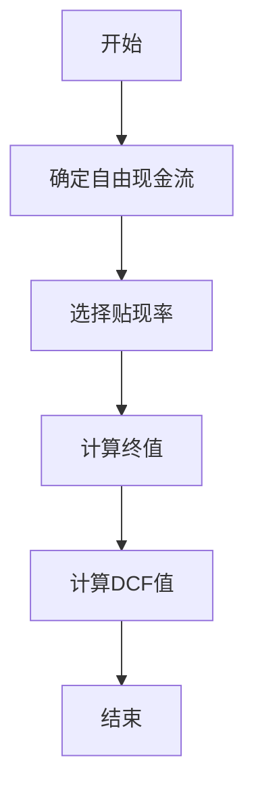
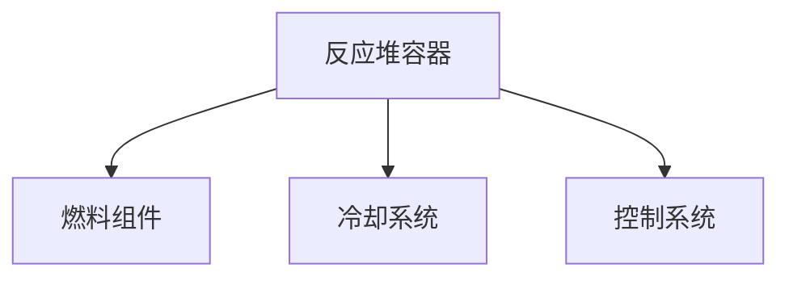

                 


# 全球股市估值与小型模块化核反应堆技术的发展

## 关键词：股市估值、模块化核反应堆、技术发展、投资分析、能源创新

## 摘要：  
本文探讨了全球股市估值与小型模块化核反应堆技术发展的潜在联系。首先，分析了股市估值的核心概念和方法，包括市盈率、市净率等指标，以及现金流折现模型（DCF）的应用。接着，详细介绍了小型模块化核反应堆的技术特点，如模块化设计、安全性与经济性。然后，结合实际案例，分析了模块化核反应堆企业的估值影响因素，包括技术创新、市场前景和财务表现。最后，总结了两者结合的创新意义，并提出了投资建议和注意事项。

---

# 正文

## 第一部分：引言

### 第1章：全球股市估值与小型模块化核反应堆的概述

#### 1.1 全球股市估值的基本概念
股市估值是评估企业内在价值的重要方法，常用的指标包括市盈率（P/E）、市净率（P/B）和股息率。这些指标帮助投资者判断股票是否被高估或低估。

#### 1.2 问题背景与研究意义
全球股市波动频繁，而小型模块化核反应堆技术作为清洁能源的重要发展方向，具有广阔的应用前景。研究两者的结合，可以为投资者提供新的视角，帮助其做出更明智的投资决策。

---

## 第二部分：全球股市估值的理论与方法

### 第2章：股市估值的核心原理

#### 2.1 常用估值指标
- **市盈率（P/E）**：衡量股价与每股收益的比例，公式为 $P/E = \text{股价} / \text{每股收益}$。
- **市净率（P/B）**：衡量股价与每股净资产的比例，公式为 $P/B = \text{股价} / \text{每股净资产}$。
- **股息率**：衡量每股股息与股价的比率，公式为 $\text{股息率} = (\text{每股股息} / \text{股价}) \times 100\%$。

#### 2.2 估值模型
- **现金流折现模型（DCF）**：通过预测未来现金流并折现，计算企业价值。步骤包括确定自由现金流、选择贴现率、计算终值等。

**DCF模型流程图**：


---

## 第三部分：小型模块化核反应堆技术的发展

### 第3章：模块化核反应堆的技术特点

#### 3.1 模块化设计的优势
模块化设计使核反应堆可以像积木一样组装，提高了生产效率和灵活性。

**模块化设计优势对比表**：

| 特性       | 模块化设计 | 非模块化设计 |
|------------|------------|--------------|
| 安装时间   | 短         | 长           |
| 成本       | 低         | 高           |
| 可扩展性   | 高         | 低           |

#### 3.2 安全性与经济性
- **安全性**：模块化设计提高了核反应堆的安全性，降低了事故风险。
- **经济性**：模块化生产降低了建设和运营成本，提高了经济效益。

---

## 第四部分：股市估值与核反应堆技术的结合

### 第4章：模块化核反应堆企业的估值分析

#### 4.1 核心企业介绍
- **主要企业**：如Westinghouse、NuScale等。
- **财务分析**：分析企业的收入、利润和现金流情况。

#### 4.2 技术创新对估值的影响
技术创新可以提升企业的竞争力，进而提高股价。例如，技术成熟度高的企业可能享有更高的市盈率。

---

## 第五部分：系统分析与架构设计

### 第5章：模块化核反应堆的系统架构

#### 5.1 系统组成
- **核心模块**：包括反应堆容器、燃料组件等。
- **辅助系统**：如冷却系统、控制系统等。

**模块化核反应堆系统架构图**：


---

## 第六部分：项目实战与数学模型

### 第6章：股市估值的实战分析

#### 6.1 环境安装与数据收集
- **数据源**：使用Yahoo Finance获取历史数据。
- **数据预处理**：清洗数据，处理缺失值。

#### 6.2 核心算法实现
- **DCF模型的Python实现**：
  ```python
  def calculate_dcf(free_cash_flow, discount_rate, terminal_value):
      present_value = 0
      for cash_flow in free_cash_flow:
          present_value += cash_flow / (1 + discount_rate)**i
      return present_value + terminal_value / (1 + discount_rate)**len(free_cash_flow)
  ```

---

## 第七部分：总结与展望

### 第7章：总结与最佳实践

#### 7.1 全书总结
通过分析全球股市估值和小型模块化核反应堆技术，我们发现技术创新和市场前景是影响企业估值的关键因素。投资者应综合考虑技术、财务和市场因素，做出明智的投资决策。

#### 7.2 最佳实践 tips
- **技术关注点**：关注企业的技术创新能力和专利情况。
- **财务分析**：结合DCF模型等方法，全面评估企业价值。
- **市场风险**：关注政策变化和市场需求波动。

---

# 作者：AI天才研究院/AI Genius Institute & 禅与计算机程序设计艺术 /Zen And The Art of Computer Programming

---

这篇文章通过系统的分析和实际案例，深入探讨了全球股市估值与小型模块化核反应堆技术的结合，为投资者和科技从业者提供了有价值的见解和建议。

