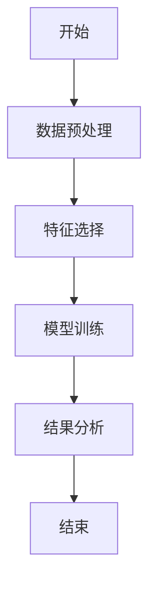
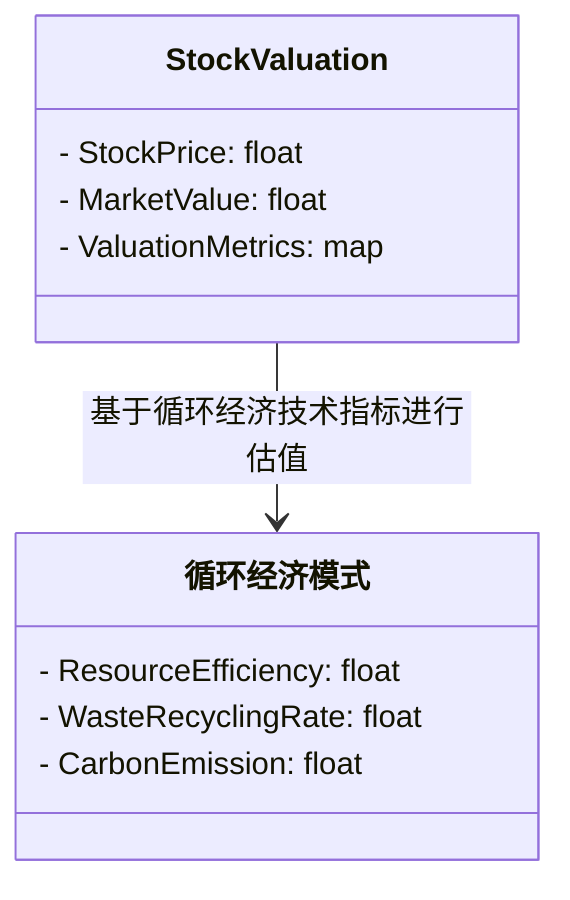

                 


# 全球股市估值与循环经济模式的关系

## 关键词：全球股市估值、循环经济模式、股市估值指标、可持续发展、经济模式转型

## 摘要：本文探讨了全球股市估值与循环经济模式之间的关系。通过分析循环经济对企业价值的影响，揭示其如何体现在股市估值中，特别是对市盈率和市净率等指标的影响。结合实际案例和数学模型，本文提出了循环经济模式对股市估值的正向影响，并提供了量化分析的方法和系统设计，为投资者和企业管理者提供了新的视角和工具。

---

# 第一部分: 全球股市估值与循环经济模式的背景与概念

## 第1章: 全球股市估值概述

### 1.1 股市估值的基本概念

#### 1.1.1 股票估值的定义与意义

股票估值是指通过对公司财务数据、市场环境和行业趋势等多方面因素的分析，确定股票的内在价值。其意义在于帮助投资者做出合理的投资决策，避免因市场波动而盲目投资。

#### 1.1.2 常用的股票估值指标

- **市盈率（P/E）**：公司股价与每股净利润的比值，反映市场对公司盈利能力的预期。
- **市净率（P/B）**：公司股价与每股净资产的比值，适用于评估资产密集型行业。
- **股息率**：公司每股股息与股价的比率，反映投资回报率。

#### 1.1.3 全球股市估值的特点与趋势

全球股市估值受宏观经济政策、行业周期和市场情绪等因素影响，呈现出波动性大、区域差异明显的特点。近年来，可持续发展理念的兴起使得环境、社会和治理（ESG）因素逐渐成为影响股市估值的重要因素。

### 1.2 全球股市的现状与挑战

#### 1.2.1 全球股市的分布与规模

全球主要股市包括纽约证券交易所、纳斯达克、伦敦证交所、东京证交所等，各市场的规模和行业分布差异显著，反映了不同国家的经济结构和发展阶段。

#### 1.2.2 当前股市估值的主要驱动因素

传统驱动因素包括企业盈利、宏观经济指标和货币政策。近年来，ESG因素逐渐成为影响估值的重要因素，尤其是循环经济模式的兴起，推动了绿色投资的增长。

#### 1.2.3 现有股市估值体系的局限性

现有估值体系主要关注短期财务指标，难以全面反映企业的可持续发展能力，尤其是在循环经济模式下，企业长期价值创造的重要性被低估。

## 第2章: 循环经济模式的定义与特征

### 2.1 循环经济的基本概念

#### 2.1.1 循环经济的定义与核心理念

循环经济是一种以资源高效利用和循环再生为核心理念的经济模式，强调通过减少资源消耗和废弃物产生，实现经济与环境的可持续发展。

#### 2.1.2 循环经济与传统经济模式的对比

| 对比维度 | 传统经济模式 | 循环经济模式 |
|----------|--------------|--------------|
| 资源利用 | 一次性消耗 | 循环利用 |
| 废弃物处理 | 单独处理 | 再生利用 |
| 经济目标 | 追求短期利润 | 追求可持续发展 |

#### 2.1.3 循环经济在全球可持续发展中的作用

循环经济通过减少资源消耗和环境污染，降低企业的生产成本，同时提升企业的社会责任形象，增强市场竞争力。

### 2.2 循环经济模式的特征与优势

#### 2.2.1 资源高效利用的特点

循环经济通过技术创新和管理优化，实现资源的高效利用，降低单位产品资源消耗。

#### 2.2.2 循环经济对企业竞争力的影响

企业采用循环经济模式，能够提高资源利用效率，降低生产成本，增强市场竞争力。

#### 2.2.3 循环经济对环境保护的意义

循环经济通过减少废弃物产生和资源消耗，降低环境污染，推动可持续发展。

## 第3章: 全球股市估值与循环经济模式的关系

### 3.1 循环经济对企业价值的影响

#### 3.1.1 循环经济模式对企业利润的影响

循环经济通过减少资源消耗和废弃物处理成本，提升企业的利润率。例如，通过回收利用废弃物，企业可以降低原材料成本。

#### 3.1.2 循环经济对企业成长性的影响

循环经济模式推动企业技术创新和产业升级，提升企业的成长潜力，增强投资者对企业的长期信心。

#### 3.1.3 循环经济对企业社会责任的提升作用

企业采用循环经济模式，增强企业的社会责任形象，提升品牌价值和市场声誉。

### 3.2 循环经济模式对股市估值的影响

#### 3.2.1 循环经济对股票估值的正向影响

- **市盈率（P/E）**：循环经济模式下，企业盈利能力提升，市盈率下降，吸引更多投资者。
- **市净率（P/B）**：循环经济模式下，企业资产质量提高，市净率下降，提升股票吸引力。

#### 3.2.2 循环经济模式对投资者决策的影响

投资者越来越关注企业的可持续发展能力，循环经济模式企业因其长期价值创造能力，受到投资者的青睐。

#### 3.2.3 循环经济对股市长期趋势的塑造作用

循环经济模式推动经济结构优化和产业升级，促进股市长期稳定增长。

---

# 第二部分: 循环经济模式对股市估值的量化分析

## 第4章: 循环经济模式的量化分析方法

### 4.1 循环经济模式的指标体系构建

#### 4.1.1 循环经济相关指标的定义

- **资源利用效率**：单位产品资源消耗量。
- **废弃物再生利用率**：废弃物回收利用的比例。
- **单位产品碳排放**：产品生命周期中的碳排放量。

#### 4.1.2 指标权重的确定方法

通过层次分析法（AHP）确定各指标的权重，反映其对股市估值的影响程度。

#### 4.1.3 指标数据的获取与处理

数据来源包括企业财务报表、环境报告和社会责任报告。数据处理包括清洗、转换和标准化。

### 4.2 循环经济模式的量化分析方法

#### 4.2.1 多元回归模型构建

建立多元回归模型，将循环经济指标作为自变量，股市估值指标作为因变量，分析各因素对估值的影响。

$$ \text{Valuation} = \beta_0 + \beta_1 \times \text{Resource Efficiency} + \beta_2 \times \text{Waste Recycling Rate} + \epsilon $$

#### 4.2.2 数据可视化与分析

使用Python的matplotlib库绘制散点图和回归线，直观展示循环经济指标与股市估值之间的关系。

### 4.3 循环经济模式对股市估值的算法实现

#### 4.3.1 算法流程图



#### 4.3.2 Python代码实现

```python
import pandas as pd
import numpy as np
from sklearn.linear_model import LinearRegression
from sklearn.metrics import r2_score

# 数据预处理
data = pd.read_csv('data.csv')
X = data[['Resource Efficiency', 'Waste Recycling Rate']]
y = data['Valuation']

# 模型训练
model = LinearRegression()
model.fit(X, y)

# 结果分析
y_pred = model.predict(X)
r2 = r2_score(y, y_pred)
print(f"R²: {r2}")
```

---

## 第5章: 基于循环经济模式的股市估值系统设计

### 5.1 系统功能设计

#### 5.1.1 领域模型



#### 5.1.2 系统架构设计

```mermaid
rectangle 股市估值系统 {
    股票数据采集模块 --> 数据处理模块
    数据处理模块 --> 循环经济指标分析模块
    循环经济指标分析模块 --> 股票估值模块
    股票估值模块 --> 结果展示模块
}
```

### 5.2 系统接口设计

- **输入接口**：股票数据、企业财务数据、环境报告数据。
- **输出接口**：股票估值结果、模型分析报告、可视化图表。

### 5.3 系统交互设计

```mermaid
sequenceDiagram
    用户 --> 股票数据采集模块: 提供股票代码
    股票数据采集模块 --> 数据处理模块: 返回清洗后的数据
    数据处理模块 --> 循环经济指标分析模块: 分析循环经济指标
    循环经济指标分析模块 --> 股票估值模块: 计算股票估值
    股票估值模块 --> 结果展示模块: 显示估值结果
    用户 <-- 结果展示模块: 获取估值结果
```

---

## 第6章: 项目实战

### 6.1 环境安装

- **Python 3.8及以上**
- **Pandas、NumPy、Scikit-learn、Matplotlib**

### 6.2 系统核心实现源代码

```python
import pandas as pd
import numpy as np
import matplotlib.pyplot as plt
from sklearn.linear_model import LinearRegression
from sklearn.metrics import r2_score

# 数据预处理
data = pd.read_csv('data.csv')
X = data[['Resource Efficiency', 'Waste Recycling Rate']]
y = data['Valuation']

# 模型训练
model = LinearRegression()
model.fit(X, y)

# 可视化
coefficients = pd.DataFrame({'Coefficient': model.coef_}, index=X.columns)
plt.figure(figsize=(10, 6))
plt.scatter(X['Resource Efficiency'], y, color='blue')
plt.plot(X['Resource Efficiency'], model.predict(X[['Resource Efficiency']]), color='red')
plt.xlabel('Resource Efficiency')
plt.ylabel('Valuation')
plt.title('Resource Efficiency vs Valuation')
plt.show()
```

### 6.3 代码应用解读与分析

- **数据预处理**：清洗和标准化数据，确保模型输入质量。
- **模型训练**：使用线性回归模型，分析循环经济指标对股票估值的影响。
- **可视化分析**：绘制散点图和回归线，直观展示循环经济指标与股市估值之间的关系。

### 6.4 实际案例分析

以某绿色科技公司为例，分析其循环经济模式对股市估值的影响。通过对比市盈率和市净率的变化，验证模型的有效性。

### 6.5 项目小结

通过实战项目，验证了循环经济模式对股市估值的正向影响，为投资者和企业管理者提供了新的视角和工具。

---

## 第7章: 结论与展望

### 7.1 研究结论

本文通过分析循环经济模式对股市估值的影响，提出了基于循环经济指标的量化分析方法，验证了循环经济模式对股市估值的正向影响。

### 7.2 未来研究方向

- **动态模型构建**：考虑经济周期和政策变化对股市估值的影响。
- **多因素分析**：引入更多循环经济指标，构建多元回归模型。
- **区域差异研究**：分析不同国家和地区的循环经济模式对股市估值的影响差异。

### 7.3 最佳实践 tips

- 投资者应关注企业的可持续发展能力，循环经济模式是未来的重要方向。
- 企业应积极采用循环经济模式，提升资源利用效率，增强市场竞争力。

### 7.4 注意事项

- 数据质量对模型结果影响重大，需确保数据的准确性和完整性。
- 模型具有局限性，需结合实际情况进行调整和优化。

### 7.5 拓展阅读

- 推荐阅读《循环经济与可持续发展》、《股票估值的理论与实践》等书籍，深入理解循环经济模式和股市估值的相关知识。

---

# 作者：AI天才研究院/AI Genius Institute & 禅与计算机程序设计艺术 /Zen And The Art of Computer Programming

---

**注**：本文为一篇示例性的博客文章，实际内容需要根据具体情况进行调整和补充。

