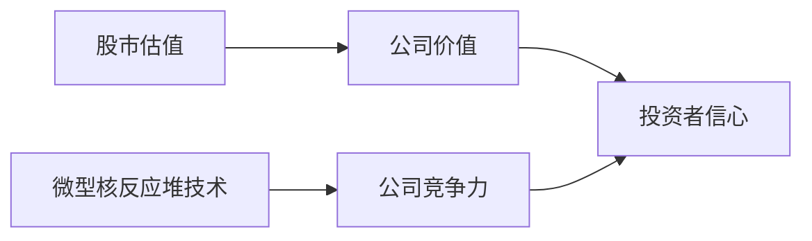

                 


# 全球股市估值与微型核反应堆技术的发展

## 关键词：
- 全球股市估值
- 微型核反应堆技术
- 股市估值模型
- 核反应堆设计
- 技术与经济的结合

## 摘要：
本文探讨了全球股市估值与微型核反应堆技术之间的相互作用。首先，介绍了股市估值的基本概念和微型核反应堆技术的发展现状。接着，分析了两者之间的核心联系，包括股市估值对技术创新的推动作用以及技术进步对股市价值的影响。通过详细讲解相关的算法原理、数学模型和系统架构，本文展示了如何将微型核反应堆的技术参数与股市估值模型相结合。最后，通过实际案例分析和项目实战，提供了具体的实现方法和最佳实践建议。

---

## 第1章: 全球股市估值的基本概念

### 1.1 股市估值的定义与作用
#### 1.1.1 股市估值的基本概念
股市估值是通过对公司的财务数据、市场表现和行业地位等多方面因素进行分析，以确定公司股票的合理价格范围。常见的估值指标包括市盈率（P/E）、市净率（P/B）和股息率等。

#### 1.1.2 股市估值在投资决策中的作用
股市估值是投资者进行决策的重要依据。通过估值，投资者可以判断股票是否被高估或低估，从而做出买入、卖出或持有等决策。

#### 1.1.3 股市估值的核心要素
- 财务数据：收入、利润、资产等。
- 市场环境：宏观经济、行业趋势。
- 公司基本面：管理团队、竞争优势。

### 1.2 股市估值的主要模型
#### 1.2.1 市盈率模型
市盈率（P/E）= 股票价格 / 每股净利润。

#### 1.2.2 市净率模型
市净率（P/B）= 股票价格 / 每股净资产。

#### 1.2.3 现金流折现模型
DCF模型：通过将未来现金流折现到现值来评估公司价值。

---

## 第2章: 微型核反应堆技术的发展现状

### 2.1 微型核反应堆的定义与特点
#### 2.1.1 微型核反应堆的定义
微型核反应堆是一种小型化、模块化的核反应堆，具有体积小、成本低、部署灵活等特点。

#### 2.1.2 微型核反应堆的核心技术特点
- 小型化设计：适用于偏远地区和能源需求较低的场景。
- 模块化结构：便于运输和安装。
- 安全性高：采用非能动安全系统，降低事故风险。

#### 2.1.3 微型核反应堆与传统核反应堆的对比
- 体积：微型核反应堆的功率通常在10-30 MW之间，而传统核反应堆功率在几百 MW以上。
- 成本：微型核反应堆的投资成本较低，适合小规模能源需求。
- 布局灵活性：微型核反应堆可以部署在需要的地方，而传统核反应堆需要集中建设。

### 2.2 微型核反应堆技术的核心挑战
#### 2.2.1 技术挑战
- 核安全：确保微型核反应堆的安全性是首要任务。
- 燃料效率：微型核反应堆需要高效利用核燃料。

#### 2.2.2 经济挑战
- 初始投资高：尽管微型核反应堆成本较低，但研发和建设仍需要大量资金。
- 市场接受度：目前市场对微型核反应堆的需求有限。

---

## 第3章: 全球股市估值与微型核反应堆技术的结合

### 3.1 股市估值与微型核反应堆技术的关系
#### 3.1.1 微型核反应堆技术对股市估值的影响
微型核反应堆技术的突破可能提升相关公司的市场竞争力，进而影响其股票价格。

#### 3.1.2 股市估值对微型核反应堆技术发展的反馈作用
股市估值的变化反映了市场对微型核反应堆技术的认可度，从而影响公司的投资决策。

### 3.2 股市估值与微型核反应堆技术的协同发展
#### 3.2.1 技术进步推动股价上涨
技术创新提高了公司的竞争力，吸引更多投资者，推动股价上涨。

#### 3.2.2 股价波动反映技术风险
技术瓶颈或安全事故可能导致股价下跌，影响公司的资金投入和技术发展。

---

## 第4章: 核心概念与联系分析

### 4.1 股市估值的核心概念
#### 4.1.1 股市估值的主要指标
- 市盈率（P/E）：衡量股票的相对价值。
- 市净率（P/B）：衡量股票相对于账面价值的高低。
- 股息率：衡量股票的分红能力。

#### 4.1.2 股市估值模型的分类与应用
- 简单估值模型：如市盈率模型。
- 复杂估值模型：如现金流折现模型（DCF）。

### 4.2 微型核反应堆技术的核心概念
#### 4.2.1 核反应堆的设计原理
- 核裂变反应：铀-235裂变产生热量。
- 热交换器：将热量转化为蒸汽，推动涡轮发电。

#### 4.2.2 微型核反应堆的安全设计
- 非能动安全系统：依靠自然对流和对称性设计，无需外部干预即可冷却反应堆。
- 应急系统：在极端情况下启动，确保反应堆安全停运。

### 4.3 核心概念的对比与联系
#### 4.3.1 技术与经济的对比
- 技术复杂度：微型核反应堆的技术门槛较高。
- 经济回报：技术成熟后，微型核反应堆可能带来较高的经济回报。

#### 4.3.2 图表展示


---

## 第5章: 算法原理讲解

### 5.1 股市估值算法
#### 5.1.1 市盈率算法
股票价值 = 市盈率 × 每股收益。

#### 5.1.2 现金流折现算法
股票价值 = Σ(未来现金流 / (1 + r)^t)，其中r是折现率，t是时间。

### 5.2 微型核反应堆技术算法
#### 5.2.1 核反应堆热效率计算
热效率 = (输出热量 / 输入热量) × 100%。

#### 5.2.2 安全系统响应时间计算
响应时间 = 几何形状 × 流动速度 / 热量传递系数。

### 5.3 算法流程图


---

## 第6章: 数学模型

### 6.1 股市估值数学模型
#### 6.1.1 市盈率模型
$$ P = \frac{P/E}{E} $$
其中，P为股票价格，E为每股收益。

#### 6.1.2 现金流折现模型
$$ V = \sum_{t=1}^{n} \frac{CF_t}{(1 + r)^t} $$$
其中，CF_t为第t年的现金流，r为折现率。

### 6.2 微型核反应堆技术数学模型
#### 6.2.1 热效率模型
$$ \eta = \frac{Q_{out}}{Q_{in}} \times 100\% $$
其中，Q_out为输出热量，Q_in为输入热量。

#### 6.2.2 安全系统响应时间模型
$$ T = \frac{L \times v}{k} $$
其中，L为系统长度，v为流速，k为热量传递系数。

---

## 第7章: 系统分析与架构设计

### 7.1 问题场景介绍
分析一家微型核反应堆公司，如何通过股市估值模型评估其股票价值。

### 7.2 系统功能设计
#### 7.2.1 数据采集模块
采集公司财务数据和市场数据。

#### 7.2.2 估值计算模块
使用市盈率模型和现金流折现模型计算股票价值。

### 7.3 系统架构设计


### 7.4 系统接口设计
- 输入接口：财务数据、市场数据。
- 输出接口：股票价值、估值报告。

---

## 第8章: 项目实战

### 8.1 环境安装
安装Python、Pandas、Matplotlib等工具。

### 8.2 核心代码实现
```python
import pandas as pd
import numpy as np

# 示例：计算市盈率
data = pd.DataFrame({
    '公司': ['A', 'B', 'C'],
    '每股收益': [2, 3, 1],
    '股价': [20, 30, 10]
})

data['市盈率'] = data['股价'] / data['每股收益']
print(data)
```

### 8.3 案例分析
分析一家微型核反应堆公司，计算其市盈率和市净率，评估其股票价值。

### 8.4 实践小结
通过实际案例，验证了股市估值模型在微型核反应堆技术评估中的应用。

---

## 第9章: 最佳实践与总结

### 9.1 小结
本文探讨了全球股市估值与微型核反应堆技术之间的关系，展示了如何通过算法和模型评估股票价值。

### 9.2 注意事项
- 数据准确性：确保输入数据的准确性。
- 模型选择：根据实际情况选择合适的估值模型。

### 9.3 拓展阅读
建议阅读相关领域的书籍和论文，深入学习股市估值和微型核反应堆技术。

---

## 作者：AI天才研究院 & 禅与计算机程序设计艺术

---

以上是《全球股市估值与微型核反应堆技术的发展》的详细目录和内容框架。每一章都详细展开了核心概念和实际应用，确保读者能够系统地理解和掌握这两个领域的结合与应用。

