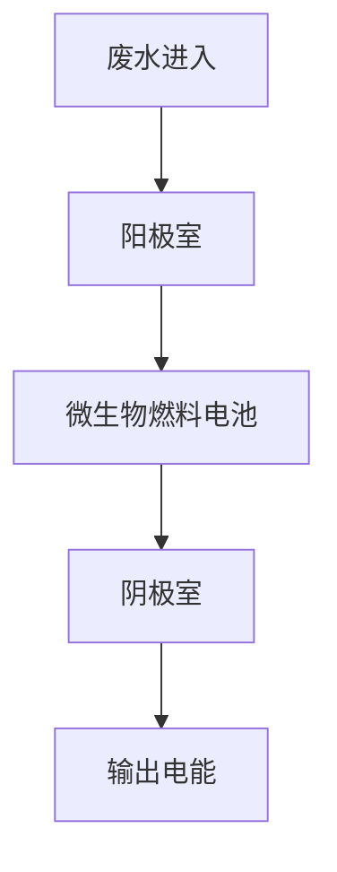

                 

# 全球股市估值与微生物燃料电池在环境修复中的应用

## 关键词
- 全球股市估值
- 微生物燃料电池
- 环境修复
- 股市投资策略
- 可再生能源技术

## 摘要
本文探讨了全球股市估值与微生物燃料电池在环境修复中的应用。首先，详细介绍了股市估值的基础知识、常用模型及其在投资策略中的应用。接着，深入分析了微生物燃料电池的工作原理、在废水处理中的实际应用及其在其他环境修复领域的潜力。最后，结合了两者的最新研究成果，展望了未来的应用前景。

---

## 第一部分：全球股市估值

### 第1章：股市估值的基础知识

#### 1.1 股市估值的定义与作用
股市估值是通过对公司财务数据和市场因素的分析，评估股票的内在价值，帮助投资者做出理性决策。它不仅是投资决策的基础，也是衡量市场健康状况的重要指标。

#### 1.2 股市估值的核心要素
- **公司基本面**：包括收入、利润、资产负债情况等。
- **市场因素**：如整体经济状况、利率水平、市场情绪等。
- **行业特点**：行业的发展趋势和竞争格局影响估值。

#### 1.3 全球股市估值的背景与现状
全球股市估值受宏观经济政策、国际贸易关系和地缘政治等因素影响，呈现多样性。不同市场的估值方法和标准差异显著，需结合具体情况进行分析。

### 第2章：常用股市估值模型

#### 2.1 市盈率（PE）模型
市盈率是股票价格与每股收益的比值，用于衡量股票的估值水平。

**公式：**
$$ PE = \frac{股票价格}{每股收益} $$

#### 2.2 市净率（PB）模型
市净率是股票价格与每股净资产的比值，适用于评估资产密集型行业的股票。

**公式：**
$$ PB = \frac{股票价格}{每股净资产} $$

#### 2.3 现金流折现模型（DCF）
DCF模型通过将未来现金流折现，评估公司的内在价值。

**公式：**
$$ V = \sum_{t=1}^{n} \frac{CF_t}{(1 + r)^t} + \frac{TV}{(1 + r)^n} $$

### 第3章：技术分析与股市估值

#### 3.1 技术分析的基本原理
技术分析通过研究历史价格数据，预测未来的价格走势，帮助投资者做出买卖决策。

#### 3.2 常用技术指标
- **移动平均线（MA）**：用于判断价格趋势。
- **相对强弱指数（RSI）**：衡量股票超买或超卖状态。

---

## 第二部分：微生物燃料电池在环境修复中的应用

### 第1章：微生物燃料电池的基本原理

#### 1.1 微生物燃料电池的定义
微生物燃料电池是一种利用微生物代谢产生的电能进行能量转换的装置，主要用于处理有机废水。

#### 1.2 工作原理
- **阳极反应**：有机物被微生物降解，释放电子。
- **阴极反应**：电子与氧气或其他氧化剂反应，生成水或二氧化碳。

#### 1.3 优势与特点
- **高效性**：同时处理废水和发电。
- **可持续性**：利用可再生能源，减少环境污染。

### 第2章：微生物燃料电池在废水处理中的应用

#### 2.1 废水处理的基本流程
- **预处理**：过滤、沉淀等。
- **主处理**：利用微生物燃料电池降解有机物。
- **后处理**：深度处理，确保水质达标。

#### 2.2 应用案例
- **处理有机物**：如处理造纸废水。
- **去除重金属**：利用微生物的吸附作用。

### 第3章：微生物燃料电池的系统设计与优化

#### 3.1 系统架构图

#### 3.2 优化策略
- **材料选择**：选用高导电性材料。
- **微生物种类**：选择高效降解菌种。

#### 3.3 成本效益分析
- **初期投资**：设备和材料成本较高。
- **运营成本**：维护和能源消耗较低。

---

## 结论

全球股市估值与微生物燃料电池在环境修复中的应用分别属于金融和环保领域，但都体现了科技创新对社会发展的重要推动作用。通过深入研究和应用，这两个领域将为人类社会的可持续发展做出更大贡献。

---

## 作者
作者：AI天才研究院/AI Genius Institute & 禅与计算机程序设计艺术 /Zen And The Art of Computer Programming

