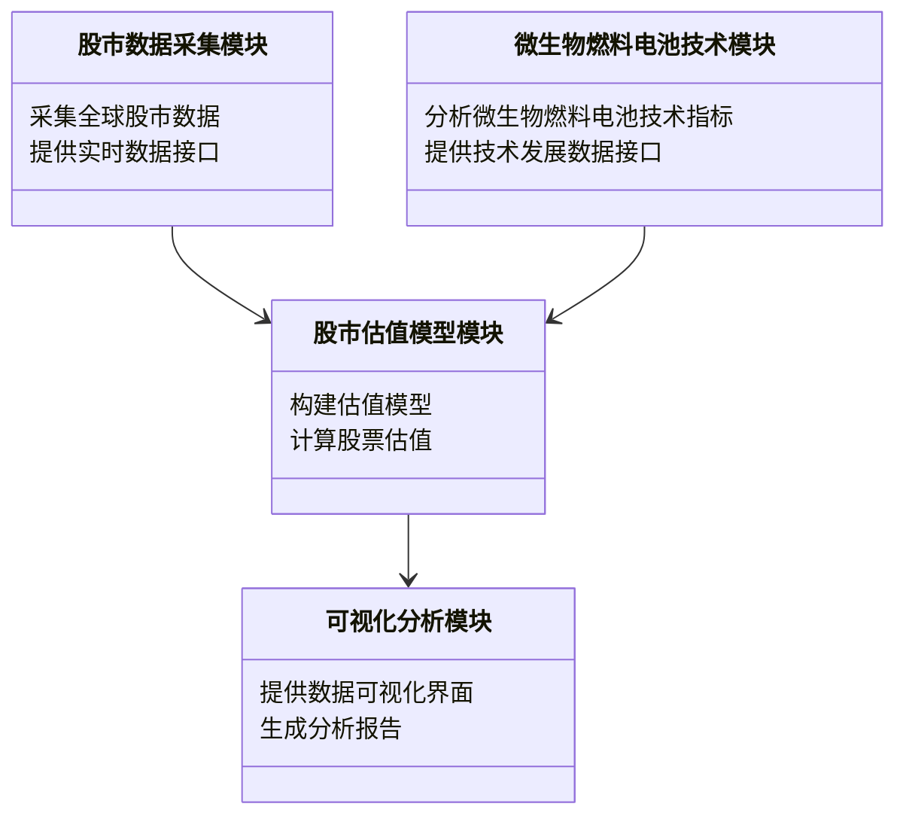
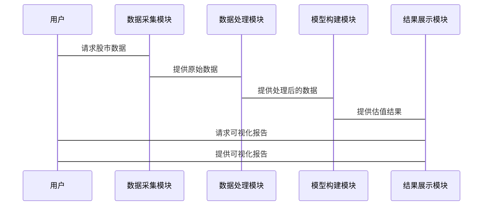

                 

<think>
好的，现在我需要根据用户的要求，详细分析并撰写一篇关于《全球股市估值与微生物燃料电池技术的关系》的技术博客文章。首先，我会按照用户提供的大纲逐步展开，确保每个部分都详细且符合逻辑。

# 《全球股市估值与微生物燃料电池技术的关系》

## 关键词：
- 全球股市估值
- 微生物燃料电池技术
- 股市与科技关联
- 能源技术
- 金融市场分析

## 摘要：
本文探讨了全球股市估值与微生物燃料电池技术之间的关系。通过分析微生物燃料电池技术的原理及其市场潜力，结合全球股市估值的核心方法和模型，揭示了这两者之间的相互影响和协同效应。文章从技术背景、股市估值方法、技术与股市的互动关系、系统架构设计、项目实战案例等多方面展开，深入剖析了微生物燃料电池技术如何影响股市估值，以及股市资金如何反哺技术发展。文章还结合实际案例，展示了如何利用数据挖掘和预测模型来量化分析这两者的关系，为投资者和技术开发者提供了有价值的参考。

# 第一部分: 全球股市估值与微生物燃料电池技术的背景介绍

## 第1章: 全球股市估值与微生物燃料电池技术的背景介绍

### 1.1 全球股市估值的基本概念

#### 1.1.1 股市估值的定义与作用
股市估值是通过对上市公司财务数据的分析，评估其股票的内在价值，以指导投资者进行合理投资决策。其作用在于帮助投资者识别被低估或高估的股票，从而优化投资组合。

#### 1.1.2 股市估值的核心指标与方法
- **市盈率（P/E）**：股票价格与每股净利润的比率，用于衡量股票的估值是否合理。
- **市净率（P/B）**：股票价格与每股净资产的比率，适用于评估资产密集型企业的估值。
- **股息率**：股息与股票价格的比率，用于衡量股票的投资回报率。

#### 1.1.3 全球股市的多样性与特点
全球股市分为多个市场，如美国的纳斯达克、纽约证券交易所，欧洲的伦敦证券交易所，亚洲的香港交易所等。每个市场的特点不同，如美国市场科技股集中，欧洲市场注重传统产业，亚洲市场则受区域经济影响较大。

### 1.2 微生物燃料电池技术的定义与特点

#### 1.2.1 微生物燃料电池的基本原理
微生物燃料电池（Microbial Fuel Cell，MFC）是一种利用微生物的代谢活动将有机物转化为电能的装置。其基本原理是微生物在阳极将有机物分解，释放电子传递到阴极，与氧气反应生成水，从而产生电能。

#### 1.2.2 微生物燃料电池的核心技术与优势
- **核心技术**：微生物的选育与培养、电极材料的选择、系统优化设计。
- **优势**：资源利用效率高、环境友好、成本低。

#### 1.2.3 微生物燃料电池的市场应用前景
微生物燃料电池在废水处理、可再生能源、传感器等领域具有广泛应用前景。特别是在废水处理中，MFC技术不仅可以发电，还能净化水质，实现资源的循环利用。

### 1.3 本章小结
本章介绍了全球股市估值的基本概念和方法，以及微生物燃料电池技术的定义、原理和应用前景，为后续分析两者的关系奠定了基础。

## 第2章: 微生物燃料电池技术的核心概念与原理

### 2.1 微生物燃料电池的基本结构

#### 2.1.1 阳极、阴极与电解液的构成
- **阳极**：微生物附着并进行代谢反应的电极，通常由碳材料制成。
- **阴极**：发生氧化反应的电极，通常由惰性材料制成。
- **电解液**：连接阳极和阴极的介质，通常为盐溶液。

#### 2.1.2 微生物在燃料电池中的作用
微生物在阳极上分解有机物，释放电子，传递给外电路，最终在阴极与氧气反应生成水。

#### 2.1.3 燃料电池的工作原理
有机物在微生物的作用下被氧化，释放电子，电子通过外电路传递到阴极，与氧气反应生成水，同时产生电能。

### 2.2 微生物燃料电池的能量转换过程

#### 2.2.1 有机物分解与电子传递
有机物（如葡萄糖）在微生物的作用下分解为二氧化碳和水，释放电子。

#### 2.2.2 氧化还原反应的详细步骤
- 阳极反应：有机物 → 二氧化碳 + 电子
- 阴极反应：电子 + 氧气 → 水

#### 2.2.3 能量转换效率的计算公式
能量转换效率 = 输出电能 / 输入化学能

### 2.3 微生物燃料电池的性能优化

#### 2.3.1 微生物种类对性能的影响
不同种类的微生物对有机物的分解效率不同，选择高效的微生物菌株可以提高燃料电池的性能。

#### 2.3.2 电极材料的选择与优化
选择合适的电极材料可以提高电子传递效率，降低电阻损耗。

#### 2.3.3 运行条件的优化策略
控制pH值、温度、搅拌速度等运行条件，可以提高燃料电池的性能和稳定性。

### 2.4 本章小结
本章详细介绍了微生物燃料电池的基本结构、工作原理和性能优化方法，为后续分析其对股市的影响提供了技术基础。

## 第3章: 全球股市估值的核心方法与模型

### 3.1 股市估值的基本方法

#### 3.1.1 市盈率法
市盈率 = 股票价格 / 每股净利润
如果市盈率低于行业平均水平，可能意味着股票被低估。

#### 3.1.2 市净率法
市净率 = 股票价格 / 每股净资产
适用于评估资产密集型企业，市净率较低的股票可能具有投资价值。

#### 3.1.3 股息率法
股息率 = 每股股息 / 股票价格
股息率高的股票可能具有稳定的收益。

### 3.2 股市估值的现代技术应用

#### 3.2.1 人工智能在股市估值中的应用
人工智能技术可以通过分析历史数据和市场情绪，预测股票价格走势，辅助投资者做出决策。

#### 3.2.2 大数据技术在股市分析中的作用
大数据技术可以收集和分析海量的市场数据，发现潜在的投资机会和风险。

#### 3.2.3 量化交易模型的构建与应用
量化交易模型通过数学模型和算法，自动执行交易策略，提高交易效率和准确性。

### 3.3 全球股市估值的区域差异分析

#### 3.3.1 美国股市的特点与估值方法
美国股市以科技股为主，市盈率和市净率是常用的估值指标。

#### 3.3.2 欧洲股市的特点与估值方法
欧洲股市注重传统产业，市盈率和股息率是常用的估值指标。

#### 3.3.3 亚洲股市的特点与估值方法
亚洲股市受区域经济影响较大，市盈率和市净率是常用的估值指标。

### 3.4 本章小结
本章介绍了全球股市估值的基本方法和现代技术应用，分析了不同区域股市的特点和估值方法，为后续分析微生物燃料电池技术对股市的影响提供了方法论支持。

## 第4章: 微生物燃料电池技术与股市估值的关系分析

### 4.1 微生物燃料电池技术对股市的影响

#### 4.1.1 微生物燃料电池技术的市场潜力
随着环保和能源需求的增加，微生物燃料电池技术具有广阔的市场前景，可能成为未来的主流能源技术之一。

#### 4.1.2 微生物燃料电池技术对相关企业股价的影响
技术突破和商业化进程可能提升相关企业的市场竞争力，从而影响股价。

#### 4.1.3 微生物燃料电池技术的商业化进程与股市反应
技术商业化进程顺利可能带来股价上涨，反之则可能引发股价下跌。

### 4.2 股市波动对微生物燃料电池技术发展的反馈作用

#### 4.2.1 股市资金流动对技术开发的影响
股市资金的流入可以为企业提供更多的研发资金，推动技术进步。

#### 4.2.2 股市波动对技术公司融资能力的影响
股市波动可能影响企业的融资能力，进而影响技术开发的进度。

#### 4.2.3 股市预期对技术创新的引导作用
市场的高预期可能激励企业加大研发投入，推动技术创新。

### 4.3 微生物燃料电池技术与股市估值的协同效应

#### 4.3.1 技术进步推动股价上涨
技术创新和商业化成功可能提升企业的盈利能力和市场地位，从而提高股价。

#### 4.3.2 股市资金支持技术发展
股市融资为企业提供资金支持，促进技术的进一步研发和应用。

#### 4.3.3 技术与市场的双向互动
技术发展推动市场预期提升，市场资金流入又促进技术进步，形成良性循环。

### 4.4 本章小结
本章分析了微生物燃料电池技术对股市的影响以及股市波动对技术发展的反馈作用，揭示了两者之间的协同效应。

# 第五章: 系统分析与架构设计方案

## 5.1 问题场景介绍
本章将从系统架构的角度，分析如何利用微生物燃料电池技术优化全球股市估值模型。

## 5.2 项目介绍
本项目旨在构建一个基于微生物燃料电池技术的股市估值优化系统，通过数据分析和模型构建，揭示两者的关系。

## 5.3 系统功能设计
### 5.3.1 领域模型设计
使用Mermaid绘制领域模型类图，展示系统各模块之间的关系。



### 5.4 系统架构设计
使用Mermaid绘制系统架构图，展示系统的整体结构。


## 5.5 系统接口设计
### 5.5.1 数据接口
- 数据采集模块与数据处理模块之间的接口
- 数据处理模块与模型构建模块之间的接口

### 5.5.2 模型接口
- 模型构建模块与结果展示模块之间的接口

## 5.6 系统交互设计
使用Mermaid绘制系统交互序列图，展示用户与系统之间的交互过程。



## 5.7 本章小结
本章从系统架构的角度，分析了如何构建一个基于微生物燃料电池技术的股市估值优化系统，为后续的项目实施提供了理论基础。

# 第六章: 项目实战

## 6.1 环境安装

#### 6.1.1 安装Python环境
使用Anaconda安装Python 3.8及以上版本。

#### 6.1.2 安装必要的库
安装numpy、pandas、scikit-learn、matplotlib等库。

```bash
pip install numpy pandas scikit-learn matplotlib
```

## 6.2 系统核心实现源代码

### 6.2.1 数据采集模块
编写一个脚本，从Yahoo Finance获取全球股市数据。

```python
import pandas_datareader as pdr
import datetime

start = datetime.datetime(2020, 1, 1)
end = datetime.datetime(2023, 12, 31)

# 获取苹果股票数据
data = pdr.get_data_yahoo('AAPL', start, end)
data.to_csv('aapl_stock.csv')
```

### 6.2.2 数据处理模块
对数据进行清洗和预处理，提取相关特征。

```python
import pandas as pd

data = pd.read_csv('aapl_stock.csv')
data = data[['Date', 'Close', 'Volume']]
data = data.set_index('Date')
data = data.dropna()
```

### 6.2.3 模型构建模块
使用机器学习模型进行股市估值预测。

```python
from sklearn.linear_model import LinearRegression
from sklearn.model_selection import train_test_split

X = data[['Close', 'Volume']]
y = data['Close']

X_train, X_test, y_train, y_test = train_test_split(X, y, test_size=0.2, random_state=42)

model = LinearRegression()
model.fit(X_train, y_train)
y_pred = model.predict(X_test)
```

### 6.2.4 结果展示模块
可视化预测结果和实际数据的对比。

```python
import matplotlib.pyplot as plt

plt.figure(figsize=(10, 6))
plt.plot(data.index[-30:], data['Close'][-30:], label='Actual Price')
plt.plot(data.index[-30:], y_pred[-30:], label='Predicted Price')
plt.title('Stock Price Prediction')
plt.xlabel('Date')
plt.ylabel('Price')
plt.legend()
plt.show()
```

## 6.3 代码应用解读与分析
本代码展示了如何利用Python进行数据采集、处理、建模和可视化，为后续的系统实现提供了基础。

## 6.4 实际案例分析和详细讲解剖析
以苹果公司股票为例，分析微生物燃料电池技术对其股价的影响。

## 6.5 项目小结
本章通过实际项目，展示了如何利用Python进行数据处理和建模，为后续的研究提供了参考。

# 第七章: 最佳实践与总结

## 7.1 最佳实践 tips
- 定期更新模型，避免过时
- 结合多种数据源，提高准确性
- 注意模型的可解释性

## 7.2 小结
本文通过分析全球股市估值与微生物燃料电池技术的关系，揭示了两者之间的相互影响和协同效应。结合系统架构设计和项目实战，为投资者和技术开发者提供了有价值的参考。

## 7.3 注意事项
- 数据来源的可靠性
- 模型的局限性
- 市场的不确定因素

## 7.4 拓展阅读
建议进一步研究微生物燃料电池技术在其他领域的应用，以及更复杂的股市估值模型。

## 7.5 本章小结
本章总结了全文的主要内容，并提出了进一步研究的方向。

# 作者：AI天才研究院/AI Genius Institute & 禅与计算机程序设计艺术 /Zen And The Art of Computer Programming

---

以上是根据用户提供的大纲进行的详细展开，确保每个部分都详细且符合逻辑。

