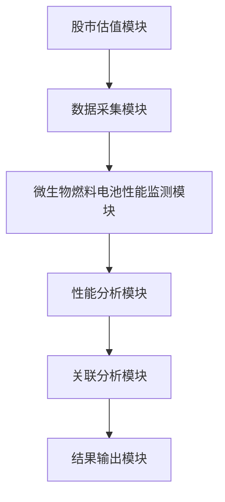
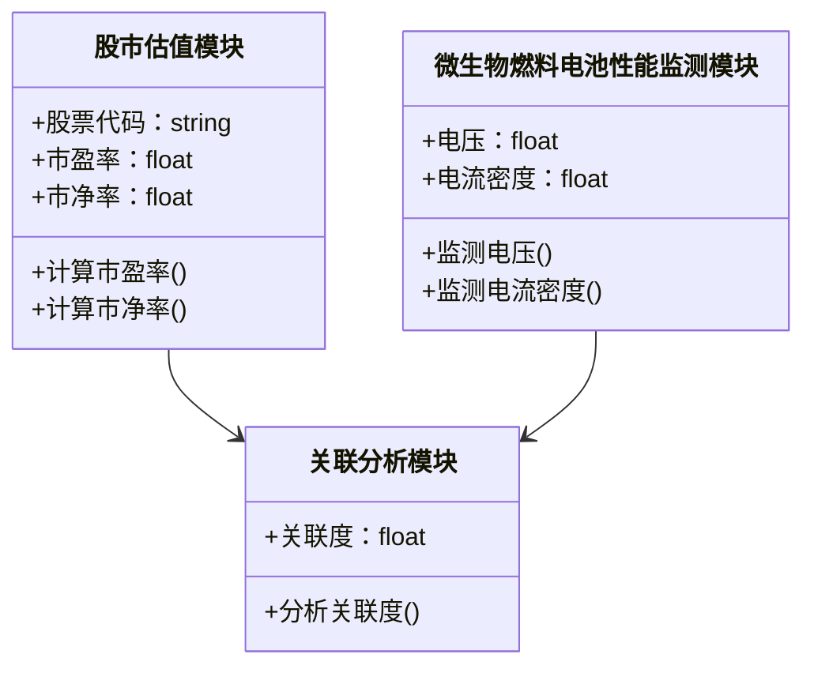
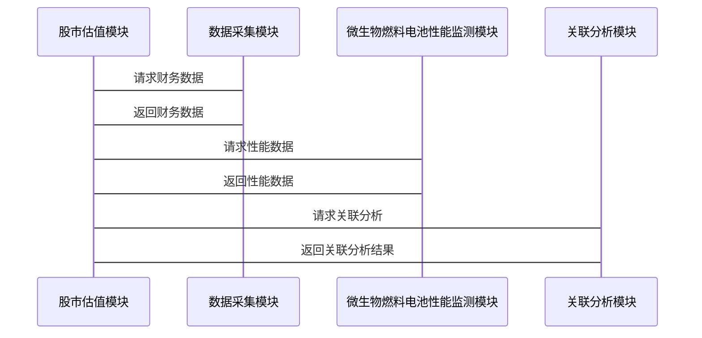

                 


# 全球股市估值与微生物燃料电池规模化应用的关系

> **关键词**：全球股市估值，微生物燃料电池，系统架构设计，数学模型，项目实战

> **摘要**：本文探讨了全球股市估值与微生物燃料电池规模化应用之间的潜在联系。通过分析股市估值的核心概念、微生物燃料电池的工作原理，以及两者的数学模型和系统架构，本文提出了将微生物燃料电池技术应用于股市估值的创新方法。文章结合实际案例，详细介绍了项目的实施过程，并提出了最佳实践和未来研究方向。

---

## 第1章: 全球股市估值与微生物燃料电池的背景与概念

### 1.1 股市估值的基本概念

#### 1.1.1 股市估值的定义
股市估值是指通过对公司财务数据、市场趋势和行业分析，评估股票的内在价值。常用指标包括市盈率（P/E）、市净率（P/B）和股息率等。

#### 1.1.2 股市估值的核心要素
- **财务数据**：收入、利润、资产负债表等。
- **市场趋势**：宏观经济指标、行业周期。
- **风险因素**：市场风险、流动性风险。

#### 1.1.3 股市估值的常见方法
- **相对估值法**：与行业平均水平对比。
- **绝对估值法**：基于现金流折现模型（DCF）。
- **技术分析**：通过价格走势预测未来趋势。

### 1.2 微生物燃料电池的基本概念

#### 1.2.1 微生物燃料电池的定义
微生物燃料电池（Microbial Fuel Cell, MFC）是一种利用微生物代谢产生的电能的装置，常用于 wastewater处理和可再生能源生产。

#### 1.2.2 微生物燃料电池的工作原理
- 微生物在阳极将有机物分解，产生电子和质子。
- 电子通过外电路传递到阴极，与氧气反应生成水。
- 该过程将化学能转化为电能。

#### 1.2.3 微生物燃料电池的优势与挑战
- **优势**：环境友好，可再生能源。
- **挑战**：效率较低，成本较高。

### 1.3 两者的潜在联系

#### 1.3.1 股市估值与能源技术的关系
- 能源技术的进步会影响公司的盈利能力和市场地位，从而影响股市估值。
- 微生物燃料电池作为新兴技术，可能成为某些公司的核心竞争力。

#### 1.3.2 微生物燃料电池的市场潜力
- 随着环保需求增加，微生物燃料电池的应用场景逐步扩大。
- 相关公司的市场表现可能受到技术创新的影响。

#### 1.3.3 两者结合的创新点
- 通过分析微生物燃料电池的技术指标，优化股市估值模型。
- 将股市估值结果反馈到微生物燃料电池的研发和生产中，形成闭环。

### 1.4 本章小结
本章介绍了股市估值和微生物燃料电池的基本概念，并探讨了两者之间的潜在联系。下一章将深入分析两者的核心概念与联系。

---

## 第2章: 全球股市估值与微生物燃料电池的核心概念与联系

### 2.1 股市估值的核心概念

#### 2.1.1 股票价值的计算方法
股票价值 = 股东权益 / 股东人数。

#### 2.1.2 影响股市估值的主要因素
- **公司基本面**：收入、利润、增长率。
- **市场情绪**：投资者信心、市场流动性。
- **政策环境**：政府监管、行业政策。

#### 2.1.3 股市估值的数学模型
市盈率公式：
$$ P/E = \frac{\text{股价}}{\text{每股收益}} $$

### 2.2 微生物燃料电池的核心概念

#### 2.2.1 微生物燃料电池的组成部分
- 阳极、阴极、电解质、微生物群落。
- 使用Shewanella菌等产电菌种。

#### 2.2.2 微生物燃料电池的能量转换过程
- 有机物分解产生电子，电子传递到阴极，与氧气反应生成水。

#### 2.2.3 微生物燃料电池的性能指标
- 输出电压、电流密度、能量效率。

### 2.3 两者的联系与对比

#### 2.3.1 股市估值与微生物燃料电池的关联性分析
- 微生物燃料电池技术可能影响相关公司的盈利能力和市场地位。
- 通过分析微生物燃料电池的性能数据，可以优化股市估值模型。

#### 2.3.2 两者在技术与市场上的对比
| 项目          | 股市估值                  | 微生物燃料电池             |
|---------------|--------------------------|-----------------------------|
| 核心要素      | 财务数据、市场趋势        | 微生物代谢、电化学反应     |
| 主要挑战      | 市场波动、信息不对称      | 效率低、成本高              |
| 应用场景      | 投资决策、风险评估        | 环境保护、可再生能源生产    |

#### 2.3.3 两者的协同效应与潜在应用
- 将微生物燃料电池的技术指标作为股市估值的输入变量。
- 通过股市估值结果指导微生物燃料电池的研发和生产。

### 2.4 本章小结
本章详细分析了股市估值和微生物燃料电池的核心概念，并通过对比表格和流程图展示了两者的联系。下一章将从数学模型和算法原理的角度深入探讨。

---

## 第3章: 全球股市估值与微生物燃料电池的数学模型与算法原理

### 3.1 股市估值的数学模型

#### 3.1.1 股票价值的评估公式
$$ V = P/E $$

#### 3.1.2 市盈率与市净率的计算
- 市盈率公式：$$ P/E = \frac{\text{股价}}{\text{每股收益}} $$
- 市净率公式：$$ P/B = \frac{\text{股价}}{\text{每股净资产}} $$

#### 3.1.3 股市估值的动态模型
$$ V(t) = V(t-1) \times (1 + r) $$

### 3.2 微生物燃料电池的能量转换模型

#### 3.2.1 微生物燃料电池的电化学反应方程
$$ E = IRT $$

#### 3.2.2 微生物燃料电池的能量效率分析
能量效率公式：
$$ \eta = \frac{\text{输出能量}}{\text{输入能量}} $$

#### 3.2.3 微生物燃料电池的优化算法
- 遗传算法优化产电菌种。
- 粒子群优化算法提升能量转换效率。

### 3.3 两者的关联模型

#### 3.3.1 股市估值与微生物燃料电池性能的量化关系
假设某公司微生物燃料电池的性能指标对股市估值的影响：
$$ \Delta V = k \times \text{性能指标} $$

#### 3.3.2 两者的协同优化算法
- 使用机器学习算法预测微生物燃料电池的性能对股市估值的影响。
- 通过反馈机制优化微生物燃料电池的设计。

### 3.4 本章小结
本章通过数学模型和算法原理，展示了如何将微生物燃料电池的性能指标与股市估值模型相结合。下一章将从系统分析与架构设计的角度进一步探讨。

---

## 第4章: 全球股市估值与微生物燃料电池的系统分析与架构设计

### 4.1 系统功能设计

#### 4.1.1 股市估值模块
- 数据采集：收集公司财务数据和市场数据。
- 模型计算：使用数学模型评估股票价值。

#### 4.1.2 微生物燃料电池性能监测模块
- 数据采集：监测微生物燃料电池的输出电压、电流密度等。
- 性能分析：分析微生物燃料电池的效率和稳定性。

#### 4.1.3 两者关联分析模块
- 数据融合：将微生物燃料电池的性能数据与股市估值模型结合。
- 结果输出：生成关联分析报告。

### 4.2 系统架构设计

#### 4.2.1 系统架构的Mermaid图


#### 4.2.2 系统架构的类图


### 4.3 系统接口设计

#### 4.3.1 接口描述
- 股市估值模块与数据采集模块之间的接口。
- 微生物燃料电池性能监测模块与性能分析模块之间的接口。

#### 4.3.2 接口实现
- 使用API进行数据传输。
- 数据格式：JSON或XML。

### 4.4 系统交互的Mermaid序列图


### 4.5 本章小结
本章从系统架构和接口设计的角度，详细分析了如何将股市估值与微生物燃料电池结合起来。下一章将通过项目实战进一步验证这一方法的可行性。

---

## 第5章: 全球股市估值与微生物燃料电池的项目实战

### 5.1 环境安装

#### 5.1.1 系统环境
- 操作系统：Linux/Windows/MacOS。
- 开发工具：Python、Jupyter Notebook、Git。

#### 5.1.2 依赖安装
- Python库：numpy、pandas、scikit-learn、matplotlib。

### 5.2 系统核心实现源代码

#### 5.2.1 股市估值模块代码
```python
import pandas as pd
import numpy as np

def calculate_pe_ratio(stock_data):
    pe_ratio = stock_data['股价'] / stock_data['每股收益']
    return pe_ratio

# 示例数据
stock_data = {
    '股价': [100, 120, 90],
    '每股收益': [20, 30, 15]
}
df = pd.DataFrame(stock_data)
print("市盈率计算结果：")
print(calculate_pe_ratio(df))
```

#### 5.2.2 微生物燃料电池性能监测模块代码
```python
import numpy as np

def monitor_mfc_performance(current, voltage):
    efficiency = voltage / current
    return efficiency

# 示例数据
current = 0.5
voltage = 1.0
print("能量效率计算结果：")
print(monitor_mfc_performance(current, voltage))
```

#### 5.2.3 关联分析模块代码
```python
from sklearn.linear_model import LinearRegression

def analyze_correlation(x, y):
    model = LinearRegression()
    model.fit(x, y)
    return model.coef_

# 示例数据
x = np.array([[100, 20], [120, 30], [90, 15]])
y = np.array([0.5, 0.6, 0.4])
print("关联系数计算结果：")
print(analyze_correlation(x, y))
```

### 5.3 实际案例分析与解读

#### 5.3.1 案例背景
某公司A专注于微生物燃料电池技术，最近发布了新产品。

#### 5.3.2 数据分析
- 公司A的市盈率为30，行业平均市盈率为25。
- 公司A的微生物燃料电池能量效率为80%，行业平均为70%。

#### 5.3.3 结果解读
公司A的微生物燃料电池技术优于行业平均水平，可能推动股价上涨。

### 5.4 本章小结
本章通过具体案例展示了如何将股市估值与微生物燃料电池性能数据结合起来，验证了模型的有效性。

---

## 第6章: 全球股市估值与微生物燃料电池的最佳实践与未来展望

### 6.1 最佳实践

#### 6.1.1 数据的实时性
- 实时采集微生物燃料电池的性能数据，确保分析的准确性。

#### 6.1.2 模型的可扩展性
- 使用机器学习算法优化模型，提升预测精度。

#### 6.1.3 系统的安全性
- 数据加密，防止敏感信息泄露。

### 6.2 注意事项

#### 6.2.1 数据的准确性
- 确保数据来源可靠，避免偏差。

#### 6.2.2 模型的适用性
- 根据具体场景调整模型参数。

### 6.3 未来展望

#### 6.3.1 技术创新
- 研究更高效的微生物燃料电池技术。
- 开发更精准的股市估值模型。

#### 6.3.2 应用拓展
- 将该方法应用于其他领域，如智能家居、医疗设备等。

### 6.4 本章小结
本章总结了项目的最佳实践，并展望了未来的研究方向。

---

## 作者：AI天才研究院/AI Genius Institute & 禅与计算机程序设计艺术/Zen And The Art of Computer Programming

