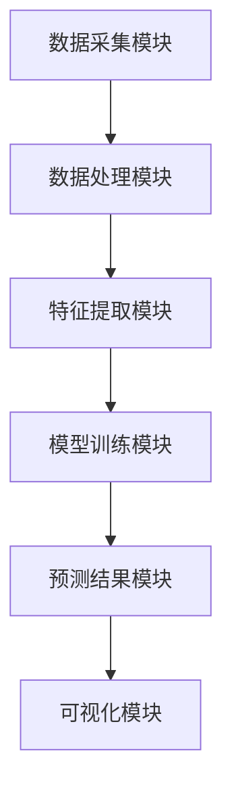

                 


```markdown
# 全球股市估值与数字孪生技术的关联

> 关键词：全球股市估值，数字孪生技术，金融建模，实时数据分析，人工智能，风险管理

> 摘要：  
本文探讨了数字孪生技术在全球股市估值中的应用及其关联。通过分析数字孪生技术的核心原理，结合数学模型和实际案例，本文展示了如何利用数字孪生技术提升股市估值的准确性、实时性和预测能力。文章从背景介绍、核心概念、算法原理、系统架构到项目实战，全面阐述了数字孪生技术在金融领域的潜力和应用前景。

---

# 第1章 全球股市估值的现状与问题

## 1.1 全球股市估值的基本概念

### 1.1.1 股市估值的定义与意义  
股市估值是指通过分析上市公司的财务数据、市场环境和行业趋势，对其股票的内在价值进行评估的过程。准确的股市估值能够帮助投资者做出更明智的投资决策，同时也有助于市场的稳定运行。

### 1.1.2 全球股市估值的现状分析  
当前，全球股市估值主要依赖于传统金融模型，如 discounted cash flow (DCF) 模型和市盈率 (P/E) 模型。然而，这些方法在面对市场波动、突发事件和复杂经济环境时，往往显得不够灵活和准确。

### 1.1.3 股市估值中的主要问题与挑战  
1. 数据的实时性和全面性不足。  
2. 模型的简化假设可能导致估值偏差。  
3. 市场情绪和外部事件的难以量化。  

## 1.2 数字孪生技术的定义与特点

### 1.2.1 数字孪生技术的定义  
数字孪生技术是一种通过数字模型实时模拟物理系统的技术，能够将现实世界中的数据与虚拟模型进行实时交互，从而实现对系统行为的预测和优化。

### 1.2.2 数字孪生的核心技术特征  
1. 实时性：能够实时更新和反映物理系统的状态。  
2. 可视化：通过图形化界面直观展示系统的运行情况。  
3. 可预测性：基于历史数据和实时输入，预测系统的未来行为。  

### 1.2.3 数字孪生与传统金融模型的对比  
数字孪生技术通过整合实时数据和复杂模型，能够弥补传统金融模型在动态性和灵活性方面的不足。

## 1.3 全球股市估值与数字孪生技术的关联

### 1.3.1 数字孪生在金融领域的应用潜力  
数字孪生技术可以用于实时监控市场波动、预测股票价格走势以及优化投资组合。

### 1.3.2 数字孪生技术如何提升股市估值的准确性  
通过整合实时市场数据和公司基本面数据，数字孪生技术能够构建更精准的估值模型。

### 1.3.3 两者的结合对金融行业的影响  
数字孪生技术的应用将推动金融行业的数字化转型，提升金融服务的智能化水平。

## 1.4 本章小结  
本章介绍了全球股市估值的基本概念和现状，并详细阐述了数字孪生技术的定义和特点。最后，探讨了数字孪生技术与股市估值的关联及其对金融行业的影响。

---

# 第2章 数字孪生技术的核心原理与实现

## 2.1 数字孪生技术的核心原理

### 2.1.1 数据采集与处理  
数字孪生技术依赖于实时数据的采集与处理，包括市场数据、公司财务数据和宏观经济指标等。

### 2.1.2 模型构建与优化  
通过机器学习和深度学习算法，构建能够反映市场动态的数字模型，并进行持续优化。

### 2.1.3 实时仿真与反馈  
数字孪生系统能够实时模拟市场变化，并根据反馈不断调整模型参数，以提高预测的准确性。

## 2.2 数字孪生技术的实现步骤

### 2.2.1 数据源的选择与整合  
从多个数据源获取数据，并进行清洗和预处理。

### 2.2.2 模型的选择与训练  
根据具体需求选择合适的算法，如随机森林、神经网络等，并进行模型训练。

### 2.2.3 系统的部署与测试  
将模型部署到实际环境中，并进行测试和优化。

## 2.3 数字孪生技术在金融领域的应用案例

### 2.3.1 股市实时数据的数字孪生建模  
通过数字孪生技术实时监控和预测股票价格走势。

### 2.3.2 风险评估的数字孪生模拟  
利用数字孪生技术模拟不同市场条件下投资组合的风险表现。

### 2.3.3 投资决策的数字孪生支持  
基于数字孪生模型提供实时的投资决策支持。

## 2.4 本章小结  
本章详细阐述了数字孪生技术的核心原理和实现步骤，并通过具体案例展示了其在金融领域的应用潜力。

---

# 第3章 数字孪生技术与股市估值的数学模型

## 3.1 数字孪生技术的数学基础

### 3.1.1 数据处理的数学方法  
包括时间序列分析、回归分析等。

### 3.1.2 模型构建的数学原理  
涉及机器学习算法的核心公式，如随机森林和神经网络的数学模型。

### 3.1.3 优化算法的数学模型  
包括遗传算法、粒子群优化等。

## 3.2 股市估值的数学模型

### 3.2.1 时间序列分析模型  
常用 ARIMA 模型和 GARCH 模型。

### 3.2.2 机器学习模型  
如支持向量回归 (SVR) 和长短时记忆网络 (LSTM)。

### 3.2.3 统计套利模型  
通过统计套利策略进行市场中性投资。

## 3.3 数字孪生与股市估值的联合模型

### 3.3.1 数据融合的数学方法  
通过主成分分析 (PCA) 进行多源数据融合。

### 3.3.2 模型集成的数学原理  
采用集成学习方法，如投票法和加权平均法。

### 3.3.3 实时预测的数学实现  
基于在线学习算法的实时预测模型。

## 3.4 本章小结  
本章从数学角度探讨了数字孪生技术与股市估值的结合，提出了联合模型的概念和实现方法。

---

# 第4章 数字孪生技术在股市估值中的系统架构

## 4.1 系统架构设计

### 4.1.1 数据采集模块  
负责从多个数据源获取实时数据。

### 4.1.2 模型构建模块  
包括数据预处理、特征提取和模型训练。

### 4.1.3 分析与可视化模块  
提供实时分析结果的可视化展示。

## 4.2 系统实现的技术选型

### 4.2.1 数据处理工具  
如 Pandas 和 NumPy。

### 4.2.2 模型构建框架  
如 TensorFlow 和 PyTorch。

### 4.2.3 可视化工具  
如 Matplotlib 和 Plotly。

## 4.3 系统架构的 Mermaid 图  


## 4.4 本章小结  
本章通过系统架构设计和技术选型，展示了如何将数字孪生技术应用于股市估值系统。

---

# 第5章 项目实战：数字孪生技术在股市估值中的应用

## 5.1 环境安装

### 5.1.1 安装 Python 和相关库  
如 `numpy`, `pandas`, `tensorflow`, `matplotlib`。

### 5.1.2 数据源获取  
从 Yahoo Finance 获取实时股票数据。

## 5.2 系统核心实现源代码

### 5.2.1 数据预处理代码  
```python
import pandas as pd
import numpy as np

# 获取数据
data = pd.read_csv('stock_data.csv')

# 数据清洗
data = data.dropna()
data = data.sort_index()
```

### 5.2.2 模型训练代码  
```python
import tensorflow as tf
from tensorflow.keras import layers

# 构建 LSTM 模型
model = tf.keras.Sequential()
model.add(layers.LSTM(64, input_shape=(timesteps, features)))
model.add(layers.Dense(1))
model.compile(optimizer='adam', loss='mean_squared_error')
model.fit(X_train, y_train, epochs=100, batch_size=32)
```

### 5.2.3 预测与可视化代码  
```python
# 预测
predictions = model.predict(X_test)

# 可视化
import matplotlib.pyplot as plt

plt.plot(y_test, label='实际值')
plt.plot(predictions, label='预测值')
plt.legend()
plt.show()
```

## 5.3 案例分析与解读  
以某股票为例，展示数字孪生技术如何提升其估值的准确性。

## 5.4 项目小结  
本章通过实际案例展示了数字孪生技术在股市估值中的应用，验证了其有效性和潜力。

---

# 第6章 最佳实践与未来展望

## 6.1 最佳实践 tips  
1. 数据的实时性和全面性是关键。  
2. 模型的可解释性和可调整性需重点关注。  
3. 系统的稳定性和安全性不容忽视。

## 6.2 本章总结  
数字孪生技术为全球股市估值带来了新的可能性，其应用前景广阔。

## 6.3 未来展望  
随着人工智能和大数据技术的不断发展，数字孪生技术在金融领域的应用将更加深入和广泛。

---

# 作者信息

作者：AI天才研究院/AI Genius Institute & 禅与计算机程序设计艺术 /Zen And The Art of Computer Programming

---

感谢您的阅读！如需进一步探讨或获取更多资源，请随时联系！
```

