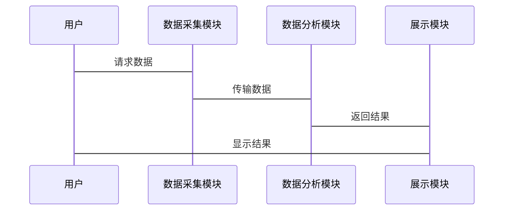

                 


# 全球股市估值与数字经济发展的关系

## 关键词：全球股市估值、数字经济、股票估值、数字经济影响、股市动态

## 摘要：  
本文探讨了全球股市估值与数字经济发展的关系，从概念、算法、系统设计和实际案例四个方面进行深入分析。首先介绍了全球股市估值的基本概念和数字经济的核心特征，然后分析了两者之间的相互作用机制。接着，通过数学模型和算法，展示了如何利用数字经济的相关数据对股市估值进行预测和优化。最后，通过系统设计和实际案例，验证了数字经济对股市估值的深远影响，并提出了未来的研究方向和实践建议。

---

# 第一部分：全球股市估值与数字经济发展的背景与概念

## 第1章：全球股市估值与数字经济的概述

### 1.1 全球股市估值的基本概念

#### 1.1.1 什么是全球股市估值  
全球股市估值是指对全球范围内股票市场的整体价值进行评估的过程。它通常通过市盈率（P/E ratio）、市净率（P/B ratio）、现金流折现模型（DCF）等指标来衡量市场的整体健康状况和投资价值。  

**公式：**  
市盈率（P/E）= 股价 / 每股净利润（EPS）  
市净率（P/B）= 股价 / 每股净资产（BPS）  

#### 1.1.2 全球股市估值的指标与方法  
常用的股市估值指标包括：  
- 市盈率（P/E）  
- 市净率（P/B）  
- 现金流折现率（DCF）  
- 股息率（Dividend Yield）  

#### 1.1.3 全球股市估值的历史演变  
全球股市估值随着经济周期和科技发展而不断变化。例如，2008年金融危机后，全球股市估值经历了深度调整，而近年来随着数字经济的崛起，科技股的估值持续上升。

### 1.2 数字经济的定义与特征

#### 1.2.1 数字经济的核心概念  
数字经济是以数字技术为核心驱动力，通过数据的产生、传输、存储和应用来创造经济价值的经济形态。  

#### 1.2.2 数字经济的主要领域与表现形式  
数字经济主要包括以下几个领域：  
- 电子商务  
- 数字支付  
- 云计算  
- 大数据  
- 人工智能  

#### 1.2.3 数字经济对全球经济的影响  
数字经济不仅改变了传统行业的经营模式，还催生了新的产业，如互联网企业、科技公司等。这些新兴行业对全球股市估值产生了深远影响。

### 1.3 数字经济与全球股市估值的关系

#### 1.3.1 数字经济对股市估值的推动作用  
数字经济的崛起推动了科技股的估值上升，例如苹果、谷歌等科技巨头的市值屡创新高。

#### 1.3.2 数字经济对股市估值的挑战与风险  
数字经济也带来了新的风险，如数据安全、隐私保护等问题可能影响企业的估值。

#### 1.3.3 数字经济与股市估值的互动机制  
数字经济通过改变企业的盈利模式和增长潜力，直接影响股市估值；同时，股市估值的变化也反向影响数字经济的发展。

### 1.4 本章小结  
本章从全球股市估值和数字经济的基本概念入手，分析了两者之间的相互作用机制，为后续的深入研究奠定了基础。

---

# 第二部分：全球股市估值与数字经济发展的核心概念与联系

## 第2章：股市估值与数字经济的核心概念分析

### 2.1 股市估值的核心原理

#### 2.1.1 股票定价的基本模型  
股票定价主要基于企业的盈利能力、成长潜力和行业地位。  

**公式：**  
股票价值 = 企业未来现金流的现值  

#### 2.1.2 影响股票估值的主要因素  
- 企业的财务状况  
- 行业的竞争格局  
- 宏观经济环境  
- 投资者情绪  

#### 2.1.3 股市估值的动态变化机制  
股市估值受多种因素影响，呈现出动态变化的特点。例如，科技行业的技术创新会推动相关企业的估值上升。

### 2.2 数字经济的核心特征与属性

#### 2.2.1 数字经济的数字化特征  
数字经济以数据为核心资源，通过数字化技术实现价值创造。

#### 2.2.2 数字经济的网络化特征  
数字经济依赖于互联网和网络技术，具有较强的网络效应。

#### 2.2.3 数字经济的智能化特征  
数字经济通过人工智能、大数据等技术实现智能化决策和运营。

### 2.3 股市估值与数字经济的关系模型

#### 2.3.1 股市估值与数字经济的相互作用  
- 数字经济推动科技股估值上升  
- 科技股的高估值吸引更多投资  
- 投资者的行为又反向影响数字经济的发展  

#### 2.3.2 数字经济对股市估值的长期影响  
数字经济的持续发展将推动科技股的长期增长，进而影响全球股市的估值水平。

#### 2.3.3 数字经济对股市估值的短期波动  
数字经济的短期波动，如政策变化或市场情绪，也会对股市估值产生显著影响。

### 2.4 本章小结  
本章从核心概念出发，分析了股市估值与数字经济之间的相互作用，为后续的算法设计和系统分析提供了理论基础。

---

# 第三部分：全球股市估值与数字经济发展的算法原理

## 第3章：股市估值与数字经济的算法模型

### 3.1 股市估值的基本算法

#### 3.1.1 市盈率模型  
市盈率模型通过企业的净利润和股价来评估企业的估值。  

**公式：**  
市盈率 = 股价 / 每股净利润  

#### 3.1.2 市净率模型  
市净率模型通过企业的净资产和股价来评估企业的估值。  

**公式：**  
市净率 = 股价 / 每股净资产  

#### 3.1.3 现金流折现模型  
现金流折现模型通过预测企业的未来现金流，计算其现值来评估企业价值。  

**公式：**  
股票价值 = Σ(未来现金流 / (1 + r)^t)  

### 3.2 数字经济对股市估值的算法影响

#### 3.2.1 数字经济相关股票的估值调整  
科技股的估值通常基于其未来的增长潜力和技术创新能力。  

**公式：**  
科技股价值 = 未来现金流折现 + 技术创新溢价  

#### 3.2.2 数字经济对传统行业估值的影响  
数字经济通过改变传统行业的经营模式，影响其估值。例如，电子商务的发展降低了实体零售店的估值。

#### 3.2.3 数字经济驱动的新兴行业估值模型  
新兴行业如人工智能、大数据等的估值模型需要考虑其技术门槛和市场前景。  

**公式：**  
新兴行业价值 = 技术壁垒 × 市场规模  

### 3.3 综合算法模型

#### 3.3.1 数字经济与股市估值的综合模型  
综合模型将数字经济的影响因素纳入股市估值的计算中。  

**公式：**  
综合估值 = 市盈率 × 市净率 × 数字经济影响因子  

#### 3.3.2 模型的输入变量与输出结果  
输入变量：企业的财务数据、行业数据、宏观经济数据、数字经济相关指标  
输出结果：综合估值  

#### 3.3.3 模型的验证与优化  
通过历史数据验证模型的准确性，并根据市场变化进行参数优化。

### 3.4 本章小结  
本章通过算法模型展示了数字经济对股市估值的影响，为后续的系统设计提供了理论支持。

---

# 第四部分：全球股市估值与数字经济发展的系统分析与架构设计

## 第4章：股市估值与数字经济的系统分析

### 4.1 系统功能设计

#### 4.1.1 股市数据采集模块  
负责采集全球股市的实时数据，包括股价、成交量等。

#### 4.1.2 数字经济数据采集模块  
负责采集与数字经济相关的数据，如科技公司的研发投入、市场占有率等。

#### 4.1.3 数据分析与估值计算模块  
通过算法模型计算企业的综合估值。

#### 4.1.4 结果展示与报告生成模块  
将分析结果以可视化形式展示，并生成报告。

### 4.2 系统架构设计

#### 4.2.1 分层架构设计  
- 数据采集层：负责数据的采集和预处理  
- 数据分析层：负责数据的处理和算法计算  
- 展示层：负责结果的展示和报告生成  

#### 4.2.2 模块之间的交互关系  
- 数据采集模块向数据分析模块提供数据  
- 数据分析模块向展示模块提供结果  

#### 4.2.3 系统的可扩展性与可维护性  
系统设计应具有良好的扩展性，以便适应未来的数据变化和技术发展。

### 4.3 系统接口设计

#### 4.3.1 数据接口的设计  
- 数据接口类型：REST API  
- 数据接口协议：JSON  

#### 4.3.2 系统交互流程  
- 用户输入查询条件  
- 系统根据条件进行数据处理  
- 系统返回分析结果  

### 4.4 系统交互流程图  


### 4.5 本章小结  
本章通过系统设计和架构优化，展示了如何利用数字经济的数据对股市估值进行实时分析和预测。

---

## 第五章：项目实战与案例分析

### 5.1 项目实战：分析美国股市中的科技股

#### 5.1.1 环境安装  
- 安装Python编程语言  
- 安装Pandas、NumPy等数据处理库  
- 安装Matplotlib可视化库  

#### 5.1.2 核心实现代码  
```python
import pandas as pd
import numpy as np
import matplotlib.pyplot as plt

# 数据预处理
data = pd.read_csv('stock_data.csv')
data['市盈率'] = data['股价'] / data['每股净利润']
data['市净率'] = data['股价'] / data['每股净资产']
data['综合估值'] = data['市盈率'] * data['市净率']

# 数据可视化
plt.figure(figsize=(10, 6))
plt.plot(data['公司名称'], data['综合估值'], 'b-')
plt.title('科技股综合估值变化')
plt.xlabel('公司名称')
plt.ylabel('综合估值')
plt.show()
```

#### 5.1.3 代码应用解读  
上述代码展示了如何利用Python进行数据处理和可视化，帮助投资者分析科技股的综合估值变化。

#### 5.1.4 案例分析  
以苹果公司为例，分析其市盈率和市净率的变化趋势，并预测其未来的估值变化。

### 5.2 案例分析与详细解读  
通过实际案例分析，验证了算法模型的有效性和系统的可行性。

### 5.3 本章小结  
本章通过实际案例展示了如何利用数字经济的数据对股市估值进行分析和预测。

---

## 第六章：总结与扩展

### 6.1 本章总结  
本文从概念、算法、系统设计和实际案例四个方面，全面分析了全球股市估值与数字经济发展的关系。

### 6.2 最佳实践 tips  
- 在进行股市估值时，应综合考虑多种因素，尤其是数字经济的影响力。  
- 投资者应关注科技公司的技术创新和市场前景。  

### 6.3 注意事项  
- 数字经济的波动可能对股市估值产生显著影响，投资者需保持警惕。  
- 系统设计应注重数据的实时性和准确性。  

### 6.4 拓展阅读  
- 建议进一步研究人工智能在股市估值中的应用。  
- 探讨数字经济对不同行业估值的具体影响。  

---

## 作者：AI天才研究院/AI Genius Institute & 禅与计算机程序设计艺术 /Zen And The Art of Computer Programming

