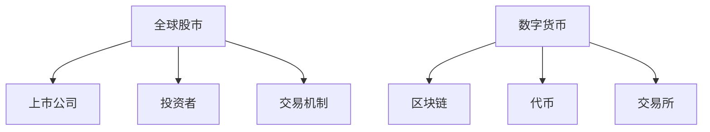

                 


# 全球股市估值与数字货币发展的关系

> 关键词：全球股市估值，数字货币发展，金融关系，技术分析，投资策略

> 摘要：本文探讨全球股市估值与数字货币发展的关系，分析数字货币对股市估值的影响，揭示两者之间的相互作用机制。通过技术分析、算法原理和系统设计，深入解析其内在联系，并提出实际投资策略。

---

## 目录

### 第1章 全球股市估值与数字货币发展的背景

1.1 问题背景与问题描述  
1.2 问题解决与研究意义  
1.3 问题的边界与外延  
1.4 概念结构与核心要素  

### 第2章 核心概念与联系

2.1 全球股市估值的核心概念  
2.2 数字货币发展的核心概念  
2.3 核心概念的对比分析  
2.4 概念结构的ER实体关系图  

### 第3章 算法原理讲解

3.1 全球股市估值与数字货币发展的关系分析算法  
3.2 算法的数学模型与公式  
3.3 算法流程图与代码实现  

### 第4章 系统分析与架构设计

4.1 系统问题场景介绍  
4.2 系统功能设计与类图  
4.3 系统架构设计与架构图  
4.4 系统接口设计与交互图  

### 第5章 项目实战

5.1 项目环境安装与配置  
5.2 系统核心代码实现与解读  
5.3 实际案例分析与结果展示  

### 第6章 总结与展望

6.1 本文总结  
6.2 未来研究方向  

---

### 第1章 全球股市估值与数字货币发展的背景

#### 1.1 问题背景与问题描述

##### 1.1.1 从传统金融到现代金融的演进
- 传统金融体系的局限性  
- 现代金融技术的创新与发展  
- 数字货币对金融体系的颠覆性影响  

##### 1.1.2 数字货币的兴起与全球金融体系的变革
- 数字货币的定义与分类  
- 数字货币对传统金融体系的冲击  
- 数字货币带来的投资机会与风险  

##### 1.1.3 全球股市估值与数字货币发展的核心问题
- 股市估值的波动性分析  
- 数字货币对股市估值的影响机制  
- 如何量化分析两者的关系  

#### 1.2 问题解决与研究意义

##### 1.2.1 问题解决思路
- 数据收集与分析方法  
- 数学建模与算法设计  
- 系统实现与验证  

##### 1.2.2 研究的意义与价值
- 理论价值：深化对金融市场的理解  
- 实践价值：为投资者提供参考  

#### 1.3 问题的边界与外延

##### 1.3.1 全球股市估值的边界
- 数据范围：全球主要股市指数  
- 时间范围：近期与长期波动  
- 影响因素：宏观经济指标  

##### 1.3.2 数字货币发展的边界
- 市场范围：主流数字货币与小币种  
- 技术基础：区块链技术的发展阶段  
- 政策环境：各国监管政策的影响  

##### 1.3.3 两者关系的外延
- 正向与反向影响  
- 短期与长期效应  
- 直接与间接关联  

#### 1.4 概念结构与核心要素

##### 1.4.1 核心概念的定义
- 全球股市估值：衡量市场整体价值的指标  
- 数字货币发展：区块链技术驱动的金融创新  

##### 1.4.2 核心要素的组成
- 股市：上市公司、投资者、交易机制  
- 数字货币：区块链、代币、交易所  

##### 1.4.3 概念结构的图示化展示


#### 1.5 本章小结
本章从背景、问题、意义等方面介绍了全球股市估值与数字货币发展的关系，明确了研究的核心问题和边界条件。

---

### 第2章 核心概念与联系

#### 2.1 全球股市估值的核心概念

##### 2.1.1 股市估值的基本原理
- 市盈率（P/E）：股价与每股收益的比率  
- 市净率（P/B）：股价与每股净资产的比率  
- 市销率（P/S）：股价与每股销售收入的比率  

##### 2.1.2 股票价格的影响因素
- 宏观经济因素：GDP增长率、利率、通货膨胀  
- 公司基本面：盈利能力、成长性、财务状况  
- 市场情绪：投资者心理、市场流动性  

##### 2.1.3 市场情绪与股市估值的关系
- 情绪指数：投资者信心指数、恐慌指数  
- 情绪对估值的影响：情绪高涨推高估值，情绪低落压低估值  

#### 2.2 数字货币发展的核心概念

##### 2.2.1 数字货币的定义与分类
- 数字货币的定义：基于数字技术，具有可编程性的货币  
- 分类：加密货币（比特币）、稳定币（USDT）、央行数字货币（CBDC）  

##### 2.2.2 数字货币的技术基础
- 区块链技术：分布式账本、共识机制、智能合约  
- 加密算法：哈希函数、椭圆曲线加密  

##### 2.2.3 数字货币的市场特征
- 流动性：高波动性、24小时交易  
- 市场参与：散户为主，机构逐渐入场  

#### 2.3 核心概念的对比分析

##### 2.3.1 股市估值与数字货币估值的异同
| 属性       | 股市估值          | 数字货币估值       |
|------------|-------------------|---------------------|
| 价值基础   | 公司基本面        | 技术与市场情绪      |
| 测度方式   | 市盈率、市净率     | 恐慌指数、链上数据  |
| 影响因素   | 宏观经济、政策     | 技术创新、市场情绪  |

##### 2.3.2 数字货币波动性与股市波动性的对比
- 数字货币波动性更高  
- 股市波动性相对平稳，受宏观经济影响较大  

##### 2.3.3 数字货币对股市估值的潜在影响
- 提供新的投资标的，影响资金流动  
- 技术创新推动金融体系变革  

#### 2.4 概念结构的ER实体关系图

```mermaid
er
  actor(投资者)
  entity(股票)
  entity(数字货币)
  entity(市场数据)
  entity(交易记录)
  entity(估值模型)
  entity(经济指标)
  entity(政策法规)
  entity(技术标准)
  entity(市场情绪)
  entity(价格指数)
  entity(风险评估)
  entity(流动性分析)
  entity(市场趋势)
  entity(市场预测)
  entity(市场反馈)
  entity(市场反应)
  entity(市场调整)
  entity(市场优化)
  entity(市场创新)
  entity(市场变化)
  entity(市场波动)
  entity(市场周期)
  entity(市场波动性)
  entity(市场增长)
  entity(市场风险)
  entity(市场机会)
  entity(市场稳定性)
  entity(市场相关性)
  
  actor(投资者) --> entity(股票)
  actor(投资者) --> entity(数字货币)
  entity(股票) --> entity(市场数据)
  entity(数字货币) --> entity(市场数据)
  entity(市场数据) --> entity(估值模型)
  entity(估值模型) --> entity(经济指标)
  entity(估值模型) --> entity(政策法规)
  entity(估值模型) --> entity(技术标准)
  entity(市场情绪) --> entity(价格指数)
  entity(风险评估) --> entity(流动性分析)
  entity(流动性分析) --> entity(市场趋势)
  entity(市场趋势) --> entity(市场预测)
  entity(市场预测) --> entity(市场反馈)
  entity(市场反馈) --> entity(市场反应)
  entity(市场反应) --> entity(市场调整)
  entity(市场调整) --> entity(市场优化)
  entity(市场优化) --> entity(市场创新)
  entity(市场创新) --> entity(市场变化)
  entity(市场变化) --> entity(市场波动)
  entity(市场波动) --> entity(市场周期)
  entity(市场周期) --> entity(市场波动性)
  entity(市场波动性) --> entity(市场增长)
  entity(市场增长) --> entity(市场机会)
  entity(市场机会) --> entity(市场相关性)
  entity(市场相关性) --> entity(市场稳定性)
  entity(市场稳定性) --> entity(市场风险)
```

---

## 本文摘要

本文从全球股市估值与数字货币发展的关系出发，通过背景介绍、核心概念分析、算法原理讲解、系统设计与实现，深入探讨数字货币对股市估值的影响。通过技术分析和实际案例，揭示两者之间的内在联系，并为投资者提供参考。

---

**作者：AI天才研究院 & 禅与计算机程序设计艺术**

