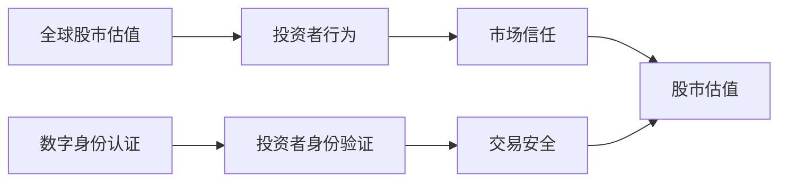

                 

# 全球股市估值与数字身份认证的关联

> 关键词：全球股市、估值模型、数字身份认证、区块链、人工智能、数据安全、金融创新

> 摘要：本文探讨了全球股市估值与数字身份认证之间的关联性。通过分析数字身份认证技术对投资者行为、市场信任和数据安全的影响，揭示其如何优化股市估值模型。结合实际案例，本文详细阐述了区块链、人工智能等技术在数字身份认证和股市估值中的应用，为金融创新提供了新的视角。

---

## 第1章: 全球股市估值与数字身份认证的关联概述

### 1.1 问题背景与描述

#### 1.1.1 全球股市估值的现状与挑战
全球股市估值是衡量市场健康程度的重要指标，但传统估值方法面临数据不透明、计算复杂、市场波动大等挑战。近年来，随着技术的进步，大数据、人工智能和区块链等技术的应用为股市估值带来了新的可能性。

#### 1.1.2 数字身份认证的兴起与应用
数字身份认证技术的兴起源于对数据安全和隐私保护的需求。通过多因素认证、区块链技术和非对称加密算法，数字身份认证在金融领域得到了广泛应用，尤其是在投资者身份验证和交易安全方面。

#### 1.1.3 两者的关联性与研究意义
数字身份认证技术通过提高投资者身份验证的准确性和安全性，影响投资者行为和市场信任，进而对股市估值产生间接影响。研究这一关联性有助于优化估值模型，提升金融市场的透明度和安全性。

### 1.2 核心概念与问题解决

#### 1.2.1 全球股市估值的核心要素
- 市盈率（P/E Ratio）
- 市净率（P/B Ratio）
- 现金流折现法（DCF）

#### 1.2.2 数字身份认证的关键技术
- 多因素认证（MFA）
- 区块链身份验证
- 非对称加密技术

#### 1.2.3 问题解决的路径与方法
- 通过数字身份认证技术优化投资者身份验证
- 利用区块链技术提高市场数据透明度
- 结合人工智能技术提升股市估值的准确性

### 1.3 边界与外延

#### 1.3.1 全球股市估值的边界条件
- 数据来源的限制
- 市场波动的不可预测性
- 政策法规的不确定性

#### 1.3.2 数字身份认证的应用范围
- 投资者身份验证
- 交易授权
- 市场数据访问控制

#### 1.3.3 两者关联的外延扩展
- 数字身份认证在金融监管中的应用
- 区块链技术在股市估值中的潜力
- 人工智能在投资者行为分析中的作用

### 1.4 概念结构与核心要素

#### 1.4.1 概念结构图

#### 1.4.2 核心要素对比分析
| 要素 | 全球股市估值 | 数字身份认证 |
|------|--------------|--------------|
| 核心目标 | 评估市场价值 | 验证投资者身份 |
| 技术基础 | 大数据、人工智能 | 区块链、非对称加密 |
| 影响因素 | 投资者行为、市场波动 | 数据安全、隐私保护 |

#### 1.4.3 关联机制的初步探讨
数字身份认证通过提高投资者身份验证的准确性和安全性，增强市场信任，从而影响投资者行为，最终优化股市估值模型。

---

## 第2章: 数字身份认证的核心概念与原理

### 2.1 数字身份认证的核心概念

#### 2.1.1 数字身份认证的定义
数字身份认证是指通过技术手段验证用户身份的真实性、完整性和不可抵赖性。其核心在于确保用户身份的唯一性和安全性。

#### 2.1.2 多因素认证（MFA）
多因素认证结合多种验证方式（如密码、短信验证码、生物识别）提高身份验证的安全性。

#### 2.1.3 区块链身份认证
区块链技术通过去中心化和不可篡改的特性，确保身份信息的安全性和透明性。

### 2.2 数字身份认证的技术特点

#### 2.2.1 去中心化身份验证
区块链技术通过去中心化的方式存储和验证身份信息，避免单点故障和数据泄露风险。

#### 2.2.2 高安全性与隐私保护
数字身份认证采用非对称加密、哈希函数等技术，确保身份信息的安全性和隐私性。

#### 2.2.3 可扩展性与灵活性
数字身份认证支持多种认证方式和应用场景，具备良好的扩展性和灵活性。

### 2.3 数字身份认证与传统身份认证的对比

#### 2.3.1 认证方式的差异
| 认证方式 | 传统身份认证 | 数字身份认证 |
|----------|--------------|--------------|
| 基础技术 | 密码、用户名 | 区块链、生物识别 |
| 安全性 | 较低 | 较高 |
| 便捷性 | 较低 | 较高 |

#### 2.3.2 安全性与效率的对比
数字身份认证通过多因素认证和区块链技术，显著提高了安全性，但可能增加一定的计算复杂度。

#### 2.3.3 成本与维护的对比
数字身份认证初期投入较高，但长期来看，其降低了数据泄露和欺诈的风险，节省了维护成本。

---

## 第3章: 全球股市估值的分析与模型

### 3.1 股市估值的核心方法

#### 3.1.1 市盈率法
市盈率法（P/E Ratio）通过将股票价格与每股收益（EPS）的比率来评估股票的价值。

$$ P/E = \frac{\text{股票价格}}{\text{每股收益}} $$

#### 3.1.2 市净率法
市净率法（P/B Ratio）通过将股票价格与每股净资产的比率来评估股票的价值。

$$ P/B = \frac{\text{股票价格}}{\text{每股净资产}} $$

#### 3.1.3 现金流折现法
现金流折现法（DCF）通过将未来现金流折现，评估公司的内在价值。

$$ V = \sum_{t=1}^{n} \frac{\text{现金流}}{(1 + r)^t} $$

### 3.2 现代技术对股市估值的影响

#### 3.2.1 大数据在估值中的应用
大数据技术通过分析海量数据，发现市场趋势和潜在风险。

#### 3.2.2 人工智能在预测中的作用
人工智能技术（如机器学习）通过分析历史数据，预测未来市场走势。

#### 3.2.3 区块链技术对数据透明度的提升
区块链技术通过提高数据透明度，增强估值模型的准确性。

### 3.3 股市估值模型的构建与优化

#### 3.3.1 模型构建的步骤
1. 确定数据来源
2. 数据预处理
3. 选择模型算法
4. 模型训练与验证
5. 模型优化与部署

#### 3.3.2 数据来源与处理方法
- 数据来源：历史股价、财务数据、市场新闻等。
- 数据处理：清洗、特征提取、标准化等。

#### 3.3.3 模型优化与验证
通过交叉验证和回测，优化模型参数，提高预测准确率。

---

## 第4章: 数字身份认证与股市估值的关联分析

### 4.1 投资者身份认证对股市的影响

#### 4.1.1 认证强度与市场参与度
投资者身份认证强度越高，市场参与度越高，交易行为越规范。

#### 4.1.2 认证方式对交易行为的影响
高安全的数字身份认证降低了交易欺诈风险，提高了市场信任度。

#### 4.1.3 高安全认证对市场信任的提升
通过数字身份认证技术，投资者对市场的信任度提高，促进市场健康发展。

### 4.2 身份认证技术对估值模型的优化

#### 4.2.1 数据质量的提升
数字身份认证技术提高了投资者身份数据的准确性和完整性。

#### 4.2.2 模型预测的准确性提高
高质量的数据输入，提高了估值模型的预测准确性。

#### 4.2.3 交易透明度对估值的影响
高透明度的交易环境，降低了市场波动性，提高了估值模型的稳定性。

### 4.3 联合分析与案例研究

#### 4.3.1 案例分析：某国股市估值变化
通过数字身份认证技术的应用，某国股市估值的波动性显著降低，市场信任度提高。

#### 4.3.2 技术应用对估值模型的改进
区块链技术的应用，提高了市场数据的透明度和准确性，优化了估值模型。

#### 4.3.3 经验总结与启示
数字身份认证技术的应用，不仅提高了投资者身份验证的准确性和安全性，还优化了股市估值模型，促进了金融市场的健康发展。

---

## 第5章: 技术实现与算法原理

### 5.1 数字身份认证的技术实现

#### 5.1.1 区块链身份认证流程
1. 用户注册：生成公私钥对，提交公钥至区块链网络。
2. 身份验证：通过非对称加密技术验证用户身份。
3. 权限管理：基于智能合约实现访问控制。

#### 5.1.2 多因素认证算法
1. 用户提供多种验证方式（如密码、短信验证码、生物识别）。
2. 系统综合验证结果，确认用户身份。

#### 5.1.3 非对称加密技术的应用
使用RSA算法加密敏感数据，确保数据传输的安全性。

### 5.2 股市估值算法的实现

#### 5.2.1 基于机器学习的预测模型
1. 数据预处理：清洗、特征提取。
2. 模型训练：使用随机森林或神经网络模型。
3. 模型预测：基于历史数据预测未来股价。

#### 5.2.2 时间序列分析方法
使用ARIMA模型对时间序列数据进行建模和预测。

#### 5.2.3 神经网络在估值中的应用
通过LSTM模型捕捉股价的时序特征，提高预测准确性。

### 5.3 关联模型的构建与实现

#### 5.3.1 数据预处理与特征提取
1. 数据清洗：去除异常值和缺失值。
2. 特征提取：提取影响股市估值的关键特征（如市盈率、市净率、现金流等）。

#### 5.3.2 算法实现与优化
1. 使用机器学习算法（如XGBoost）构建关联模型。
2. 通过交叉验证优化模型参数。

#### 5.3.3 案例分析与结果展示
通过实际案例验证关联模型的有效性，展示其在股市估值中的应用。

---

## 结语

数字身份认证技术通过提高投资者身份验证的准确性和安全性，优化了股市估值模型，促进了金融市场的健康发展。未来，随着技术的不断进步，数字身份认证和股市估值之间的关联性将更加紧密，为金融创新提供更多的可能性。

---

## 作者：AI天才研究院/AI Genius Institute & 禅与计算机程序设计艺术 /Zen And The Art of Computer Programming

---

这篇文章通过详细分析数字身份认证与全球股市估值之间的关联，探讨了技术如何改变金融行业的未来。

