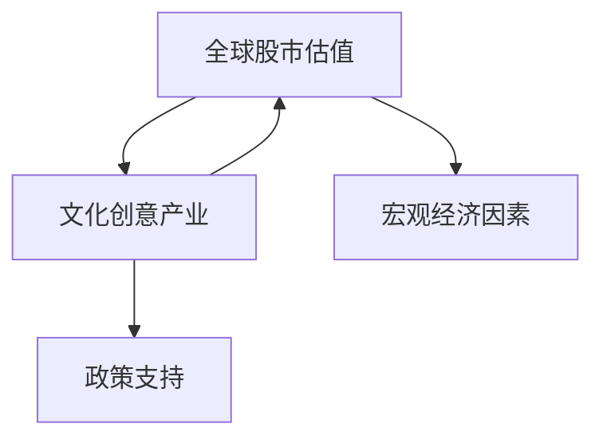
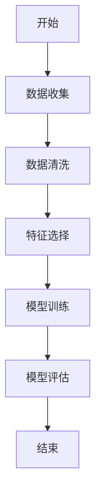
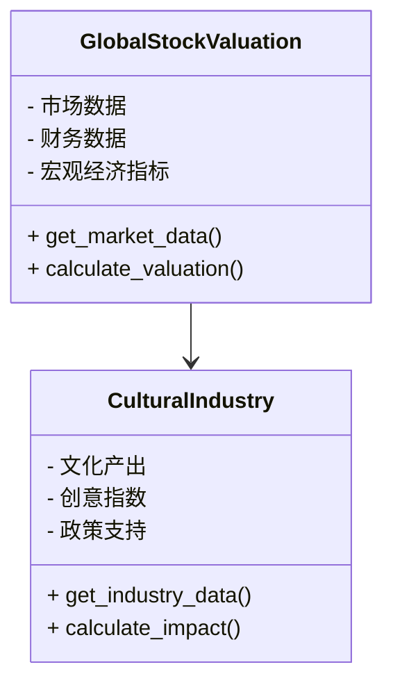
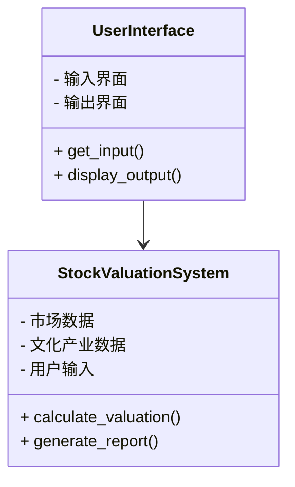
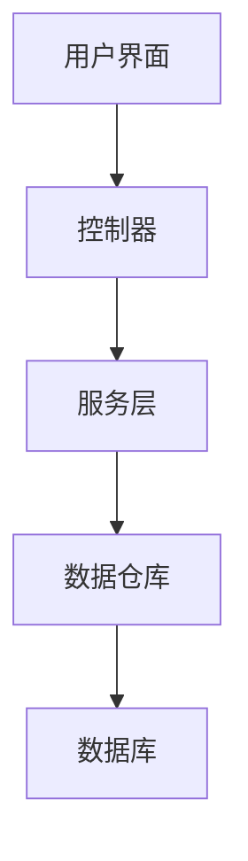
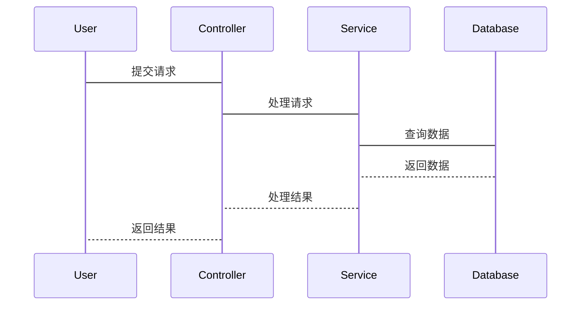

                 


---

# 第一部分: 全球股市估值与文化创意产业的背景介绍

## 第1章: 全球股市估值与文化创意产业的背景介绍

### 1.1 全球股市估值的基本概念

#### 1.1.1 股市估值的定义与核心要素

股市估值是指通过对上市公司的财务数据、市场表现、行业地位等多方面因素的分析，对其股票的价值进行评估的过程。核心要素包括市盈率（P/E）、市净率（P/B）、股息率（Dividend Yield）等。

#### 1.1.2 全球股市估值的现状与趋势

全球股市估值受宏观经济、行业动态、政策法规等多重因素影响，呈现出波动性大、区域差异显著的特点。近年来，随着科技与文化的深度融合，文化创意产业逐渐成为推动经济增长的重要引擎，其在股市中的表现也备受关注。

### 1.2 文化创意产业的定义与特点

#### 1.2.1 文化创意产业的定义

文化创意产业是指以创意为核心，通过创意、设计、生产、销售等方式，提供文化产品和服务的产业。它涵盖了影视、音乐、游戏、设计、广告等多个领域。

#### 1.2.2 文化创意产业的核心特征

文化创意产业具有高创意性、高附加值、强融合性等特点。它不仅能够创造经济价值，还能提升社会文化水平和国际影响力。

### 1.3 全球股市估值与文化创意产业的关联性分析

#### 1.3.1 关联性的背景与问题提出

随着文化创意产业的快速发展，其在股市中的表现日益重要。投资者开始关注文化创意企业的市场价值和潜力，企业估值成为影响股价的重要因素。

#### 1.3.2 问题的边界与外延

本文主要探讨全球范围内文化创意产业对股市估值的影响，重点关注企业的市场表现、行业趋势和政策支持。

#### 1.3.3 核心概念结构与要素组成

核心概念结构包括全球股市估值、文化创意产业、企业市场表现、行业趋势、政策支持等多个要素。

## 第2章: 全球股市估值与文化创意产业的核心概念与联系

### 2.1 核心概念的原理与属性

#### 2.1.1 全球股市估值的原理

股市估值通过分析企业的财务数据、市场地位和行业前景，评估其股票的合理价格。常用的指标包括市盈率、市净率等。

#### 2.1.2 文化创意产业的核心属性

文化创意产业以创意为核心，具有高附加值、强融合性和文化影响力的特征。它通过创意设计和文化输出，实现经济价值和社会价值的统一。

### 2.2 核心概念的对比分析

#### 2.2.1 表格形式的核心概念对比

| 比较维度 | 全球股市估值 | 文化创意产业 |
|----------|--------------|--------------|
| 核心目标 | 评估企业价值 | 促进文化产出与经济价值结合 |
| 主要影响因素 | 市场供需、企业盈利、宏观经济 | 文化创意、政策支持、市场需求 |
| 衡量标准 | 市盈率、市净率等 | 产值、就业、文化影响力 |

### 2.3 实体关系图（ER图）



## 第3章: 全球股市估值与文化创意产业的统计模型构建

### 3.1 统计模型的原理与方法

#### 3.1.1 多元回归模型的原理

多元回归模型通过建立多个自变量与因变量之间的关系，预测因变量的变化。在本研究中，因变量为文化创意企业的股票估值，自变量包括企业收入、净利润、研发投入、市场占有率等。

### 3.2 算法原理与流程



### 3.3 算法实现

#### 3.3.1 数据准备与特征选择

以下代码用于数据准备和特征选择：

```python
import pandas as pd
import numpy as np

# 数据准备
df = pd.read_csv('creative_industry.csv')
df.head()

# 特征选择
selected_features = ['revenue', 'net_profit', 'R&D_expense', 'market_share']
X = df[selected_features]
y = df['stock_valuation']
```

#### 3.3.2 模型训练

```python
from sklearn.linear_model import LinearRegression
from sklearn.metrics import mean_squared_error

# 模型训练
model = LinearRegression()
model.fit(X, y)

# 预测与评估
y_pred = model.predict(X)
mse = mean_squared_error(y, y_pred)
print(f"均方误差: {mse}")
```

### 3.4 系统架构设计

#### 3.4.1 系统功能设计



## 第4章: 全球股市估值与文化创意产业的系统分析与架构设计方案

### 4.1 问题场景介绍

本章将探讨如何构建一个系统，用于分析文化创意产业对全球股市估值的影响。

### 4.2 系统功能设计

#### 4.2.1 领域模型



### 4.3 系统架构设计



### 4.4 接口与交互设计

#### 4.4.1 序列图



## 第5章: 全球股市估值与文化创意产业的项目实战

### 5.1 项目环境安装

#### 5.1.1 安装Python与必要的库

```bash
pip install pandas numpy scikit-learn
```

### 5.2 项目核心实现

#### 5.2.1 核心代码实现

```python
import pandas as pd
from sklearn.linear_model import LinearRegression

# 数据准备
df = pd.read_csv('creative_industry.csv')

# 特征选择
selected_features = ['revenue', 'net_profit', 'R&D_expense', 'market_share']
X = df[selected_features]
y = df['stock_valuation']

# 模型训练
model = LinearRegression()
model.fit(X, y)

# 预测与评估
y_pred = model.predict(X)
print('预测值:', y_pred[:5])
print('真实值:', y[:5])
```

### 5.3 项目案例分析

#### 5.3.1 案例分析与解读

以某文化创意企业为例，分析其市场表现和股票估值之间的关系。

## 第6章: 全球股市估值与文化创意产业的最佳实践与总结

### 6.1 关键发现与经验总结

文化创意产业对全球股市估值的影响显著，企业市场表现和行业趋势是主要影响因素。

### 6.2 最佳实践与改进建议

建议投资者关注文化创意企业的市场表现和行业趋势，同时加强政策支持和技术创新。

### 6.3 未来展望

随着科技与文化的深度融合，文化创意产业将继续推动股市估值的增长，未来的研究可以进一步探索其长期影响。

## 作者：AI天才研究院/AI Genius Institute & 禅与计算机程序设计艺术 /Zen And The Art of Computer Programming

