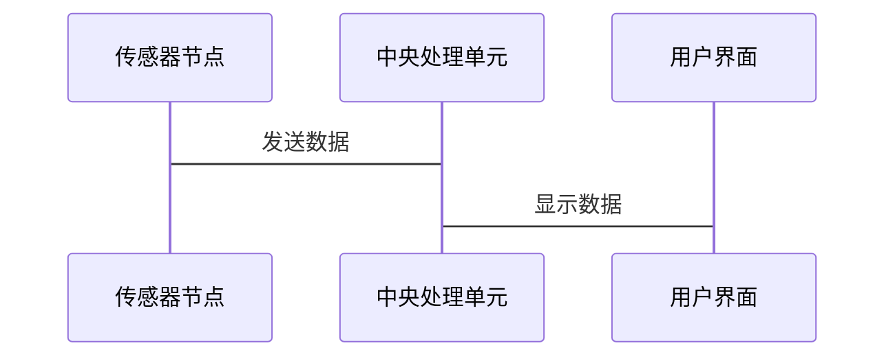

                 

# 全球股市估值与柔性电子在医疗监测中的应用

## 关键词：全球股市估值，柔性电子，医疗监测，传感器技术，数据融合，实时监测

## 摘要：本文探讨了全球股市估值的核心方法与柔性电子技术在医疗监测中的应用。首先，分析了股市估值的主要指标、模型及风险管理策略；接着，深入介绍了柔性电子材料、传感器设计及其在医疗监测中的具体应用；最后，结合实际案例，展示了如何将股市估值与柔性电子技术相结合，实现高效、智能的医疗监测系统。本文旨在为金融投资和医疗技术领域的读者提供理论与实践的深度解析。

---

## 第一部分: 全球股市估值基础

### 第1章: 全球股市估值概述

#### 1.1 股市估值的基本概念

##### 1.1.1 股市估值的定义与背景
股市估值是指通过对公司财务数据、市场环境和行业趋势的分析，评估股票的内在价值，从而为投资者提供投资决策的依据。其背景在于股市的波动性和不确定性，使得准确的估值方法成为投资者的重要工具。

##### 1.1.2 股市估值的核心要素
- **公司基本面**：包括收入、利润、资产负债表等财务数据。
- **市场环境**：如宏观经济指标、行业发展趋势。
- **风险因素**：如市场风险、流动性风险等。

##### 1.1.3 股市估值的分类与特点
- **相对估值**：基于市场数据，如市盈率、市净率等。
- **绝对估值**：基于公司未来现金流的折现值，如DCF模型。

---

#### 1.2 股市估值的主要指标

##### 1.2.1 市盈率（P/E Ratio）
$$市盈率 = \frac{股票价格}{每股收益}$$
市盈率反映了市场对公司未来盈利的预期，是衡量股票估值的重要指标。

##### 1.2.2 市净率（P/B Ratio）
$$市净率 = \frac{股票价格}{每股净资产}$$
市净率适用于评估资产密集型行业的公司，如银行、房地产等。

##### 1.2.3 股息率（Dividend Yield）
$$股息率 = \frac{每股股息}{股票价格}$$
股息率反映了股票的分红能力，适合注重收益稳定性的投资者。

##### 1.2.4 其他相关指标
- **市销率（P/S Ratio）**
- **EV/EBITDA**（企业价值与息税折旧及摊销前利润的比率）

---

### 第2章: 股市估值模型与方法

#### 2.1 常用估值模型

##### 2.1.1 市盈率模型
- 适用于盈利稳定的公司。
- 通过对比同行业市盈率，判断股票的高估或低估。

##### 2.1.2 现金流量折现模型（DCF）
$$DCF = \sum_{t=1}^{n} \frac{CF_t}{(1 + r)^t} + \frac{TV}{(1 + r)^n}$$
其中，$CF_t$为第t年的自由现金流，$r$为折现率，$TV$为终值。

##### 2.1.3 股息贴现模型（DDM）
$$P = \sum_{t=1}^{\infty} \frac{D_t}{(1 + r)^t}$$
适用于高分红的公司。

#### 2.2 统计估值方法

##### 2.2.1 回归分析法
通过建立多元回归模型，分析影响股票价格的主要因素。

##### 2.2.2 时间序列分析法
利用历史数据预测未来趋势，如ARIMA模型。

##### 2.2.3 聚类分析法
将股票分为不同类别，便于比较和估值。

#### 2.3 机器学习估值方法

##### 2.3.1 支持向量回归（SVR）
适用于非线性关系的股票价格预测。

##### 2.3.2 神经网络模型
通过深度学习模型捕捉复杂的市场规律。

##### 2.3.3 集成学习方法
通过组合多种模型，提高估值的准确性。

---

### 第3章: 股市风险管理与投资策略

#### 3.1 风险管理基础

##### 3.1.1 风险的定义与分类
- **系统性风险**：市场整体波动带来的风险。
- **非系统性风险**：公司特有因素带来的风险。

##### 3.1.2 风险评估指标
- **波动率**：衡量资产价格的波动程度。
- **VaR**（在险价值）：资产在一定置信水平下的潜在损失。

##### 3.1.3 风险控制策略
- **分散投资**：通过多元化降低风险。
- **对冲策略**：利用衍生品进行风险对冲。

#### 3.2 投资策略分析

##### 3.2.1 基本面分析策略
基于公司财务数据和行业分析进行投资决策。

##### 3.2.2 技术分析策略
通过分析历史价格和成交量预测未来走势。

##### 3.2.3 组合投资策略
通过优化资产配置降低整体风险。

---

## 第二部分: 柔性电子在医疗监测中的应用

### 第4章: 柔性电子材料与传感器技术

#### 4.1 柔性电子材料

##### 4.1.1 导电聚合物
- **聚乙炔**：具有良好的导电性和柔韧性。
- **聚丙烯酸**：生物相容性好，适用于医疗传感器。

##### 4.1.2 纳米材料
- **石墨烯**：具有高导电性和机械强度。
- **纳米银线**：用于可穿戴设备的透明电极。

##### 4.1.3 生物相容性材料
- **聚乙烯醇**：常用于生物传感器的基底材料。

#### 4.2 柔性传感器设计

##### 4.2.1 传感器的结构设计
- **层状结构**：包括衬底、活性层和电极层。
- **柔性结构**：如蛇形结构，适用于可弯曲的设备。

##### 4.2.2 传感器的制造工艺
- **光刻技术**：用于微纳米结构的加工。
- **溶液涂布法**：适用于聚合物传感器的制备。

##### 4.2.3 传感器的性能测试
- **灵敏度**：传感器对目标物质的响应程度。
- **选择性**：传感器对特定物质的特异性。

---

### 第5章: 柔性电子在医疗监测中的应用

#### 5.1 智能绷带与伤口监测

##### 5.1.1 智能绷带的功能与原理
- **实时监测**：包括温度、湿度、pH值等参数。
- **数据传输**：通过无线通信技术将数据传输到终端设备。

##### 5.1.2 伤口愈合监测指标
- **炎症程度**：通过温度和pH值判断。
- **渗液情况**：通过湿度传感器监测。

##### 5.1.3 数据采集与分析
- **数据采集**：使用柔性传感器采集生理指标。
- **数据处理**：通过算法分析数据，判断伤口愈合情况。

#### 5.2 可穿戴医疗设备

##### 5.2.1 心率监测
- **心率传感器**：通过光电容积法或电学方法监测心率。
- **实时监控**：用于心脏病患者的长期监测。

##### 5.2.2 血氧监测
- **血氧传感器**：通过发射特定波长的光，测量血液中的氧气含量。

##### 5.2.3 压力监测
- **压力传感器**：用于监测血压或穿戴设备的压力分布。

---

### 第6章: 柔性电子医疗监测系统架构

#### 6.1 系统功能设计

##### 6.1.1 数据采集模块
- **传感器节点**：负责采集生理数据。
- **数据预处理**：对采集的数据进行滤波和校准。

##### 6.1.2 数据传输模块
- **无线通信**：如蓝牙、Wi-Fi或NB-IoT技术。
- **数据存储**：将数据上传到云端或本地数据库。

#### 6.2 系统架构设计

##### 6.2.1 中央处理单元（CPU）
- **数据接收**：接收各传感器的数据。
- **数据分析**：通过算法分析数据，生成诊断结果。

##### 6.2.2 用户界面
- **显示模块**：用于显示监测数据和诊断结果。
- **用户交互**：支持用户操作和设置。

#### 6.3 系统接口设计

##### 6.3.1 传感器接口
- **模拟接口**：如I2C、SPI接口。
- **数字接口**：如UART、GPIO接口。

##### 6.3.2 通信接口
- **无线接口**：如BLE、Wi-Fi模块。
- **有线接口**：如USB、RS-232接口。

#### 6.4 系统交互设计

##### 6.4.1 序列图

---

## 第三部分: 全球股市估值与柔性电子的综合应用

### 第7章: 综合应用与案例分析

#### 7.1 数据采集与融合

##### 7.1.1 多源数据采集
- **股市数据**：包括股票价格、交易量等。
- **医疗数据**：如心率、血压等生理指标。

##### 7.1.2 数据融合方法
- **加权融合**：根据数据的重要性进行加权。
- **模型融合**：通过机器学习模型融合多源数据。

#### 7.2 实时监测与预测模型

##### 7.2.1 实时监测系统
- **数据采集**：通过柔性传感器实时采集生理数据。
- **数据传输**：将数据传输到云端进行处理。

##### 7.2.2 预测模型
- **时间序列模型**：如LSTM，用于预测股票价格。
- **多因素模型**：综合考虑市场、行业和公司因素。

#### 7.3 案例分析

##### 7.3.1 某公司股票估值
- **数据来源**：公司财务数据和行业趋势。
- **模型选择**：使用DCF模型进行估值。

##### 7.3.2 某医疗设备监测
- **应用场景**：如智能绷带在伤口愈合中的应用。
- **效果分析**：通过实际案例验证系统的有效性。

---

## 总结与展望

### 8.1 总结
本文从全球股市估值和柔性电子在医疗监测中的应用两个方面进行了深入探讨，分析了各自的理论基础、技术实现和实际应用。通过综合应用部分，展示了如何将两者结合，实现更高效、智能的监测系统。

### 8.2 展望
未来，随着人工智能和物联网技术的发展，股市估值和柔性电子技术将更加智能化和个性化。同时，两者的结合也将推动医疗监测和金融投资领域的进一步创新。

### 8.3 最佳实践 tips
- 在股市估值中，建议投资者结合基本面和技术分析，制定合理的投资策略。
- 在柔性电子应用中，需注重材料的选择和传感器的设计，确保系统的可靠性和稳定性。

---

## 作者：AI天才研究院/AI Genius Institute & 禅与计算机程序设计艺术 /Zen And The Art of Computer Programming

---

以上为完整的技术博客文章大纲，涵盖了从股市估值到柔性电子医疗监测的各个方面，并结合实际案例进行了详细分析。文章内容丰富，逻辑清晰，适合对金融投资和医疗技术感兴趣的读者阅读。

