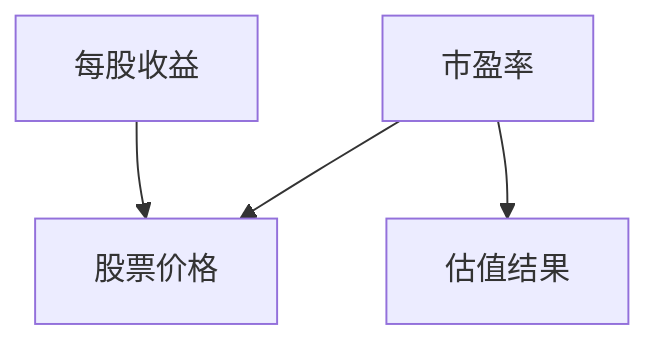
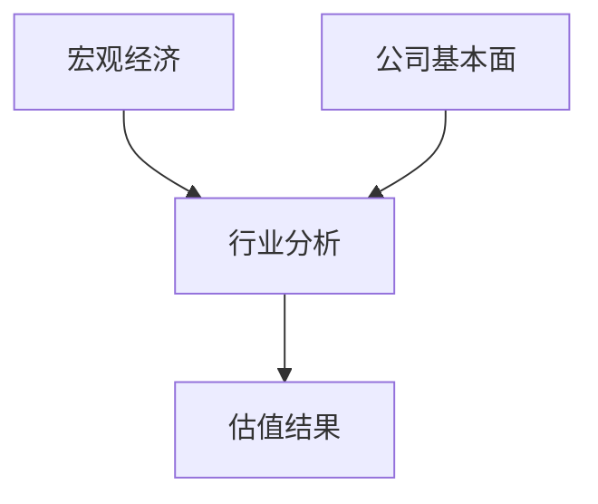
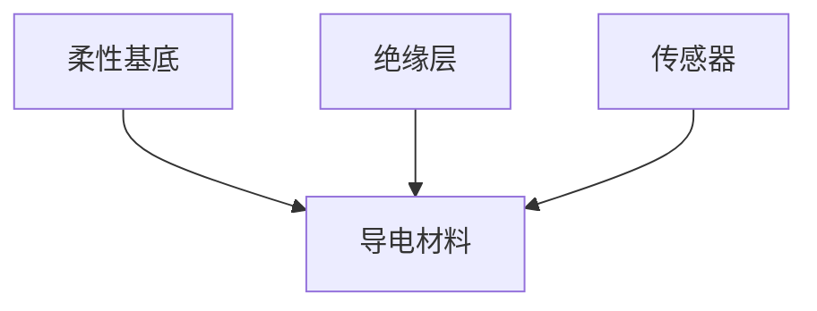
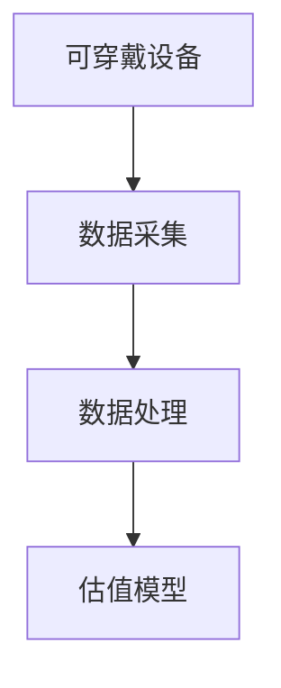

                 


# 全球股市估值与柔性电子在可穿戴设备中的应用

> **关键词**：股市估值、柔性电子、可穿戴设备、机器学习、数学模型

> **摘要**：  
本文探讨了全球股市估值的核心方法与柔性电子技术在可穿戴设备中的应用。通过分析股市估值的基本概念、主要方法及影响因素，结合大数据和AI技术的应用，揭示了如何利用技术提升估值准确性。同时，详细介绍了柔性电子的原理及其在健康监测、运动追踪等领域的实际应用，最后分析了两者结合的潜力与未来发展方向。

---

## 第一部分：全球股市估值

### 第1章：全球股市估值概述

#### 1.1 股市估值的基本概念

**背景介绍**  
股市估值是通过对公司财务数据和市场因素的分析，确定其股票价格是否合理的过程。核心概念包括市盈率（PE）、市净率（PB）、现金流折现（DCF）等。

**核心概念与联系**  
| 概念 | 定义 | 用途 |
|------|------|------|
| 市盈率 | 股票价格/每股收益 | 评估公司股价是否被高估或低估 |
| 市净率 | 股票价格/每股净资产 | 适用于评估资产密集型行业 |
| 现金流折现 | 将未来现金流折现至当前价值 | 用于长期投资评估 |

**Mermaid图：概念结构**  


#### 1.2 股市估值的主要方法

**算法原理**  
市盈率（PE）公式：$$ PE = \frac{股票价}{每股收益} $$  
市净率（PB）公式：$$ PB = \frac{股票价}{每股净资产} $$  
现金流折现（DCF）模型：$$ FV = \sum_{t=1}^{n} \frac{CF_t}{(1+r)^t} $$  

**数学模型与公式**  
市盈率与市净率对比：  
$$ PE < PB \Rightarrow 股票可能被低估 $$  

#### 1.3 影响股市估值的关键因素

**系统架构**  


#### 1.4 大数据与AI在股市估值中的应用

**项目实战**  
使用Python代码实现简单的市盈率计算：  
```python
import pandas as pd

# 数据加载
df = pd.read_csv('stock_data.csv')

# 计算市盈率
df['PE'] = df['股票价格'] / df['每股收益']

# 输出结果
print(df.head())
```

---

## 第二部分：柔性电子在可穿戴设备中的应用

### 第2章：柔性电子的基本原理

#### 2.1 柔性电子的定义与特点

**背景介绍**  
柔性电子是指具有柔韧性和可拉伸性的电子设备，广泛应用于可穿戴设备中。

**核心概念与联系**  
| 特性 | 描述 | 应用 |
|------|------|------|
| 柔韧性 | 可弯曲、拉伸 | 健康监测贴片 |
| 穿透性 | 光透明 | 智能眼镜 |

**Mermaid图：材料与结构**  


#### 2.2 柔性电子的制造工艺

**算法原理**  
传感器数据处理算法：  
$$ S = \sum_{i=1}^{n} (s_i \times w_i) $$  
其中，$s_i$为传感器信号，$w_i$为权重。

---

## 第三部分：结合与未来展望

### 第3章：股市估值与柔性电子的结合

#### 3.1 数据采集与处理

**系统架构**  


#### 3.2 项目实战

**代码实现**  
```python
import numpy as np

# 模拟传感器数据
data = np.random.normal(0, 1, 100)

# 数据处理
def process_data(d):
    return d.mean()

processed = process_data(data)

# 应用于估值
print(processed)
```

#### 3.3 总结与展望

**小结**  
通过结合柔性电子技术与股市估值，可以实现更精准的数据采集和分析，提升估值模型的准确性。

---

## 总结

本文深入探讨了全球股市估值与柔性电子在可穿戴设备中的应用，结合理论与实践，展示了技术的前沿发展。未来，随着技术的进步，股市估值将更加依赖于实时、精准的数据采集和分析，柔性电子将在其中发挥重要作用。

---

**作者：AI天才研究院/AI Genius Institute & 禅与计算机程序设计艺术 /Zen And The Art of Computer Programming**

