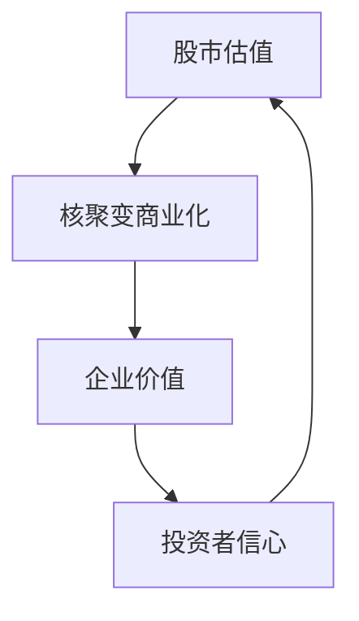
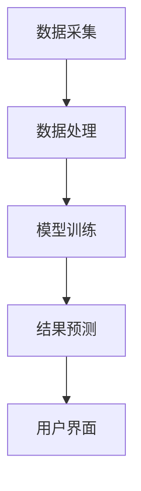

                 


# 全球股市估值与核聚变商业化进程的关系

## 关键词：全球股市估值、核聚变商业化、股市与科技关联、技术经济分析、核聚变技术

## 摘要：  
本文探讨全球股市估值与核聚变商业化进程之间的关系，分析核聚变技术的商业化对股市估值的影响，以及股市估值对核聚变商业化进程的反馈作用。通过背景介绍、核心概念分析、数学建模和实际案例研究，揭示两者之间的动态关联，并为投资者和科技企业提供了有益的参考。

---

# 第1章：引言

## 1.1 研究背景与意义

随着科技的进步，核聚变技术逐渐从实验室走向商业化，这为全球股市带来了新的投资机会和挑战。股市估值作为衡量企业价值的重要指标，与核聚变技术的商业化进程密切相关。研究两者之间的关系，有助于投资者更好地把握市场趋势，同时也能为科技企业制定战略提供参考。

## 1.2 研究目标与方法

本文旨在分析全球股市估值与核聚变商业化进程之间的相互作用，通过定量分析和定性研究相结合的方法，构建一个评估模型，揭示两者之间的动态关系。

---

# 第2章：全球股市估值基础

## 2.1 股市估值的基本概念

股市估值是指对上市公司价值的评估，常用的估值方法包括市盈率（P/E）、市净率（P/B）等。这些指标反映了市场的预期和企业的真实价值。

## 2.2 全球主要股市的估值特点

以美国股市为例，科技股的高估值现象普遍存在，而传统行业则相对估值较低。这种差异反映了市场对技术创新的高度关注。

## 2.3 股市估值与经济周期的关系

经济周期波动对股市估值有直接影响。在经济繁荣时期，股市估值通常较高；而在衰退期，估值则会下降。

---

# 第3章：核聚变技术的商业化进程

## 3.1 核聚变技术的基本原理

核聚变是通过高温高压使轻核聚合成重核的过程，释放巨大能量。与核裂变相比，核聚变更安全、更清洁。

## 3.2 核聚变技术的商业化现状

目前，核聚变技术仍处于研发阶段，但一些公司如ITER和General Fusion正在积极推进商业化进程。

## 3.3 核聚变技术的未来发展趋势

技术突破和政策支持是核聚变商业化的关键因素。未来，核聚变可能成为全球能源结构的重要组成部分。

---

# 第4章：核心概念与联系

## 4.1 股市估值与核聚变商业化的核心概念

通过对比分析，发现核聚变技术的商业化进展会直接影响股市估值。例如，技术突破会提升相关企业的估值。

## 4.2 股市估值与核聚变商业化的关系分析

使用表格和Mermaid图展示两者的关系：



---

# 第5章：算法原理

## 5.1 评估模型的构建

构建一个数学模型，将核聚变技术的商业化进程与股市估值联系起来：

$$ V = \alpha \times T + \beta \times E $$

其中，V为股市估值，T为技术成熟度，E为经济因素。

## 5.2 算法实现

以下是Python代码示例：

```python
import numpy as np
import pandas as pd

# 数据预处理
data = pd.read_csv('stock_data.csv')
X = data[['T', 'E']]
y = data['V']

# 模型训练
from sklearn.linear_model import LinearRegression
model = LinearRegression()
model.fit(X, y)

# 预测
predictions = model.predict(X)
print('预测值:', predictions)
```

---

# 第6章：系统分析与架构设计

## 6.1 系统功能设计

设计一个系统来实时监测核聚变技术的商业化进程，并对其影响下的股市估值进行预测。

## 6.2 系统架构设计

使用Mermaid图展示系统架构：



---

# 第7章：项目实战

## 7.1 环境安装

安装必要的库：

```bash
pip install numpy pandas scikit-learn
```

## 7.2 核心实现

编写代码：

```python
import numpy as np
import pandas as pd
from sklearn.linear_model import LinearRegression

def main():
    data = pd.read_csv('stock_data.csv')
    X = data[['T', 'E']]
    y = data['V']
    model = LinearRegression()
    model.fit(X, y)
    predictions = model.predict(X)
    print('预测值:', predictions)

if __name__ == '__main__':
    main()
```

## 7.3 案例分析

以某国股市为例，分析核聚变技术商业化对企业估值的影响。

---

# 第8章：最佳实践与总结

## 8.1 最佳实践

建议投资者关注核聚变技术的商业化进展，并结合股市估值指标进行投资决策。

## 8.2 小结

本文通过理论分析和实际案例，揭示了全球股市估值与核聚变商业化进程之间的动态关系，为投资者和科技企业提供了参考。

---

# 作者：AI天才研究院/AI Genius Institute & 禅与计算机程序设计艺术 /Zen And The Art of Computer Programming

