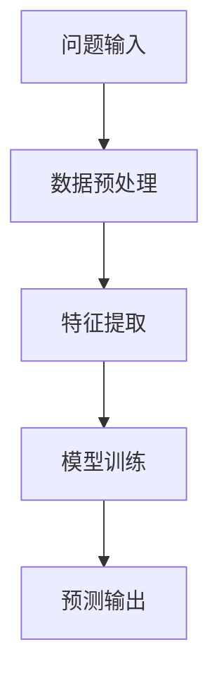
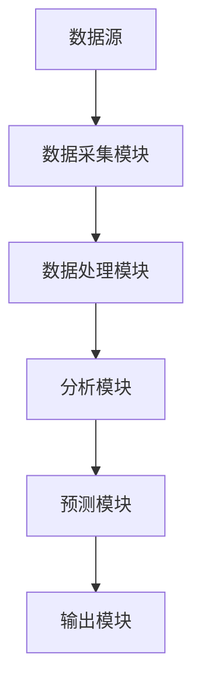

                 


```markdown
# 全球股市估值与核聚变能源商业化时间表的关系

> 关键词：全球股市估值，核聚变能源，商业化时间表，数学模型，时间序列分析

> 摘要：本文探讨了全球股市估值与核聚变能源商业化时间表之间的关系，通过背景分析、数学建模和系统设计，提出了量化两者的模型，并预测了核聚变商业化对股市的潜在影响。

## 第一部分: 背景介绍

### 第1章: 问题背景

#### 1.1 全球股市估值的波动性
全球股市估值受多种因素影响，包括经济指标、政策变化和技术创新。这些波动性为分析股市与核聚变商业化的关系提供了基础。

#### 1.2 核聚变能源的发展现状
核聚变能源被视为未来的清洁能源，但其商业化仍面临技术和经济挑战。不同国家和公司的核聚变项目进展不一，影响其商业化时间表。

#### 1.3 研究动机与意义
研究两者关系有助于投资者预测股市波动，政策制定者优化能源政策，企业和投资者做出更明智的决策。

### 第2章: 核心概念与问题描述

#### 2.1 核心概念定义
- **全球股市估值**：衡量整体市场价值的指标，如市值、市盈率、市净率。
- **核聚变商业化时间表**：从研发到商业化所需的时间，涉及技术成熟度、投资周期和政策支持。

#### 2.2 属性对比
通过对比表分析两者属性，如技术成熟度和市场反应，帮助理解它们的相互影响。

#### 2.3 问题描述
探讨股市估值如何受核聚变商业化进程的影响，以及反过来股市波动如何影响核聚变项目的融资和进展。

## 第二部分: 核心概念与联系

### 第3章: 核心概念属性特征对比

| 核心概念 | 定义 | 属性 | 示例 |
|----------|------|------|------|
| 全球股市估值 | 衡量市场整体价值的指标 | 市值、市盈率、市净率 | 标普500指数 |
| 核聚变商业化时间表 | 核聚变技术从研发到商业化的时间规划 | 技术成熟度、投资周期、政策支持 | ITER项目 |

### 第4章: ER实体关系图

```mermaid
erd
    title 实体关系图
    entity 全球股市估值 {
        <市值,市盈率,市净率>
    }
    entity 核聚变商业化时间表 {
        <技术成熟度, 投资周期, 政策支持>
    }
    全球股市估值 -[影响]-> 核聚变商业化时间表
```

## 第三部分: 算法原理与数学模型

### 第5章: 数学模型与算法原理

#### 5.1 线性回归模型

$$ y = \beta_0 + \beta_1x_1 + \beta_2x_2 + \epsilon $$

其中，$y$为股市估值，$x_1$为核聚变技术成熟度，$x_2$为政策支持指数。

#### 5.2 时间序列分析模型

$$ ARIMA(p, d, q) $$

用于分析核聚变商业化时间表的序列数据。

### 第6章: 算法流程图



## 第四部分: 系统分析与架构设计

### 第7章: 系统架构设计

#### 7.1 系统架构图



## 第五部分: 项目实战

### 第8章: 项目实战

#### 8.1 环境安装

```bash
pip install numpy pandas scikit-learn
```

#### 8.2 核心代码实现

```python
import numpy as np
import pandas as pd
from sklearn.linear_model import LinearRegression

# 示例数据加载
data = pd.read_csv('input.csv')

# 特征与目标变量
X = data[['tech_maturity', 'policy_support']]
y = data['market_val']

# 模型训练
model = LinearRegression()
model.fit(X, y)

# 预测
predictions = model.predict(X)
```

## 第六部分: 最佳实践与总结

### 第9章: 结论与建议

#### 9.1 研究结论
核聚变商业化进程对股市估值有显著影响，特别是在技术突破和政策支持的情况下。

#### 9.2 投资建议
投资者应关注核聚变项目的技术进展和政策动向，及时调整投资策略。

#### 9.3 研究局限性
模型假设可能存在偏差，实际数据可能影响预测精度。

#### 9.4 未来方向
探索更多因素，如国际政治和经济环境，以提升模型的准确性。

## 作者信息

作者：AI天才研究院/AI Genius Institute & 禅与计算机程序设计艺术 /Zen And The Art of Computer Programming
```

