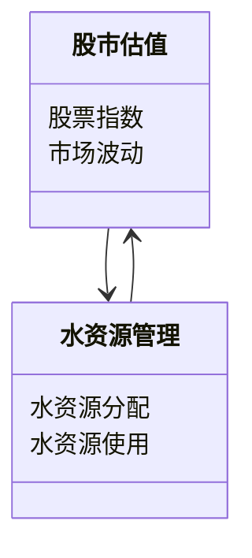
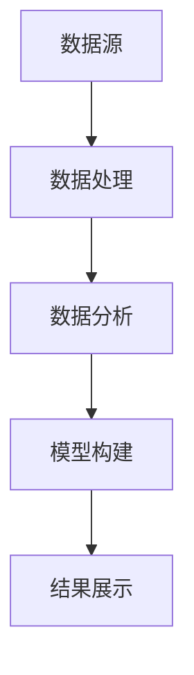

                 


# 全球股市估值与水资源管理的关系

**关键词：全球股市估值、水资源管理、经济影响、风险评估、可持续发展**

**摘要：本文探讨了全球股市估值与水资源管理之间的复杂关系，分析了水资源短缺如何影响企业利润和股市表现，以及股市波动对水资源管理策略的影响。通过数学模型和实际案例，本文揭示了两者相互作用的机制，并提出了系统的解决方案和架构设计。**

---

# 第一部分：全球股市估值与水资源管理的背景与核心概念

## 第1章：全球股市估值与水资源管理的背景介绍

### 1.1 问题背景与问题描述

#### 1.1.1 全球化经济体系中的股市估值

全球化使得股市成为反映经济健康状况的重要指标。股市估值不仅反映企业的盈利能力和市场预期，还受宏观经济政策、行业动态和环境因素的影响。水资源作为基础资源，对多个行业（如农业、工业）的生产成本和可持续性有直接影响。

#### 1.1.2 水资源管理的重要性

水资源是人类生存和经济发展不可或缺的资源。全球水资源分布不均，部分地区面临严重短缺，影响农业、工业生产和居民生活。水资源管理的有效性直接影响企业的运营成本和地区的经济发展。

#### 1.1.3 问题的提出：股市与水资源的关联性

随着全球水资源短缺问题的加剧，企业因水资源不足可能面临更高的成本或生产中断，进而影响其利润和股价。同时，股市的波动也可能影响政府和企业的水资源管理决策，形成双向互动关系。

### 1.2 问题解决与边界外延

#### 1.2.1 问题解决的路径

通过分析水资源短缺对股市的影响和股市波动对水资源管理的影响，构建数学模型，量化两者的关系，并提出相应的管理策略。

#### 1.2.2 问题的边界与限制

研究的范围限定在主要经济体和高用水行业，如农业、工业和能源行业。不考虑短期天气波动，专注于长期趋势和政策变化的影响。

#### 1.2.3 概念的外延与扩展

扩展至气候变化、政策法规、技术创新对水资源管理和股市估值的综合影响。

### 1.3 核心概念与组成要素

#### 1.3.1 核心概念的结构

- 股市估值：反映企业价值和市场信心的指标。
- 水资源管理：优化水资源分配和使用的策略。

#### 1.3.2 组成要素的详细描述

- 股市估值：包括市盈率、市净率等指标。
- 水资源管理：包括水资源分配、污染控制、节约用水等措施。

#### 1.3.3 概念之间的关系

水资源管理的状况直接影响企业的生产成本和盈利能力，进而影响股市估值。同时，股市的波动可能促使企业调整水资源管理策略以应对风险。

---

## 第2章：核心概念与联系

### 2.1 核心概念原理

#### 2.1.1 股市估值的核心原理

股市估值基于企业的盈利能力和市场预期。水资源短缺导致企业成本上升，利润减少，进而影响股价。

#### 2.1.2 水资源管理的核心原理

水资源管理通过优化配置和使用，降低企业的用水成本，提高生产效率，从而增强企业的盈利能力。

### 2.2 概念属性特征对比

| 属性 | 股市估值 | 水资源管理 |
|------|---------|------------|
| 影响因素 | 经济指标、市场情绪 | 气候、政策、技术 |
| 目标 | 反映企业价值 | 优化资源配置 |
| 作用方式 | 价格信号 | 成本节约、效率提升 |

### 2.3 ER实体关系图

```mermaid
erd
    股市估值 <--- 关联关系 ---> 水资源管理
    股市估值 --> 影响企业利润
    水资源管理 --> 影响企业成本
```

---

## 第3章：股市估值与水资源管理的相互作用机制

### 3.1 机制原理

#### 3.1.1 水资源短缺对股市的影响

水资源短缺导致企业生产成本上升，利润减少，股价下跌。例如，干旱导致农业减产，影响食品企业的收入，进而影响股价。

#### 3.1.2 股市波动对水资源管理的影响

股市波动可能导致企业调整水资源管理策略，以降低成本应对市场不确定性。

### 3.2 数学模型与公式

#### 3.2.1 水资源短缺对股市的影响模型

$$
\text{Stock Price} = \beta \times \text{Water Stress Index} + \epsilon
$$

其中，Water Stress Index是衡量水资源短缺程度的指标，$\beta$为回归系数，$\epsilon$为误差项。

#### 3.2.2 股市波动对水资源管理的影响模型

$$
\text{Water Usage} = \alpha \times \text{Market Volatility} + \delta
$$

其中，Market Volatility是市场波动指标，$\alpha$为回归系数，$\delta$为误差项。

### 3.3 实际案例分析

#### 3.3.1 案例一：水资源短缺引发的股市波动

某地区因干旱导致农业减产，食品企业利润下降，股价下跌。

#### 3.3.2 案例二：股市波动影响水资源政策

股市波动促使政府出台节水政策，影响企业水资源管理策略。

---

## 第4章：系统分析与架构设计方案

### 4.1 问题场景介绍

#### 4.1.1 问题背景

水资源短缺导致企业成本上升，影响股市估值。股市波动促使企业调整水资源管理策略。

#### 4.1.2 问题目标

构建模型量化水资源短缺对股市的影响，设计系统优化水资源管理。

### 4.2 项目介绍

#### 4.2.1 项目目标

量化水资源短缺对股市的影响，优化水资源管理策略。

#### 4.2.2 项目范围

主要针对高用水行业，如农业和工业，分析其对股市的影响。

### 4.3 系统功能设计

#### 4.3.1 领域模型



#### 4.3.2 系统架构设计



---

## 第5章：项目实战

### 5.1 环境安装

#### 5.1.1 数据源选择

选择全球主要股市指数和水资源短缺数据。

#### 5.1.2 工具安装

安装Python、Pandas、NumPy、Scikit-learn等工具。

### 5.2 系统核心实现源代码

```python
import pandas as pd
import numpy as np
from sklearn.linear_model import LinearRegression

# 数据加载
data = pd.read_csv('water_stock.csv')

# 模型训练
model = LinearRegression()
model.fit(data[['Water Stress']], data['Stock Price'])

# 结果分析
print("回归系数：", model.coef_[0])
print("截距：", model.intercept_)
```

### 5.3 代码应用解读与分析

通过回归分析，量化水资源短缺对股市的影响。回归系数表示水资源短缺每增加一个单位，股价的变化。

### 5.4 实际案例分析

分析某地区水资源短缺导致股市波动的案例，解读模型结果。

### 5.5 最佳实践 tips

- 数据质量：确保数据准确性和完整性。
- 模型优化：考虑更多变量，如政策影响。
- 实际应用：结合行业特点调整模型。

---

## 第6章：总结与展望

### 6.1 小结

总结本书的主要内容，强调股市估值与水资源管理的相互影响。

### 6.2 注意事项

提示读者在实际应用中注意数据和模型的适用性。

### 6.3 拓展阅读

推荐进一步阅读水资源管理和金融市场风险的相关文献。

---

**作者：AI天才研究院/AI Genius Institute & 禅与计算机程序设计艺术 /Zen And The Art of Computer Programming**

