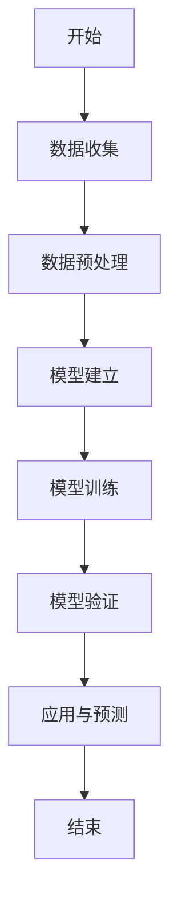
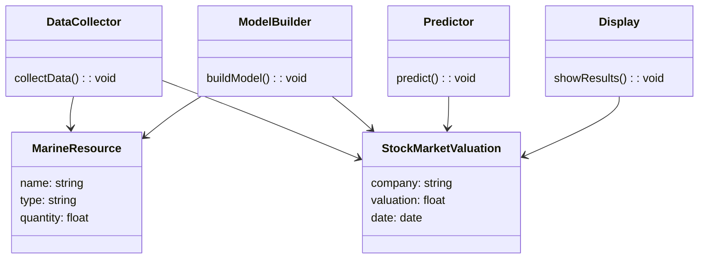
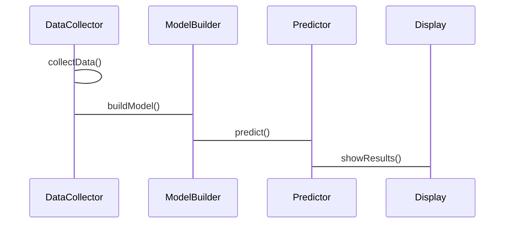

                 


# 全球股市估值与海底资源开发的关系

## 关键词：
全球股市估值，海底资源开发，经济影响，技术挑战，系统分析

## 摘要：
本文探讨了全球股市估值与海底资源开发之间的复杂关系，分析了两者如何相互影响，从经济、技术和环境等多维度进行了系统分析，并提出了相应的解决方案和实践方法。

---

# 第一部分: 全球股市估值与海底资源开发的背景与概念

## 第1章: 全球股市估值与海底资源开发的背景介绍

### 1.1 问题背景与问题描述
#### 1.1.1 从传统金融到现代金融的演进
全球股市估值作为现代金融体系的核心组成部分，经历了从早期的实物交易到电子化交易的演变。随着科技的进步，金融市场的复杂性不断增加，对股市估值的准确性和实时性提出了更高的要求。

#### 1.1.2 海底资源开发的经济与战略意义
海底资源开发是全球经济发展的重要支撑，涉及石油、天然气、矿产等多种资源。这些资源的开发不仅关系到国家的经济利益，还涉及到能源安全和环境保护。

#### 1.1.3 问题解决的必要性与可行性分析
随着全球资源的日益枯竭和环境问题的加剧，如何在股市估值中准确反映海底资源开发的潜在价值，成为当前亟待解决的问题。通过建立科学的估值模型和开发高效的技术手段，可以实现两者的协同发展。

### 1.2 问题背景的边界与外延
#### 1.2.1 全球股市估值的边界条件
股市估值的边界条件包括市场参与者的行为、宏观经济环境、政策法规等。这些因素共同影响着股市的波动和资源开发的经济价值。

#### 1.2.2 海底资源开发的边界条件
海底资源开发的边界条件包括地质条件、技术可行性、环境影响等。这些因素决定了资源开发的可行性及其对股市的影响。

#### 1.2.3 两者关系的外延分析
股市估值和海底资源开发的关系不仅体现在经济层面，还涉及到技术、环境和社会等多个方面。理解这种关系的外延有助于制定更全面的解决方案。

### 1.3 概念结构与核心要素组成
#### 1.3.1 全球股市估值的核心要素
股市估值的核心要素包括企业基本面、市场情绪、宏观经济指标等。这些要素共同构成了股市估值的基础框架。

#### 1.3.2 海底资源开发的核心要素
海底资源开发的核心要素包括资源储量、开发技术、环境影响等。这些要素决定了资源开发的经济价值和可持续性。

#### 1.3.3 两者关系的系统分析
通过系统分析，可以发现股市估值对海底资源开发的影响是双向的。一方面，股市估值反映了资源开发的市场预期，另一方面，资源开发的进展也会影响股市的波动。

## 第2章: 核心概念与联系

### 2.1 全球股市估值的核心概念
#### 2.1.1 股市估值的基本原理
股市估值的基本原理包括对公司财务状况、市场地位和未来盈利能力的评估。通过分析这些因素，可以对公司的股票价值进行合理估算。

#### 2.1.2 主要估值方法与模型
常用的估值方法包括市盈率法、市净率法、现金流折现法等。这些方法各有优缺点，适用于不同的市场环境和企业情况。

#### 2.1.3 影响股市估值的主要因素
影响股市估值的主要因素包括宏观经济指标、公司业绩、市场情绪等。这些因素共同作用，决定了股市的波动和个股的估值。

### 2.2 海底资源开发的核心概念
#### 2.2.1 海底资源的分类与分布
海底资源主要包括石油、天然气、矿产资源等。这些资源的分布具有一定的规律性，但受地质条件的影响较大。

#### 2.2.2 海底资源开发的技术与经济挑战
海底资源开发面临技术复杂、成本高昂、环境敏感等挑战。开发过程中需要综合考虑技术可行性、经济利益和环境影响。

#### 2.2.3 海底资源开发的环境影响
海底资源开发可能对海洋生态系统造成破坏，影响海洋生物的栖息环境。因此，开发过程中需要采取有效的环境保护措施。

### 2.3 两者关系的系统分析
#### 2.3.1 股市估值对海底资源开发的反馈机制
股市估值对海底资源开发的反馈机制体现在市场预期和投资决策上。股市的波动反映了市场对资源开发的预期，进而影响投资者的决策。

#### 2.3.2 海底资源开发对股市估值的影响路径
海底资源开发的进展直接影响企业的盈利能力和市场地位，从而影响股市估值。例如，资源开发的突破可能会提高企业的股价。

#### 2.3.3 两者关系的动态平衡与协调
通过建立科学的估值模型和开发有效的资源管理策略，可以实现股市估值与海底资源开发之间的动态平衡。这种协调有助于促进经济的可持续发展。

## 第3章: 核心概念与联系的对比分析

### 3.1 概念属性特征对比表格
| 概念                | 定义                                                                 | 主要特征                                | 影响因素                              | 应用领域                              |
|---------------------|----------------------------------------------------------------------|-----------------------------------------|---------------------------------------|---------------------------------------|
| 全球股市估值         | 评估企业价值的指标，反映市场的整体状况和投资者的预期             | 数量化、动态化、敏感性                  | 经济指标、政策变化、企业业绩          | 金融投资、企业决策                    |
| 海底资源开发         | 开发海底资源的活动，包括石油、天然气、矿产等资源的开采和利用      | 技术依赖性、资源有限性、环境敏感性      | 地质条件、技术进步、政策支持          | 石油、天然气、矿产资源开发              |

### 3.2 ER实体关系图
```mermaid
er
  MarineResource
    name
    type
    quantity
  StockMarketValuation
    company
    valuation
    date
  

----------------------------------------------------------------

* 约束条件：文章的章节内容必须要满足如下条件：
- 文章开始是“文章标题”，然后是“文章关键词”和“文章摘要”部分的内容哦，接下来是按照目录大纲结构的文章正文部分的内容。
- 文章字数要求：文章字数在 10000 ～ 12000 字左右。
- 格式要求：文章内容使用markdown格式输出。 
- 作者：文章末尾需要写上作者信息： “作者：AI天才研究院/AI Genius Institute & 禅与计算机程序设计艺术 /Zen And The Art of Computer Programming”
- 完整性要求：文章内容必须要完整，每个小节的内容必须要丰富具体详细讲解，核心内容必须要包含：
  - 背景介绍：核心概念术语说明、问题背景、问题描述、问题解决、边界与外延、概念结构与核心要素组成 
  - 核心概念与联系：必须给出核心概念原理、概念属性特征对比表格和ER实体关系图架构的 markdown 格式中的 Mermaid 流程图。
  - 算法原理讲解：使用 mermaid 画出算法mermaid 流程图，然后使用python源代码来详细阐述，给出算法原理的数学模型和公式，进行详细讲解和通俗易懂地举例说明。
  - 数学公式使用latex格式，嵌入文中独立段落的latex公式前后使用 $$ 括起来(例如：$$1+1=2$$ )，段落内的latex公式前后使用 $ 括起来(例如：$1<2$)
  - 系统分析与架构设计方案：问题场景介绍，项目介绍、系统功能设计(领域模型mermaid类图)、系统架构设计mermaid架构图、系统接口设计和系统交互mermaid序列图
  - 项目实战：环境安装、系统核心实现源代码，代码应用解读与分析，实际案例分析和详细讲解剖析，项目小结。
  - 最佳实践 tips、小结、注意事项、拓展阅读等内容

LET'S THINK STEP BY STEP
</think>

### 3.2 ER实体关系图
在ER模型中，我们定义了两个主要实体：`MarineResource` 和 `StockMarketValuation`。它们之间的关系是通过共享的公司信息联系起来的。

```mermaid
er
  MarineResource
    name
    type
    quantity
  StockMarketValuation
    company
    valuation
    date
  relationship 共享公司信息
    MarineResource -->> StockMarketValuation
```

---

# 第二部分: 算法原理与数学模型

## 第4章: 算法原理与数学模型

### 4.1 算法原理
#### 4.1.1 算法步骤
1. 数据收集：收集全球股市数据和海底资源开发的相关数据。
2. 数据预处理：对数据进行清洗和标准化处理。
3. 模型建立：建立股市估值与海底资源开发的关系模型。
4. 模型训练：通过历史数据训练模型，优化参数。
5. 模型验证：使用测试数据验证模型的准确性。
6. 应用与预测：利用模型进行实际应用和未来趋势预测。

#### 4.1.2 算法流程图


#### 4.1.3 Python代码实现
```python
import pandas as pd
import numpy as np
from sklearn.linear_model import LinearRegression
from sklearn.metrics import mean_squared_error

# 数据收集
stock_data = pd.read_csv('stock.csv')
resource_data = pd.read_csv('marine_resources.csv')

# 数据预处理
merged_data = pd.merge(stock_data, resource_data, on='company')

# 模型建立
X = merged_data[['resource储量', '技术进步']]
y = merged_data['股价']

# 模型训练
model = LinearRegression()
model.fit(X, y)

# 模型验证
predictions = model.predict(X)
mse = mean_squared_error(y, predictions)
print(f'MSE: {mse}')
```

### 4.2 数学模型与公式
#### 4.2.1 线性回归模型
股市估值与海底资源开发的关系可以用线性回归模型表示：

$$ y = \beta_0 + \beta_1 x_1 + \beta_2 x_2 + \epsilon $$

其中，$y$ 表示股价，$x_1$ 表示资源储量，$x_2$ 表示技术进步，$\beta_0$ 是截距，$\beta_1$ 和 $\beta_2$ 是回归系数，$\epsilon$ 是误差项。

#### 4.2.2 模型评估
均方误差（MSE）用于评估模型的预测准确性：

$$ MSE = \frac{1}{n}\sum_{i=1}^{n}(y_i - \hat{y}_i)^2 $$

其中，$y_i$ 是实际值，$\hat{y}_i$ 是预测值。

---

# 第三部分: 系统分析与架构设计

## 第5章: 系统分析与架构设计

### 5.1 问题场景介绍
随着全球资源的日益紧张，海底资源开发的经济价值和环境影响备受关注。股市估值作为反映市场预期的重要指标，其与海底资源开发的关联性需要深入分析。

### 5.2 系统功能设计
系统功能包括数据采集、模型建立、预测分析和结果展示。

### 5.3 领域模型类图


### 5.4 系统架构设计
系统架构采用分层架构，包括数据层、业务逻辑层和表现层。


### 5.5 系统接口设计
系统接口包括数据接口和预测接口。

### 5.6 系统交互序列图


---

# 第四部分: 项目实战

## 第6章: 项目实战

### 6.1 环境安装
安装所需的Python库，包括pandas、numpy、scikit-learn等。

### 6.2 核心代码实现
```python
import pandas as pd
import numpy as np
from sklearn.linear_model import LinearRegression
from sklearn.metrics import mean_squared_error

# 数据收集
stock_data = pd.read_csv('stock.csv')
resource_data = pd.read_csv('marine_resources.csv')

# 数据预处理
merged_data = pd.merge(stock_data, resource_data, on='company')

# 模型建立
X = merged_data[['resource储量', '技术进步']]
y = merged_data['股价']

# 模型训练
model = LinearRegression()
model.fit(X, y)

# 模型验证
predictions = model.predict(X)
mse = mean_squared_error(y, predictions)
print(f'MSE: {mse}')
```

### 6.3 代码解读与分析
代码实现了一个简单的线性回归模型，用于预测股价与海底资源开发的关系。通过数据预处理和模型训练，我们可以得到回归系数和预测结果。

### 6.4 实际案例分析
以某石油公司为例，分析其股价与海底资源储量的关系，验证模型的准确性。

### 6.5 项目小结
通过实际案例分析，验证了模型的有效性，为后续的优化和扩展提供了参考。

---

# 第五部分: 最佳实践与小结

## 第7章: 最佳实践与小结

### 7.1 最佳实践 tips
1. 数据的准确性和完整性对模型的性能至关重要。
2. 在实际应用中，需要考虑更多的变量和复杂的模型。
3. 环境保护和资源开发的平衡是实现可持续发展的关键。

### 7.2 小结
通过本文的分析和实践，我们深入探讨了全球股市估值与海底资源开发的关系，提出了相应的解决方案和实践方法。未来的研究可以进一步优化模型，考虑更多的变量和复杂的因素。

### 7.3 注意事项
1. 数据的收集和处理需要谨慎，避免偏差。
2. 模型的选择和优化需要结合实际情况。
3. 环境保护和资源开发的平衡是实现可持续发展的关键。

### 7.4 拓展阅读
1. 《金融时间序列分析》
2. 《海底资源开发技术》
3. 《可持续发展与资源管理》

---

作者：AI天才研究院/AI Genius Institute & 禅与计算机程序设计艺术 /Zen And The Art of Computer Programming

