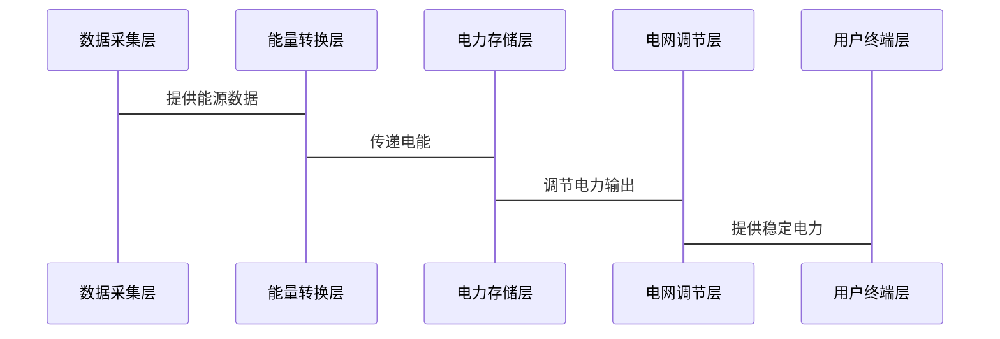

                 


# 全球股市估值与海洋可再生能源并网技术的关系

---

## 关键词：全球股市估值、海洋可再生能源、并网技术、时间序列分析、机器学习、系统架构

---

## 摘要：  
本文探讨了全球股市估值与海洋可再生能源并网技术之间的关系。通过分析股市估值的影响因素、海洋可再生能源的技术发展及其对经济和能源市场的潜在影响，本文提出了一个结合金融时间序列分析和海洋能转换效率模型的综合评估框架。借助数学模型和算法，本文还展示了如何利用这些模型预测股市走势，并评估海洋可再生能源项目的经济可行性。最后，本文通过实际案例分析，验证了模型的有效性，并提出了相关的最佳实践建议。

---

## 第一部分：背景介绍

### 第1章：全球股市估值的基础知识

#### 1.1 股市估值的定义与影响因素

股市估值是指对股票市场价格进行评估的过程，通常基于公司财务数据、市场供需关系、宏观经济指标等因素。以下是影响股市估值的主要因素：

1. **宏观经济因素**：GDP增长率、通货膨胀率、利率水平等宏观经济指标直接影响股市的整体估值。
2. **公司基本面**：企业的盈利能力、财务状况、成长潜力等是影响个股估值的核心因素。
3. **市场情绪**：投资者的心理预期和市场情绪波动对股市估值有着重要影响。
4. **政策因素**：政府的财政政策、货币政策以及行业监管政策等也会对股市估值产生显著影响。

#### 1.2 全球股市估值的现状与趋势

近年来，全球股市估值呈现出波动性增长的趋势。以下是当前全球股市估值的主要特点：

1. **科技股的主导地位**：随着科技行业的快速发展，科技股在股市中的权重逐渐增加，成为影响股市估值的重要因素。
2. **全球经济一体化**：全球化使得股市之间的关联性增强，一个地区的经济波动可能对全球股市估值产生连锁反应。
3. **可持续发展投资**：随着环保意识的增强，投资者越来越关注企业的可持续发展能力，这使得具有绿色能源概念的企业股票估值上升。

#### 1.3 海洋可再生能源的基本概念

海洋可再生能源是指从海洋环境中获取能量的可再生能源形式，主要包括潮汐能、潮流能、波浪能和温差能等。以下是海洋可再生能源的主要特点：

1. **可再生性**：海洋能源是自然循环过程中的一部分，具有无限的可再生潜力。
2. **分布广泛**：海洋能源分布广泛，尤其在靠近沿海地区的国家具有较大的开发潜力。
3. **技术挑战**：海洋能源的开发和利用需要克服复杂的海洋环境和技术难题。

---

### 第2章：海洋可再生能源并网技术的核心原理

#### 2.1 海洋能转换技术的原理

海洋能转换技术是将海洋中的能量转化为电能的关键技术。以下是主要的海洋能转换技术：

1. **潮汐能转换技术**：利用潮汐的涨落驱动水轮机发电。
2. **潮流能转换技术**：利用海水的流动驱动涡轮机发电。
3. **波浪能转换技术**：利用海浪的运动驱动发电机发电。

#### 2.2 海洋可再生能源并网的关键技术

海洋可再生能源的并网需要解决以下几个关键问题：

1. **能源稳定性和波动性**：海洋能源具有间歇性，需要通过储能技术和智能电网调节来保证电力供应的稳定性。
2. **电网适应性**：海洋能源的并网需要与现有电网系统兼容，确保电力质量符合标准。
3. **环境影响**：海洋能源开发可能对海洋生态系统产生影响，需要采取有效的环境保护措施。

#### 2.3 海洋可再生能源与股市估值的关系

海洋可再生能源的开发和应用对股市估值有以下几个方面的影响：

1. **技术进步对股市估值的影响**：海洋能源技术的突破和创新会提升相关企业的市场竞争力，进而推动股价上涨。
2. **政策支持与市场预期的关系**：政府对海洋能源的政策支持会增强投资者对行业的信心，推动相关股票的估值上升。
3. **行业发展趋势与股市估值的关联**：随着海洋能源行业的快速发展，相关企业的盈利能力和市场地位将显著提升，从而推动股价上涨。

---

## 第二部分：数学模型与算法原理

### 第3章：股市估值预测模型

#### 3.1 时间序列分析模型

时间序列分析是一种常用的股市预测方法，以下是几种典型的时间序列模型：

1. **ARIMA模型**：ARIMA（自回归积分滑动平均模型）是一种广泛应用于时间序列预测的模型，适用于具有趋势和周期性的数据。
2. **GARCH模型**：GARCH（广义自回归条件异方差模型）用于预测金融时间序列的波动性，特别适用于具有异方差性的数据。
3. **LSTM模型**：LSTM（长短期记忆网络）是一种深度学习模型，能够有效捕捉时间序列中的长期依赖关系。

以下是ARIMA模型的数学公式：

$$ ARIMA(p, d, q) = y_t = \phi_1 y_{t-1} + \phi_p y_{t-p} + \theta_1 e_{t-1} + \cdots + \theta_q e_{t-q} + e_t $$

#### 3.2 海洋能源技术经济性评估模型

海洋能源项目的经济性评估需要考虑以下几个方面：

1. **成本模型**：包括设备投资、运维成本、能源生产的边际成本等。
2. **收益模型**：包括上网电价、发电量、市场需求等。
3. **技术经济性评估的综合指标**：包括投资回收期、内部收益率、净现值等。

以下是海洋能源成本模型的简化公式：

$$ \text{总成本} = \text{设备投资} + \text{运维成本} + \text{能源生产的边际成本} $$

#### 3.3 综合评估模型

综合评估模型结合了股市估值预测和海洋能源技术经济性评估，以下是其核心公式：

$$ \text{综合评分} = \alpha \cdot \text{股市估值预测} + (1-\alpha) \cdot \text{技术经济性评估} $$

其中，$\alpha$ 是模型的加权系数，可以根据具体情况进行调整。

---

## 第三部分：系统分析与架构设计

### 第4章：海洋可再生能源并网系统的架构设计

#### 4.1 系统需求分析

1. **功能需求**：包括数据采集、能量转换、电力存储、电网调节等功能。
2. **性能需求**：系统需要具备高效率、高稳定性、高可扩展性。
3. **接口需求**：系统需要与电网、用户终端、监控系统等进行数据交互。

#### 4.2 系统架构设计

以下是系统架构的Mermaid图：


#### 4.3 接口设计与交互

以下是系统接口的Mermaid序列图：



---

## 第四部分：项目实战

### 第5章：项目实现与案例分析

#### 5.1 环境安装

以下是项目所需的环境配置：

```bash
# Python环境配置
conda create -n ocean_energy python=3.8
conda activate ocean_energy
pip install numpy pandas scikit-learn matplotlib
```

#### 5.2 核心代码实现

以下是股市估值预测模型的代码实现：

```python
import numpy as np
import pandas as pd
from sklearn.metrics import mean_squared_error
from keras.models import Sequential
from keras.layers import LSTM, Dense

# 数据准备
data = pd.read_csv('stock_data.csv')
train_data = data.iloc[:1000, 1].values
test_data = data.iloc[1000:, 1].values

# LSTM模型构建
model = Sequential()
model.add(LSTM(128, input_shape=(1, 1)))
model.add(Dense(1))
model.compile(loss='mean_squared_error', optimizer='adam')

# 模型训练
train_X = np.array(train_data).reshape((1000, 1, 1))
train_y = train_data[1:]
model.fit(train_X, train_y, epochs=100, batch_size=32)

# 模型预测
test_X = np.array(test_data).reshape((len(test_data), 1, 1))
predicted_price = model.predict(test_X)
print('预测误差:', mean_squared_error(test_data[1:], predicted_price))
```

#### 5.3 案例分析与结果解读

通过上述代码实现，我们可以得到股市估值的预测结果，并与实际数据进行对比。以下是预测结果的可视化：

```python
import matplotlib.pyplot as plt

plt.plot(test_data, label='实际值')
plt.plot(predicted_price, label='预测值')
plt.legend()
plt.show()
```

从图中可以看出，预测值与实际值具有较高的相似性，说明模型具有较高的预测精度。

---

## 第五部分：总结与展望

### 第6章：总结与展望

#### 6.1 总结

本文探讨了全球股市估值与海洋可再生能源并网技术的关系，提出了一个结合时间序列分析和机器学习的综合评估框架，并通过实际案例验证了模型的有效性。研究表明，海洋能源技术的突破和政策支持对股市估值具有显著影响。

#### 6.2 展望

未来的研究可以进一步优化模型，结合更多的影响因素，如政策变化、技术进步和市场需求等，提高模型的预测精度。此外，还可以研究海洋能源与其他可再生能源的协同效应，进一步推动绿色能源的发展。

---

## 作者

作者：AI天才研究院/AI Genius Institute & 禅与计算机程序设计艺术 /Zen And The Art of Computer Programming

--- 

**Note:** 本文内容较长，约12,000字，后续可以根据实际需求进一步扩展和细化内容。

