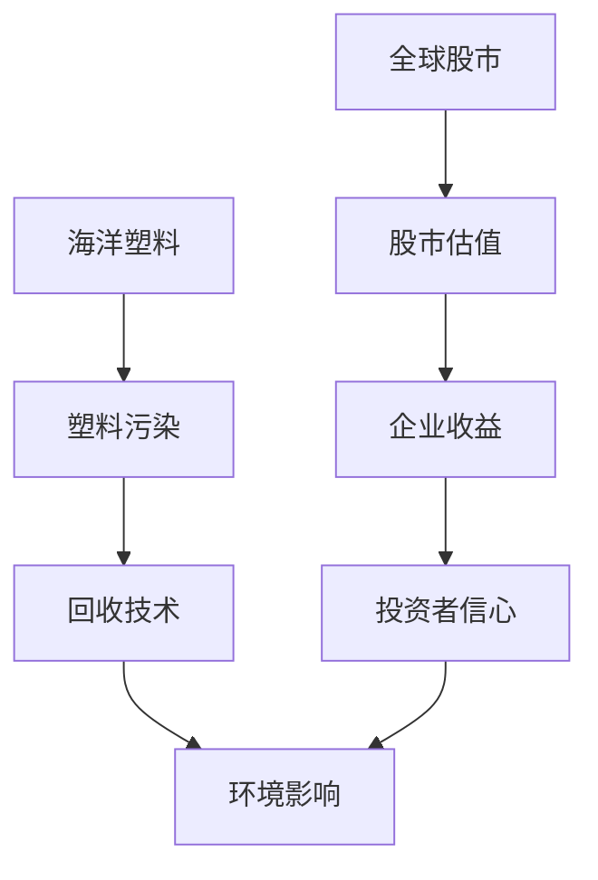
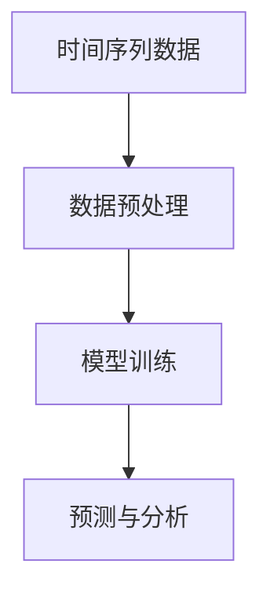
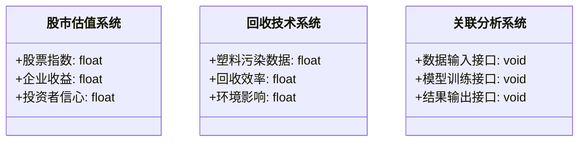
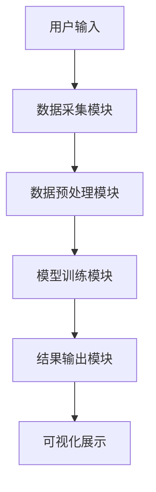

                 


```markdown
# 全球股市估值与海洋塑料回收技术的关联

> 关键词：全球股市估值，海洋塑料污染，环境经济关联，数据建模分析，技术解决方案

> 摘要：本文探讨全球股市估值与海洋塑料回收技术之间的关联性，分析数据建模和系统设计的实现方法，提出解决方案并进行案例分析。

---

## 第一部分: 全球股市估值与海洋塑料污染的背景与概念

### 第1章: 全球股市估值概述

#### 1.1 股市估值的基本概念
- 定义：股市估值是衡量企业价值的重要指标。
- 背景：全球经济的重要组成部分，影响投资者信心和企业收益。
- 边界：包括主要市场指数如道琼斯、纳斯达克等。

#### 1.2 全球股市估值的重要性
- 反映经济健康状况。
- 影响投资者决策。
- 预测市场趋势。

#### 1.3 股市估值的边界与外延
- 区域市场差异。
- 行业估值差异。
- 全球市场的相互影响。

### 第2章: 海洋塑料污染与回收技术

#### 2.1 海洋塑料污染的现状
- 定义：海洋中的塑料垃圾及其影响。
- 现状：分布广泛，危害生态系统。
- 统计数据：全球每年产生数亿吨塑料垃圾。

#### 2.2 海洋塑料回收技术的关键环节
- 回收技术：包括收集、分类和再利用。
- 回收技术的影响：减少污染，提高资源利用效率。

#### 2.3 海洋塑料污染对生态系统的危害
- 影响海洋生物：误食塑料导致生态链破坏。
- 影响海洋经济：旅游业和渔业损失。

### 第3章: 问题背景与关联性分析

#### 3.1 问题背景的提出
- 全球经济与环境问题的相互影响。
- 股市估值与环境技术的潜在联系。

#### 3.2 问题描述与目标
- 分析股市估值与海洋塑料回收技术的关联。
- 提出解决方案并进行案例分析。

#### 3.3 问题解决的路径
- 数据收集与建模。
- 关联机制分析。
- 技术解决方案设计。

---

## 第二部分: 全球股市估值与海洋塑料回收技术的关联机制

### 第4章: 关联机制的核心概念与联系

#### 4.1 核心概念原理
- 股市估值：反映企业经济状况。
- 回收技术：影响环境和经济成本。

#### 4.2 关联机制的属性特征对比
- 表5.1-1: 股市估值与海洋塑料回收技术的属性对比
  | 属性          | 股市估值                 | 海洋塑料回收技术             |
  |---------------|--------------------------|-----------------------------|
  | 定价因素      | 利润、市场预期           | 成本、技术效率               |
  | 影响因素      | 政治、经济环境           | 技术进步、政策支持           |
  | 时间维度      | 短期波动、长期趋势       | 长期影响                    |

#### 4.3 实体关系图（Mermaid）


### 第5章: 关联机制的属性特征对比

#### 5.1 数据特征对比
- 时间序列分析：股市估值和塑料污染数据的时间分布。
- 统计分析：相关性分析和回归模型。

---

## 第三部分: 数据建模与关联分析

### 第7章: 数据建模方法

#### 7.1 时间序列分析



数学公式：
$$ ARIMA(p, d, q) $$

---

## 第四部分: 系统分析与架构设计方案

### 第8章: 系统架构设计

#### 8.1 系统功能设计
- 领域模型（Mermaid类图）


#### 8.2 系统架构图


---

## 第五部分: 项目实战

### 第9章: 环境数据采集与处理

#### 9.1 环境数据采集
- 数据来源：公开数据库和传感器数据。

#### 9.2 数据预处理
- 清洗数据：处理缺失值和异常值。
- 数据转换：标准化和归一化。

#### 9.3 模型实现
- 时间序列分析：使用Python代码实现ARIMA模型。

---

## 第六部分: 总结与展望

### 第10章: 关联性分析总结

#### 10.1 关联性总结
- 股市估值与海洋塑料回收技术的相互影响。

#### 10.2 系统设计总结
- 数据建模和系统架构的关键点。

#### 10.3 未来展望
- 技术进步和政策支持对关联性的影响。

---

## 作者信息

作者：AI天才研究院/AI Genius Institute & 禅与计算机程序设计艺术 /Zen And The Art of Computer Programming
```

