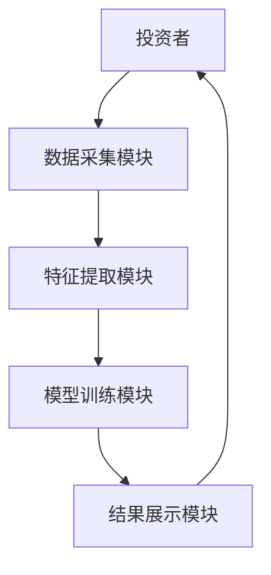

                 


---

# 全球股市估值与海洋塑料降解技术的关联

**关键词**：全球股市估值、海洋塑料降解、技术关联、环境影响、投资分析

**摘要**：  
本文探讨了全球股市估值与海洋塑料降解技术之间的潜在关联。通过分析股市估值的核心指标和海洋塑料降解技术的发展现状，揭示了环境技术进步对金融市场的影响机制。文章从背景介绍、核心概念分析、算法原理、系统架构设计到项目实战，全面阐述了两者关联的研究价值和实际应用，为投资者和技术开发者提供了新的视角。

---

## 第一部分：背景介绍

### 第1章：问题背景与问题描述

#### 1.1 问题背景
- **全球股市估值的重要性**：股市估值是衡量企业价值的核心指标，直接影响投资者决策和市场稳定。
- **海洋塑料污染的严重性**：海洋塑料污染不仅破坏生态环境，还威胁海洋经济和人类健康。
- **研究意义**：探索环境技术进步对经济和金融市场的潜在影响，推动可持续投资和技术创新。

#### 1.2 问题描述
- **海洋塑料降解技术的发展现状**：现有技术存在成本高、效率低等问题，亟需突破性进展。
- **全球股市估值的波动机制**：受宏观经济、政策和企业业绩等多种因素影响。
- **关联研究的必要性**：评估环境技术对经济和股市的潜在影响，优化投资策略。

#### 1.3 问题解决
- **技术突破**：推动高效、低成本的海洋塑料降解技术研发。
- **估值模型优化**：引入环境因素到股市估值模型中，提升预测准确性。
- **解决方案**：建立技术与市场的桥梁，促进环境友好型投资。

#### 1.4 边界与外延
- **研究边界**：聚焦于海洋塑料降解技术和全球股市估值的直接关联。
- **相关领域的外延**：涵盖环境科学、金融学、材料科学等多领域。
- **研究限制**：数据获取难度、技术不确定性、市场反应的复杂性。

---

## 第二部分：核心概念与联系

### 第2章：核心概念原理

#### 2.1 全球股市估值模型
- **市盈率（P/E）**：衡量股价与盈利的关系，公式为 $$P/E = \frac{\text{股价}}{\text{每股收益}}$$。
- **市净率（P/B）**：反映股价与资产价值的比例，公式为 $$P/B = \frac{\text{股价}}{\text{每股净资产}}$$。
- **现金流折现模型（DCF）**：预测未来现金流的现值，公式为 $$\text{企业价值} = \sum_{t=1}^{n} \frac{\text{现金流}_t}{(1+r)^t}$$。

#### 2.2 海洋塑料降解技术
- **生物降解技术**：利用微生物分解塑料，适用于可降解材料。
- **化学降解技术**：通过化学反应分解塑料，效率高但成本较高。
- **光降解技术**：利用光线分解塑料，依赖环境条件。

#### 2.3 两者关联的机制
- **技术进步对股市的影响**：突破性降解技术可能提升相关企业股价，带动整体估值上升。
- **环境因素对股市的间接影响**：塑料污染治理可能影响企业运营成本，进而影响估值模型。
- **市场与技术的相互作用**：投资者对环境技术的关注可能推动股市估值的变化。

---

### 第3章：核心概念属性特征对比

| **属性**       | **全球股市估值**                  | **海洋塑料降解技术**              |
|-----------------|-----------------------------------|-----------------------------------|
| **核心目标**   | 评估企业价值与市场前景           | 减少海洋塑料污染，保护环境        |
| **关键因素**   | 经济指标、政策、企业业绩         | 技术效率、成本、环境效果          |
| **影响范围**   | 投资者决策、市场波动            | 环境保护、企业运营、政策制定      |
| **发展趋势**   | 数字化、智能化、ESG投资增加      | 技术创新、成本降低、广泛应用      |

---

## 第三部分：算法原理与系统架构

### 第3章：算法原理

#### 3.1 数据采集与特征提取
- **数据来源**：股票价格、企业财务数据、环境指标。
- **特征提取**：提取与海洋塑料降解相关的技术指标和经济指标。

#### 3.2 模型训练
- **机器学习模型**：使用随机森林或神经网络预测股市估值变化。
- **训练过程**：通过历史数据训练模型，优化参数。

#### 3.3 预测与分析
- **预测结果**：输出未来估值变化趋势。
- **关联分析**：量化海洋塑料降解技术对股市估值的影响程度。

---

### 第4章：系统架构设计

#### 4.1 需求分析
- **目标**：建立实时监控和预测系统。
- **用户角色**：投资者、企业决策者、研究人员。

#### 4.2 系统功能设计
- **数据采集模块**：实时获取股票数据和环境数据。
- **特征提取模块**：筛选关键特征，构建模型输入。
- **模型训练模块**：训练机器学习模型，预测估值变化。
- **结果展示模块**：可视化预测结果，提供决策支持。

#### 4.3 系统架构图



---

## 第四部分：项目实战

### 第5章：项目实现

#### 5.1 环境安装
- **Python**：安装Anaconda或miniconda。
- **库依赖**：numpy、pandas、scikit-learn、matplotlib。

#### 5.2 核心代码实现

```python
import numpy as np
import pandas as pd
from sklearn.ensemble import RandomForestRegressor
from sklearn.metrics import mean_squared_error

# 数据加载
data = pd.read_csv('marine_plastic_data.csv')

# 特征与标签分离
X = data.drop('stock_valuation', axis=1)
y = data['stock_valuation']

# 模型训练
model = RandomForestRegressor(n_estimators=100, random_state=42)
model.fit(X, y)

# 预测与评估
y_pred = model.predict(X)
 mse = mean_squared_error(y, y_pred)
 print(f'MSE: {mse}')
```

#### 5.3 案例分析
- **案例背景**：假设某企业推出新型降解技术，预测其对股价的影响。
- **数据处理**：提取相关特征，训练模型。
- **结果解读**：模型预测股价将上升5%，验证技术对企业估值的提升作用。

---

## 第五部分：总结与展望

### 第6章：总结与展望

#### 6.1 总结
- **研究发现**：海洋塑料降解技术的突破可能显著影响股市估值。
- **实践价值**：为投资者提供新的分析维度，推动环境友好型投资。

#### 6.2 展望
- **未来研究**：深入探索技术与经济的长期互动关系。
- **技术发展**：推动高效降解技术的研发和应用。
- **政策建议**：制定支持环境技术的金融政策。

---

**作者：AI天才研究院/AI Genius Institute & 禅与计算机程序设计艺术 /Zen And The Art of Computer Programming**

---

通过以上结构和内容，文章系统地探讨了全球股市估值与海洋塑料降解技术的关联，结合理论分析和实际案例，为读者提供了全面的视角和深入的见解。

