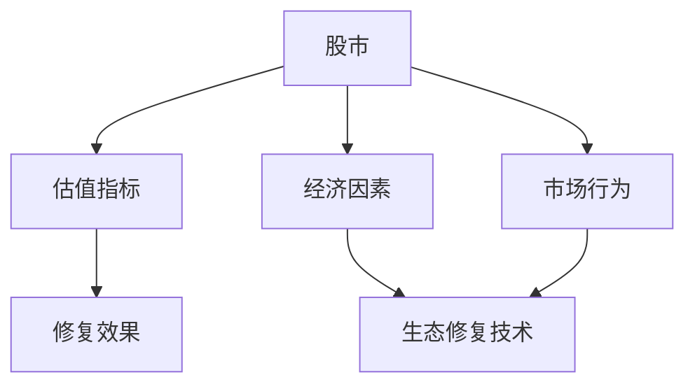
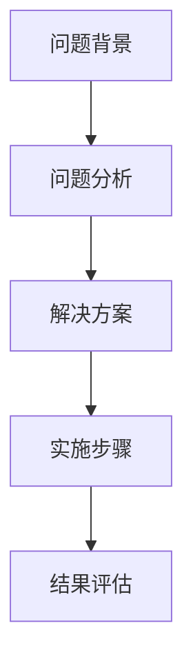

                 


```markdown
# 全球股市估值与海洋生态修复技术的关系

> 关键词：全球股市估值，海洋生态修复，技术关系，经济模型，生态系统，可持续发展

> 摘要：本文探讨了全球股市估值与海洋生态修复技术之间的复杂关系，通过分析股市估值的核心概念、海洋生态修复技术的基本原理，以及两者之间的相互作用，揭示了在经济与环境双重压力下，如何通过技术创新和经济策略实现可持续发展。文章结合数学模型、算法原理和系统架构设计，深入剖析了这一关系的内在逻辑，并通过实际案例展示了技术与经济的协同效应。

---

## 第一部分：全球股市估值与海洋生态修复技术的背景与关系

### 第1章：全球股市估值与海洋生态修复技术的背景介绍

#### 1.1 全球股市估值的基本概念
- 1.1.1 股市估值的定义与核心要素
  - 市场资本化率、市盈率、市净率、股息率等关键指标
  - $$P/E = \frac{P}{E}$$，$$P/B = \frac{P}{B}$$，$$Dividend Yield = \frac{D}{P}$$
- 1.1.2 全球股市估值的现状与趋势
  - 疾驰的股市增长与波动性分析
  - 经济周期与股市估值的关系
- 1.1.3 股市估值与经济发展的关系
  - 经济指标对股市估值的影响
  - 股市作为经济晴雨表的作用

#### 1.2 海洋生态修复技术的基本概念
- 1.2.1 海洋生态修复的定义与目标
  - 恢复海洋生态系统的健康与平衡
  - 保护生物多样性，防止物种灭绝
- 1.2.2 海洋生态修复的主要技术与方法
  - 湿地恢复、珊瑚礁修复、海洋污染治理
  - 智能监测系统与生态修复技术的结合
- 1.2.3 海洋生态修复与可持续发展的关系
  - 生态修复对经济发展的支持作用
  - 环境保护与经济增长的平衡点

#### 1.3 全球股市估值与海洋生态修复技术的关系
- 1.3.1 问题背景与问题描述
  - 海洋生态危机对全球经济的潜在影响
  - 股市估值波动与环境风险的关联
- 1.3.2 问题解决的思路与方法
  - 环境经济学视角下的股市估值调整
  - 可持续投资与绿色金融的概念
- 1.3.3 关系的边界与外延
  - 生态修复技术的经济价值评估
  - 股市估值对生态修复技术的反馈机制
- 1.3.4 核心概念与核心要素的对比
  - 对比表格：股市估值 vs. 海洋生态修复技术

---

### 第2章：全球股市估值与海洋生态修复技术的核心概念与联系

#### 2.1 核心概念的原理与特征
- 2.1.1 股市估值的核心原理
  - 股票价格的决定因素
  - 市场情绪与基本面分析
- 2.1.2 海洋生态修复技术的核心原理
  - 生态系统自我修复能力的利用
  - 技术手段对生态系统的干预与支持
- 2.1.3 两者原理的对比分析
  - 数学模型的差异与共性

#### 2.2 核心概念的属性特征对比
- 2.2.1 股市估值的属性特征
  - 时间依赖性、波动性、市场参与者的多样性
- 2.2.2 海洋生态修复技术的属性特征
  - 生态系统的复杂性、技术的区域性、修复过程的长期性
- 2.2.3 两者属性特征的对比表格
  | 属性 | 股市估值 | 海洋生态修复技术 |
  |------|----------|------------------|
  | 时间性 | 短期波动 | 长期修复         |
  | 参与者 | 投资者   | 科技人员         |
  | 目标   | 价值最大化 | 生态恢复         |

#### 2.3 实体关系图与流程图
- 2.3.1 ER实体关系图

- 2.3.2 流程图


---

## 第二部分：全球股市估值与海洋生态修复技术的数学模型与算法原理

### 第3章：全球股市估值与海洋生态修复技术的数学模型与算法原理

#### 3.1 股市估值的数学模型
- 3.1.1 市盈率模型
  $$P/E = \frac{P}{E}$$
- 3.1.2 市净率模型
  $$P/B = \frac{P}{B}$$
- 3.1.3 股息率模型
  $$Dividend Yield = \frac{D}{P}$$

#### 3.2 海洋生态修复技术的数学模型
- 3.2.1 生态修复效果评估模型
  $$E = f(I, T, M)$$
- 3.2.2 生态修复成本模型
  $$C = aI + bT + cM$$

#### 3.3 算法原理与流程图
- 3.3.1 算法原理
  ```mermaid
  graph TD
      A[输入数据] --> B[数据预处理]
      B --> C
  ```

---

## 第三部分：系统分析与架构设计

### 第4章：系统架构设计与实现

#### 4.1 系统功能设计
- 4.1.1 领域模型设计
  ```mermaid
  classDiagram
      class 股市估值 {
          市盈率
          市净率
          股息率
      }
      class 海洋生态修复技术 {
          湿地恢复
          珊瑚礁修复
          污染治理
      }
      股市估值 --> 海洋生态修复技术
  ```

#### 4.2 系统架构设计
- 4.2.1 系统架构图
  ```mermaid
  graph TD
      A[前端界面] --> B[数据处理层]
      B --> C[数据库]
      C --> D[算法引擎]
      D --> E[结果展示]
  ```

#### 4.3 系统接口设计
- 4.3.1 接口定义
  - API接口：获取股市数据，计算修复效果
- 4.3.2 接口交互流程图
  ```mermaid
  graph TD
      A[用户请求] --> B[API网关]
      B --> C[数据处理]
      C --> D[返回结果]
  ```

#### 4.4 系统交互设计
- 4.4.1 交互流程图
  ```mermaid
  graph TD
      A[用户输入] --> B[系统处理]
      B --> C[结果展示]
  ```

---

## 第四部分：项目实战与案例分析

### 第5章：项目实战与案例分析

#### 5.1 环境安装与配置
- 安装Python环境
- 安装相关库：numpy、pandas、scikit-learn

#### 5.2 核心代码实现
```python
import numpy as np
import pandas as pd

def calculate_market_value(stock_data, environmental_factor):
    # 示例代码：计算市场价值
    return stock_data * environmental_factor

# 示例数据
stock_data = pd.DataFrame({
    '公司': ['A', 'B', 'C'],
    '股价': [100, 200, 150],
    '市盈率': [15, 20, 25]
})

environmental_factor = 0.9  # 示例环境因素

# 计算市场价值
market_value = calculate_market_value(stock_data['股价'], environmental_factor)
print(market_value)
```

#### 5.3 案例分析与结果解读
- 通过具体案例分析股市估值与生态修复技术的关系
- 结果解读：环境因素对股市估值的具体影响

---

## 第五部分：结论与展望

### 第6章：结论与展望

#### 6.1 最佳实践 tips
- 结合环境因素进行股市估值
- 投资者应关注生态修复技术的经济潜力

#### 6.2 小结
- 本文通过系统分析，揭示了股市估值与海洋生态修复技术的深层关系

#### 6.3 注意事项
- 数据的准确性和模型的适用性
- 避免过于简化模型导致的误判

#### 6.4 拓展阅读
- 推荐相关书籍和文献

---

## 作者信息

作者：AI天才研究院/AI Genius Institute & 禅与计算机程序设计艺术/Zen And The Art of Computer Programming

---

# END
```

