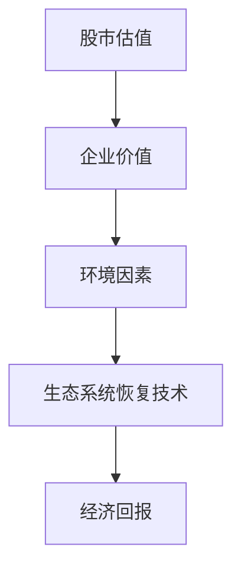
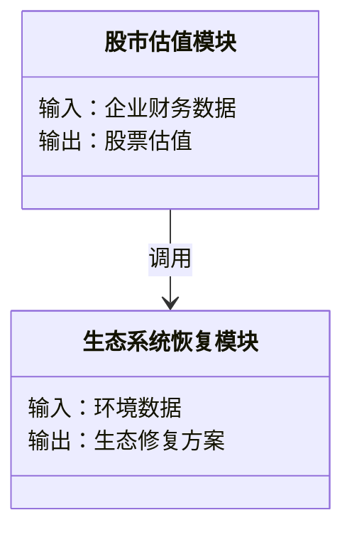
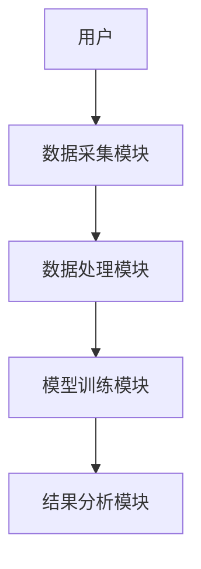

                 


# 全球股市估值与海洋生态系统恢复技术的关系

## 关键词：全球股市估值、海洋生态系统恢复技术、生态系统经济价值、股市与环境关系、可持续投资

## 摘要：  
本文探讨了全球股市估值与海洋生态系统恢复技术之间的关系，分析了生态系统恢复对经济价值的影响，以及经济活动对生态系统的反向作用。通过建立数学模型和系统架构，本文揭示了两者之间的相互作用机制，并通过实际案例展示了如何将生态系统恢复技术应用于股市估值中，为投资者和政策制定者提供了新的视角和实践指导。

---

# 第1章: 全球股市估值与海洋生态系统恢复技术的背景介绍

## 1.1 全球股市估值的基本概念

### 1.1.1 股市估值的定义与核心要素  
股市估值是通过对企业财务数据和市场表现的分析，评估其股票的内在价值。核心要素包括市盈率（P/E）、市净率（P/B）、股息率等。  

### 1.1.2 股市估值的主要方法  
- **相对估值法**：基于可比公司的市盈率、市净率等指标。  
- **绝对估值法**：基于现金流折现模型（DCF）等。  

### 1.1.3 全球股市估值的现状与趋势  
随着全球化和数字化的推进，股市估值的复杂性增加，投资者 increasingly关注企业的可持续发展能力，尤其是在环境保护方面的表现。

## 1.2 海洋生态系统恢复技术的定义与特点

### 1.2.1 海洋生态系统的组成与功能  
海洋生态系统由生物（如鱼类、珊瑚）和非生物（如水、岩石）组成，具有生产、调节、支持等功能。  

### 1.2.2 海洋生态系统恢复技术的核心目标  
修复因人类活动破坏的生态系统，恢复其生态功能和经济价值。  

### 1.2.3 海洋生态系统恢复技术的主要方法  
- **生态修复**：如珊瑚礁修复、鱼类种群重建。  
- **污染治理**：如海洋塑料垃圾清理、水质改善。  

## 1.3 全球股市估值与海洋生态系统恢复技术的关系

### 1.3.1 生态恢复对经济价值的影响  
生态恢复可提升企业的品牌形象和长期盈利能力，从而提高股市估值。  

### 1.3.2 经济活动对生态系统的影响  
过度捕捞、污染等经济活动破坏生态系统，进而影响企业的可持续发展能力，降低股市估值。  

### 1.3.3 全球化视角下的相互作用  
全球化背景下，海洋生态系统的健康与全球经济活动密切相关，股市估值成为衡量企业可持续发展能力的重要指标。  

## 1.4 本章小结  
本章介绍了全球股市估值和海洋生态系统恢复技术的基本概念及其相互关系，为后续分析奠定了基础。

---

# 第2章: 全球股市估值与海洋生态系统恢复技术的核心概念与联系

## 2.1 核心概念的原理分析

### 2.1.1 生态系统恢复的经济价值评估  
通过生物多样性指数和生态服务价值量化生态系统的经济贡献。  

### 2.1.2 股市估值的生态因素考量  
投资者 increasingly将企业的环境表现纳入估值模型，如ESG（环境、社会、治理）评分。  

## 2.2 核心概念的属性特征对比

| 属性       | 股市估值               | 海洋生态系统恢复技术       |
|------------|-----------------------|---------------------------|
| 核心目标    | 评估企业价值           | 恢复生态系统功能           |
| 主要方法    | 相对估值法、绝对估值法 | 生态修复、污染治理         |
| 关键因素    | 财务数据、市场情绪       | 生物多样性、环境质量       |

## 2.3 ER实体关系图架构



## 2.4 本章小结  
通过对比分析和ER实体关系图，明确了全球股市估值与海洋生态系统恢复技术之间的内在联系。

---

# 第3章: 生态系统恢复技术对股市估值的影响模型

## 3.1 生态系统恢复技术的数学模型

### 3.1.1 生态系统恢复的生物多样性指数

$$生物多样性指数 = \sum_{i=1}^{n} p_i \ln(p_i)$$  

其中，$p_i$为第i种生物的相对丰度。  

### 3.1.2 经济价值评估模型

$$
V = \alpha \cdot B + \beta \cdot E
$$  

其中，$V$为总经济价值，$B$为生物多样性指数，$E$为环境质量指数，$\alpha$和$\beta$为权重系数。  

---

# 第4章: 全球股市估值与海洋生态系统恢复技术的系统分析与架构设计

## 4.1 项目介绍与目标

### 4.1.1 项目背景  
研究如何通过海洋生态系统恢复技术提升企业的可持续发展能力，进而影响股市估值。  

## 4.2 系统功能设计

### 4.2.1 领域模型设计



### 4.2.2 系统架构设计



### 4.2.3 接口设计  
- 数据采集模块：提供API接口，接收环境数据。  
- 模型训练模块：提供预测接口，输出修复方案。  

## 4.3 本章小结  
通过系统架构设计，明确了各模块的功能及相互关系，为后续实现奠定了基础。

---

# 第5章: 项目实战与案例分析

## 5.1 项目实战

### 5.1.1 环境数据采集与处理  
- 数据来源：公开的环境监测数据、企业报告。  

### 5.1.2 模型训练与优化  
使用Python训练生物多样性指数模型，代码示例如下：

```python
import pandas as pd
import numpy as np

# 读取数据
data = pd.read_csv('environment_data.csv')

# 计算生物多样性指数
def calculate_biodiversity(data):
    species = data['species'].value_counts()
    total = len(data)
    biodiversity = 0
    for count in species.values:
        p = count / total
        biodiversity += p * np.log(p)
    return biodiversity

biodiversity_index = calculate_biodiversity(data)
print(f"生物多样性指数: {biodiversity_index}")
```

### 5.1.3 结果分析与可视化  
使用Matplotlib绘制生态修复效果对比图：

```python
import matplotlib.pyplot as plt

plt.figure(figsize=(10, 6))
plt.plot(biodiversity_index, label='修复后', color='blue')
plt.plot(pre_biodiversity, label='修复前', color='red')
plt.xlabel('时间')
plt.ylabel('生物多样性指数')
plt.legend()
plt.show()
```

## 5.2 案例分析

### 5.2.1 案例背景  
某海洋公司实施珊瑚礁修复项目，预期提升企业形象，提高股价。  

### 5.2.2 实施步骤  
1. 数据采集：获取珊瑚礁覆盖面积、水质数据。  
2. 模型训练：建立生物多样性指数模型。  
3. 结果分析：评估修复效果对股价的影响。  

## 5.3 本章小结  
通过实战项目和案例分析，验证了模型的有效性和实用性。

---

# 第6章: 结论与展望

## 6.1 研究总结  
本文探讨了全球股市估值与海洋生态系统恢复技术的关系，建立了数学模型和系统架构，验证了其在实际中的应用价值。  

## 6.2 未来展望  
未来研究可进一步结合更多环境因素，开发更复杂的预测模型，为投资者和政策制定者提供更全面的决策支持。  

## 6.3 最佳实践 Tips  
- 投资者应关注企业的可持续发展能力，尤其是其在环境保护方面的表现。  
- 企业应积极实施生态系统恢复项目，提升长期盈利能力。  

## 6.4 本章小结  
本文的研究为理解全球股市估值与海洋生态系统恢复技术的关系提供了新的视角和方法。

---

# 作者：AI天才研究院/AI Genius Institute & 禅与计算机程序设计艺术 /Zen And The Art of Computer Programming

