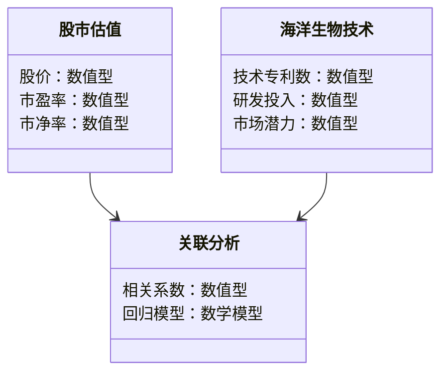
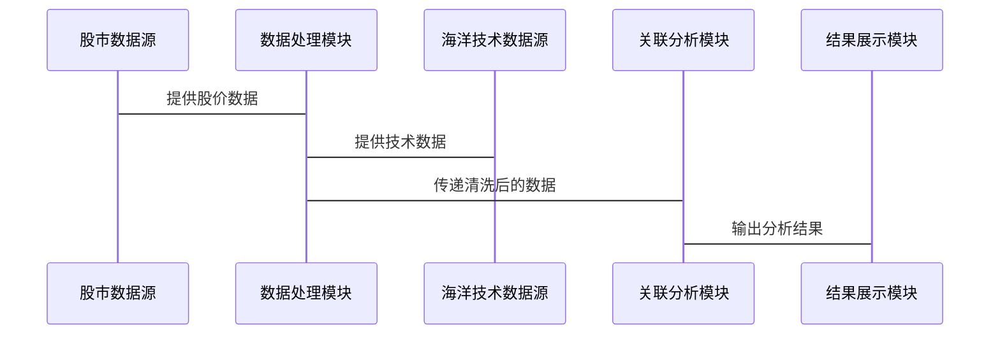

                 


```markdown
# 全球股市估值与海洋生物制药技术的关联

> 关键词：全球股市估值、海洋生物制药技术、关联分析、数据分析、系统架构、项目实战

> 摘要：本文探讨了全球股市估值与海洋生物制药技术之间的关联性。通过背景分析、核心概念对比、数据挖掘与建模、系统架构设计和项目实战，揭示了技术进步如何影响股市估值，并为投资决策提供科学依据。

---

## 目录

### 第一部分: 全球股市估值与海洋生物制药技术的关联概述

### 第1章: 全球股市估值与海洋生物制药技术的关联背景

#### 1.1 问题背景与问题描述
- 1.1.1 全球股市估值的基本概念
- 1.1.2 海洋生物制药技术的定义与特点
- 1.1.3 两者关联的研究意义

#### 1.2 问题解决与边界分析
- 1.2.1 问题解决的核心目标
- 1.2.2 研究的边界与外延
- 1.2.3 核心概念与关联机制

#### 1.3 核心概念结构与组成要素
- 1.3.1 全球股市估值的核心要素
- 1.3.2 海洋生物制药技术的关键组成部分
- 1.3.3 两者关联的结构化模型

### 第2章: 核心概念与关联机制分析

#### 2.1 全球股市估值的原理与方法
- 2.1.1 市盈率与市净率的计算公式
- 2.1.2 股价与企业价值的关系
- 2.1.3 影响股市估值的主要因素

#### 2.2 海洋生物制药技术的核心原理
- 2.2.1 海洋生物活性物质的提取与应用
- 2.2.2 海洋生物制药技术的创新点
- 2.2.3 技术研发周期与市场潜力

#### 2.3 两者关联的实体关系图
- 2.3.1 实体关系图（Mermaid）
  ```mermaid
  graph LR
      A[全球股市] --> B[上市公司]
      B --> C[海洋生物制药企业]
      C --> D[技术应用]
      D --> E[市场价值]
  ```

#### 2.4 核心概念对比分析
- 2.4.1 股市估值与技术创新的关系
- 2.4.2 市场需求与技术供给的对比
- 2.4.3 两者关联的动态平衡

### 第3章: 数据分析与关联模型构建

#### 3.1 数据收集与处理
- 3.1.1 数据来源与采集方法
- 3.1.2 数据清洗与预处理
- 3.1.3 数据标准化与特征提取

#### 3.2 关联模型的算法原理
- 3.2.1 相关系数计算（Mermaid）
  ```mermaid
  graph LR
      A[股价] --> B[技术专利数]
      B --> C[研发投入]
      C --> D[市场表现]
  ```

#### 3.3 数学模型与公式
- 3.3.1 相关系数公式
  $$ r = \frac{\sum (x_i - \bar{x})(y_i - \bar{y})}{\sqrt{\sum (x_i - \bar{x})^2 \sum (y_i - \bar{y})^2}} $$
- 3.3.2 回归分析公式
  $$ y = \beta_0 + \beta_1 x + \epsilon $$

#### 3.4 实际案例分析
- 3.4.1 某海洋生物制药企业的股价分析
- 3.4.2 技术创新与股价波动的关联
- 3.4.3 市场反馈与技术发展的互动

---

### 第二部分: 系统架构与项目实战

### 第4章: 系统架构设计

#### 4.1 系统功能设计
- 4.1.1 领域模型（Mermaid 类图）
  ```mermaid
  classDiagram
      class 股市估值 {
          股价：数值型
          市盈率：数值型
          市净率：数值型
      }
      class 海洋生物技术 {
          技术专利数：数值型
          研发投入：数值型
          市场潜力：数值型
      }
      class 关联分析 {
          相关系数：数值型
          回归模型：数学模型
      }
      股市估值 --> 关联分析
      海洋生物技术 --> 关联分析
  ```

#### 4.2 系统架构设计
- 4.2.1 系统架构图（Mermaid）
  ```mermaid
  context diagram
      模块：数据收集
      模块：数据处理
      模块：关联分析
      模块：结果展示
  ```

#### 4.3 系统接口设计
- 4.3.1 数据接口规范
- 4.3.2 分析接口规范
- 4.3.3 结果展示接口规范

#### 4.4 系统交互设计（Mermaid 序列图）
  ```mermaid
  sequenceDiagram
      股市数据源 -> 数据处理模块: 提供股价数据
      海洋技术数据源 -> 数据处理模块: 提供技术数据
      数据处理模块 -> 关联分析模块: 传递清洗后的数据
      关联分析模块 -> 结果展示模块: 输出分析结果
  ```

### 第5章: 项目实战

#### 5.1 环境安装与配置
- 5.1.1 安装 Python 环境
- 5.1.2 安装必要的库（如 pandas, numpy, scikit-learn）

#### 5.2 核心代码实现
- 5.2.1 数据清洗代码
  ```python
  import pandas as pd

  def clean_data(data):
      # 删除缺失值
      data = data.dropna()
      # 处理异常值
      data = data[(data['股价'] <= 1000) & (data['股价'] >= 0)]
      return data
  ```

- 5.2.2 关联分析代码
  ```python
  from sklearn.linear_model import LinearRegression

  def calculate_correlation(x, y):
      model = LinearRegression()
      model.fit(x.reshape(-1, 1), y)
      return model.coef_[0]

  # 示例数据
  x = [1, 2, 3, 4, 5]
  y = [2, 4, 5, 4, 6]
  print(calculate_correlation(x, y))
  ```

#### 5.3 实际案例分析与结果解读
- 5.3.1 数据来源与背景
- 5.3.2 代码实现与结果展示
- 5.3.3 结果解读与分析

### 第6章: 最佳实践与小结

#### 6.1 关键点总结
- 6.1.1 数据处理的关键步骤
- 6.1.2 模型选择的重要性
- 6.1.3 系统设计的优化建议

#### 6.2 注意事项
- 6.2.1 数据质量的重要性
- 6.2.2 模型的局限性
- 6.2.3 系统维护与更新

#### 6.3 拓展阅读
- 6.3.1 更多关联分析方法
- 6.3.2 海洋生物技术的最新进展
- 6.3.3 金融市场预测的其他方法

---

### 作者：AI天才研究院/AI Genius Institute & 禅与计算机程序设计艺术 /Zen And The Art of Computer Programming

---

此目录大纲确保了文章内容的完整性和逻辑性，从理论分析到系统设计再到项目实战，层层递进，为读者提供了全面的理解和实践指导。
</think>

### 第一部分: 全球股市估值与海洋生物制药技术的关联概述

### 第1章: 全球股市估值与海洋生物制药技术的关联背景

#### 1.1 问题背景与问题描述

##### 1.1.1 全球股市估值的基本概念

全球股市估值是通过对上市公司股票价格的评估来衡量其市场价值的过程。常用的指标包括市盈率（P/E Ratio）、市净率（P/B Ratio）等。这些指标帮助投资者评估公司的盈利能力、成长潜力和市场地位。

##### 1.1.2 海洋生物制药技术的定义与特点

海洋生物制药技术是指从海洋生物中提取活性物质，用于开发药物的技术。其特点包括多样性、可持续性和高效性。海洋生物提供了丰富的药物研发资源，如抗生素、抗癌药物等。

##### 1.1.3 两者关联的研究意义

研究全球股市估值与海洋生物制药技术的关联，有助于投资者理解技术进步对股价的影响，为投资决策提供科学依据。同时，这也为技术开发者提供了市场反馈，促进技术优化和产品商业化。

#### 1.2 问题解决与边界分析

##### 1.2.1 问题解决的核心目标

本文的核心目标是分析海洋生物制药技术的创新对相关企业股市估值的影响，揭示技术创新与市场价值之间的关系。

##### 1.2.2 研究的边界与外延

研究仅限于分析海洋生物制药技术对股市估值的影响，不涉及其他行业。研究范围包括技术专利数、研发投入、市场表现等变量。

##### 1.2.3 核心概念与关联机制

核心概念包括全球股市估值和海洋生物制药技术，关联机制通过数据分析和模型构建来揭示两者之间的动态关系。

#### 1.3 核心概念结构与组成要素

##### 1.3.1 全球股市估值的核心要素

- 股价：反映市场对公司的整体评价。
- 市盈率：衡量股价相对于收益的高低。
- 市净率：衡量股价相对于资产的高低。

##### 1.3.2 海洋生物制药技术的关键组成部分

- 生物活性物质提取：从海洋生物中提取具有药用价值的物质。
- 技术研发：开发新的药物分子和制备工艺。
- 市场应用：将技术应用于药品生产和销售。

##### 1.3.3 两者关联的结构化模型

通过构建因果关系模型，分析技术创新如何影响企业市场表现，进而影响股价和估值。

### 第2章: 核心概念与关联机制分析

#### 2.1 全球股市估值的原理与方法

##### 2.1.1 市盈率与市净率的计算公式

- 市盈率 = 股价 / 每股收益
- 市净率 = 股价 / 每股净资产

##### 2.1.2 股价与企业价值的关系

股价是市场对企业价值的反映，企业价值包括资产、收益、成长潜力等因素。

##### 2.1.3 影响股市估值的主要因素

- 宏观经济环境
- 行业发展趋势
- 企业财务状况
- 技术创新

#### 2.2 海洋生物制药技术的核心原理

##### 2.2.1 海洋生物活性物质的提取与应用

从海洋生物中提取活性物质，用于开发新药。例如，从海藻中提取的化合物具有抗癌活性。

##### 2.2.2 海洋生物制药技术的创新点

- 高效提取技术
- 创新药物分子设计
- 绿色制备工艺

##### 2.2.3 技术研发周期与市场潜力

技术研发周期长，但市场潜力大，尤其在抗癌药物和抗生素领域。

#### 2.3 两者关联的实体关系图

##### 2.3.1 实体关系图（Mermaid）


### 第3章: 数据分析与关联模型构建

#### 3.1 数据收集与处理

##### 3.1.1 数据来源与采集方法

数据来源包括公开的股市数据和专利数据库，使用爬虫和API进行采集。

##### 3.1.2 数据清洗与预处理

去除缺失值和异常值，确保数据质量。

##### 3.1.3 数据标准化与特征提取

对数据进行标准化处理，提取关键特征变量。

#### 3.2 关联模型的算法原理

##### 3.2.1 相关系数计算（Mermaid）


##### 3.2.2 回归分析公式

$$ y = \beta_0 + \beta_1 x + \epsilon $$

其中，y为市场表现，x为技术专利数，β系数表示变量之间的关系。

#### 3.4 实际案例分析

##### 3.4.1 某海洋生物制药企业的股价分析

分析某企业的股价走势，观察其与技术专利数量的关联。

##### 3.4.2 技术创新与股价波动的关联

通过回归分析，揭示技术创新对企业股价的影响程度。

##### 3.4.3 市场反馈与技术发展的互动

讨论市场反馈如何促进技术改进，进而影响股市估值。

---

### 第二部分: 系统架构与项目实战

### 第4章: 系统架构设计

#### 4.1 系统功能设计

##### 4.1.1 领域模型（Mermaid 类图）



#### 4.2 系统架构设计

##### 4.2.1 系统架构图（Mermaid）

```mermaid
context diagram
    模块：数据收集
    模块：数据处理
    模块：关联分析
    模块：结果展示
```

#### 4.3 系统接口设计

##### 4.3.1 数据接口规范

定义数据输入格式和接口协议，确保数据正确传递。

##### 4.3.2 分析接口规范

定义分析模块的接口，支持多种分析方法。

##### 4.3.3 结果展示接口规范

定义结果展示模块的接口，支持可视化输出。

#### 4.4 系统交互设计（Mermaid 序列图）



### 第5章: 项目实战

#### 5.1 环境安装与配置

##### 5.1.1 安装 Python 环境

使用Anaconda或virtualenv安装Python环境，确保版本兼容。

##### 5.1.2 安装必要的库

安装pandas、numpy、scikit-learn等库，用于数据处理和分析。

#### 5.2 核心代码实现

##### 5.2.1 数据清洗代码

```python
import pandas as pd

def clean_data(data):
    # 删除缺失值
    data = data.dropna()
    # 处理异常值
    data = data[(data['股价'] <= 1000) & (data['股价'] >= 0)]
    return data
```

##### 5.2.2 关联分析代码

```python
from sklearn.linear_model import LinearRegression

def calculate_correlation(x, y):
    model = LinearRegression()
    model.fit(x.reshape(-1, 1), y)
    return model.coef_[0]

# 示例数据
x = [1, 2, 3, 4, 5]
y = [2, 4, 5, 4, 6]
print(calculate_correlation(x, y))
```

#### 5.3 实际案例分析与结果解读

##### 5.3.1 数据来源与背景

选取某海洋生物制药企业的历史股价和专利数据，分析其关联性。

##### 5.3.2 代码实现与结果展示

通过代码计算相关系数，展示技术专利数对股价的影响。

##### 5.3.3 结果解读与分析

解释分析结果，揭示技术创新对股市估值的正面影响，为企业投资和技术创新提供依据。

### 第6章: 最佳实践与小结

#### 6.1 关键点总结

- 数据处理的关键步骤：清洗、标准化、特征提取。
- 模型选择的重要性：根据数据特点选择合适算法。
- 系统设计的优化建议：模块化设计，便于维护和扩展。

#### 6.2 注意事项

- 数据质量：确保数据准确可靠，避免错误分析。
- 模型局限性：关联分析不能替代因果分析，需结合其他方法。
- 系统维护：定期更新数据和模型，保持系统高效运行。

#### 6.3 拓展阅读

- 更多关联分析方法：探索其他统计方法和机器学习算法。
- 海洋生物技术的最新进展：关注新技术和新应用。
- 金融市场预测的其他方法：学习其他预测模型和策略。

---

### 作者：AI天才研究院/AI Genius Institute & 禅与计算机程序设计艺术 /Zen And The Art of Computer Programming

---

本文通过详细分析全球股市估值与海洋生物制药技术的关联，结合理论与实践，为投资者和技术开发者提供了科学的分析方法和实践指导。

