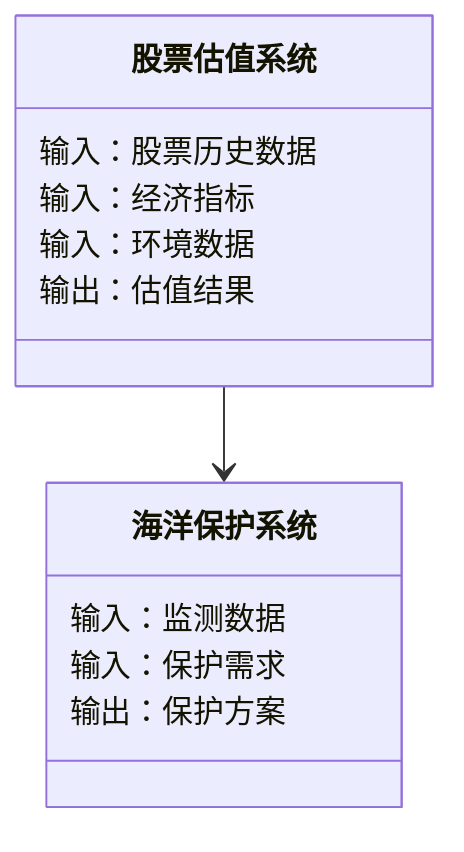
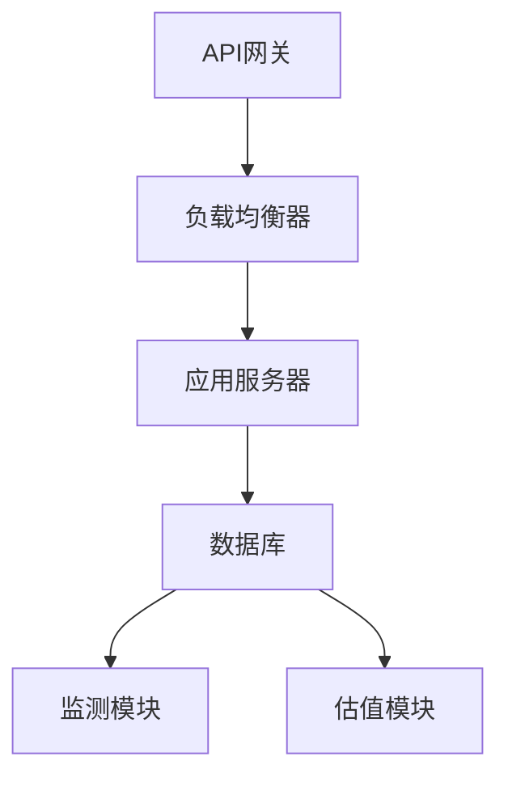

                 


# 全球股市估值与海洋生物多样性保护技术的关系

## 关键词：全球股市估值, 海洋生物多样性, 保护技术, 经济影响, 技术创新

## 摘要：本文探讨了全球股市估值与海洋生物多样性保护技术之间的关系。通过分析股市估值的核心概念、海洋保护技术的原理，以及两者如何相互影响，本文揭示了技术创新在经济与生态平衡中的关键作用。结合实际案例和系统设计，本文为实现可持续发展提供了理论与实践指导。

---

## 第一部分：全球股市估值与海洋生物多样性保护的背景

### 第1章：全球股市估值的现状与挑战

#### 1.1 全球股市估值的基本概念
- 股票估值是通过分析企业财务状况、市场趋势等因素，预测其股票价格的过程。
- 核心指标包括市盈率（P/E）、市净率（P/B）等。
- $$\text{市盈率} = \frac{\text{股价}}{\text{每股收益}}$$

#### 1.2 海洋生物多样性保护的重要性
- 海洋生物多样性是地球生态系统的基石。
- 海洋资源的价值远超经济价值，包括生态服务价值（ESV）和生物资产价值（BAV）。
- 海洋保护技术涵盖监测、保护和治理三个层面。

#### 1.3 股市估值与海洋保护的关系
- 海洋保护影响企业供应链（如渔业、旅游业）的稳定性。
- 投资者 increasingly关注企业的环境责任，绿色投资（ESG）成为趋势。
- 技术创新（如AI、大数据）推动股市估值模型优化，同时助力海洋保护。

---

## 第二部分：股市估值与海洋保护技术的理论框架

### 第2章：股市估值的理论基础

#### 2.1 股票定价理论
- **内在价值法**：基于企业未来现金流的折现值。
- **相对估值法**：通过比较可比公司确定估值。
- $$\text{内在价值} = \sum_{t=1}^{n} \frac{\text{现金流}_t}{(1+r)^t}$$

#### 2.2 股市波动与经济周期
- 经济周期影响股市整体估值。
- 宏观因素（如利率、通货膨胀）对估值有显著影响。

### 第3章：海洋保护技术的核心原理

#### 3.1 海洋监测技术
- 利用卫星遥感、无人机等技术进行海洋环境监测。
- 关键指标包括水温、盐度、氧气含量等。

#### 3.2 生物多样性保护技术
- 基因编辑技术（CRISPR）用于濒危物种保护。
- 生态修复技术（如珊瑚礁修复）恢复海洋生态系统。

#### 3.3 海洋污染治理技术
- 使用生物降解材料减少污染。
- 智能监测与清理系统（如无人清理船）提高治理效率。

---

## 第三部分：股市估值与海洋保护技术的技术分析

### 第4章：大数据与AI在股市估值中的应用

#### 4.1 大数据分析
- 数据来源：历史股价、财务数据、新闻 sentiment。
- 技术工具：Hadoop、Spark等分布式计算框架。

#### 4.2 机器学习算法
- 算法选择：线性回归、随机森林、神经网络。
- 应用场景：预测股价波动、识别市场趋势。

### 第5章：海洋保护技术的创新

#### 5.1 海洋监测技术的创新
- 智能传感器网络实现实时监测。
- 使用边缘计算减少数据传输延迟。

#### 5.2 生物多样性保护的技术创新
- 利用区块链技术确保保护数据的透明性。
- 使用AI识别濒危物种分布。

---

## 第四部分：系统分析与架构设计

### 第6章：系统功能设计

#### 6.1 领域模型设计


#### 6.2 系统架构设计


---

## 第五部分：项目实战与最佳实践

### 第7章：项目实战

#### 7.1 环境安装
- 操作系统：Linux
- 开发工具：Python、Jupyter Notebook
- 依赖库：pandas、scikit-learn

#### 7.2 核心代码实现
```python
import pandas as pd
from sklearn.linear_model import LinearRegression

# 数据加载
data = pd.read_csv('stock_data.csv')

# 模型训练
model = LinearRegression()
model.fit(data[['PE_ratio', 'PB_ratio']], data['Price'])

# 预测结果
predicted_price = model.predict([[20, 3]])
print(predicted_price)
```

---

## 第六部分：总结与展望

### 第8章：结论

- 股市估值与海洋保护技术的结合是可持续发展的关键。
- 技术创新（如AI、大数据）在提升估值模型精度和保护海洋生物多样性方面发挥重要作用。
- 未来研究应关注两者的协同效应，探索更多应用场景。

### 第9章：最佳实践 tips

- 在实施海洋保护项目时，优先选择技术成熟且可扩展的方案。
- 在股市估值中，结合环境因素（如碳排放）能提高模型的鲁棒性。
- 加强跨学科合作，推动技术创新。

---

## 作者：AI天才研究院 & 禅与计算机程序设计艺术

本文由AI天才研究院撰写，结合禅与计算机程序设计艺术的理念，致力于探索技术与生态的平衡之道。

