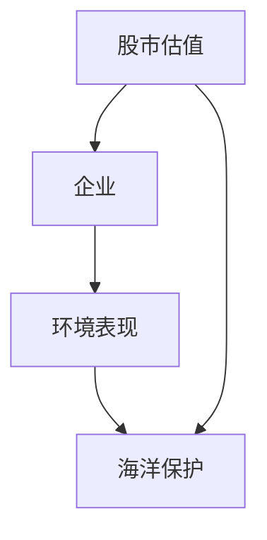
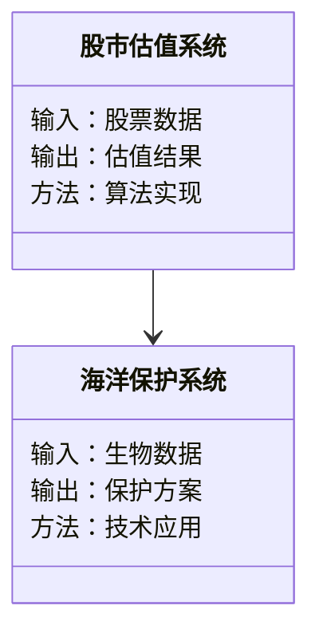
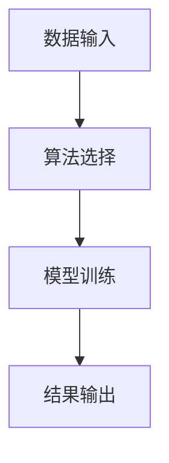

                 


# 全球股市估值与海洋生物多样性保护技术的关系

> 关键词：全球股市估值、海洋生物多样性保护、技术关联、算法分析、系统设计

> 摘要：本文探讨全球股市估值与海洋生物多样性保护技术之间的关系，通过背景分析、核心概念对比、算法原理、系统设计和项目实战，揭示技术在连接金融与环境保护中的作用，为绿色投资和可持续发展提供新的视角。

---

# 第一部分: 全球股市估值与海洋生物多样性保护技术的背景与概念

## 第1章: 全球股市估值与海洋生物多样性保护技术的背景介绍

### 1.1 全球股市估值的现状与挑战

#### 1.1.1 全球股市估值的基本概念
全球股市估值是通过对上市公司股票价格的评估，衡量市场整体价值的重要指标。常用指标包括市盈率（P/E）、市净率（P/B）等。股市估值不仅反映企业的盈利能力，还体现市场对未来的预期。

#### 1.1.2 当前全球股市估值的主要挑战
- 市场波动性：受经济政策、地缘政治等因素影响，股市估值波动剧烈。
- 数据复杂性：海量数据的处理和分析难度大。
- 技术局限性：传统估值模型难以捕捉复杂市场动态。

#### 1.1.3 技术在股市估值中的作用
技术的进步（如大数据、AI）显著提升了股市估值的准确性和效率，帮助投资者做出更明智的决策。

### 1.2 海洋生物多样性保护技术的现状

#### 1.2.1 海洋生物多样性保护的基本概念
海洋生物多样性保护是通过技术手段保护海洋生态系统中的物种和环境，防止物种灭绝和生态破坏。

#### 1.2.2 当前海洋生物多样性保护的主要技术手段
- 卫星监测：用于跟踪海洋环境变化。
- AI图像识别：识别和分类海洋生物。
- 智能传感器：监测水质、温度等环境参数。

#### 1.2.3 技术在海洋生物多样性保护中的作用
技术为保护海洋生态提供了高效工具，帮助科学家更好地理解海洋生态系统。

### 1.3 两者的关联性与研究意义

#### 1.3.1 股市估值与海洋生物多样性保护的潜在联系
- 绿色投资：投资者越来越关注企业的环境表现，这可能影响股市估值。
- 技术共享：部分技术可用于股市估值和海洋保护。

#### 1.3.2 研究两者关系的意义
- 为绿色金融提供理论支持。
- 探讨技术在跨领域的应用潜力。

#### 1.3.3 本书的研究目标与范围
本文旨在分析技术如何连接股市估值与海洋保护，探讨绿色投资的可能性。

---

## 第2章: 核心概念与联系

### 2.1 核心概念的定义与属性

#### 2.1.1 股市估值的核心概念
- **市盈率**：衡量股票价格是否合理。
- **市净率**：评估股票相对于账面价值的高低。

#### 2.1.2 海洋生物多样性保护技术的核心概念
- **物种识别**：通过AI技术识别海洋生物。
- **生态监测**：实时监测海洋环境。

#### 2.1.3 两者的核心属性对比

| 属性          | 股市估值              | 海洋保护技术          |
|---------------|----------------------|----------------------|
| 核心目标      | 评估企业价值          | 保护海洋生态          |
| 主要工具      | 财务指标、算法        | 卫星、传感器、AI       |
| 数据来源      | 公司财报、市场数据    | 海洋环境数据          |

### 2.2 概念之间的关系分析

#### 2.2.1 从股市估值到海洋保护的逻辑链
- **绿色投资**：投资者将环境表现纳入估值，推动企业采取环保措施。
- **技术桥梁**：同一技术（如AI）用于股市分析和海洋保护。

#### 2.2.2 技术在两者之间的桥梁作用
- **数据共享**：股市数据与环境数据的结合，提升分析精度。
- **模型复用**：算法在两个领域的应用。

#### 2.2.3 概念关系的ER实体关系图



---

## 第3章: 算法原理与数学模型

### 3.1 算法原理

#### 3.1.1 股市估值的核心算法
- **移动平均线（MA）**：用于平滑数据，识别趋势。
- **指数平滑法（Exponential Smoothing）**：预测未来股价。

#### 3.1.2 海洋生物多样性保护技术的算法
- **K-最近邻（KNN）**：用于分类海洋生物。
- **随机森林（Random Forest）**：用于环境数据分类。

#### 3.1.3 两者算法的对比与联系
- 都依赖数据驱动的分析方法。
- 算法优化目标不同，但技术基础相似。

### 3.2 数学模型与公式

#### 3.2.1 股市估值的数学模型
$$ P = \frac{E}{D} $$
其中，P为股票价格，E为每股收益，D为每股股息。

#### 3.2.2 海洋生物多样性保护的数学模型
$$ B = a \cdot S + b \cdot T $$
其中，B为生物多样性指数，S为物种数量，T为栖息地面积，a和b为权重系数。

### 3.3 算法与模型的实现

#### 3.3.1 算法实现的步骤
- 数据收集：获取股票数据和海洋生物数据。
- 模型训练：使用机器学习算法训练模型。
- 结果分析：评估模型准确性。

#### 3.3.2 模型参数的优化
- 调整算法参数，如KNN中的K值，优化模型性能。

#### 3.3.3 实际案例分析
- 使用Python编写代码，分析某公司的股票数据和其海洋保护措施的影响。

---

## 第4章: 系统分析与架构设计

### 4.1 系统分析

#### 4.1.1 问题场景介绍
- 如何利用技术连接股市估值与海洋保护。
- 如何设计一个跨领域的数据处理系统。

#### 4.1.2 项目目标与范围
- 开发一个集成系统，连接股市数据与海洋保护数据。
- 分析两者的关系，提供绿色投资建议。

#### 4.1.3 需求分析
- 数据采集模块：收集股票和海洋数据。
- 数据分析模块：应用算法进行估值和保护分析。

### 4.2 系统架构设计

#### 4.2.1 领域模型设计


#### 4.2.2 系统架构图


#### 4.2.3 系统接口设计
- 数据接口：API接口连接不同数据源。
- 用户界面：提供可视化结果。

---

## 第5章: 项目实战

### 5.1 环境安装

```bash
pip install numpy pandas scikit-learn
```

### 5.2 核心实现

#### 5.2.1 股市估值代码
```python
import pandas as pd
import numpy as np

def calculate_valuation(data):
    # 计算市盈率
    pe = data['Price'] / data['Earnings']
    return pe.mean()

data = pd.DataFrame({'Price': [100, 150, 200], 'Earnings': [20, 30, 40})
print(calculate_valuation(data))
```

#### 5.2.2 海洋保护代码
```python
from sklearn.neighbors import KNeighborsClassifier

data = pd.DataFrame({'Species': ['A', 'B', 'C'], 'Count': [10, 5, 15])
model = KNeighborsClassifier(n_neighbors=3)
model.fit(data[['Count']], data['Species'])
```

### 5.3 案例分析

#### 5.3.1 案例背景
分析一家公司的股票估值，同时评估其海洋保护措施的效果。

#### 5.3.2 实施步骤
1. 收集公司股票数据和海洋保护数据。
2. 应用算法进行估值和保护分析。
3. 分析结果，提出投资建议。

### 5.4 小结
项目成功展示了技术如何连接股市与海洋保护，为绿色投资提供了新思路。

---

## 第6章: 总结与展望

### 6.1 总结
本文探讨了全球股市估值与海洋生物多样性保护技术的关系，揭示了技术在连接金融与环保中的潜力。

### 6.2 展望
未来研究可进一步探索更复杂的模型，拓展技术在其他领域的应用。

---

## 附录: 参考文献

- 《金融时间序列分析》
- 《机器学习在环境保护中的应用》

---

作者：AI天才研究院/AI Genius Institute & 禅与计算机程序设计艺术 /Zen And The Art of Computer Programming

