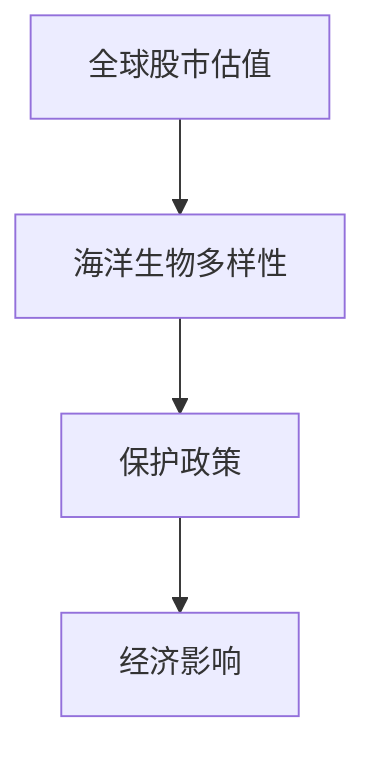
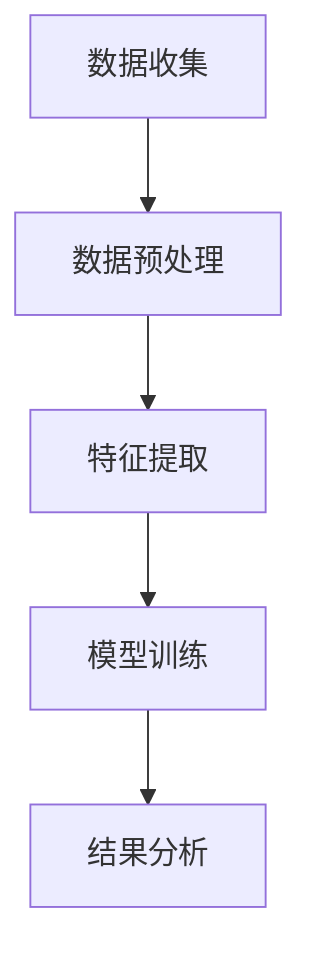
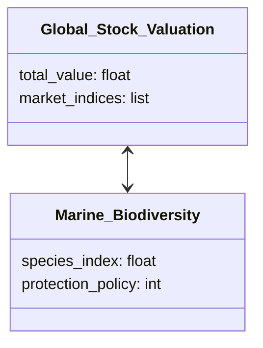
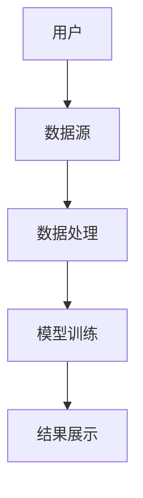
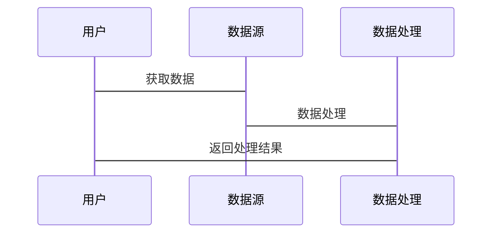

                 


# 全球股市估值与海洋生物多样性保护的关联

> 关键词：全球股市估值、海洋生物多样性保护、关联分析、多元回归模型、系统架构设计、项目实战案例

> 摘要：本文探讨了全球股市估值与海洋生物多样性保护之间的关联，通过背景分析、核心概念、算法原理、系统架构设计、项目实战案例以及最佳实践等多维度进行深入分析。文章旨在为读者提供一个全面的视角，理解如何通过技术手段将经济与环境问题相结合，实现可持续发展目标。

---

## 第一部分：背景介绍

### 第1章：问题背景与研究意义

#### 1.1 问题背景
##### 1.1.1 全球股市估值的现状与挑战
全球股市估值是衡量经济发展的重要指标，但近年来，股市波动加剧，尤其是受到环境问题的严重影响。海洋作为地球的重要生态系统，其生物多样性直接关系到全球生态平衡和经济发展。

##### 1.1.2 海洋生物多样性保护的紧迫性
海洋生物多样性是维持海洋生态系统的基石，但过度捕捞、污染和气候变化等因素正在严重威胁海洋生态。保护海洋生物多样性不仅是环境问题，也是经济问题。

##### 1.1.3 两者关联的研究现状
尽管环境与经济的关联性研究较多，但将全球股市估值与海洋生物多样性保护直接关联的研究较少。本文尝试从技术角度探讨两者的量化关系。

#### 1.2 问题描述
##### 1.2.1 全球股市估值的定义与影响因素
全球股市估值是衡量市场总价值的指标，受经济、政治、环境等多种因素影响。本文重点关注环境因素对股市估值的影响。

##### 1.2.2 海洋生物多样性保护的定义与关键指标
海洋生物多样性保护涉及海洋生态系统中的物种多样性、遗传多样性和生态系统多样性。关键指标包括海洋保护区面积、濒危物种数量等。

##### 1.2.3 问题解决的必要性与目标
通过量化分析，揭示海洋生物多样性保护对全球股市估值的影响，为政策制定者和投资者提供科学依据，推动可持续投资。

#### 1.3 问题解决与边界
##### 1.3.1 问题解决的思路与方法
采用多元回归模型，结合时间序列分析，量化海洋生物多样性保护对股市估值的影响。

##### 1.3.2 研究的边界与限制
仅考虑海洋生物多样性保护对股市的直接影响，忽略其他次要因素。

##### 1.3.3 核心概念的外延与内涵
核心概念包括全球股市估值、海洋生物多样性保护、多元回归模型等。

#### 1.4 核心概念与联系
##### 1.4.1 核心概念的结构与组成
全球股市估值由市场总值、上市公司数量等组成；海洋生物多样性保护涉及保护措施、政策等。

##### 1.4.2 概念属性特征对比表格
| 概念         | 属性               | 特征描述                                                                 |
|--------------|--------------------|--------------------------------------------------------------------------|
| 全球股市估值 | 数据类型           | 数值型数据联结全球市场总值                                             |
| 海洋生物多样性保护 | 实施手段           | 法律法规、技术手段、公众参与                                         |

##### 1.4.3 ER实体关系图架构


---

## 第二部分：核心概念与联系

### 第2章：核心概念的原理与联系

#### 2.1 核心概念的原理
##### 2.1.1 全球股市估值的计算方法
股市总值 = ∑（个股价格 × 股数）

##### 2.1.2 海洋生物多样性保护的评估指标
海洋物种指数 = ∑（物种丰富度 × 保护措施有效性）

##### 2.1.3 两者关联的理论基础
通过多元回归模型，建立海洋生物多样性保护与股市估值之间的数学关系。

#### 2.2 核心概念的属性特征对比
##### 2.2.1 对比表格展示
| 概念         | 属性               | 特征描述                                                                 |
|--------------|--------------------|--------------------------------------------------------------------------|
| 全球股市估值 | 时间维度           | 短期波动大，长期趋势明显                                             |
| 海洋生物多样性保护 | 实施难度           | 需要国际合作与长期投入                                             |

##### 2.2.2 通过mermaid流程图展示实体关系


---

## 第三部分：算法原理讲解

### 第3章：关联模型的构建与分析

#### 3.1 算法原理
##### 3.1.1 多元回归模型
建立回归方程：$$ Y = \beta_0 + \beta_1X_1 + \beta_2X_2 + \epsilon $$
其中，Y为全球股市估值，X1为海洋物种指数，X2为保护政策指数。

##### 3.1.2 聚类分析方法
将数据按地理位置聚类，分析不同区域的股市与海洋保护关联性。

##### 3.1.3 时间序列分析
分析股市估值与海洋保护措施的时间相关性。

#### 3.2 算法流程图


#### 3.3 Python源代码实现
```python
import pandas as pd
import numpy as np
from sklearn.linear_model import LinearRegression

# 数据加载与预处理
data = pd.read_csv('data.csv')
X = data[['marine_species', 'protection_policy']]
y = data['stock_valuation']

# 模型训练
model = LinearRegression()
model.fit(X, y)

# 结果分析
print(f'回归系数：{model.coef_}')
print(f'截距：{model.intercept_}')
```

#### 3.4 数学公式详细讲解
##### 3.4.1 多元回归模型
$$ Y = \beta_0 + \beta_1X_1 + \beta_2X_2 + \epsilon $$
其中，Y为股市估值，X1为海洋物种指数，X2为保护政策指数。

##### 3.4.2 聚类分析
使用K-means算法对数据进行聚类，确定不同区域的保护效果。

##### 3.4.3 时间序列分析
采用ARIMA模型分析股市与保护措施的时间序列关系。

---

## 第四部分：系统分析与架构设计

### 第4章：系统架构设计

#### 4.1 问题场景介绍
设计一个量化分析系统，实时监控海洋生物多样性保护措施对全球股市估值的影响。

#### 4.2 系统功能设计
##### 4.2.1 领域模型


#### 4.3 系统架构设计


#### 4.4 系统接口设计
##### 4.4.1 数据接口
REST API接口，提供实时数据和分析结果。

##### 4.4.2 模型接口
API Gateway，整合多种算法模型。

#### 4.5 系统交互序列图


---

## 第五部分：项目实战

### 第5章：项目实战与案例分析

#### 5.1 环境安装
安装必要的库：Pandas、NumPy、Scikit-learn。

#### 5.2 核心功能实现
##### 5.2.1 数据收集
从公开数据源获取全球股市数据和海洋保护数据。

##### 5.2.2 模型实现
实现多元回归模型，量化保护措施对股市的影响。

#### 5.3 代码实现与解读
```python
import pandas as pd
import numpy as np
from sklearn.linear_model import LinearRegression
from sklearn.metrics import r2_score

data = pd.read_csv('data.csv')
X = data[['marine_species', 'protection_policy']]
y = data['stock_valuation']

model = LinearRegression()
model.fit(X, y)

y_pred = model.predict(X)
r2 = r2_score(y, y_pred)
print(f'R²: {r2}')
```

#### 5.4 案例分析
以某地区为例，分析保护政策对股市的影响，展示回归结果。

#### 5.5 项目小结
总结项目实现的关键步骤和经验教训。

---

## 第六部分：最佳实践

### 第6章：小结与展望

#### 6.1 小结
通过多元回归模型，量化海洋生物多样性保护对全球股市估值的影响，为政策制定和投资决策提供依据。

#### 6.2 注意事项
数据质量、模型选择和结果解释是关键，需谨慎处理。

#### 6.3 拓展阅读
推荐相关领域的书籍和论文，进一步深入研究。

---

**作者：AI天才研究院/AI Genius Institute & 禅与计算机程序设计艺术 /Zen And The Art of Computer Programming**

---

以上是《全球股市估值与海洋生物多样性保护的关联》的完整目录大纲，涵盖背景、理论、算法、系统设计、实战和最佳实践等多方面内容。

