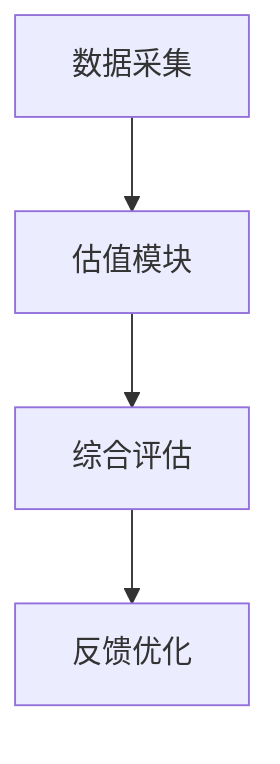
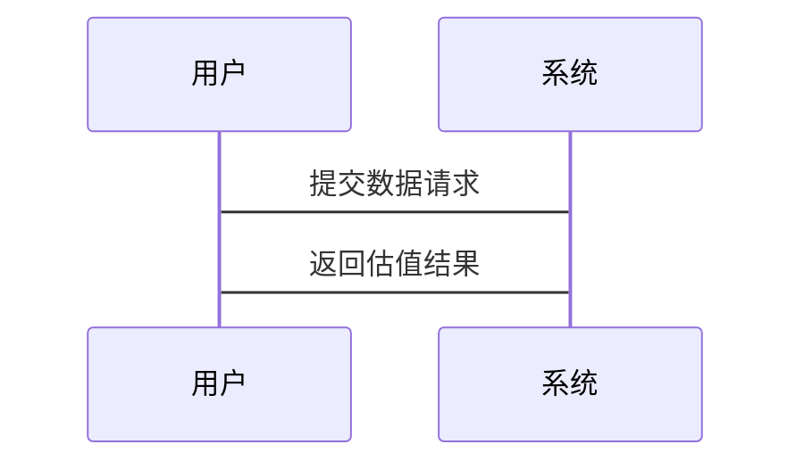

                 


```markdown
# 全球股市估值与海洋生物多样性基因库建设的关系

> 关键词：全球股市估值、海洋生物多样性、基因库建设、经济与生态、可持续发展

> 摘要：本文探讨了全球股市估值与海洋生物多样性基因库建设之间的潜在联系，分析了股市估值的核心概念与数学模型，以及基因库建设的关键要素。通过系统分析与架构设计，提出了将两者结合的创新方法，并通过具体案例展示了如何通过技术手段实现双重目标的可持续发展。

---

## 第一部分: 背景介绍

### 第1章: 全球股市估值与海洋生物多样性概述

#### 1.1 全球股市估值的现状与挑战
##### 1.1.1 全球股市估值的基本概念
股市估值是通过对公司财务数据和市场表现的分析，评估其股票的内在价值。常用指标包括市盈率（P/E）、市净率（P/B）等。股市估值不仅反映了企业的盈利能力，还体现了市场对未来的预期。

##### 1.1.2 当前全球股市估值的主要挑战
- 经济不确定性：全球疫情、地缘政治冲突等外部因素对股市估值的影响显著。
- 技术变革：新兴技术和产业转型对企业估值带来新的挑战。
- 数据复杂性：海量数据的处理与分析需要更高效的技术支持。

##### 1.1.3 股市估值与经济发展的关系
股市不仅是资金流动的平台，更是经济发展的重要晴雨表。股市估值的波动直接影响投资者信心和经济发展。

#### 1.2 海洋生物多样性基因库建设的现状
##### 1.2.1 海洋生物多样性的定义与重要性
海洋生物多样性是指海洋生态系统中所有生物的多样性，包括基因、物种和生态系统三个层次。它是维持海洋生态系统功能和生产力的基础。

##### 1.2.2 基因库建设的现状与技术进展
基因库建设是通过收集、保存和研究海洋生物的遗传信息，为生物多样性保护和利用提供技术支持。目前，基因编辑技术（如CRISPR）和大数据分析技术在基因库建设中得到广泛应用。

##### 1.2.3 海洋生物多样性保护的全球趋势
全球范围内，海洋生物多样性的保护已成为国际共识。《巴黎协定》和《生物多样性公约》等国际协议为海洋生态保护提供了框架。

#### 1.3 股市估值与海洋生物多样性基因库建设的关系
##### 1.3.1 两者关系的初步探讨
股市估值与海洋生物多样性看似关联性不大，但通过可持续发展和绿色投资的视角，两者可以建立联系。

##### 1.3.2 全球经济与生态系统的相互影响
全球经济活动对海洋生态系统的影响日益显著，而海洋生态系统的健康又反过来影响全球经济的稳定性。

##### 1.3.3 可持续发展视角下的双重目标
在可持续发展理念下，股市估值需要考虑企业的环境影响，而海洋生物多样性基因库建设则是保护环境的重要手段。两者的结合是实现经济与生态平衡的关键。

---

## 第二部分: 核心概念与数学模型

### 第2章: 全球股市估值的核心概念与数学模型

#### 2.1 股市估值的基本原理
##### 2.1.1 股票估值的定义与方法
股票估值是通过对公司财务数据的分析，估算其股票的内在价值。常用方法包括DCF模型（现金流折现法）和相对估值法（市盈率、市净率等）。

##### 2.1.2 股市估值的关键影响因素
- 财务数据：收入、利润、资产负债情况等。
- 市场因素：整体市场走势、行业趋势等。
- 宏观经济：利率、通货膨胀、政策环境等。

##### 2.1.3 股市估值的数学模型
**现金流折现模型（DCF模型）：**
$$ V = \sum_{t=1}^{n} \frac{CF_t}{(1+r)^t} + \frac{TV}{(1+r)^n} $$
其中，$CF_t$为第t年的现金流，$r$为贴现率，$TV$为终值。

#### 2.2 海洋生物多样性基因库建设的核心要素
##### 2.2.1 基因库建设的目标与原则
基因库建设的目标是保护海洋生物多样性，支持科学研究和可持续利用。其原则包括多样性、代表性和可持续性。

##### 2.2.2 基因多样性与生态系统功能的关系
基因多样性是生物多样性的基础，直接关系到生态系统的稳定性和生产力。

##### 2.2.3 基因库建设的技术与伦理挑战
- 技术挑战：基因编辑技术的精准性与成本问题。
- 伦理挑战：基因资源的公平利用与知识产权保护。

#### 2.3 股市估值与基因库建设的数学模型对比
##### 2.3.1 股市估值模型的数学表达
股票估值的DCF模型：
$$ V = \sum_{t=1}^{n} \frac{CF_t}{(1+r)^t} + \frac{TV}{(1+r)^n} $$

##### 2.3.2 基因库建设的数学模型
基因多样性指数（Genetic Diversity Index, GDI）：
$$ GDI = \frac{\sum_{i=1}^{n} \frac{1}{(1+p_i)}}{N} $$
其中，$p_i$为第i个基因的频率，$N$为基因总数。

##### 2.3.3 两者模型的异同点分析
- **相同点**：两者都需要数学模型进行预测和优化。
- **不同点**：股市估值模型注重经济价值，基因库模型注重生态价值。

---

## 第三部分: 系统分析与架构设计

### 第3章: 股市估值与基因库建设的系统分析与架构设计

#### 3.1 系统分析与问题场景
##### 3.1.1 股市估值与基因库建设的双重目标
- 经济目标：通过股市估值实现资本优化配置。
- 生态目标：通过基因库建设保护海洋生物多样性。

##### 3.1.2 系统分析的方法与工具
- 数据流分析：识别系统中的数据流动。
- 模块化分析：将系统划分为功能模块。

##### 3.1.3 系统分析的挑战与解决方案
- 数据复杂性：采用大数据分析技术。
- 跨学科融合：组建多学科团队。

#### 3.2 系统架构设计
##### 3.2.1 系统架构的模块划分
- 数据采集模块：收集股市数据和基因数据。
- 估值模块：进行股市估值和基因多样性评估。
- 综合评估模块：实现经济与生态的双重评估。

##### 3.2.2 数据流与信息交互设计
- 数据从采集模块流向估值模块和综合评估模块。
- 综合评估结果反馈至数据采集模块，优化数据采集策略。

##### 3.2.3 系统架构的Mermaid图展示


#### 3.3 系统接口与交互设计
##### 3.3.1 系统接口的设计原则
- 标准化：接口设计遵循行业标准。
- 可扩展性：接口设计支持功能扩展。

##### 3.3.2 用户与系统的交互流程
- 用户输入需求，系统进行数据处理并返回结果。

##### 3.3.3 系统交互的Mermaid序列图展示


---

## 第四部分: 项目实战

### 第4章: 股市估值与基因库建设的项目实战

#### 4.1 项目介绍
##### 4.1.1 项目目标
通过技术手段实现股市估值与基因库建设的双重优化。

##### 4.1.2 项目范围
选取特定区域的股市和海洋生态系统进行分析。

#### 4.2 系统核心实现
##### 4.2.1 数据采集与预处理
- 数据来源：公开的股市数据和海洋生物数据。
- 数据清洗：去除无效数据，处理异常值。

##### 4.2.2 核心算法实现
- 股市估值算法：基于改进的DCF模型。
- 基因多样性评估算法：优化的GDI指数计算。

##### 4.2.3 系统实现代码示例
```python
def calculate_stock_value(cf, r, n, tv):
    return sum(cf / (1 + r)**t for t in range(1, n+1)) + tv / (1 + r)**n

def calculate_genetic_diversity(gene_frequencies, n):
    return sum(1 / (1 + p) for p in gene_frequencies) / n
```

#### 4.3 实际案例分析
##### 4.3.1 案例背景
选取某个地区的股市和海洋生态系统进行分析。

##### 4.3.2 数据分析与结果展示
- 股市估值结果：通过DCF模型计算出目标公司的股票价值。
- 基因多样性评估结果：通过GDI指数评估海洋生物多样性。

##### 4.3.3 结果解读与优化建议
- 根据评估结果，提出优化股市投资和海洋生态保护的建议。

#### 4.4 项目小结
##### 4.4.1 项目成果
实现了股市估值与基因库建设的双重优化。

##### 4.4.2 经验总结
- 数据质量对结果影响显著，需重视数据采集与处理。
- 跨学科融合是解决复杂问题的关键。

---

## 第五部分: 总结与展望

### 第5章: 总结与展望

#### 5.1 双重目标的实现
通过技术手段实现股市估值与基因库建设的双重优化，为可持续发展提供新思路。

#### 5.2 未来研究方向
##### 5.2.1 技术创新
探索更高效的数据分析方法和算法优化。

##### 5.2.2 应用拓展
将双重优化方法推广至其他领域，如农业、能源等。

##### 5.2.3 政策建议
制定相关政策，推动经济与生态的协调发展。

#### 5.3 结论
股市估值与基因库建设的结合不仅是技术上的创新，更是可持续发展理念的重要实践。

---

## 作者：AI天才研究院/AI Genius Institute & 禅与计算机程序设计艺术 /Zen And The Art of Computer Programming
```

