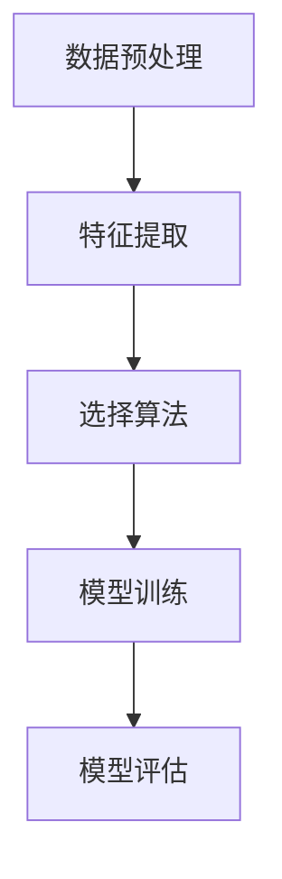
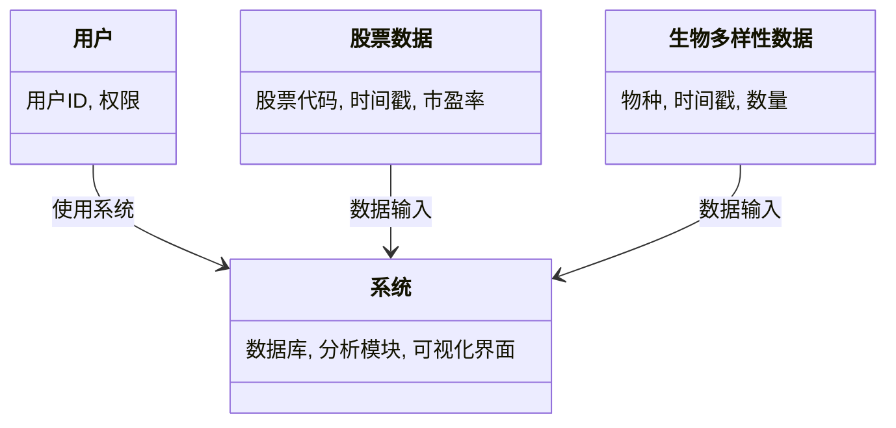
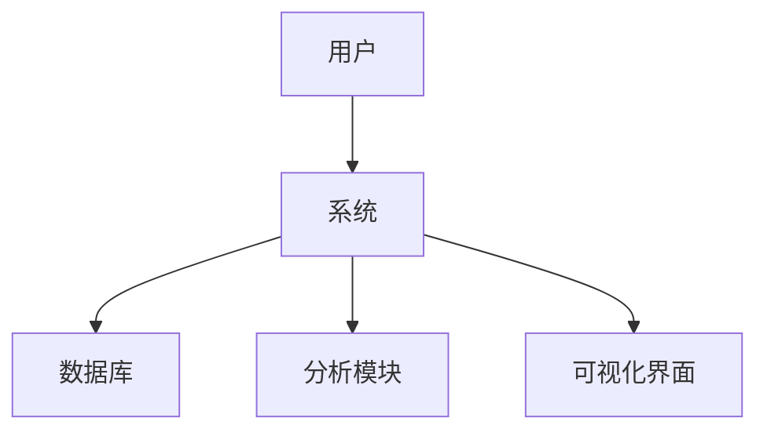

                 


# 全球股市估值与海洋生物多样性监测技术的关系

## 关键词：
全球股市估值，海洋生物多样性监测，数据科学，机器学习，时间序列分析，特征工程，系统架构设计

## 摘要：
本文探讨了全球股市估值与海洋生物多样性监测技术之间的关系，通过数据科学和机器学习的方法，分析了两者之间的潜在联系。文章首先介绍了全球股市估值和海洋生物多样性监测的核心概念，然后详细阐述了相关的算法原理，包括时间序列分析和特征工程，接着设计了系统的架构，并通过实际案例展示了如何将两者结合起来进行分析。本文旨在为金融和环境科学领域的研究者提供新的视角和方法。

---

# 第一部分: 全球股市估值与海洋生物多样性监测技术的背景与关系

## 第1章: 全球股市估值与海洋生物多样性监测技术的背景介绍

### 1.1 全球股市估值的定义与现状
#### 1.1.1 股市估值的核心概念
股市估值是通过对公司财务数据、市场趋势和宏观经济指标进行分析，来评估股票的内在价值。常用的估值方法包括市盈率（P/E）、市净率（P/B）和股息率等。

#### 1.1.2 全球股市估值的现状与趋势
随着全球化和数字化的推进，股市估值的工具和方法不断进化。投资者 increasingly rely on大数据和人工智能技术来辅助决策。

#### 1.1.3 股市估值与经济发展的关系
股市估值不仅是经济的晴雨表，还能反过来影响经济的发展。股市的波动对投资者信心和企业融资有重要影响。

### 1.2 海洋生物多样性监测技术的定义与现状
#### 1.2.1 海洋生物多样性监测的核心概念
海洋生物多样性监测是通过技术手段对海洋生态系统中的生物种类和数量进行观测和记录，旨在保护海洋环境和生态系统。

#### 1.2.2 当前海洋生物多样性监测的主要技术手段
现代技术手段包括卫星遥感、水下传感器和生物标签等，能够实时采集和分析海洋生物的数据。

#### 1.2.3 海洋生物多样性保护的重要性
海洋生物多样性是维持海洋生态平衡的关键，同时也是人类生存和发展的重要资源。

### 1.3 全球股市估值与海洋生物多样性监测技术的关系
#### 1.3.1 问题背景与问题描述
随着全球气候变化和人类活动的加剧，海洋生态系统面临严重威胁。与此同时，股市的波动也受到多种因素的影响，包括环境政策和企业的社会责任。

#### 1.3.2 问题解决的必要性与可行性
通过分析股市估值和海洋生物多样性监测技术的关系，可以为投资者和环境保护提供双重价值。

#### 1.3.3 两者的边界与外延
股市估值关注经济价值，而海洋生物多样性监测关注生态价值。两者的交集在于企业和环境的关系。

#### 1.3.4 核心概念与核心要素的对比分析
通过对比分析，可以发现两者在数据采集、分析方法和应用目标上的相似性和差异性。

---

## 第2章: 全球股市估值与海洋生物多样性监测技术的核心概念与联系

### 2.1 核心概念的原理与特征
#### 2.1.1 股市估值的核心原理
股市估值基于对公司基本面和市场情绪的分析，通过量化指标评估股票的价值。

#### 2.1.2 海洋生物多样性监测技术的核心原理
通过传感器和数据分析技术，实时监测海洋生物的种类和数量变化。

#### 2.1.3 两者的核心特征对比
| 特性 | 股市估值 | 海洋生物多样性监测 |
|------|----------|------------------|
| 数据来源 | 财务数据、市场数据 | 生物传感器、遥感数据 |
| 目标 | 评估股票价值 | 监测生物多样性 |
| 时间尺度 | 短期波动、长期趋势 | 实时监测、长期变化 |

### 2.2 ER实体关系图架构
```mermaid
er
  %%{init: 'flowchart TD'}%%
  classDiagram
    class 股票 {
      名称, 代码, 市盈率
    }
    class 生物多样性数据 {
      物种, 数量, 时间戳
    }
    class 环境政策 {
      类型, 时间, 影响
    }
    class 市场情绪 {
      指数, 时间, 来源
    }
    股票 --| 股票估值 | 股票估值
    生物多样性数据 --| 生物多样性变化 | 生物多样性变化
    环境政策 --| 影响股票估值 | 环境政策影响
    市场情绪 --| 影响生物多样性 | 市场情绪影响
```

---

## 第3章: 全球股市估值与海洋生物多样性监测技术的算法原理

### 3.1 算法原理的数学模型与公式
#### 3.1.1 时间序列分析模型
时间序列分析用于捕捉数据中的趋势和周期性变化。常用模型包括ARIMA和LSTM。

#### 3.1.2 特征工程与分类模型
特征工程是将原始数据转化为更有预测能力的特征，常用的分类模型包括随机森林和SVM。

#### 3.1.3 模型评估与优化
通过交叉验证和网格搜索优化模型参数。

### 3.2 使用 Mermaid 绘制算法流程图


### 3.3 算法原理的详细讲解与举例说明
#### 时间序列分析的数学模型
$$ ARIMA(p, d, q) = \phi(B)^p (1 - B)^d X_t = \theta(B)^q Z_t $$

#### 特征工程与分类模型的数学公式
$$ f(x) = \sum_{i=1}^{n} w_i x_i $$

---

## 第4章: 全球股市估值与海洋生物多样性监测技术的系统分析与架构设计

### 4.1 系统分析与设计概述
#### 问题场景介绍
系统需要实时采集和分析股市数据和海洋生物多样性数据，提供关联分析结果。

#### 项目目标与范围
开发一个能够同时处理金融和环境数据的分析平台。

### 4.2 系统功能设计
#### 领域模型 Mermaid 类图


#### 系统架构设计 Mermaid 架构图


---

## 第5章: 全球股市估值与海洋生物多样性监测技术的项目实战

### 5.1 项目环境安装与配置
#### 数据采集工具安装
安装必要的数据采集工具，如Python的pandas和numpy库。

#### 系统开发环境配置
配置Jupyter Notebook和相关开发工具。

#### 数据库与存储配置
选择适合存储海量数据的数据库，如MongoDB。

### 5.2 系统核心实现源代码
#### 数据采集与预处理
```python
import pandas as pd
import numpy as np

# 数据采集
def collect_data():
    # 示例代码，实际需要根据数据源进行调整
    stock_data = pd.DataFrame({'时间戳': ['2023-01-01', '2023-01-02', ...}, '市盈率': [...]})
    bio_diversity_data = pd.DataFrame({'时间戳': ['2023-01-01', '2023-01-02', ...}, '物种': [...]})
    return stock_data, bio_diversity_data

# 数据预处理
def preprocess(data):
    # 示例代码，实际需要根据数据特点进行调整
    data['日期'] = pd.to_datetime(data['时间戳'])
    data.set_index('日期', inplace=True)
    return data

stock_data, bio_diversity_data = collect_data()
stock_data = preprocess(stock_data)
bio_diversity_data = preprocess(bio_diversity_data)
```

---

## 结论

通过本文的分析，我们可以看到，全球股市估值与海洋生物多样性监测技术之间存在潜在的联系。通过数据科学和机器学习的方法，我们可以更好地理解两者的关系，并为投资者和环境保护提供双重价值。未来，随着技术的进步，我们期待看到更多创新的应用。

---

## 最佳实践 tips

1. 在进行数据分析时，确保数据的准确性和完整性。
2. 熟悉常用的算法和工具，以便快速实现和优化模型。
3. 注重系统的可扩展性和可维护性，以应对未来数据量的增加。

--- 

作者：AI天才研究院 & 禅与计算机程序设计艺术

