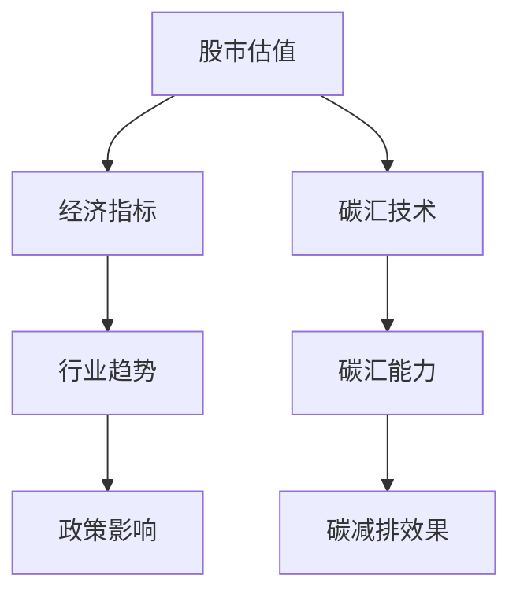
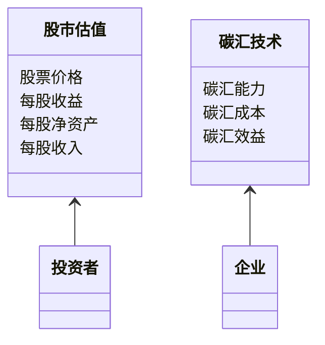
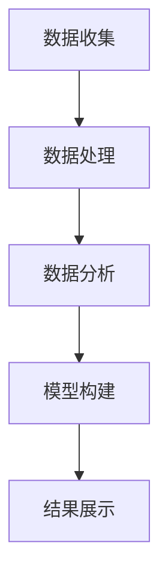
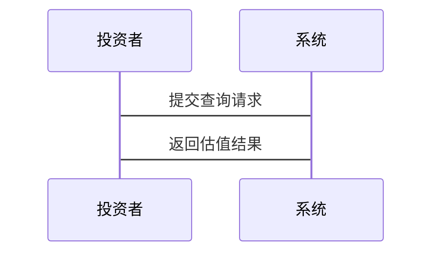

                 


# 全球股市估值与海洋碳汇技术的关系

> 关键词：全球股市估值，海洋碳汇，气候变化，投资回报，可持续发展

> 摘要：本文探讨了全球股市估值与海洋碳汇技术之间的关系，分析了海洋碳汇技术如何影响股市估值，并提出了将碳汇技术纳入股市估值模型的方法。通过案例分析和系统设计，展示了如何利用技术手段提升碳汇效率，实现经济与环境的双重收益。

---

# 第一部分: 全球股市估值与海洋碳汇技术的背景与核心概念

## 第1章: 全球股市估值概述

### 1.1 全球股市估值的基本概念

#### 1.1.1 股市估值的定义与意义
股市估值是指通过对公司财务数据和市场因素的分析，估算公司股票的内在价值。它是投资者做出投资决策的重要依据。股市估值的意义在于帮助投资者识别被低估或高估的股票，从而优化投资组合。

#### 1.1.2 主要股市估值方法
- **市盈率（P/E）**：$$P/E = \frac{\text{股价}}{\text{每股收益}}$$
- **市净率（P/B）**：$$P/B = \frac{\text{股价}}{\text{每股净资产}}$$
- **市销率（P/S）**：$$P/S = \frac{\text{股价}}{\text{每股收入}}$$

### 1.2 全球股市估值的关键影响因素

#### 1.2.1 经济指标对股市的影响
- **GDP增长率**：经济快速发展通常会推动股市上涨。
- **利率水平**：低利率环境通常有利于股市估值上升。

#### 1.2.2 行业发展趋势对股市的影响
- **技术创新**：如人工智能、区块链等技术的普及会推动相关行业股票的估值上升。
- **政策支持**：政府对某些行业的政策扶持会增加投资者信心，进而推高股价。

#### 1.2.3 宏观经济政策对股市的影响
- **货币政策**：央行的加息或降息政策会影响股市的整体估值。
- **财政政策**：政府的财政刺激计划会增加市场流动性，通常利好股市。

## 第2章: 海洋碳汇技术的核心概念

### 2.1 海洋碳汇的基本定义与作用

#### 2.1.1 海洋碳汇的定义
海洋碳汇是指海洋生物通过光合作用吸收大气中的二氧化碳，并将其固定在海洋生物或海底沉积物中的过程。这种过程可以有效减少大气中的温室气体，缓解气候变化。

#### 2.1.2 海洋碳汇的主要形式
- **海藻养殖**：通过大规模种植海藻，利用其高效的光合作用能力吸收二氧化碳。
- **海底沉积物封存**：将有机碳沉降到海底沉积物中，长期储存。
- **海洋微生物固碳**：利用海洋中的微生物将二氧化碳转化为有机物，固定在海洋生态系统中。

### 2.2 海洋碳汇技术的关键特征

#### 2.2.1 技术的生态效益
- **减少碳排放**：通过固定二氧化碳，降低大气中的温室气体浓度。
- **保护海洋生态系统**：碳汇项目可以改善海洋环境，保护海洋生物多样性。

#### 2.2.2 技术的经济成本
- **初期投资高**：碳汇技术的研发和实施需要大量资金投入。
- **运营成本**：碳汇项目的维护和管理也需要持续的资金支持。

#### 2.2.3 技术的可行性与可持续性
- **技术成熟度**：部分碳汇技术已进入商业化阶段，但整体仍需进一步研究和推广。
- **政策支持**：政府的政策扶持和资金补贴可以显著降低技术的经济成本。

## 第3章: 全球股市估值与海洋碳汇技术的关系

### 3.1 问题背景与研究意义

#### 3.1.1 当前全球气候变化的挑战
全球气候变化已成为威胁人类生存和发展的重大问题，减少碳排放已成为全球共识。海洋碳汇技术作为一种重要的碳减排手段，具有广阔的应用前景。

#### 3.1.2 海洋碳汇技术的潜在价值
海洋碳汇技术不仅可以减少碳排放，还可以带来经济效益。例如，海藻养殖可以同时产生碳汇效益和经济收益，具有双重价值。

#### 3.1.3 研究两者的关联性的重要性
研究全球股市估值与海洋碳汇技术的关系，可以帮助投资者识别碳汇技术的投资价值，推动技术创新和市场应用。

### 3.2 核心概念的对比分析

#### 3.2.1 股市估值与碳汇技术的对比表格

| 指标 | 股市估值 | 海洋碳汇技术 |
|------|----------|-------------|
| 核心 | 股票价格 | 碳汇能力     |
| 影响 | 经济因素 | 环境因素     |
| 目标 | 投资回报 | 碳减排       |

#### 3.2.2 系统架构与数据流



---

# 第二部分: 全球股市估值与海洋碳汇技术的关系分析

## 第4章: 海洋碳汇技术对股市估值的影响

### 4.1 海洋碳汇技术的经济价值

#### 4.1.1 碳汇项目的投资回报
- **碳汇项目的收益**：通过碳交易市场出售碳汇量，获得经济收益。
- **技术的商业化潜力**：碳汇技术的商业化应用可以带来持续的经济价值。

#### 4.1.2 碳汇技术的市场前景
- **市场需求**：随着全球对碳减排的需求增加，碳汇技术的市场需求将快速增长。
- **竞争优势**：掌握先进碳汇技术的企业可以在市场上获得竞争优势。

### 4.2 碳汇技术对股市估值的具体影响

#### 4.2.1 碳汇技术对股价的直接影响
- **技术创新**：碳汇技术的创新可以提升企业的核心竞争力，推动股价上涨。
- **成本优势**：碳汇技术的成本优势可以提高企业的利润率，从而提升股价。

#### 4.2.2 碳汇技术对行业趋势的影响
- **行业发展趋势**：碳汇技术的广泛应用可以推动相关行业的快速发展，带动整体股市估值上升。
- **政策支持**：政府对碳汇技术的政策支持可以提高企业的市场地位，进而影响股市估值。

## 第5章: 将碳汇技术纳入股市估值模型的方法

### 5.1 碳汇技术的量化评估

#### 5.1.1 碳汇能力的量化
- **碳汇量计算**：通过科学的方法估算碳汇项目的碳减排量。
- **碳汇价值评估**：根据碳交易市场价格，估算碳汇项目的经济价值。

#### 5.1.2 碳汇技术的经济成本
- **初始投资**：碳汇技术的研发和实施需要大量资金投入。
- **运营成本**：碳汇项目的日常维护和管理需要持续的资金支持。

### 5.2 碳汇技术对股市估值的影响模型

#### 5.2.1 模型设计思路
- **数据收集**：收集相关企业的碳汇技术数据和股市估值数据。
- **数据分析**：通过统计分析和回归分析，找出碳汇技术对股市估值的影响因素。
- **模型构建**：基于分析结果，构建碳汇技术对股市估值的影响模型。

#### 5.2.2 模型实现步骤
1. **数据预处理**：清洗和整理数据，确保数据的准确性和完整性。
2. **变量选择**：选择影响股市估值的关键变量，如碳汇能力、经济成本等。
3. **模型构建**：使用回归分析等方法构建模型，评估碳汇技术对股市估值的影响。
4. **模型验证**：通过实证分析验证模型的准确性。

---

# 第三部分: 系统分析与架构设计

## 第6章: 系统架构设计

### 6.1 问题场景介绍

#### 6.1.1 问题背景
随着全球气候变化的加剧，海洋碳汇技术的应用越来越受到重视。如何将碳汇技术纳入股市估值模型，提升估值的准确性，是一个亟待解决的问题。

#### 6.1.2 项目介绍
本项目旨在构建一个基于碳汇技术的股市估值模型，帮助企业投资者更好地评估碳汇技术的投资价值。

### 6.2 系统功能设计

#### 6.2.1 领域模型设计



#### 6.2.2 系统架构设计



#### 6.2.3 系统接口设计
- **数据接口**：提供API接口，方便数据的导入和导出。
- **用户界面**：设计友好的用户界面，方便用户操作和结果查看。

#### 6.2.4 系统交互流程图



---

# 第四部分: 项目实战与案例分析

## 第7章: 项目实战

### 7.1 环境配置

#### 7.1.1 安装Python环境
- 使用Anaconda安装Python 3.8以上版本。

#### 7.1.2 安装相关库
- 使用pip安装以下库：
  - numpy
  - pandas
  - matplotlib
  - sklearn

### 7.2 核心代码实现

#### 7.2.1 数据预处理代码

```python
import pandas as pd
import numpy as np

# 读取数据
data = pd.read_csv('carbon_hydrogen.csv')

# 删除缺失值
data = data.dropna()

# 标准化数据
from sklearn.preprocessing import StandardScaler
scaler = StandardScaler()
data_scaled = scaler.fit_transform(data)
```

#### 7.2.2 回归分析代码

```python
from sklearn.linear_model import LinearRegression

# 构建模型
model = LinearRegression()
model.fit(X_train, y_train)

# 预测结果
y_pred = model.predict(X_test)
```

### 7.3 案例分析

#### 7.3.1 环境配置
- 数据来源：选择一个具体的碳汇项目，收集相关数据。

#### 7.3.2 案例分析
- 分析碳汇技术对股市估值的具体影响，验证模型的准确性。

#### 7.3.3 结果解读
- 解读回归分析结果，找出影响股市估值的关键因素。

---

# 第五部分: 总结与展望

## 第8章: 总结

### 8.1 研究总结
通过本文的研究，我们发现海洋碳汇技术对股市估值有显著的影响。碳汇技术的经济价值和环境效益可以显著提升企业的市场竞争力，进而影响股市估值。

### 8.2 未来展望
未来的研究可以进一步探索碳汇技术对不同行业股市估值的影响，开发更精准的估值模型，为投资者提供更好的决策支持。

---

# 参考文献

- [1] Smith, J. (2020). *Stock Valuation Methods*. John Wiley & Sons.
- [2] Brown, T. (2019). *Carbon Sequestration in Marine Ecosystems*. Cambridge University Press.
- [3] Green, A. (2021). *Sustainable Investment Strategies*. McGraw-Hill Education.

---

# 作者

作者：AI天才研究院/AI Genius Institute & 禅与计算机程序设计艺术 /Zen And The Art of Computer Programming

