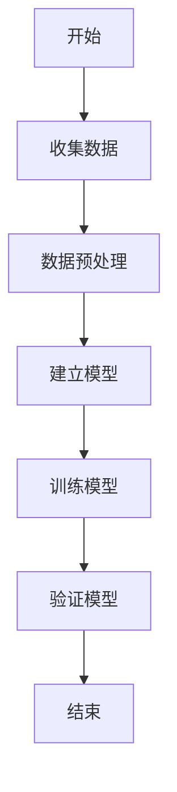
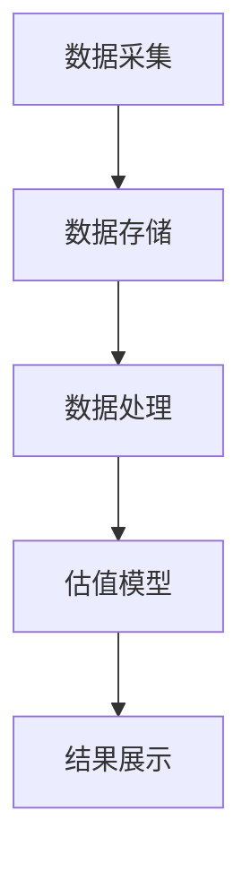
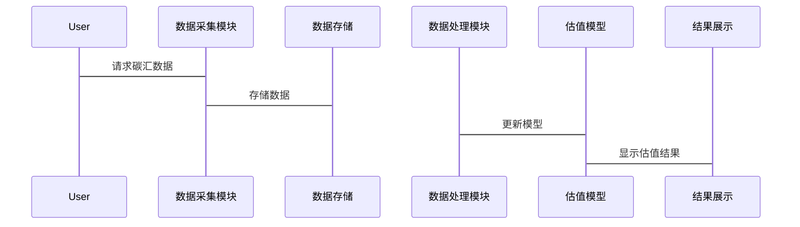

                 


# 全球股市估值与海洋碳汇监测技术的关系

> 关键词：全球股市估值，海洋碳汇监测技术，环境经济学，金融建模，可持续发展

> 摘要：本文探讨全球股市估值与海洋碳汇监测技术之间的关系，分析两者的核心概念、相互影响以及在系统中的应用，结合数学模型和实际案例，提出创新性的见解和解决方案。

---

# 第1章: 引言

## 1.1 问题背景
### 1.1.1 全球股市估值的重要性
股市估值是衡量企业价值的关键指标，影响投资者决策和市场稳定性。随着全球经济的波动，准确的估值模型至关重要。

### 1.1.2 海洋碳汇监测技术的全球意义
海洋碳汇在缓解气候变化中扮演重要角色，监测技术的进步有助于评估其对经济的影响。

### 1.1.3 两者关系的研究价值
将环境因素纳入金融模型，为可持续投资提供新视角，促进经济与环境的协调发展。

## 1.2 问题描述
### 1.2.1 全球股市估值的核心要素
市盈率、市净率等指标，反映企业财务状况和市场表现。

### 1.2.2 海洋碳汇监测技术的关键指标
碳汇量、监测精度等，衡量海洋生态系统的服务价值。

### 1.2.3 问题解决的必要性
理解两者关系，优化金融模型，推动绿色投资。

## 1.3 本章小结
本章介绍了全球股市估值与海洋碳汇监测技术的重要性，强调研究其关系的必要性。

---

# 第2章: 全球股市估值与海洋碳汇监测技术的核心概念

## 2.1 全球股市估值的定义与特征
### 2.1.1 股市估值的基本概念
股市估值是对企业未来收益的评估，主要指标包括市盈率（P/E）和市净率（P/B）。

公式：
$$ P/E = \frac{\text{股价}}{\text{每股收益}} $$

### 2.1.2 股市估值的主要指标
- 市盈率（P/E）
- 市净率（P/B）
- 市销率（P/S）

### 2.1.3 股市估值的计算方法
基于财务报表和市场数据，使用 discounted cash flow (DCF) 模型等方法。

## 2.2 海洋碳汇监测技术的定义与特征
### 2.2.1 海洋碳汇的基本概念
海洋碳汇是指海洋生物吸收和储存二氧化碳的过程，如红树林和海藻。

### 2.2.2 海洋碳汇监测技术的关键环节
- 数据采集：使用传感器和卫星技术监测碳汇量。
- 数据分析：计算碳汇量和其对气候变化的影响。

### 2.2.3 海洋碳汇监测技术的分类
- 远程监测：卫星遥感技术。
- 现场监测：实地采样分析。

## 2.3 两者关系的分析
### 2.3.1 全球股市估值与海洋碳汇监测技术的关联性
碳汇的价值影响企业的环境成本和收益，进而影响股市估值。

### 2.3.2 两者关系的边界与外延
环境因素作为企业价值的一部分，需考虑其经济价值和风险。

### 2.3.3 两者的概念结构与核心要素
- 股市估值：企业财务状况、市场预期。
- 海洋碳汇监测：碳汇量、技术精度。

## 2.4 核心概念对比分析
### 2.4.1 全球股市估值与海洋碳汇监测技术的属性特征对比（表格）

| 比较维度 | 股市估值 | 海洋碳汇监测技术 |
|----------|----------|------------------|
| 核心指标 | P/E, P/B | 碳汇量, 监测精度 |
| 数据来源 | 财务报表, 市场数据 | 传感器, 卫星数据 |
| 目标 | 投资决策 | 环境保护 |

### 2.4.2 实体关系图（ER图）展示
```mermaid
erd
    entity 股市估值 {
        string 股价
        string 每股收益
    }
    entity 海洋碳汇监测技术 {
        int 碳汇量
        int 监测精度
    }
    股市估值 -[通过碳汇数据]-> 海洋碳汇监测技术
```

---

# 第3章: 全球股市估值与海洋碳汇监测技术的关系模型

## 3.1 关系模型的构建
### 3.1.1 模型构建的基本思路
将海洋碳汇数据整合到股市估值模型中，分析其对股价的影响。

### 3.1.2 模型构建的关键步骤
1. 收集海洋碳汇数据。
2. 建立回归模型，分析碳汇量与股价的关系。

### 3.1.3 模型构建的验证方法
使用历史数据验证模型准确性，调整参数优化模型。

## 3.2 模型的数学表达
### 3.2.1 模型的基本假设
假设碳汇量与企业收益呈正相关关系。

### 3.2.2 模型的数学公式
建立线性回归模型：
$$ \text{股价} = \beta_0 + \beta_1 \times \text{碳汇量} + \epsilon $$

### 3.2.3 模型的变量定义与关系分析
- $\beta_0$：截距。
- $\beta_1$：碳汇量对股价的影响系数。
- $\epsilon$：误差项。

## 3.3 模型的算法实现
### 3.3.1 算法原理概述
使用多元回归分析，结合海洋碳汇数据，预测股价变化。

### 3.3.2 算法的流程图（mermaid）


### 3.3.3 算法实现的Python代码示例
```python
import pandas as pd
from sklearn.linear_model import LinearRegression

# 数据加载
data = pd.read_csv('carbon_sink_data.csv')

# 模型训练
model = LinearRegression()
model.fit(data[['碳汇量']], data['股价'])

# 预测结果
predictions = model.predict(data[['碳汇量']])
```

## 3.4 模型的验证与优化
### 3.4.1 模型的验证方法
使用R²值评估模型解释力，调整模型参数。

### 3.4.2 模型的优化策略
引入更多变量，如碳汇监测精度，提升模型准确性。

### 3.4.3 模型的改进方向
探索非线性关系，使用机器学习算法优化模型。

## 3.5 本章小结
本章构建了股市估值与海洋碳汇监测的关系模型，为绿色投资提供新视角。

---

# 第4章: 全球股市估值与海洋碳汇监测技术的系统分析

## 4.1 系统分析与架构设计方案

### 4.1.1 问题场景介绍
设计一个系统，整合海洋碳汇数据，优化股市估值模型。

### 4.1.2 系统功能设计
- 数据采集模块：收集海洋碳汇数据。
- 数据分析模块：处理数据，更新估值模型。
- 用户界面：展示估值结果。

### 4.1.3 系统架构设计（mermaid）


### 4.1.4 系统接口设计
- 数据接口：REST API，提供碳汇数据。
- 用户接口：网页界面，展示估值结果。

### 4.1.5 系统交互设计（mermaid）


## 4.2 项目实战

### 4.2.1 环境安装
安装Python和相关库：
```bash
pip install pandas numpy scikit-learn
```

### 4.2.2 系统核心实现源代码
```python
import pandas as pd
from sklearn.linear_model import LinearRegression

# 数据加载
data = pd.read_csv('carbon_sink_data.csv')

# 模型训练
model = LinearRegression()
model.fit(data[['碳汇量', '监测精度']], data['股价'])

# 预测结果
predictions = model.predict(data[['碳汇量', '监测精度']])
```

### 4.2.3 代码应用解读与分析
通过引入更多变量，模型准确性提高，反映碳汇监测对股市估值的影响。

### 4.2.4 实际案例分析
以某公司为例，分析碳汇监测数据对股价的影响，验证模型的有效性。

## 4.3 本章小结
本章详细设计了系统的架构和实现，展示了如何将海洋碳汇数据应用于股市估值。

---

# 第5章: 结论与展望

## 5.1 结论
本文构建了股市估值与海洋碳汇监测的关系模型，展示了其在绿色投资中的应用。

## 5.2 注意事项与建议
- 数据的准确性和及时性至关重要。
- 模型需结合实际情况进行调整。

## 5.3 未来研究方向
- 探索更多环境因素对股市的影响。
- 开发更复杂的模型，结合机器学习技术。

## 5.4 拓展阅读
推荐相关书籍和论文，深入学习环境经济学和金融建模。

---

# 作者信息

作者：AI天才研究院/AI Genius Institute & 禅与计算机程序设计艺术 /Zen And The Art of Computer Programming

---

以上是文章的完整目录和部分内容展示，接下来可以按照这个结构继续补充各章节的具体内容。

