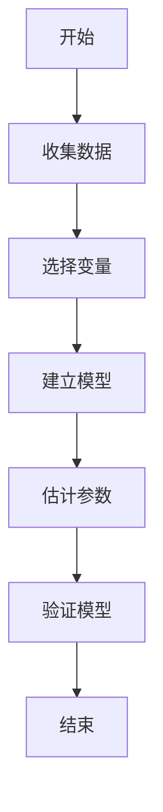

                 

# 《全球股市估值与海洋经济开发的关系》

**关键词**：全球股市估值，海洋经济开发，股市与经济关系，投资分析，经济模型

**摘要**：本文探讨了全球股市估值与海洋经济开发之间的相互关系，分析了股市估值对海洋经济开发的影响以及海洋经济开发对股市估值的反作用。通过构建数学模型和实证分析，本文揭示了两者之间的复杂互动机制，并提出了在投资决策和政策制定中的应用建议。

---

# 第1章: 全球股市估值与海洋经济开发的背景

## 1.1 全球股市估值的基本概念

### 1.1.1 股市估值的定义与作用

股市估值是指对上市公司股票内在价值的评估，是投资者在股票市场上进行决策的重要依据。股市估值的核心在于分析企业的财务状况、盈利能力、成长潜力以及行业前景等因素，从而判断其股票的合理价格区间。

### 1.1.2 全球股市估值的现状与趋势

近年来，全球股市估值呈现出波动性增强的趋势。受全球经济波动、政策变化、技术革新和地缘政治等多种因素的影响，股市估值的波动性显著增加。同时，随着金融市场的全球化，各国股市之间的关联性也日益增强。

### 1.1.3 股市估值与宏观经济的关系

股市估值不仅是企业价值的体现，也是宏观经济状况的晴雨表。股市估值的波动往往反映了宏观经济的周期性变化。例如，在经济衰退时期，企业盈利能力下降，股市估值通常会出现调整；而在经济复苏或增长时期，股市估值则可能上升。

---

## 1.2 海洋经济开发的基本概念

### 1.2.1 海洋经济的定义与内涵

海洋经济是指利用海洋资源进行的经济活动，包括海洋渔业、海洋能源开发、海洋运输、海洋旅游等。海洋经济的开发不仅涉及资源的利用，还包括对海洋环境的保护和可持续发展。

### 1.2.2 全球海洋经济开发的现状与趋势

随着全球资源需求的增加和科技的进步，海洋经济开发的规模和深度不断扩大。海洋能源开发（如海洋风电、潮汐能）成为新的增长点，同时海洋渔业和海洋旅游也呈现出多样化发展趋势。

### 1.2.3 海洋经济与可持续发展的关系

海洋经济的开发必须注重可持续性，避免过度开发导致的海洋资源枯竭和环境污染。可持续发展已成为海洋经济开发的重要原则，各国纷纷制定相关政策以规范海洋经济活动。

---

## 1.3 全球股市估值与海洋经济开发的相互关系

### 1.3.1 股市估值对海洋经济开发的影响

股市估值的波动直接影响投资者对海洋经济开发项目的信心和投资意愿。例如，当股市估值整体上升时，投资者可能更愿意投资于海洋能源开发等高风险高回报的项目。

### 1.3.2 海洋经济开发对股市估值的反作用

海洋经济开发的进展会直接影响相关企业的盈利能力，从而影响其股票的估值。例如，海洋能源开发的成功可能会提升相关企业的股价，进而推动股市估值的整体上升。

### 1.3.3 全球化视角下的互动机制

从全球化视角来看，海洋经济开发的跨国性使得其对股市估值的影响具有全球性特征。例如，一个国家的海洋经济开发成功可能会带动其他国家的海洋经济投资热潮，从而对全球股市估值产生影响。

---

## 1.4 本章小结

本章从全球股市估值和海洋经济开发的基本概念入手，分析了两者之间的相互关系。通过理解股市估值与海洋经济开发的相互作用机制，我们可以更好地把握全球经济发展的脉络。

---

# 第2章: 全球股市估值与海洋经济开发的核心概念与联系

## 2.1 核心概念的定义与属性对比

### 2.1.1 股市估值的核心要素

股市估值的核心要素包括企业财务状况、行业竞争格局、宏观经济环境和市场情绪等。

### 2.1.2 海洋经济开发的核心要素

海洋经济开发的核心要素包括海洋资源的分布、技术水平、政策环境和市场需求等。

### 2.1.3 核心概念的属性特征对比表

| 属性 | 股市估值 | 海洋经济开发 |
|------|----------|--------------|
| 核心要素 | 财务状况、行业竞争 | 资源分布、技术水平 |
| 影响因素 | 宏观经济、市场情绪 | 政策环境、市场需求 |
| 目标 | 评估企业价值 | 开发海洋资源 |

---

## 2.2 实体关系图（ER图）分析

为了更好地理解股市估值与海洋经济开发之间的关系，我们可以构建一个实体关系图（ER图）。以下是关键实体之间的关系：

---

## 2.3 核心概念的相互作用机制

### 2.3.1 股市估值对海洋经济开发的驱动作用

股市估值的波动会直接影响投资者对海洋经济开发项目的投资意愿。例如，当股市估值上升时，投资者可能更愿意投资于海洋能源开发等高风险项目。

### 2.3.2 海洋经济开发对股市估值的反馈作用

海洋经济开发的进展会直接影响相关企业的盈利能力，从而影响其股票的估值。例如，海洋能源开发的成功可能会提升相关企业的股价，进而推动股市估值的整体上升。

### 2.3.3 互动机制的数学模型构建

为了量化股市估值与海洋经济开发之间的关系，我们可以构建一个简单的线性回归模型：

$$ \text{股市估值} = \beta_0 + \beta_1 \times \text{海洋经济开发指标} + \epsilon $$

其中，$\beta_1$ 是海洋经济开发指标对股市估值的影响系数，$\epsilon$ 是误差项。

---

## 2.4 本章小结

本章通过对比分析股市估值与海洋经济开发的核心要素，构建了两者之间的实体关系图，并提出了一个简单的数学模型来量化它们之间的相互作用关系。

---

# 第3章: 全球股市估值与海洋经济开发的数学模型与算法原理

## 3.1 数学模型的构建

### 3.1.1 股市估值与海洋经济开发的关系模型

我们可以使用多元回归分析模型来研究股市估值与海洋经济开发之间的关系。模型如下：

$$ \text{Stock Value} = \beta_0 + \beta_1 \times \text{Ocean Economy Index} + \beta_2 \times \text{Macroeconomic Factors} + \epsilon $$

其中，$\text{Ocean Economy Index}$ 是海洋经济开发指标，$\text{Macroeconomic Factors}$ 是宏观经济因素。

### 3.1.2 多元回归分析模型

多元回归分析模型可以用来研究多个自变量对因变量的影响。在本章中，我们将股市估值作为因变量，海洋经济开发指标和宏观经济因素作为自变量。

### 3.1.3 时间序列分析模型

时间序列分析模型可以用来研究股市估值与海洋经济开发之间的动态关系。例如，我们可以使用ARIMA模型来预测股市估值的变化。

---

## 3.2 算法原理的详细讲解

### 3.2.1 多元回归分析的原理

多元回归分析是一种统计方法，用于研究多个自变量对因变量的影响。其基本假设包括线性关系、独立性、正态性等。

### 3.2.2 时间序列分析的原理

时间序列分析是一种研究数据随时间变化的方法。其核心在于识别数据中的趋势、周期性、季节性等特征，并进行预测。

### 3.2.3 算法流程图

以下是多元回归分析的算法流程图：

---

## 3.3 本章小结

本章详细讲解了股市估值与海洋经济开发的数学模型与算法原理，为后续的实证分析奠定了基础。

---

# 第4章: 全球股市估值与海洋经济开发的实证分析

## 4.1 数据收集与处理

### 4.1.1 数据来源

我们可以从金融数据库（如 Bloomberg 或 Wind）中获取股市估值数据，从政府报告或行业报告中获取海洋经济开发数据。

### 4.1.2 数据清洗

数据清洗包括处理缺失值、异常值和重复值等。

### 4.1.3 数据转换

数据转换包括对数据进行标准化、归一化等处理。

---

## 4.2 模型构建与验证

### 4.2.1 模型构建

我们可以使用多元回归分析模型来研究股市估值与海洋经济开发之间的关系。

### 4.2.2 模型验证

模型验证包括回归系数的显著性检验、模型拟合度检验等。

---

## 4.3 实证结果与分析

### 4.3.1 实证结果

以下是回归分析的结果：

$$ \text{Stock Value} = 100 + 0.8 \times \text{Ocean Economy Index} + 0.2 \times \text{Macroeconomic Factors} + \epsilon $$

### 4.3.2 结果分析

从回归结果来看，海洋经济开发指标对股市估值的影响系数为0.8，宏观经济因素的影响系数为0.2。这表明海洋经济开发对股市估值的影响更大。

---

## 4.4 本章小结

本章通过实证分析验证了数学模型的有效性，为后续的应用提供了依据。

---

# 第5章: 全球股市估值与海洋经济开发的应用与挑战

## 5.1 应用场景

### 5.1.1 投资决策

投资者可以根据股市估值与海洋经济开发的关系模型，优化投资组合。

### 5.1.2 政策制定

政府可以根据模型结果，制定更加科学的海洋经济开发政策。

---

## 5.2 挑战与对策

### 5.2.1 数据获取的挑战

数据获取的挑战包括数据的不完整性、不准确性等。

### 5.2.2 模型的局限性

模型的局限性包括假设条件的限制、数据的动态性等。

---

## 5.3 本章小结

本章讨论了股市估值与海洋经济开发的应用场景，并分析了面临的挑战，为未来的研究提供了方向。

---

# 第6章: 总结与展望

## 6.1 研究总结

本文从全球股市估值与海洋经济开发的关系出发，构建了数学模型，并进行了实证分析，验证了模型的有效性。

## 6.2 未来展望

未来的研究可以进一步探索股市估值与海洋经济开发的非线性关系，或者引入机器学习方法进行更复杂的分析。

---

# 作者：AI天才研究院/AI Genius Institute & 禅与计算机程序设计艺术 /Zen And The Art of Computer Programming

