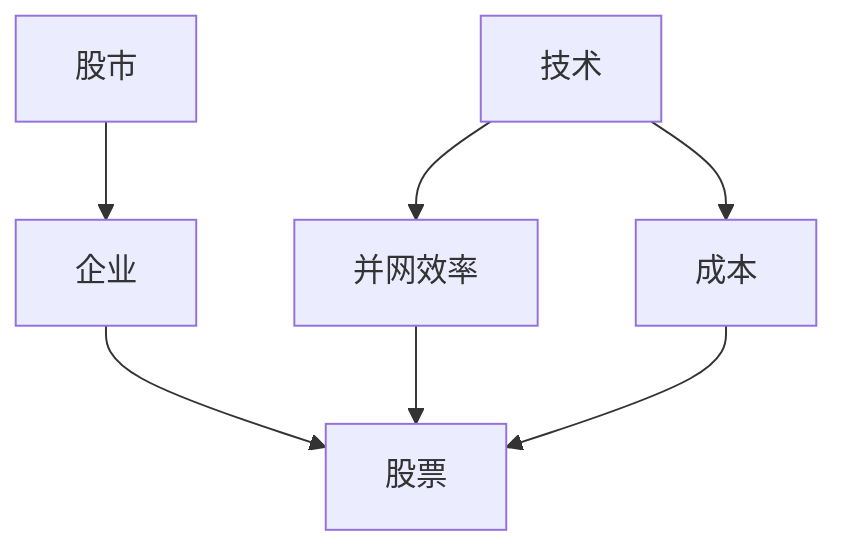
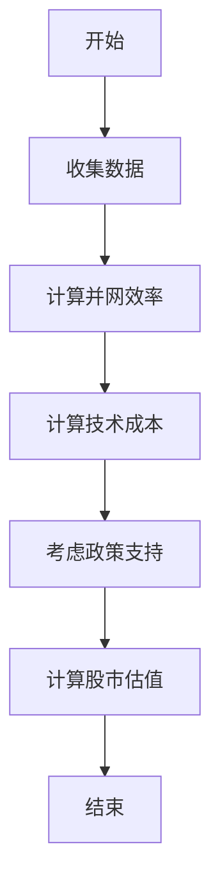
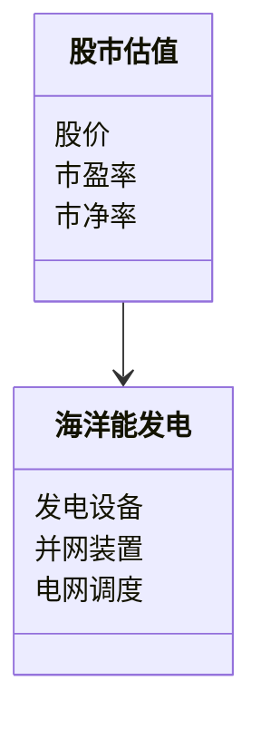

                 


# 全球股市估值与海洋能发电并网技术的关系

> **关键词**：全球股市、海洋能发电、并网技术、估值模型、能源转型、投资决策、绿色能源  
> **摘要**：本文探讨了全球股市估值与海洋能发电并网技术之间的关系，分析了海洋能技术对能源市场和股市估值的影响，建立了数学模型，提出了系统架构设计方案，并通过实际案例展示了如何将两者结合，为投资决策提供科学依据。

---

## 第1章：全球股市估值的基本概念

### 1.1 股市估值的定义
股市估值是指对上市公司股票价值的评估，通常通过市盈率（P/E）、市净率（P/B）等指标来衡量。这些指标反映了市场对企业的信心和未来盈利能力的预期。

### 1.2 海洋能发电并网技术的基本概念
海洋能发电是指利用海洋中的能量（如潮汐能、波浪能、温差能等）进行发电的技术。并网技术则是将这些能源通过电网输送到千家万户的过程，涉及电力转换、存储和调度等复杂环节。

---

## 第2章：全球股市估值与海洋能发电并网技术的关系

### 2.1 问题背景与问题描述
随着全球能源需求的增长和环保压力的增加，海洋能发电作为一种清洁能源备受关注。然而，其技术和经济可行性对股市估值有直接影响。例如，海洋能技术的突破可能提升相关企业的股价，而政策变化可能影响整个板块的估值。

### 2.2 核心概念与联系
#### 核心概念原理
- 海洋能发电技术的成熟度直接影响其成本和市场竞争力，进而影响相关企业的盈利能力和股市估值。
- 股市估值的变化反映了市场对海洋能发电技术未来发展的预期。

#### 概念属性特征对比表格
| 属性         | 股市估值             | 海洋能发电并网技术       |
|--------------|----------------------|-------------------------|
| 核心指标     | 市盈率、市净率       | 并网效率、成本           |
| 影响因素     | 经济指标、政策       | 技术成熟度、政策支持     |
| 发展趋势     | 绿色能源推动         | 技术创新与成本下降       |

#### ER实体关系图架构（使用 Mermaid 流程图）


---

## 第3章：全球股市估值与海洋能发电并网技术的数学模型

### 3.1 数学模型与公式
#### 股市估值模型
$$
\text{市盈率} = \frac{\text{股价}}{\text{每股收益}}
$$

#### 海洋能发电并网技术模型
$$
\text{并网效率} = \frac{\text{输出功率}}{\text{输入功率}}
$$

#### 两者关系的数学公式
$$
\text{股市估值} = f(\text{并网效率}, \text{技术成本}, \text{政策支持})
$$

### 3.2 算法原理讲解
#### 算法流程图（使用 Mermaid）


---

## 第4章：系统分析与架构设计方案

### 4.1 问题场景介绍
#### 全球股市估值的动态变化
股市估值受多种因素影响，包括经济指标、政策变化和技术创新。

#### 海洋能发电并网技术的系统架构
海洋能发电系统包括发电设备、并网装置和电网调度模块。

### 4.2 系统功能设计
#### 领域模型（使用 Mermaid 类图）


#### 系统架构设计（使用 Mermaid 架构图）
```mermaid
archi
    客户端 --> 服务器
    服务器 --> 数据库
    服务器 --> 海洋能发电模块
    服务器 --> 股市估值模块
```

---

## 第5章：项目实战

### 5.1 环境安装与配置
#### 数据收集工具安装
使用 Python 的 `pandas` 和 `numpy` 库进行数据处理。

### 5.2 核心实现源代码
#### 示例代码
```python
import pandas as pd
import numpy as np

# 示例数据：假设我们有并网效率和股市估值的数据
data = {
    '并网效率': [0.8, 0.85, 0.9, 0.95],
    '股市估值': [100, 110, 120, 130]
}

df = pd.DataFrame(data)

# 计算股市估值与并网效率的相关性
correlation = df['股市估值'].corr(df['并网效率'])
print(f"相关性系数：{correlation}")
```

#### 代码应用解读
上述代码展示了如何利用数据科学工具分析股市估值与并网效率之间的相关性，为投资决策提供数据支持。

---

## 总结

通过本文的分析，我们可以看到，全球股市估值与海洋能发电并网技术之间存在密切的联系。海洋能技术的突破和政策支持直接影响股市估值，而股市估值的变化则反映了市场对技术发展的预期。未来，随着绿色能源的普及，这种关系将更加紧密。

**作者：AI天才研究院 & 禅与计算机程序设计艺术**

