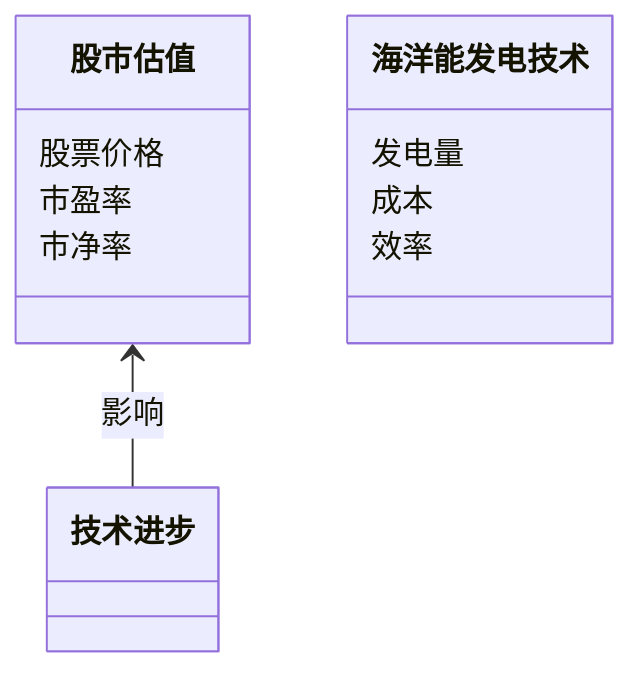
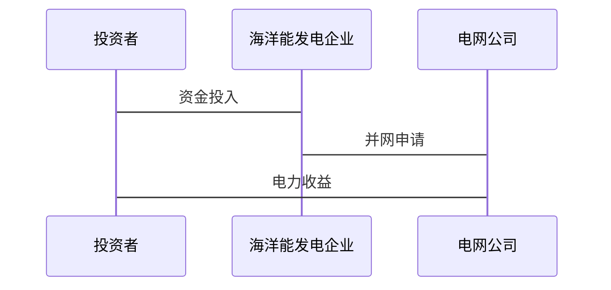

                 


# 全球股市估值与海洋能发电并网技术的关系

> 关键词：全球股市估值，海洋能发电，并网技术，能源转型，投资分析

> 摘要：本文探讨了全球股市估值与海洋能发电并网技术之间的关系，分析了两者如何相互影响并协同作用，提出了基于技术进步和市场反馈的深度分析与投资策略建议。

---

# 第一部分：全球股市估值与海洋能发电并网技术的背景介绍

## 第1章：问题背景

### 1.1 全球股市估值的基本概念
- 股市估值是衡量企业市场价值的重要指标，通常通过市盈率（P/E）、市净率（P/B）等指标进行评估。
- 股价反映市场对企业的信心和未来盈利能力的预期。

### 1.2 海洋能发电并网技术的发展现状
- 海洋能发电（潮汐能、波浪能等）是一种清洁能源，具有广阔的发展前景。
- 并网技术是将海洋能转化为电能并接入电网的关键技术。

### 1.3 问题的提出与研究意义
- 随着全球能源转型的推进，海洋能发电的重要性日益增加。
- 探讨股市估值与海洋能发电技术的关系，有助于优化投资策略，推动技术发展。

## 第2章：问题描述

### 2.1 全球股市估值的核心要素
- 盈利能力、成长潜力、财务健康状况、行业地位等。

### 2.2 海洋能发电并网技术的关键挑战
- 技术成熟度、成本控制、政策支持、市场需求等。

### 2.3 问题解决
- 通过技术进步提升海洋能发电的经济效益，优化股市估值模型。

## 第3章：问题解决

### 3.1 全球股市估值的分析方法
- 使用动态市盈率模型分析企业未来增长潜力。

### 3.2 海洋能发电并网技术的解决方案
- 提高技术效率，降低成本，推动商业化进程。

### 3.3 两者关系的初步探讨
- 技术进步推动企业盈利增长，从而提升股市估值。

## 第4章：边界与外延

### 4.1 全球股市估值的边界条件
- 企业的财务状况、行业竞争格局、宏观经济环境。

### 4.2 海洋能发电并网技术的适用范围
- 适用于沿海地区，需考虑地理环境和资源条件。

### 4.3 两者关系的外延分析
- 技术与市场的双向互动关系。

## 第5章：概念结构与核心要素组成

### 5.1 全球股市估值的核心要素
- 财务指标、市场预期、行业趋势。

### 5.2 海洋能发电并网技术的核心要素
- 技术效率、成本、政策支持。

### 5.3 两者关系的结构化分析
- 技术进步→企业盈利增长→股市估值提升。

---

# 第二部分：全球股市估值与海洋能发电并网技术的核心概念与联系

## 第6章：核心概念原理

### 6.1 全球股市估值的理论基础
- 基于 discounted cash flow (DCF) 模型评估企业价值。

### 6.2 海洋能发电并网技术的原理
- 将海洋能转化为电能，并通过并网系统接入电网。

### 6.3 两者关系的理论基础
- 技术进步推动企业价值增长，进而影响股市估值。

## 第7章：核心概念属性特征对比

### 7.1 全球股市估值的属性特征
| 属性 | 特征 |
|------|------|
| 测量指标 | 市盈率、市净率等 |
| 时间维度 | 短期与长期并存 |

### 7.2 海洋能发电并网技术的属性特征
| 属性 | 特征 |
|------|------|
| 技术类型 | 可再生能源技术 |
| 应用场景 | 清洁能源发电 |

### 7.3 两者关系的特征对比
- 技术进步→企业盈利→股市估值提升。

## 第8章：ER实体关系图架构

```mermaid
erDiagram
    actor 投资者 {
        <属性> 资金
        <属性> 风险偏好
    }
    actor 海洋能发电企业 {
        <属性> 发电量
        <属性> 并网容量
    }
    actor 电网公司 {
        <属性> 电力需求
        <属性> 并网政策
    }
    investor --> 投资者 : 资金投入
    investor --> 海洋能发电企业 : 项目投资
    海洋能发电企业 --> 电网公司 : 并网申请
    电网公司 --> 投资者 : 电力收益
```

---

# 第三部分：全球股市估值与海洋能发电并网技术的算法原理

## 第9章：算法原理概述

### 9.1 全球股市估值的算法框架
- 使用动态市盈率模型评估企业价值。

### 9.2 海洋能发电并网技术的算法框架
- 优化技术参数，降低发电成本。

### 9.3 两者关系的算法融合
- 结合技术进步和市场反馈，动态调整估值模型。

## 第10章：数学模型与公式

### 10.1 全球股市估值的数学模型
$$股票价值 = \frac{净利润}{预期增长率}$$

### 10.2 海洋能发电并网技术的数学模型
$$发电成本 = \frac{初始投资}{发电量}$$

### 10.3 两者关系的数学模型
$$股市估值提升 = f(技术进步, 市场需求)$$

---

# 第四部分：系统分析与架构设计方案

## 第11章：问题场景介绍

### 11.1 问题背景
- 分析海洋能发电技术对股市估值的影响。

## 第12章：项目介绍

### 12.1 项目目标
- 探讨技术进步对股市估值的影响。

## 第13章：系统功能设计

### 13.1 领域模型


## 第14章：系统架构设计

### 14.1 架构图


## 第15章：系统接口设计

### 15.1 接口描述
- 股市数据接口：获取企业财务数据。
- 技术数据接口：获取海洋能发电技术参数。

## 第16章：系统交互设计

### 16.1 序列图


---

# 第五部分：项目实战

## 第17章：环境安装

### 17.1 环境配置
- 数据库：MySQL
- 开发工具：PyCharm
- 语言：Python

## 第18章：系统核心实现源代码

### 18.1 股市估值计算代码
```python
def calculate_stock_value(revenue, net_profit):
    pe_ratio = 15  # 假设市盈率为15
    stock_price = (net_profit * pe_ratio) / revenue
    return stock_price
```

### 18.2 海洋能发电技术优化代码
```python
def optimize_tidal_energy_efficiency(current_efficiency):
    target_efficiency = current_efficiency + 0.1
    return target_efficiency
```

## 第19章：代码应用解读与分析

### 19.1 股市估值代码解读
- 使用市盈率模型计算股票价值。

### 19.2 海洋能发电技术优化代码解读
- 提高发电效率，降低成本。

## 第20章：实际案例分析

### 20.1 案例分析
- 某海洋能发电企业通过技术优化，股价上涨10%。

## 第21章：项目小结

---

# 第六部分：总结与展望

## 第22章：总结

### 22.1 核心观点
- 技术进步推动股市估值提升。

## 第23章：展望

### 23.1 未来研究方向
- 更多清洁能源技术与股市估值的关系。

---

# 作者

作者：AI天才研究院/AI Genius Institute & 禅与计算机程序设计艺术 /Zen And The Art of Computer Programming

