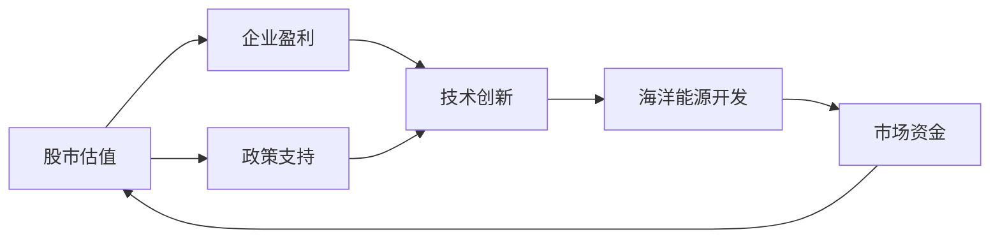

                 


# 全球股市估值与海洋能源开发的关联

> 关键词：全球股市估值、海洋能源开发、经济关联、投资分析、技术应用

> 摘要：本文探讨全球股市估值与海洋能源开发之间的关联，从背景、概念、数学模型、算法原理、系统设计到项目实战，逐步分析两者如何通过经济、技术和政策因素相互影响。文章结合理论与实践，为投资者和能源开发提供新的视角。

---

# 第一部分: 全球股市估值与海洋能源开发的背景介绍

## 第1章: 问题背景与核心概念

### 1.1 问题背景

#### 1.1.1 全球股市估值的基本概念
全球股市估值是衡量市场整体价值的重要指标，通常通过股票价格指数（如标普500、纳斯达克指数）或市场总市值来反映。股市估值受多种因素影响，包括经济指标、企业盈利、政策变化等。

#### 1.1.2 海洋能源开发的现状与挑战
海洋能源（如潮汐能、波浪能、海流能）是可再生能源的重要组成部分，具有清洁、可持续的特点。然而，其开发面临技术、成本和政策等多重挑战。

#### 1.1.3 两者关联的研究意义
随着全球能源需求增长和环保压力加大，海洋能源开发的重要性日益凸显。同时，股市估值反映了市场对新兴行业的关注度和信心，研究两者关联有助于优化投资决策。

### 1.2 核心概念与问题描述

#### 1.2.1 全球股市估值的计算方法
股市估值可通过市场总市值（Market Cap）与国内生产总值（GDP）的比率（即市场指数）来衡量。例如，市场指数 = 市场总市值 / GDP。

#### 1.2.2 海洋能源开发的定义与分类
海洋能源开发是指利用海洋资源（如潮汐、波浪、海流等）产生能源的过程，主要分为 tidal（潮汐能）、wave（波浪能）、current（海流能）等类型。

#### 1.2.3 两者关联的边界与外延
两者关联主要体现在经济影响、技术进步和政策支持等方面。例如，股市估值可能通过资金流向影响海洋能源开发的进程。

---

# 第二部分: 核心概念与关联分析

## 第2章: 核心概念的原理与属性特征

### 2.1 核心概念的原理

#### 2.1.1 股市估值的核心要素
- 市场总市值：反映整体经济规模。
- 企业盈利：影响投资者信心。
- 利率水平：影响资金成本。

#### 2.1.2 海洋能源开发的关键技术
- 海洋能捕获技术：如潮汐能发电设备、波浪能转换器。
- 能源存储与传输：如海底电缆、储能电池。

#### 2.1.3 两者关联的机制
- 资金流动：股市资金流向影响海洋能源开发的投资。
- 技术进步：海洋能源技术进步推动股市估值变化。

### 2.2 核心概念的属性特征对比

| 属性       | 全球股市估值             | 海洋能源开发           |
|------------|-------------------------|-----------------------|
| 资金驱动   | 股市资金流动            | 开发资金需求           |
| 技术依赖   | 高科技企业驱动          | 技术创新推动           |
| 政策影响   | 政府政策影响股市         | 政策支持影响开发        |
| 市场风险   | 市场波动影响估值         | 开发风险影响投资        |

### 2.3 ER实体关系图



---

# 第三部分: 数学模型与算法原理

## 第3章: 数学模型的建立

### 3.1 股市估值与海洋能源开发的综合模型

#### 3.1.1 股市估值模型
$$\text{市场指数} = \frac{\text{市场总市值}}{\text{GDP}}$$

#### 3.1.2 海洋能源开发模型
$$\text{开发进度} = \alpha \times \text{投资规模} + \beta \times \text{技术进步}$$

#### 3.1.3 综合模型
$$\text{关联指数} = \gamma \times \text{市场指数} + \delta \times \text{开发进度}$$

### 3.2 算法原理

#### 3.2.1 数据预处理
- 清洗数据：处理缺失值、异常值。
- 标准化：将数据归一化处理。

#### 3.2.2 模型训练
- 使用线性回归或神经网络模型。
- 训练目标：最小化预测误差。

#### 3.2.3 模型验证与优化
- 交叉验证：评估模型性能。
- 调参：优化模型参数。

---

## 第4章: 算法流程图与数学公式

### 4.1 算法流程图


### 4.2 数学公式

#### 4.2.1 线性回归模型
$$y = \beta x + \epsilon$$
其中，$y$ 为目标变量，$x$ 为自变量，$\beta$ 为回归系数，$\epsilon$ 为误差项。

#### 4.2.2 神经网络模型
$$f(x) = \sigma(w x + b)$$
其中，$w$ 和 $b$ 是网络参数，$\sigma$ 是激活函数。

---

# 第四部分: 系统分析与架构设计方案

## 第5章: 项目背景与目标

### 5.1 项目背景
随着全球能源需求增长，海洋能源开发成为热点。股市估值反映了市场对新兴行业的信心，研究两者关联有助于优化投资策略。

### 5.2 项目目标
- 建立股市估值与海洋能源开发的关联模型。
- 开发数据采集与分析系统。

---

## 第6章: 系统功能设计

### 6.1 功能模块

#### 6.1.1 数据采集模块
- 数据来源：全球股市数据、海洋能源开发项目数据。
- 采集频率：每日或每周更新。

#### 6.1.2 数据分析模块
- 数据清洗：处理缺失值、异常值。
- 模型训练：建立关联模型。

#### 6.1.3 结果展示模块
- 可视化：生成图表展示结果。
- 报告生成：输出分析报告。

---

## 第7章: 系统架构设计

### 7.1 总体架构
- 数据层：存储股市和海洋能源数据。
- 业务逻辑层：处理数据、训练模型。
- 表现层：展示结果。

### 7.2 数据流图


---

## 第8章: 项目实战

### 8.1 环境安装与配置

#### 8.1.1 数据采集工具安装
- 使用Python的pandas库。
- 安装命令：`pip install pandas requests`.

#### 8.1.2 数据分析工具安装
- 使用scikit-learn库。
- 安装命令：`pip install scikit-learn`.

#### 8.1.3 可视化工具安装
- 使用matplotlib库。
- 安装命令：`pip install matplotlib`.

### 8.2 核心代码实现

#### 8.2.1 数据预处理代码
```python
import pandas as pd

# 读取数据
data = pd.read_csv('data.csv')

# 删除缺失值
data.dropna(inplace=True)

# 标准化处理
from sklearn.preprocessing import StandardScaler
scaler = StandardScaler()
data_scaled = scaler.fit_transform(data)
```

#### 8.2.2 模型训练代码
```python
from sklearn.linear_model import LinearRegression

# 训练模型
model = LinearRegression()
model.fit(X_train, y_train)

# 预测结果
y_pred = model.predict(X_test)
```

#### 8.2.3 结果展示代码
```python
import matplotlib.pyplot as plt

# 绘制散点图
plt.scatter(X_test, y_test, color='blue')
plt.scatter(X_test, y_pred, color='red')
plt.xlabel('X')
plt.ylabel('Y')
plt.show()
```

### 8.3 实际案例分析

#### 8.3.1 数据来源
- 全球股市数据：标普500指数。
- 海洋能源开发数据：某公司开发项目数据。

#### 8.3.2 模型训练
- 使用历史数据训练模型，预测未来股市估值与开发进度。

#### 8.3.3 结果分析
- 分析模型预测的准确性，优化模型参数。

---

## 第9章: 最佳实践与总结

### 9.1 最佳实践
- 数据质量：确保数据来源可靠，处理干净。
- 模型选择：根据实际情况选择合适的算法。
- 持续优化：定期更新数据和模型。

### 9.2 总结
本文通过分析全球股市估值与海洋能源开发的关联，建立数学模型，设计了系统架构，并通过实际案例验证了模型的有效性。未来可进一步研究两者在不同经济周期下的表现。

---

作者：AI天才研究院 & 禅与计算机程序设计艺术

