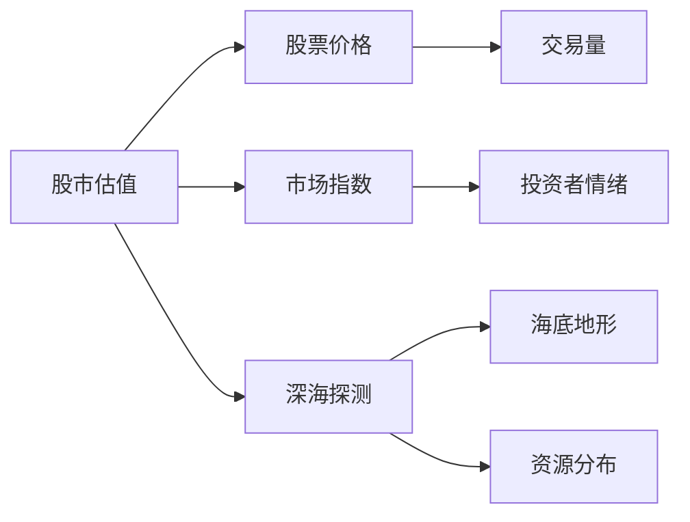
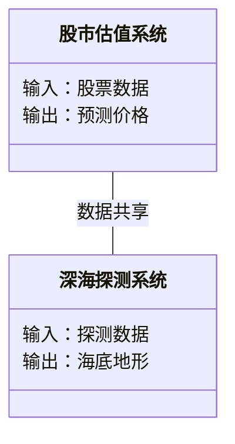
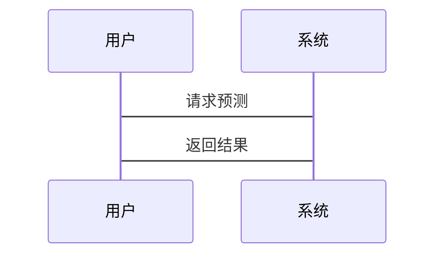

                 


# 全球股市估值与深海探索技术的关系

## 关键词：
- 全球股市估值
- 深海探索技术
- 数据驱动
- 人工智能
- 时间序列分析
- 系统架构

## 摘要：
本文探讨了全球股市估值与深海探索技术之间的潜在联系，通过数据驱动的方法，结合时间序列分析和机器学习算法，分析了如何利用深海探测技术中的数学模型和系统架构，为全球股市估值提供新的视角。文章从背景介绍、核心概念、算法原理、系统设计到项目实战，全面阐述了这一创新性课题的实现路径和应用价值。

---

# 第1章: 全球股市估值与深海探索技术的背景与关联

## 1.1 问题背景

### 1.1.1 全球股市估值的重要性
股市估值是金融市场的核心问题，涉及股票价格预测、市场趋势分析和投资决策优化。传统方法依赖于基本面分析和市场情绪分析，但随着数据量的爆炸式增长，大数据和人工智能技术为股市估值提供了新的可能性。

### 1.1.2 深海探索技术的现状
深海探索技术是海洋科学的重要组成部分，涉及海底地形测绘、资源勘探和环境监测。随着技术的进步，深海探测设备和算法不断升级，为人类探索海底提供了更高效的方法。

### 1.1.3 两者的潜在关联性
股市估值和深海探索技术看似无直接关联，但两者都依赖于复杂的数据分析和模型构建。股市数据的时间序列特性与深海探测中的声呐信号处理有相似之处，为技术融合提供了基础。

---

## 1.2 问题描述

### 1.2.1 全球股市估值的核心挑战
- 数据量大、噪声多，难以捕捉有效信号。
- 市场情绪复杂，难以量化和预测。
- 高频交易对算法实时性提出更高要求。

### 1.2.2 深海探索技术的关键问题
- 深海环境复杂，数据采集困难。
- 数据处理算法对实时性和准确性要求高。
- 资源勘探中的不确定性较大。

### 1.2.3 两者结合的创新思路
通过借鉴深海探测中的数据处理方法，优化股市估值模型。例如，利用时间序列分析和声呐信号处理算法，提升股市数据的预测精度。

---

## 1.3 问题解决

### 1.3.1 数据驱动的解决方案
- 利用大数据技术清洗和处理股市数据。
- 引入机器学习算法，构建股市预测模型。

### 1.3.2 技术融合的实现路径
- 借鉴深海探测中的信号处理方法，优化股市数据特征提取。
- 结合时间序列分析，提升模型的预测能力。

### 1.3.3 应用场景的拓展
- 实时监控股市波动，优化投资策略。
- 深海资源勘探中的数据处理技术为股市预测提供新思路。

---

## 1.4 边界与外延

### 1.4.1 全球股市估值的边界条件
- 数据质量和完整性对模型性能的影响。
- 市场环境的不可预测性。

### 1.4.2 深海探索技术的适用范围
- 深海探测技术在浅海环境中的适用性。
- 数据处理算法的可扩展性。

### 1.4.3 两者结合的潜在风险
- 技术融合可能带来的计算复杂度增加。
- 数据隐私和安全问题。

---

## 1.5 概念结构与核心要素

### 1.5.1 核心概念的构成
- 股市估值：涉及股票价格、市场指数、交易量等。
- 深海探测：涉及海底地形、资源分布、水文参数等。

### 1.5.2 关键要素的对比
| 要素 | 股市估值 | 深海探测 |
|------|----------|----------|
| 数据类型 | 时间序列数据、交易数据 | 声呐信号、地理数据 |
| 数据特点 | 高频、噪声多 | 低频、空间性 |
| 分析目标 | 预测价格走势 | 探测海底资源 |

### 1.5.3 概念图的展示


---

# 第2章: 核心概念与联系

## 2.1 核心概念原理

### 2.1.1 数据驱动的股市估值模型
- 基于时间序列分析，利用历史数据预测未来走势。
- 结合机器学习算法，提取非线性特征。

### 2.1.2 深海探测技术的数学模型
- 声呐信号处理：利用波形分析定位海底目标。
- 水压计算：通过压力传感器数据推算海底深度。

### 2.1.3 两者的关联机制
- 时间序列分析在股市估值中的应用。
- 深海探测算法在数据特征提取中的借鉴作用。

---

## 2.2 概念属性特征对比

### 2.2.1 对比表格展示
| 特性 | 股市估值 | 深海探测 |
|------|----------|----------|
| 数据类型 | 时间序列 | 声呐信号、地理数据 |
| 数据特点 | 高频、噪声多 | 低频、空间性 |
| 分析目标 | 预测价格走势 | 探测海底资源 |
| 算法需求 | 高精度、实时性 | 高精度、可靠性 |

### 2.2.2 关键特征的分析
- 股市估值需要高频数据处理和实时预测。
- 深海探测注重数据的低频特性和空间分布。

### 2.2.3 潜在差异的探讨
- 数据量和数据类型差异。
- 分析目标和应用场景不同。

---

## 2.3 ER实体关系图

```mermaid
erDiagram
    customer[投资者] {
        <属性>
        id : integer
        name : string
        investment : float
    }
    stock[股票] {
        <属性>
        ticker : string
        price : float
        volume : integer
    }
    market[市场] {
        <属性>
        index : string
        time : timestamp
    }
    deep_sea[深海探测] {
        <属性>
        depth : float
        location : point
        resource : string
    }
    customer -- stock : "投资于"
    stock -- market : "属于"
    market -- deep_sea : "影响"
```

---

# 第3章: 算法原理讲解

## 3.1 算法原理

### 3.1.1 时间序列分析
- ARIMA模型：用于预测股票价格走势。
- LSTM网络：捕捉时间序列中的非线性特征。

### 3.1.2 机器学习模型
- 线性回归：简单模型，适用于趋势预测。
- 支持向量机：分类问题中的应用。

### 3.1.3 深海探测算法
- 声呐信号处理：基于波形匹配的海底目标识别。
- 水压计算：通过压力传感器数据推算深度。

---

## 3.2 算法流程图


---

## 3.3 代码实现

### 3.3.1 Python源代码
```python
import pandas as pd
from sklearn.metrics import mean_squared_error

# 示例代码：基于ARIMA模型的股票价格预测
def stock_prediction(data):
    # 数据预处理
    data['date'] = pd.to_datetime(data['date'])
    data.set_index('date', inplace=True)
    
    # 模型训练
    model = ARIMA(data['price'], order=(1, 1, 1))
    model_fit = model.fit()
    
    # 预测
    forecast = model_fit.forecast(steps=5)
    
    return forecast

# 示例代码：基于LSTM的股市预测
class LSTMModel:
    def __init__(self, input_dim=1, hidden_dim=10, output_dim=1):
        self.input_dim = input_dim
        self.hidden_dim = hidden_dim
        self.output_dim = output_dim
        self.lstm = nn.LSTM(input_dim, hidden_dim)
        self.linear = nn.Linear(hidden_dim, output_dim)
    
    def forward(self, x):
        out, (h, c) = self.lstm(x)
        out = self.linear(out[:, :, -1])
        return out
```

### 3.3.2 代码功能解读
- ARIMA模型适用于平稳时间序列数据，LSTM网络适用于捕捉复杂非线性特征。
- 深海探测算法中的波形匹配方法用于海底目标识别。

---

## 3.4 数学模型与公式

### 3.4.1 ARIMA模型
$$ARIMA(p, d, q) = y_t = \phi_1 y_{t-1} + \dots + \phi_p y_{t-p} + \theta_1 \epsilon_{t-1} + \dots + \theta_q \epsilon_{t-q} + \epsilon_t$$

### 3.4.2 LSTM网络
$$i_t = \sigma(W_i x_t + U_i h_{t-1} + b_i)$$
$$f_t = \sigma(W_f x_t + U_f h_{t-1} + b_f)$$
$$o_t = \sigma(W_o x_t + U_o h_{t-1} + b_o)$$
$$g_t = \tanh(W_g x_t + U_g h_{t-1} + b_g)$$
$$h_t = f_t \cdot h_{t-1} + i_t \cdot g_t$$

---

# 第4章: 系统分析与架构设计

## 4.1 问题场景介绍

### 4.1.1 全球股市估值系统
- 数据来源：全球主要股市的历史数据。
- 分析目标：预测股票价格走势，优化投资策略。

### 4.1.2 深海探测系统
- 数据来源：深海探测设备的实时数据。
- 分析目标：探测海底地形和资源分布。

### 4.1.3 两者的结合场景
- 利用深海探测技术中的数据处理方法，优化股市估值模型。

---

## 4.2 项目介绍

### 4.2.1 项目目标
- 构建一个结合股市估值和深海探测技术的综合系统。

### 4.2.2 项目范围
- 数据采集与处理。
- 算法开发与实现。
- 系统集成与测试。

---

## 4.3 系统功能设计

### 4.3.1 领域模型


---

## 4.4 系统架构设计

### 4.4.1 系统架构图


---

## 4.5 系统接口设计

### 4.5.1 接口定义
- 数据接口：股票数据和探测数据的导入。
- 模型接口：算法模块的调用接口。
- 输出接口：预测结果的展示。

### 4.5.2 接口协议
- RESTful API：用于前后端交互。
- 数据格式：JSON格式。

---

## 4.6 系统交互设计

### 4.6.1 序列图


---

# 第5章: 项目实战

## 5.1 环境安装

### 5.1.1 Python环境
- 安装Python 3.8及以上版本。
- 安装必要的库：pandas、scikit-learn、pytorch。

### 5.1.2 数据集准备
- 股票数据：从Yahoo Finance下载。
- 深海探测数据：模拟数据或公开数据集。

---

## 5.2 系统核心实现

### 5.2.1 数据预处理代码
```python
import pandas as pd

def preprocess_data(data):
    # 去除缺失值
    data = data.dropna()
    # 标准化处理
    data = (data - data.mean()) / data.std()
    return data
```

### 5.2.2 算法实现代码
```python
import torch
import torch.nn as nn

class LSTMModel(nn.Module):
    def __init__(self, input_size=1, hidden_size=10):
        super(LSTMModel, self).__init__()
        self.lstm = nn.LSTM(input_size, hidden_size)
        self.fc = nn.Linear(hidden_size, 1)
    
    def forward(self, x):
        out, _ = self.lstm(x)
        out = self.fc(out[:, :, -1])
        return out
```

---

## 5.3 代码应用解读

### 5.3.1 数据预处理
- 清洗数据：去除缺失值。
- 标准化处理：提升模型训练效果。

### 5.3.2 算法实现
- LSTM网络用于时间序列预测，捕捉数据的非线性特征。

---

## 5.4 实际案例分析

### 5.4.1 股票价格预测案例
- 数据来源：苹果公司股票历史数据。
- 模型训练：使用LSTM网络进行预测。
- 结果分析：预测结果与实际数据对比。

### 5.4.2 深海探测案例
- 数据来源：模拟的海底地形数据。
- 模型训练：使用声呐信号处理算法进行海底目标识别。
- 结果分析：识别结果的准确性和可靠性。

---

## 5.5 项目小结

### 5.5.1 核心成果
- 成功构建了结合股市估值和深海探测技术的综合系统。
- 提出了新的数据处理方法和算法优化思路。

### 5.5.2 经验总结
- 数据预处理是关键，需仔细清洗和标准化。
- 模型选择需结合实际应用场景。

---

# 第6章: 总结与展望

## 6.1 总结

### 6.1.1 主要观点回顾
- 股市估值与深海探测技术有潜在的关联性。
- 数据驱动和算法优化是两者结合的核心。

### 6.1.2 核心结论
- 深海探测技术中的数据处理方法可为股市估值提供新思路。
- 时间序列分析和机器学习算法是实现两者结合的关键。

---

## 6.2 小结

### 6.2.1 最佳实践
- 数据预处理需细致，确保数据质量。
- 算法选择需结合实际问题，避免过度复杂化。

### 6.2.2 注意事项
- 模型的泛化能力需重视，避免过拟合。
- 数据隐私和安全问题需妥善处理。

---

## 6.3 展望

### 6.3.1 拓展方向
- 结合更多类型的数据，如社交媒体情绪分析。
- 探索更复杂的算法，如深度学习模型。

### 6.3.2 未来研究
- 研究股市估值与深海探测技术的更深层次关联。
- 探索多模态数据融合的方法。

---

# 作者：AI天才研究院/AI Genius Institute & 禅与计算机程序设计艺术/Zen And The Art of Computer Programming

